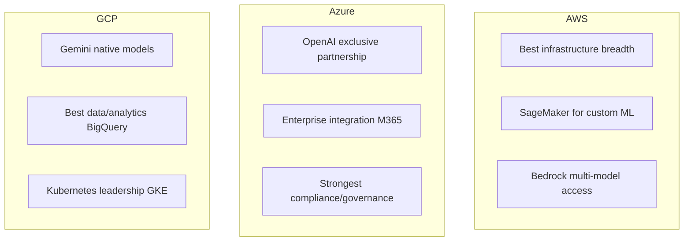
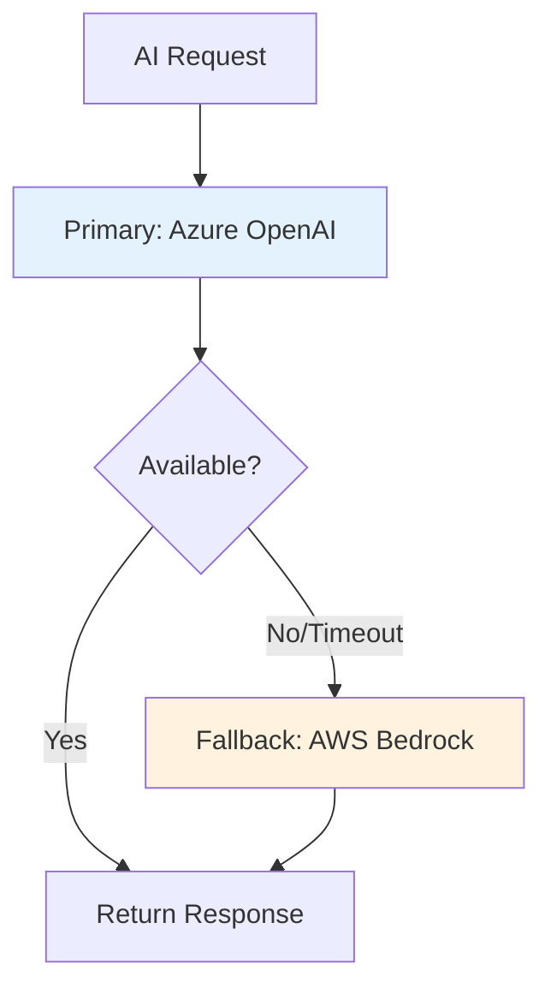
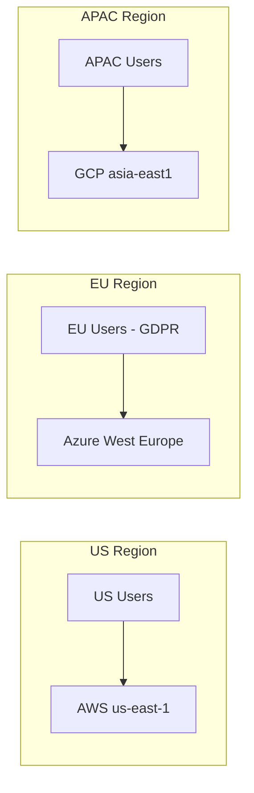
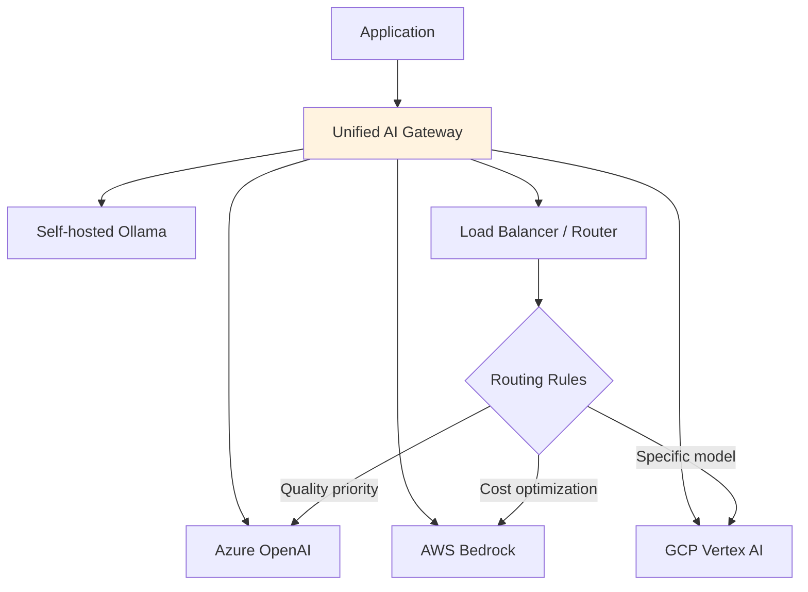
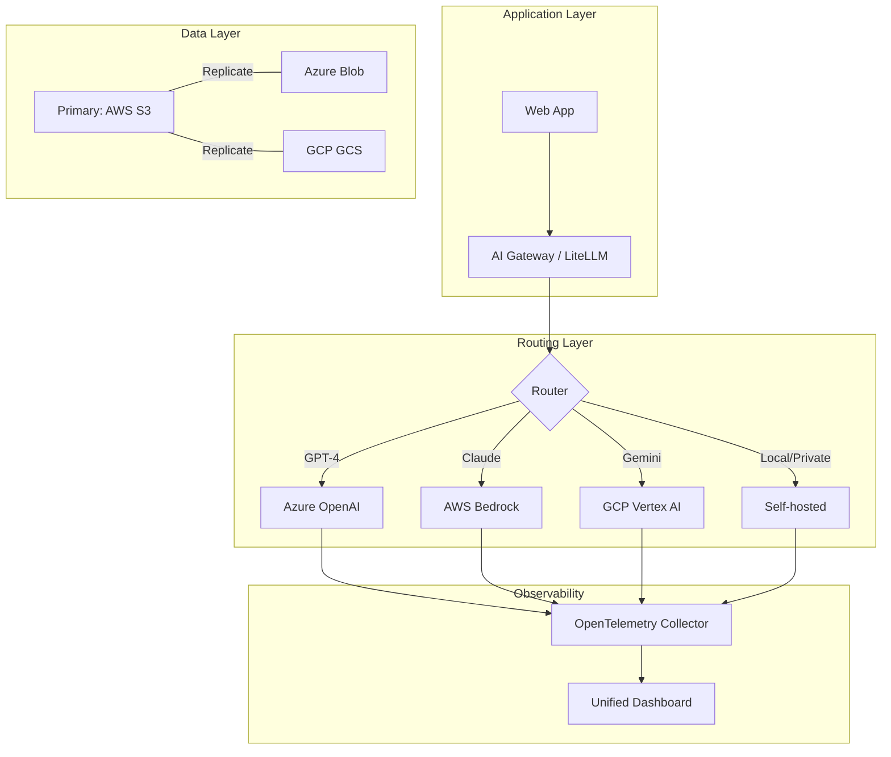

# Multi-Cloud AI Architecture

## Why Multi-Cloud for AI?

**Analogy:** Using a single cloud is like shopping at one store — convenient but you're limited to their selection and prices. Multi-cloud is like having memberships at multiple stores — you pick the best product from each.

**Reasons for multi-cloud AI:**
- **Avoid vendor lock-in:** If Azure OpenAI has an outage, fall back to AWS Bedrock
- **Best-of-breed:** Use Azure for OpenAI models, AWS for infrastructure, GCP for Gemini
- **Regulatory compliance:** EU data on EU cloud, US data on US cloud
- **Negotiating leverage:** "We can move workloads" is powerful in pricing discussions
- **Capacity:** During GPU shortages, spread across providers

---

## AI Services by Cloud Provider

| Capability | AWS | Azure | GCP |
|-----------|-----|-------|-----|
| **LLM Platform** | Bedrock | Azure OpenAI | Vertex AI |
| **Model Garden** | Bedrock (Anthropic, Meta) | AI Studio (OpenAI, Meta) | Model Garden (Gemini, Claude) |
| **Vector Search** | OpenSearch | AI Search | Vertex Vector Search |
| **ML Platform** | SageMaker | Azure ML | Vertex AI |
| **Document AI** | Textract | Document Intelligence | Document AI |
| **Speech** | Transcribe/Polly | Speech Services | Speech-to-Text/TTS |
| **Database** | DynamoDB, Aurora | Cosmos DB, SQL | AlloyDB, Firestore |
| **Serverless** | Lambda | Functions | Cloud Run/Functions |
| **Orchestration** | Step Functions | Durable Functions | Workflows |

### Provider Strengths



---

## Multi-Cloud Patterns

### Pattern 1: Primary + Fallback



**Implementation:** Circuit breaker pattern. If primary fails 3 times in 60 seconds, route all traffic to fallback for 5 minutes, then retry primary.

### Pattern 2: Best-of-Breed Per Capability

```
LLM Inference → Azure (OpenAI GPT-4)
Vector Search → AWS (OpenSearch)
Data Pipeline → GCP (BigQuery + Dataflow)
Monitoring → AWS (CloudWatch) + Datadog
```

### Pattern 3: Geographic Distribution



### Pattern 4: Abstraction Layer



**Tools for abstraction:**
- **LiteLLM:** Unified Python API for 100+ LLM providers
- **OpenRouter:** API gateway for multiple providers
- **Custom gateway:** Your own router with provider-specific adapters

---

## Challenges

### 1. Data Residency and Transfer

```
Problem: Your data is in AWS S3, your AI model is in Azure.
Cost: Data transfer between clouds = $0.02-0.09/GB
Latency: Cross-cloud adds 20-100ms
Compliance: Some data cannot legally cross borders
```

**Solution:** Replicate critical data to each cloud, or process data where it lives.

### 2. Inconsistent APIs

```python
# Azure OpenAI
client = AzureOpenAI(azure_endpoint="...", api_version="2024-02-01")

# AWS Bedrock  
client = boto3.client('bedrock-runtime')
response = client.invoke_model(modelId="anthropic.claude-3-sonnet...")

# GCP Vertex AI
model = GenerativeModel("gemini-1.5-pro")
response = model.generate_content("...")
```

Three completely different APIs for the same operation. This is why abstraction layers exist.

### 3. Credential Management

Each cloud has its own identity system:
- AWS: IAM roles, access keys
- Azure: Entra ID, managed identities
- GCP: Service accounts, workload identity

**Solution:** Use a secrets manager (HashiCorp Vault) that works across clouds.

### 4. Cost Tracking

```
Problem: "How much did our AI spend last month?"
Reality: Invoices from 3 clouds, different billing models,
         different units, different billing cycles.
```

**Solution:** Unified cost management (CloudHealth, Spot.io) + tagging strategy across all clouds.

### 5. Network Latency Between Clouds

```
Same region, same cloud: ~1ms
Same region, different cloud: ~5-20ms  
Different region, same cloud: ~50-150ms
Different region, different cloud: ~100-300ms
```

---

## The Abstraction Layer Pattern (In Detail)

```python
# Unified interface - application code never touches provider SDKs directly

class AIGateway:
    def complete(self, messages, model="default", **kwargs):
        provider = self.router.select_provider(model, kwargs)
        
        try:
            return provider.complete(messages, **kwargs)
        except ProviderError:
            fallback = self.router.get_fallback(provider)
            return fallback.complete(messages, **kwargs)
    
    def embed(self, texts, model="default"):
        provider = self.router.select_provider(model, task="embedding")
        return provider.embed(texts)
```

**Routing strategies:**
- **Cost:** Send to cheapest available provider
- **Latency:** Send to fastest responding provider
- **Quality:** Send to highest-quality model
- **Load:** Distribute across providers to avoid rate limits
- **Compliance:** Route based on data classification

---

## Vendor Exit Strategy

Design for portability from day one:

1. **Abstract provider APIs** — never call cloud SDKs directly from business logic
2. **Use open formats** — ONNX for models, OpenTelemetry for observability
3. **Containerize everything** — Docker + Kubernetes work on all clouds
4. **Store data in portable formats** — Parquet, not proprietary formats
5. **Document dependencies** — know exactly what you use from each cloud
6. **Test migration regularly** — run the same workload on two clouds quarterly

---

## Multi-Cloud AI Topology



---

## Key Takeaways

1. **Multi-cloud is about resilience and choice**, not using everything everywhere
2. **Start with primary + fallback** — simplest pattern with highest value
3. **Abstraction layers** (LiteLLM, custom gateway) are essential — never call providers directly
4. **Data gravity wins** — process data where it lives, don't move it unnecessarily
5. **Credential management** is the hardest operational problem in multi-cloud
6. **Design for exit** from day one — assume you'll want to switch providers
7. **Most teams start single-cloud** and add a second cloud for specific capabilities or resilience

---

## Next Steps

- Multi-cloud patterns combine naturally with [MLOps Integration](./07-mlops-integration.md) for unified operations
- Consider [Edge AI](./05-edge-and-on-device-ai.md) as another "cloud" in your topology
