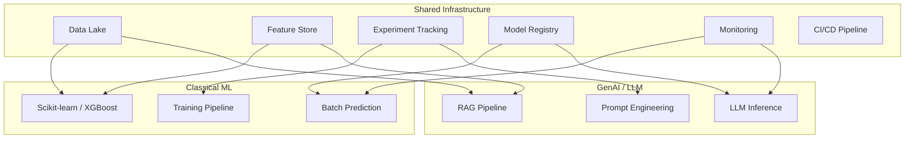
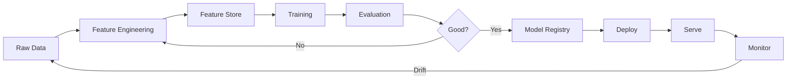
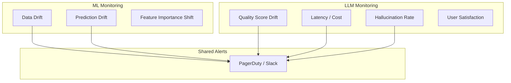
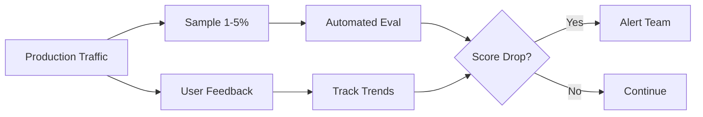
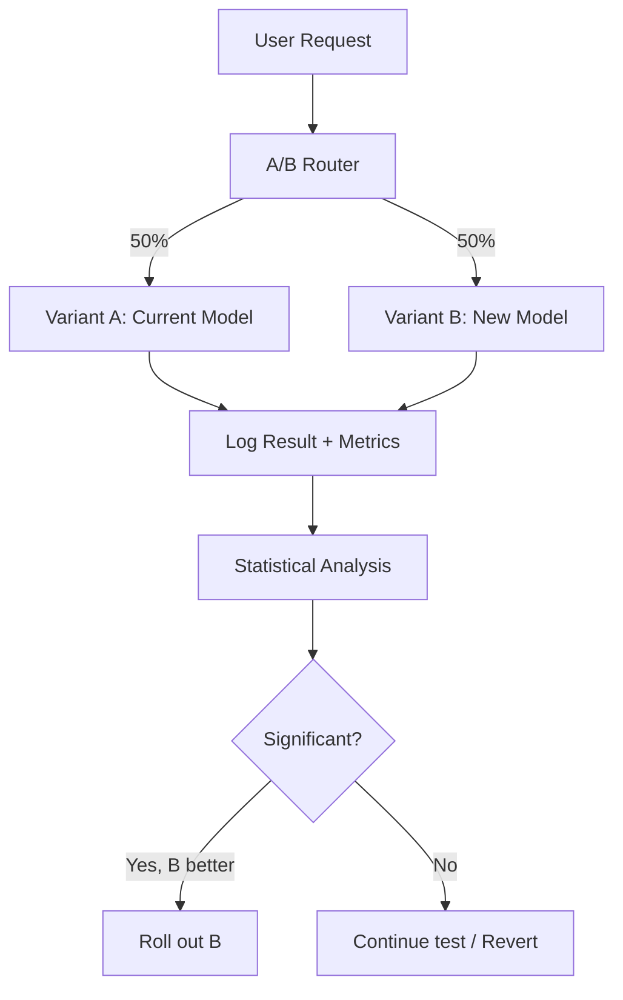
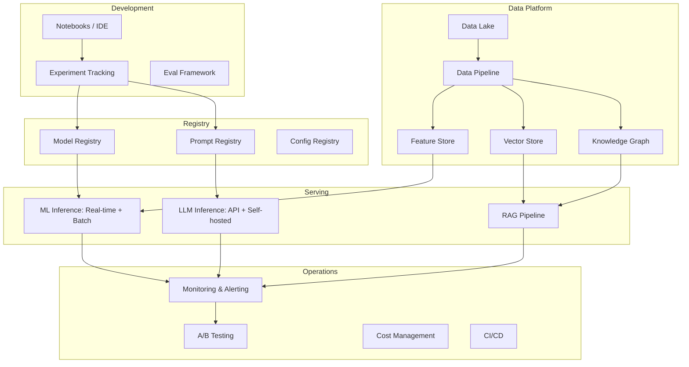

# MLOps Integration

## MLOps vs LLMOps

**MLOps** is the practice of operationalizing machine learning models — getting them from notebook to production reliably. **LLMOps** is the equivalent for large language models.

They share DNA but differ in key ways:

| Aspect | MLOps (Classical ML) | LLMOps (GenAI) |
|--------|---------------------|----------------|
| Model source | Train from scratch | Use pre-trained, fine-tune or prompt |
| Data needed | 10K-10M labeled examples | 100-1000 examples (fine-tune) or 0 (prompt) |
| Evaluation | Accuracy, F1, AUC | Human eval, LLM-as-judge, vibes |
| Deployment | Model binary + serving infra | API call or model serving |
| Monitoring | Data drift, prediction drift | Quality drift, cost, latency |
| Iteration speed | Days-weeks to retrain | Minutes to change prompt |
| Cost model | Compute for training | Per-token for inference |
| Versioning | Model weights + data | Prompts + configs + model version |
| Feature engineering | Critical (months of work) | Minimal (context/RAG instead) |

---

## When You Need Both

Most enterprises have BOTH classical ML and GenAI:

```
Classical ML: Fraud detection, recommendation engines, demand forecasting
GenAI: Customer support, content generation, document processing
```

**The unified platform question:** Should these share infrastructure?



---

## Classical ML Pipeline



---

## Integration Patterns

### 1. Shared Feature Stores

The same features can serve both ML models and GenAI context:

```python
# Classical ML: features as model input
features = feature_store.get_features(user_id="123")
prediction = ml_model.predict(features)  # churn probability: 0.73

# GenAI: features as context
features = feature_store.get_features(user_id="123")
prompt = f"""User context: {features}
This user has high churn risk. Generate a personalized retention offer."""
response = llm.complete(prompt)
```

### 2. Shared Experiment Tracking

Tools like MLflow and Weights & Biases work for both:

```python
# Classical ML experiment
with mlflow.start_run():
    mlflow.log_params({"model": "xgboost", "n_estimators": 100})
    mlflow.log_metrics({"accuracy": 0.94, "f1": 0.89})
    mlflow.sklearn.log_model(model, "model")

# GenAI experiment
with mlflow.start_run():
    mlflow.log_params({"model": "gpt-4", "temperature": 0.7, "prompt_version": "v3"})
    mlflow.log_metrics({"human_rating": 4.2, "latency_p50": 1.3, "cost": 0.05})
    mlflow.log_artifact("prompt_template.txt")
```

### 3. Shared Model Registry

```
Registry:
├── fraud-detection-v2.1 (XGBoost, 5MB)
├── churn-predictor-v1.4 (Random Forest, 2MB)
├── support-agent-v3 (GPT-4 + prompt v7 + RAG config)
└── summarizer-v2 (Fine-tuned Llama-3, 14GB)
```

### 4. Shared Monitoring

Both need monitoring, but for different signals:



---

## Model Monitoring Deep Dive

### Concept Drift (The World Changes)

The relationship between inputs and correct outputs changes over time.

**Example:** A fraud model trained pre-COVID. During COVID, buying patterns changed dramatically. The model's assumptions about "normal behavior" were wrong.

**Detection:** Monitor prediction distribution over time. If it shifts significantly, investigate.

### Data Drift (Input Distribution Changes)

The inputs your model sees in production differ from training data.

**Example:** Your chatbot was trained on formal English. Users start using slang heavily. The input distribution has drifted.

**Detection:** Statistical tests (KS test, PSI) comparing production inputs to training distribution.

### Performance Drift (Quality Degrades)

Everything looks the same, but quality silently drops.

**Example:** A competitor launches a similar product. Users now ask more complex comparative questions your RAG can't handle.

**Detection:** Continuous evaluation sampling + user feedback signals.



---

## Experiment Tracking for GenAI

GenAI experiments are different from ML experiments:

| What to Track | ML | GenAI |
|--------------|-----|-------|
| Inputs | Feature vectors | Prompts, context, model config |
| Outputs | Predictions | Generated text, tool calls |
| Metrics | Accuracy, F1 | Human rating, LLM judge score |
| Artifacts | Model binary | Prompt template, RAG config |
| Cost | Training compute | Inference cost per query |
| Versioning | Data + code + model | Prompt + model + tools + context |

### What Makes a Good GenAI Experiment

```yaml
experiment:
  name: "support-agent-v3.1"
  changes: "Added tone instructions, increased context window"
  config:
    model: "gpt-4-turbo"
    temperature: 0.3
    system_prompt_version: "v7"
    rag_top_k: 5
    max_tokens: 500
  evaluation:
    test_set: "support-queries-100.jsonl"
    judges: ["gpt-4", "human"]
    metrics: ["helpfulness", "accuracy", "tone"]
  results:
    helpfulness: 4.3  # up from 3.9
    accuracy: 0.91    # same
    tone: 4.5         # up from 3.2
    cost_per_query: $0.04
    latency_p50: 1.8s
```

---

## A/B Testing Infrastructure

Works for both ML and GenAI:



**Key differences for GenAI A/B tests:**
- Need more samples (output is high-variance)
- Evaluation is subjective (need LLM judges or human eval)
- Cost differences between variants may matter
- Latency differences may affect user behavior

---

## The Unified AI Platform



---

## Practical Integration Checklist

- [ ] **Shared data platform** — one place for all training/RAG data
- [ ] **Unified experiment tracking** — MLflow or W&B for both ML and GenAI
- [ ] **Common CI/CD** — same pipeline deploys both model types
- [ ] **Unified monitoring** — same dashboards, same alerting system
- [ ] **Shared feature store** — features serve both ML models and GenAI context
- [ ] **Cost attribution** — track spend per team/project across ML and GenAI
- [ ] **Common evaluation framework** — automated tests for both paradigms
- [ ] **Single model registry** — all models (ML + LLM + fine-tuned) in one place

---

## Key Takeaways

1. **MLOps and LLMOps share 60% of infrastructure** — don't build separate platforms
2. **Feature stores** bridge both worlds — same data serves predictions and context
3. **Monitoring differs in signals** but shares infrastructure (alerting, dashboards)
4. **Experiment tracking for GenAI** must capture prompts, costs, and subjective quality
5. **A/B testing works for both** but GenAI needs more samples and LLM-based evaluation
6. **The trend is convergence** — unified AI platforms that serve classical ML and GenAI together
7. **Start with shared monitoring and experiment tracking** — biggest ROI for integration

---

## Next Steps

- Apply these patterns across all previous programs in this learning path
- Consider how [Multi-Cloud](./06-multi-cloud-ai-architecture.md) adds complexity to unified platforms
