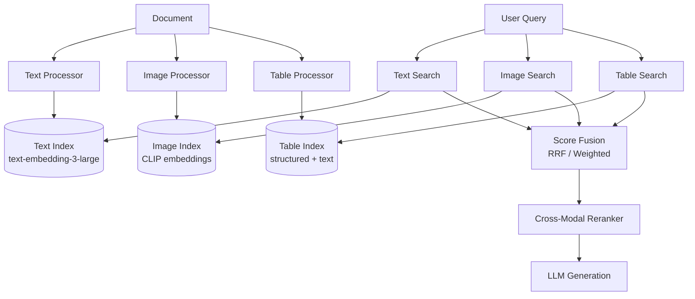
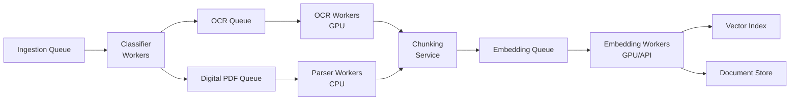

# Multi-Modal RAG Architecture

## Overview

Traditional RAG systems treat everything as text. Real-world documents contain tables, charts, images, diagrams, and complex layouts. Multi-modal RAG bridges this gap by understanding and retrieving across all content types.

**The core challenge**: A financial analyst asks "What was the revenue trend in Q3?" The answer is in a bar chart on page 47 of a PDF. Text-only RAG will never find it.

---

## Document Understanding Pipeline

### Stage 1: Ingestion and Classification

```
Raw Document → Format Detection → Content Type Classification → Route to Processors
```

Document types and their challenges:
| Document Type | Challenges | Processing Time |
|---|---|---|
| Scanned PDF | OCR errors, layout loss | 2-5s/page |
| Digital PDF | Table extraction, multi-column | 0.5-1s/page |
| Presentations | Slide layout, speaker notes | 1-2s/slide |
| Spreadsheets | Formula context, cross-sheet refs | 0.3-1s/sheet |
| Images | Captioning, text extraction | 1-3s/image |

### Stage 2: OCR and Layout Analysis

```
┌─────────────────────────────────────────────────────┐
│ OCR + Layout Pipeline                                │
├─────────────────────────────────────────────────────┤
│ 1. Image preprocessing (deskew, denoise, binarize)  │
│ 2. Text detection (CRAFT, DBNet)                    │
│ 3. Text recognition (TrOCR, PaddleOCR)             │
│ 4. Layout analysis (LayoutLMv3, DiT)               │
│ 5. Reading order determination                      │
│ 6. Region classification (title, body, table, fig)  │
└─────────────────────────────────────────────────────┘
```

**Key insight**: Layout analysis is NOT optional. Without it, a two-column PDF becomes garbled text mixing both columns.

### Stage 3: Table Extraction

Tables are the #1 failure mode in document RAG:

- **Simple tables**: Bordered, regular grid → rule-based extraction works
- **Complex tables**: Merged cells, nested headers → ML models required (TableTransformer)
- **Borderless tables**: Whitespace-aligned → layout analysis critical
- **Multi-page tables**: Headers repeat, rows span pages → stateful processing

Production accuracy benchmarks:
- Simple bordered tables: 95-98% cell accuracy
- Complex merged tables: 75-85% cell accuracy
- Borderless tables: 60-75% cell accuracy

### Stage 4: Image Captioning and Understanding

```python
# Conceptual pipeline for image understanding
def process_image_in_document(image, context):
    # Step 1: Classify image type
    image_type = classify(image)  # chart, photo, diagram, logo, signature
    
    # Step 2: Type-specific processing
    if image_type == "chart":
        return extract_chart_data(image)  # → structured data
    elif image_type == "diagram":
        return describe_diagram(image, context)  # → text description
    elif image_type == "photo":
        return caption_image(image, context)  # → natural language caption
    
    # Step 3: Generate embedding for retrieval
    embedding = clip_embed(image)
    return {"description": description, "embedding": embedding}
```

---

## Multi-Modal Embeddings

### Embedding Model Comparison

| Model | Modalities | Dim | Speed | Use Case |
|---|---|---|---|---|
| CLIP (OpenAI) | Image + Text | 512/768 | Fast | General cross-modal |
| SigLIP (Google) | Image + Text | 768/1024 | Fast | Better zero-shot |
| ColPali | Document pages | 128×N | Medium | Full-page retrieval |
| BGE-M3 | Text + sparse | 1024 | Fast | Hybrid text retrieval |
| Nomic Embed Vision | Image + Text | 768 | Fast | Open-source alternative |

### CLIP-Based Retrieval

```
Text Query: "revenue growth chart"
     ↓ CLIP Text Encoder
Text Embedding [512-dim]
     ↓ Cosine Similarity
Image Embeddings [512-dim each]  ← Pre-computed from document images
     ↓ Top-K
Retrieved: [chart_page47.png, graph_page12.png, ...]
```

**Limitation**: CLIP understands visual concepts but NOT fine-grained text in images. It can find "a bar chart" but not "a bar chart showing revenue > $5M."

### ColPali: Late Interaction for Documents

ColPali treats entire document pages as images and uses late interaction (like ColBERT) for retrieval:

```
Query tokens: ["revenue", "Q3", "2024"]
     ↓ Each token gets embedding
Page patch embeddings: 1024 patches per page
     ↓ MaxSim between query tokens and page patches
Score = Σ max(sim(q_i, p_j)) for all query tokens i
```

**Advantage**: No OCR needed. No chunking. The model "reads" the page visually.
**Disadvantage**: 1024 embeddings per page = expensive storage. 1M pages = 1B vectors.

---

## Indexing Strategies

### Strategy 1: Separate Indexes (Recommended for Most)



**Pros**: Each modality optimized independently, easy to debug, can scale each index separately.
**Cons**: Score fusion is tricky, no cross-modal relationships in index.

### Strategy 2: Unified Multi-Modal Index

All content embedded into same vector space using multi-modal models:

```
Text chunks → CLIP text encoder → unified index
Image regions → CLIP image encoder → unified index  
Table cells → text representation → CLIP text encoder → unified index
```

**Pros**: Single retrieval call, natural cross-modal matching.
**Cons**: CLIP text embeddings inferior to specialized text embedders for text-only queries.

### Strategy 3: Hybrid (Production Recommendation)

```
Primary: Text index with specialized embeddings (90% of queries)
Secondary: Multi-modal index for cross-modal queries (10% of queries)
Router: Classify query type → route to appropriate index
```

---

## Cross-Modal Retrieval

### Text Query → Image Retrieval

The hardest problem: user asks in text, answer is in an image.

**Approach 1: Pre-generated descriptions**
```
Index time: Image → Vision model → Text description → Text embedding
Query time: Text query → Text embedding → Match against descriptions
```

**Approach 2: Direct cross-modal matching**
```
Index time: Image → CLIP image embedding
Query time: Text query → CLIP text embedding → Match in shared space
```

**Approach 3: Hybrid (best results)**
```
Index time: Image → [CLIP embedding] + [Generated description → text embedding]
Query time: Query → [CLIP text embedding] + [text embedding] → Merge results
```

### Chart and Graph Understanding

Converting visual data to queryable knowledge:

```
Chart Image
  → Chart type classification (bar, line, pie, scatter)
  → Axis label extraction (OCR + spatial reasoning)
  → Data point extraction (visual → numerical)
  → Trend analysis (increasing, decreasing, stable)
  → Natural language summary generation
  → Structured data output (JSON/CSV)
```

Production accuracy:
- Chart type classification: 95%+
- Axis label extraction: 85-90%
- Data point extraction: 70-80% (varies with chart complexity)

---

## PDF Processing at Scale

### Architecture for Millions of Documents



### Scale Numbers

| Component | Throughput | Bottleneck |
|---|---|---|
| PDF parsing (digital) | 50-100 pages/sec/worker | CPU |
| OCR (Tesseract) | 2-5 pages/sec/GPU | GPU memory |
| OCR (cloud API) | 20-50 pages/sec | API rate limit |
| Layout analysis | 5-10 pages/sec/GPU | GPU compute |
| Text embedding | 500-1000 chunks/sec | Batch size |
| Image embedding (CLIP) | 100-200 images/sec/GPU | GPU compute |
| Vision model captioning | 1-3 images/sec | Model latency |

### Cost Modeling (1M documents, avg 20 pages each)

```
Total pages: 20M pages

OCR (if needed, ~30% scanned): 6M pages × $0.001/page = $6,000
Layout analysis: 20M pages × $0.0005/page = $10,000
Text embedding: ~100M chunks × $0.0001/1K tokens = $2,000
Image embedding: ~5M images × $0.0002/image = $1,000
Vision captioning: ~5M images × $0.01/image = $50,000  ← DOMINANT COST
Storage (vectors): ~100M vectors × 6KB = 600GB = $150/month

Total one-time processing: ~$69,000
Monthly storage + serving: ~$2,000-5,000
```

**Key insight**: Vision model captioning dominates cost. Use it selectively—only for images that OCR cannot handle.

---

## Anti-Patterns

### 1. Treating Images as Text-Only
**Problem**: Running OCR on charts and expecting meaningful text.
**Reality**: OCR on a bar chart gives you axis labels, not data relationships.
**Fix**: Classify image type first, route charts to chart-understanding models.

### 2. Ignoring Document Layout
**Problem**: Extracting text linearly from a multi-column document.
**Reality**: Two-column text gets interleaved, destroying meaning.
**Fix**: Layout analysis before text extraction. Always.

### 3. No OCR Fallback
**Problem**: Assuming all PDFs are digital (text-extractable).
**Reality**: 20-40% of enterprise PDFs are scanned images.
**Fix**: Always check if text extraction yields content; fall back to OCR if not.

### 4. Single Embedding Space for Everything
**Problem**: Using text embeddings for image retrieval.
**Reality**: Text embeddings cannot represent visual concepts.
**Fix**: Use appropriate embedding model per modality; fuse at retrieval time.

### 5. Embedding Entire Pages
**Problem**: One embedding per page loses granularity.
**Reality**: A page may contain 5 different topics.
**Fix**: Layout-aware chunking that respects content boundaries.

### 6. Ignoring Tables During Chunking
**Problem**: Table rows split across chunks.
**Reality**: "Revenue: $5M" in one chunk, column header "Q3 2024" in another = meaningless.
**Fix**: Detect table boundaries; keep tables as atomic units.

---

## Production Challenges

### Latency Budget

```
User query arrives
  → Query classification: 10ms
  → Text retrieval: 50-100ms
  → Image retrieval: 50-100ms (parallel)
  → Score fusion: 5ms
  → Reranking: 100-200ms
  → LLM generation: 500-2000ms
  ─────────────────────────────
  Total: 700-2400ms (acceptable for most apps)
```

**Problem areas**:
- Vision model in the loop at query time: +2-5 seconds
- Large image re-processing: +1-3 seconds
- Solution: Pre-compute everything possible at index time

### Quality Measurement

Metrics for multi-modal RAG:
- **Cross-modal recall@K**: Can text queries find relevant images?
- **Table extraction accuracy**: F1 on cell content extraction
- **Layout fidelity**: Does chunking preserve reading order?
- **End-to-end answer accuracy**: Human evaluation on multi-modal questions

---

## Case Studies

### Legal Document Review
- **Volume**: 500K contracts, 20-200 pages each, mixed scanned/digital
- **Challenge**: Finding specific clauses, signature pages, amendment tables
- **Solution**: Layout-aware extraction + table-specific index + signature detection
- **Result**: 85% reduction in manual review time, 92% recall on clause finding

### Medical Imaging RAG
- **Volume**: 2M radiology reports with embedded images
- **Challenge**: "Find similar cases to this X-ray showing pleural effusion"
- **Solution**: Medical CLIP (BiomedCLIP) + report text embedding + metadata filters
- **Result**: Radiologists find relevant prior cases in 3 seconds vs 15 minutes

### Financial Report Analysis
- **Volume**: 10K annual reports, heavy charts and tables
- **Challenge**: "Compare EBITDA margins across competitors over 5 years"
- **Solution**: Chart extraction → structured data + table extraction → time series index
- **Result**: Analysts get structured comparisons in seconds vs hours of manual work

---

## Staff Decision Framework

### When to Use Multi-Modal RAG vs Text-Only

**Use text-only when**:
- Documents are primarily text (contracts, emails, articles)
- Budget is limited (multi-modal adds 5-10x processing cost)
- Latency requirements are strict (<500ms)
- Image content is decorative, not informative

**Use multi-modal when**:
- Answers frequently live in charts, tables, or diagrams
- Documents are visually complex (scientific papers, financial reports)
- Users expect to query across modalities ("show me the architecture diagram for X")
- Accuracy on visual content is a business requirement

### Architecture Decision Tree

```
Q: Do >20% of user questions require visual content?
  YES → Multi-modal RAG required
  NO → 
    Q: Are tables critical for answers?
      YES → Text RAG + table extraction (not full multi-modal)
      NO → Text-only RAG is sufficient

Q: Budget allows vision model processing at scale?
  YES → Full multi-modal with captioning
  NO → CLIP-based retrieval + OCR (cheaper, lower quality)

Q: Latency budget >2 seconds acceptable?
  YES → Can use vision models at query time
  NO → All multi-modal processing must be at index time
```

### Build vs Buy

| Approach | Cost | Quality | Control |
|---|---|---|---|
| Build custom pipeline | High eng cost, low API cost | Highest (tunable) | Full |
| Azure AI Document Intelligence | Medium API cost | High for standard docs | Medium |
| Unstructured.io | Medium | Good for varied formats | Medium |
| LlamaParse | Low cost | Good for PDFs | Low |
| ColPali end-to-end | Low complexity | Good for retrieval | Low |

**Staff recommendation**: Start with managed services (Azure Doc Intelligence or Unstructured) for 80% of documents. Build custom only for the 20% that fail—usually complex tables, domain-specific charts, and unusual layouts.
