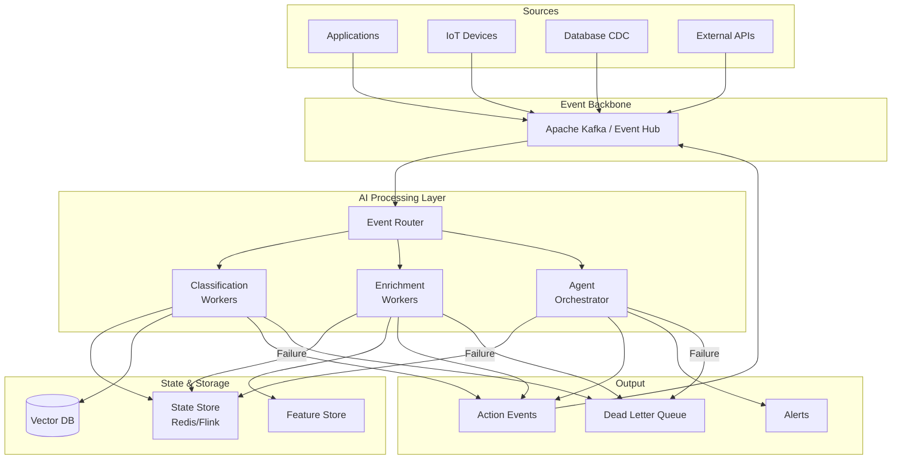
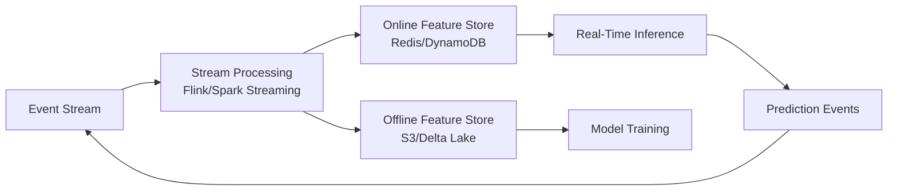

# Event-Driven AI Architecture

## Overview

AI systems that only respond to synchronous requests miss the real world. Events happen continuously—transactions, user actions, sensor readings, market changes. Event-driven AI reacts to the world as it happens, not just when asked.

**The fundamental shift**: From "user asks question → AI answers" to "world changes → AI notices → AI acts."

---

## Why Event-Driven AI

### Request-Response AI Limitations

```
Traditional: User → API → LLM → Response
Problems:
  - Only acts when explicitly asked
  - No continuous monitoring
  - State between requests is lost
  - Can't correlate events over time
  - Misses time-sensitive patterns
```

### Event-Driven AI Capabilities

```
Event-Driven: World → Events → AI Processing → Actions + Events
Enables:
  - Real-time fraud detection (must react in <100ms)
  - Continuous customer sentiment monitoring
  - Anomaly detection across thousands of metrics
  - Agent workflows triggered by external conditions
  - Streaming personalization
```

---

## Core Architecture



---

## Kafka + AI Integration Patterns

### Pattern 1: Event Classification

```
Input topic: raw-customer-interactions
AI processing: Classify intent, sentiment, urgency
Output topic: classified-interactions

Example:
  IN:  {"user": "u123", "msg": "This is unacceptable! Cancel my account NOW"}
  OUT: {"user": "u123", "intent": "cancellation", "sentiment": -0.9, 
        "urgency": "critical", "route": "retention-team"}
```

### Pattern 2: Event Enrichment

```
Input topic: raw-transactions
AI processing: Add fraud score, merchant category, user pattern match
Output topic: enriched-transactions

Example:
  IN:  {"user": "u456", "amount": 5000, "merchant": "xyz-store", "country": "NG"}
  OUT: {"user": "u456", "amount": 5000, "fraud_score": 0.87, 
        "pattern": "unusual_country", "action": "hold_for_review"}
```

### Pattern 3: Event-Triggered Agents

```
Input topic: system-alerts
AI processing: Diagnose issue, determine remediation, execute or escalate
Output topics: remediation-actions, escalations

Example:
  IN:  {"alert": "latency_spike", "service": "payment-api", "p99": "5200ms"}
  OUT: {"diagnosis": "database connection pool exhaustion",
        "action": "scale_connection_pool", "confidence": 0.82,
        "escalate": false}
```

---

## Architecture Patterns

### Event-Sourced AI

Store every event and AI decision as immutable facts:

```
Event Log:
  t=1: customer_message{id=1, text="Help with order"}
  t=2: ai_classification{id=1, intent="order_help", confidence=0.95}
  t=3: agent_action{id=1, action="lookup_order", result="found"}
  t=4: ai_response{id=1, response="Your order #X is..."}

Benefits:
  - Full audit trail of AI decisions
  - Replay events to test new models
  - Debug AI failures by replaying exact sequence
  - A/B test models on historical events
```

### CQRS for AI State

Separate the write path (event processing) from read path (querying AI state):

```
Write side:
  Events → AI Processors → State Updates → Event Store

Read side:
  Queries → Materialized Views (pre-computed by AI)
  
Example:
  Write: Process 10K customer messages/min → update sentiment scores
  Read: Dashboard queries "current average sentiment" → instant response
```

### Saga Pattern for Multi-Step AI

Complex AI workflows spanning multiple services:

```
Saga: Customer Onboarding AI
  Step 1: Document verification (Vision AI) → verified/rejected
  Step 2: Identity matching (Embedding similarity) → matched/unmatched
  Step 3: Risk scoring (ML model) → approved/flagged
  Step 4: Account creation (Service call) → created/failed
  
  Compensation (if step 3 fails):
    → Undo step 2 identity linking
    → Flag documents for manual review
    → Notify customer of delay
```

---

## Real-Time Feature Computation

### Streaming Features for ML Models

```
Event stream: user_actions
  → Window: 5-minute sliding window
  → Compute: actions_per_minute, unique_pages, session_depth
  → Output: feature vector updated in real-time
  → Consumer: fraud model queries latest features at prediction time

Feature freshness matters:
  Batch features (daily): User lifetime value, segment
  Near-real-time (minutes): Session behavior, recent purchases  
  Real-time (seconds): Current page, click velocity, device fingerprint
```

### Feature Store Integration



---

## Streaming Inference

### Continuous Processing vs Batch

| Aspect | Streaming | Micro-Batch | Batch |
|---|---|---|---|
| Latency | <1 second | 1-30 seconds | Minutes-hours |
| Throughput | Medium | High | Highest |
| Cost efficiency | Low (idle GPUs) | Medium | High (spot) |
| State management | Complex | Medium | Simple |
| Use case | Fraud, moderation | Recommendations | Reports, training |

### LLM in Streaming Pipeline

**Challenge**: LLMs take 500ms-5s per request. Events arrive at 10K/sec.

**Solutions**:

```
1. Parallel workers with auto-scaling:
   Event stream → Partition by key → N workers (scale 10-1000)
   Throughput: N × (1/latency) events/sec
   Example: 100 workers × 2 req/sec = 200 events/sec

2. Batched prompts:
   Collect 10 events → Single prompt classifying all 10
   Throughput: 10× improvement per call
   Risk: One failure affects 10 events

3. Tiered processing:
   Fast path: Small model / rules (90% of events, <50ms)
   Slow path: LLM (10% of events, needs reasoning)
   
4. Cached responses:
   Similar events → Cache hit → Skip LLM call
   Cache hit rate: 30-70% depending on domain
```

---

## Exactly-Once Processing with AI

### The Non-Determinism Problem

```
Traditional exactly-once: Process event, commit offset atomically
AI problem: Same event → different LLM response each time

Scenario:
  Event E1 processed → LLM says "positive sentiment" → crash before commit
  Event E1 reprocessed → LLM says "neutral sentiment" → different result!

Solutions:
  1. Idempotency key: Hash(event_id + model_version) → cache response
  2. Deterministic fallback: If reprocessing, use cached first response
  3. Accept non-determinism: For many use cases, slight variation is acceptable
  4. Seed-based: Use event_id as random seed (model-dependent support)
```

### Exactly-Once Architecture

```
Event → Check idempotency cache
  → Cache hit: Return cached result (truly exactly-once)
  → Cache miss: Process with AI → Store result → Commit offset
  
Idempotency cache: Redis with TTL = max reprocessing window (e.g., 24h)
Key: SHA256(event_id + model_id + prompt_version)
Value: AI response
```

---

## Backpressure Management

### The Fundamental Problem

```
Event arrival rate: 10,000 events/sec
LLM processing rate: 200 events/sec (100 workers × 2/sec)
Gap: 9,800 events/sec accumulating as lag
```

### Strategies

```
1. Prioritization:
   High priority events → Process immediately (dedicated workers)
   Low priority events → Queue, process when capacity available
   
2. Sampling:
   Process 2% of events with LLM, extrapolate for the rest
   Works for: aggregate analytics, trend detection
   Doesn't work for: per-event decisions (fraud)

3. Degradation tiers:
   Normal load: Full LLM processing
   High load: Switch to smaller/faster model
   Critical load: Switch to rule-based fallback
   
4. Dynamic scaling:
   Monitor consumer lag → Auto-scale workers
   Scale-up trigger: lag > 1000 events or growing for 2 minutes
   Scale-down trigger: lag = 0 for 10 minutes
   Challenge: GPU scale-up takes 2-5 minutes (cold start)

5. Load shedding:
   If lag > threshold: Drop lowest-priority events
   Send to DLQ for batch processing later
```

### Backpressure Metrics

```
Key metrics to monitor:
  - Consumer lag (events behind): Primary health indicator
  - Processing time p50/p95/p99: Model performance
  - Worker utilization: Scaling trigger
  - DLQ rate: Quality indicator (>5% = problem)
  - Cache hit rate: Efficiency indicator
```

---

## Dead Letter Queue for AI

### Why AI Needs DLQ More Than Traditional Systems

```
Traditional DLQ reasons: Invalid format, schema mismatch, timeout
AI-specific DLQ reasons:
  - Model returned unparseable response
  - Content policy violation (refused to process)
  - Confidence below threshold
  - Token limit exceeded
  - Rate limit hit (retry later)
  - Hallucination detected in output validation
```

### DLQ Processing Strategy

```
DLQ Event → Classify failure reason
  → Transient (rate limit, timeout): Auto-retry with backoff
  → Model failure (bad output): Retry with different model
  → Content issue (policy, tokens): Route to human review
  → Permanent (invalid input): Log and discard

Retry policy:
  Attempt 1: Same model, immediate
  Attempt 2: Same model, 30s delay
  Attempt 3: Fallback model
  Attempt 4: Human review queue
```

---

## Event-Driven Agent Orchestration

### Trigger → Condition → Action Pattern

```yaml
agent_rules:
  - name: "escalation-agent"
    trigger:
      event: "customer_message"
      topic: "support-classified"
    condition:
      - field: "sentiment"
        operator: "less_than"
        value: -0.8
      - field: "customer_tier"
        operator: "equals"
        value: "enterprise"
    action:
      - type: "invoke_agent"
        agent: "retention-specialist"
        context: ["last_5_messages", "customer_profile", "account_health"]
      - type: "emit_event"
        topic: "escalations"
        
  - name: "anomaly-responder"
    trigger:
      event: "metric_anomaly"
      topic: "monitoring-alerts"
    condition:
      - field: "severity"
        operator: "greater_than"
        value: 7
    action:
      - type: "invoke_agent"
        agent: "incident-diagnostician"
        context: ["related_metrics", "recent_deployments", "runbooks"]
```

### Agent Coordination via Events

```
Agent A produces event → Agent B consumes and acts → Agent C observes result

Example: Order Processing
  Agent A (Validator): order_placed → validates → order_validated event
  Agent B (Risk): order_validated → risk check → order_approved event  
  Agent C (Fulfillment): order_approved → initiates shipping → order_shipped event
  Agent D (Notifier): order_shipped → sends customer notification

Each agent is independent, stateless, scales independently.
Event log provides complete audit trail.
```

---

## Anti-Patterns

### 1. Synchronous AI in Event Pipeline
**Problem**: Event consumer calls LLM synchronously, blocks processing.
**Impact**: Consumer lag grows unboundedly during LLM slowdowns.
**Fix**: Async processing with dedicated worker pools. Consumer only enqueues work.

### 2. No Dead Letter Queue
**Problem**: Failed AI processing events are retried infinitely.
**Impact**: Poison messages block partition processing forever.
**Fix**: Max retry count → DLQ → separate processing/alerting.

### 3. Unbounded Queues Between AI Stages
**Problem**: Stage 1 produces faster than Stage 2 (LLM) can consume.
**Impact**: Memory exhaustion, OOM crashes.
**Fix**: Bounded queues with backpressure signaling. Apply strategies from Backpressure section.

### 4. No Event Ordering Guarantees for AI
**Problem**: Events processed out of order; AI gets confused context.
**Impact**: "Cancel order" processed before "Place order" → wrong state.
**Fix**: Partition by entity key, process in order within partition.

### 5. Treating LLM as Stateless Function
**Problem**: Every event processed independently, no context.
**Impact**: AI can't detect patterns across events (e.g., escalating frustration).
**Fix**: Maintain session state in external store. Feed context window from recent events.

### 6. No Fallback When AI Is Down
**Problem**: AI service failure = entire event pipeline stops.
**Impact**: Events accumulate, downstream systems starved.
**Fix**: Rule-based fallback that handles 80% of cases without AI. AI enhances, not gates.

---

## Case Studies

### Real-Time Fraud Detection

```
Architecture:
  Transaction event (Kafka) → Feature enrichment (Flink) → ML scoring → Decision

Requirements:
  - Latency: <100ms (must approve/deny before authorization timeout)
  - Volume: 50K transactions/sec peak
  - Accuracy: <0.1% false positive rate

AI components:
  - Real-time features: velocity, geolocation anomaly, device fingerprint
  - ML model: XGBoost (fast) + LLM review (for borderline cases only)
  - LLM handles: 2% of transactions flagged as uncertain by ML model
  
Numbers:
  - XGBoost inference: 2ms (handles 98% of decisions)
  - LLM review: 800ms (handles 2% = 1000 transactions/sec)
  - 50 LLM workers needed for 2% overflow
```

### Live Customer Support Routing

```
Architecture:
  Customer message → Classify (intent + sentiment + complexity) → Route

Processing:
  - Intent classification: Which team handles this?
  - Complexity scoring: Can bot handle or need human?
  - Sentiment tracking: Escalation trigger
  - Skill matching: Best available agent for this issue
  
Event flow:
  message_received → classified → routed → agent_assigned → resolution_tracked

Real-time state:
  - Per-customer: Conversation history, sentiment trajectory, issue count
  - Per-agent: Current load, skill set, availability
  - System: Queue depths, wait times, satisfaction scores
```

### Streaming Recommendations

```
Architecture:
  User action events → Real-time personalization → Updated recommendations

Event types:
  - page_view, product_click, add_to_cart, purchase, search_query

Processing:
  - Update user embedding in real-time (every action shifts interests)
  - Re-score candidate items against updated embedding
  - Push new recommendations to user session

Latency budget:
  - Event ingestion: 10ms
  - Feature update: 20ms
  - Re-scoring: 50ms
  - Push to client: 20ms
  - Total: 100ms (user sees updated recommendations instantly)

Challenge: Millions of users × thousands of candidate items = scale problem
Solution: Pre-filter candidates, only re-score top-1000 per user
```

---

## Staff Decision Framework

### When Event-Driven AI vs Request-Response

**Use event-driven when**:
- System must react to external world changes without user prompting
- Processing can be async (user doesn't wait for immediate response)
- Need to correlate patterns across multiple events over time
- Multiple downstream systems need AI results
- Audit trail of all AI decisions is required
- Scale requires decoupled processing (different rates for ingestion vs AI)

**Use request-response when**:
- User is waiting for an answer (chatbot, search)
- Single request, single response pattern
- No need to maintain state between requests
- Low volume (<100 requests/sec)
- Simple architecture preferred over distributed complexity

### Technology Selection

```
Event backbone:
  - Kafka: Self-managed, highest control, complex ops
  - Confluent Cloud: Managed Kafka, expensive, full-featured
  - Azure Event Hubs: Managed, Kafka-compatible, Azure-native
  - AWS Kinesis: AWS-native, simpler than Kafka, limited features
  - Pulsar: Multi-tenancy, tiered storage, growing ecosystem

Stream processing:
  - Flink: Most powerful, complex to operate
  - Kafka Streams: Simple, JVM-only, no separate cluster
  - Spark Structured Streaming: Good for ML integration
  - Custom (Python + consumer): Simplest, limited windowing

For AI workloads specifically:
  - Start with: Kafka + custom Python consumers
  - Scale to: Kafka + Flink (when you need windowing/state)
  - Enterprise: Confluent + managed Flink
```

### Capacity Planning

```
Given:
  - Event rate: E events/sec
  - AI processing time: T seconds/event
  - Target lag: L seconds max
  
Workers needed: W = E × T / (1 - L_buffer)
  
Example:
  E = 1000 events/sec
  T = 0.5 sec/event (LLM call)
  L_buffer = 0.2 (20% headroom)
  
  W = 1000 × 0.5 / 0.8 = 625 workers

Cost: 625 workers × $0.10/hour = $62.50/hour = $45,000/month
  → This is why tiered processing matters!
  → If 90% can be handled by fast model (T=0.05s): 
    Fast workers: 900 × 0.05 / 0.8 = 56 workers
    LLM workers: 100 × 0.5 / 0.8 = 63 workers
    Total: 119 workers = $8,500/month (81% savings)
```
