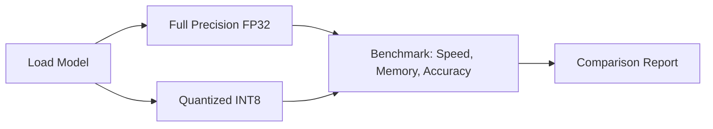

# Edge Inference Demo

## What This Demonstrates

How model compression (quantization) affects inference speed, memory usage, and accuracy — simulating edge deployment constraints.

**Key insight:** By reducing precision from 32-bit to 8-bit, you can run models 2-4x faster with 75% less memory, at minimal accuracy cost. This is what makes on-device AI possible.

## Architecture



## How to Run

```bash
pip install -r requirements.txt
cp .env.example .env
python main.py
```

## What It Measures

| Metric | What It Tells You |
|--------|------------------|
| Inference time | How fast the model responds |
| Memory usage | How much RAM is needed |
| Model size | Storage requirements |
| Accuracy | Quality of predictions |

## Expected Results

```
Full Precision (FP32): Baseline accuracy, slower, more memory
Quantized (INT8):      ~99% accuracy, 2-4x faster, 75% less memory
```

## Why This Matters for Edge

- Phones have 4-8 GB RAM (shared with OS and apps)
- IoT devices may have < 1 GB
- Battery life depends on compute efficiency
- Quantization makes deployment on these devices possible
