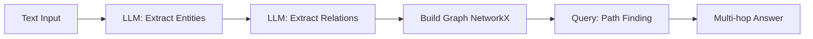

# Knowledge Graph Builder

## What This Demonstrates

Building a knowledge graph from text using LLM-powered entity and relation extraction, then querying it for multi-hop reasoning.

**Key concepts:**
- Extract entities (people, organizations, concepts) from text
- Extract relationships between entities
- Build a traversable graph using NetworkX
- Answer multi-hop questions by following graph paths

## Architecture



## How to Run

```bash
pip install -r requirements.txt
cp .env.example .env  # Add your OpenAI API key
python main.py
```

## Features

- **Entity extraction** — Identifies people, organizations, technologies, concepts
- **Relation extraction** — Identifies how entities connect
- **Graph visualization** — Text-based graph structure display
- **Path queries** — "How is A related to B?" via graph traversal
- **Multi-hop reasoning** — Follow chains of relationships

## Sample Queries

After building the graph from `sample_text.txt`:
- "How is [Person] related to [Company]?"
- "What connects [Technology] to [Product]?"
- "Show all relationships for [Entity]"
