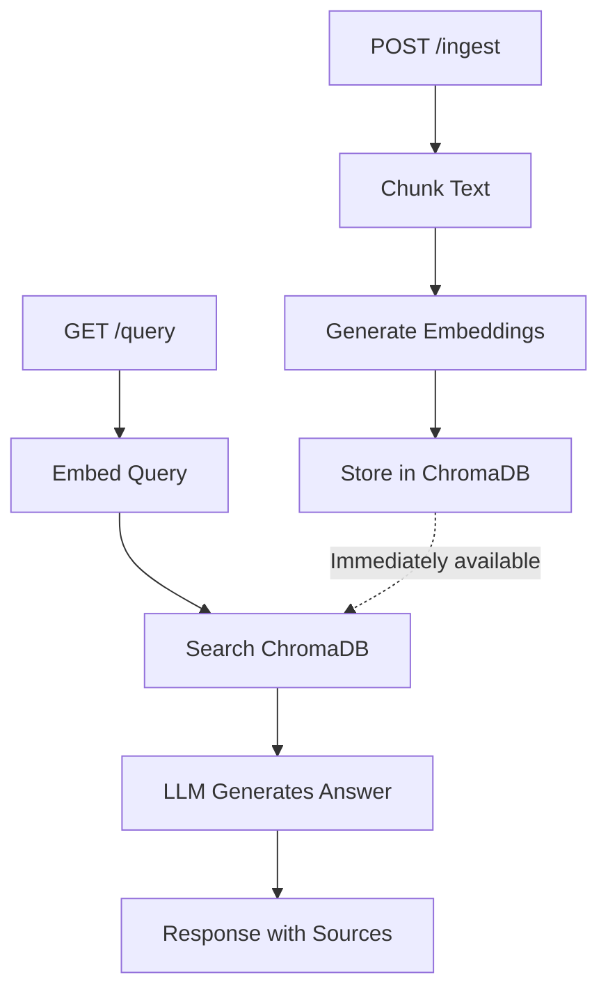

# Real-Time RAG

## What This Demonstrates

A RAG system where newly ingested content is immediately searchable — no batch reindexing needed.

**Key insight:** Traditional RAG systems reindex on a schedule (hourly/daily). This means recent information is invisible to queries. Real-time RAG eliminates this blind spot.

## Architecture



## How to Run

```bash
pip install -r requirements.txt
cp .env.example .env  # Add your OpenAI API key
python main.py
```

## Endpoints

- `POST /ingest` — Add new content (immediately searchable)
- `GET /query?q=...` — Ask questions over all ingested content
- `GET /documents` — List all ingested documents
- `DELETE /reset` — Clear all data

## Key Demonstration

1. Query something → get "no results"
2. Ingest a document about that topic
3. Query again → get accurate answer immediately
4. Shows the zero-delay between ingest and searchability
