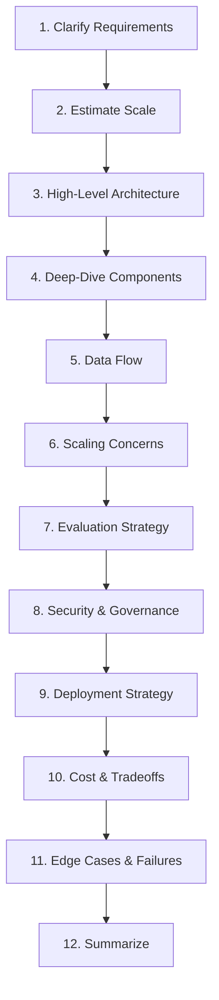

# Interview Strategy for AI Architects

## How AI Architect Interviews Differ

AI architect interviews are fundamentally different from software engineer interviews. You won't be asked to invert a binary tree. Instead, you'll be evaluated on:

1. **Systems thinking** — Can you design end-to-end AI systems?
2. **Tradeoff articulation** — Can you explain WHY you chose X over Y?
3. **Breadth + depth** — Do you understand the full stack from infra to UX?
4. **Business alignment** — Can you connect technical decisions to business outcomes?
5. **Risk awareness** — Do you understand what can go wrong with AI systems?

## Interview Types

### 1. System Design: "Design an AI-powered X"

You'll get 45-60 minutes to design a complete system. The interviewer evaluates:
- How you gather requirements
- Your architectural decisions
- How you handle scale
- Your awareness of AI-specific challenges (hallucination, latency, cost)

### 2. Deep Dive: "How does RAG work at scale?"

A 30-45 minute technical deep dive into one area. Tests:
- Depth of understanding
- Awareness of failure modes
- Production experience vs theoretical knowledge

### 3. Case Study: "Our system has X problem"

You're given a broken or underperforming system and must diagnose/fix it. Tests:
- Debugging intuition
- Prioritization ability
- Pragmatism vs perfectionism

### 4. Behavioral: "Tell me about a time..."

Tests leadership, communication, and decision-making. AI-specific variants:
- "Tell me about a time an AI system failed in production"
- "How did you convince leadership to invest in AI governance?"

### 5. Whiteboard Architecture

Draw a system live. Tests:
- Visual communication skills
- Ability to organize complex systems
- Iterative refinement under pressure

---

## The 12-Step Framework for System Design Questions

### Step 1: Clarify Requirements

**Functional requirements** — What does the system DO?
- "Who are the users?"
- "What are the primary use cases?"
- "What does success look like?"

**Non-functional requirements** — Quality attributes:
- Latency targets
- Accuracy/quality thresholds
- Availability requirements
- Compliance constraints

> Spend 3-5 minutes here. This signals senior thinking.

### Step 2: Estimate Scale

Calculate concrete numbers:
- Users (DAU/MAU)
- Requests per second (peak and average)
- Data size (documents, embeddings, conversations)
- Storage growth rate

Example: "100K requests/day = ~1.2 RPS average, but with 10x peak = 12 RPS"

### Step 3: High-Level Architecture

Draw 4-6 boxes showing major components. Don't go deep yet.

Typical AI system components:
- Client/API layer
- Orchestration layer
- Model serving
- Data/retrieval layer
- Evaluation/monitoring

### Step 4: Deep-Dive Key Components

Pick the 2-3 most interesting/complex components and explain:
- Internal design
- Technology choices
- Key algorithms or patterns

### Step 5: Data Flow

Walk through a request end-to-end:
- User sends query → API gateway → orchestrator → retrieval → model → response → user

### Step 6: Scaling Concerns

Address how the system handles 10x and 100x growth:
- Horizontal scaling
- Caching strategies
- Async processing
- Database sharding

### Step 7: Evaluation Strategy

How do you know the system is working?
- Offline evals (golden datasets, benchmarks)
- Online evals (A/B tests, user feedback)
- Automated quality checks

### Step 8: Security & Governance

- Authentication/authorization
- PII handling
- Prompt injection prevention
- Audit logging
- Data retention policies

### Step 9: Deployment Strategy

- CI/CD pipeline
- Canary deployments
- Rollback strategy
- Feature flags for model versions

### Step 10: Cost & Tradeoffs

- Token costs at scale
- Compute costs
- Build vs buy decisions
- Cost optimization strategies

### Step 11: Edge Cases & Failures

- What if the model is down?
- What if retrieval returns nothing relevant?
- What about adversarial users?
- Rate limiting and abuse prevention

### Step 12: Summarize

"To summarize: I've designed a system that [key capabilities], using [key technologies], with [key tradeoffs]. The main risks are [X, Y] which I've mitigated with [A, B]."

---

## Common Mistakes in AI Architect Interviews

| Mistake | Why It's Bad | What to Do Instead |
|---------|-------------|-------------------|
| Jumping to solutions | Shows lack of senior thinking | Always clarify requirements first |
| Over-engineering | Signals inability to prioritize | Start simple, add complexity with justification |
| Ignoring cost | Shows no business awareness | Always discuss cost implications |
| No evaluation plan | How do you know it works? | Always include metrics and monitoring |
| "Just use GPT-4 for everything" | Shows lack of nuance | Match model capability to task requirements |
| Ignoring security | Disqualifying for senior roles | Always address PII, auth, and injection |
| No tradeoff discussion | Architecture IS about tradeoffs | Explicitly state what you're trading off |
| Treating AI as deterministic | Fundamental misunderstanding | Acknowledge probabilistic nature, design for it |
| Forgetting the human | AI systems serve humans | Include human-in-the-loop, escalation, feedback |

---

## 9 Power Phrases for Interviews

These phrases signal architectural maturity:

1. **"The key tradeoff here is..."** — Shows you think in tradeoffs, not absolutes.

2. **"At this scale, we need to consider..."** — Shows you think about scale implications.

3. **"Let me separate the data plane from the control plane..."** — Shows systems thinking.

4. **"The failure mode I'm most concerned about is..."** — Shows risk awareness.

5. **"I'd measure success by..."** — Shows outcome orientation.

6. **"For the MVP, I'd simplify by... then evolve to..."** — Shows pragmatism + vision.

7. **"The security boundary here is..."** — Shows governance awareness.

8. **"From a cost perspective, at 10M requests..."** — Shows business awareness.

9. **"I've seen this pattern fail when..."** — Shows experience and pattern recognition.

---

## Interview Day Checklist

- [ ] Prepare 3-4 stories using STAR format
- [ ] Practice drawing architectures (clean boxes and arrows)
- [ ] Know your numbers (latency of LLM calls, embedding dimensions, token costs)
- [ ] Have opinions on: RAG vs fine-tuning, agents vs workflows, open vs closed models
- [ ] Prepare questions FOR the interviewer about their AI platform maturity

---

## Anti-Patterns for Interviews

### What Kills Your Candidacy

**1. Jumping to Solution Before Requirements**

Bad: "I'd use RAG with Pinecone and GPT-4..."  
Good: "Before designing, let me understand: who are the users, what's the latency requirement, what's the data freshness need?"

Spending 3-5 minutes on requirements signals Staff+ thinking. Jumping straight to tech signals IC-level execution mode.

**2. Not Asking Clarifying Questions**

The interviewer deliberately leaves the problem ambiguous. They're testing whether you can identify what's missing. If you design a system for 1M users when they meant 1K, you've wasted 40 minutes.

**Must-ask questions:**
- Scale (users, requests/sec, data volume)
- Latency requirements (real-time vs batch acceptable?)
- Accuracy requirements (what's the cost of a wrong answer?)
- Constraints (budget, existing infrastructure, compliance)
- Success metrics (what makes this system "working"?)

**3. Memorized Answers That Don't Fit the Question**

Interviewers recognize rehearsed designs. When your "RAG system design" answer includes components the question didn't need, it signals pattern-matching over genuine architectural reasoning.

**Fix:** Listen to the actual question. Adapt your framework to the specific constraints given.

**4. Ignoring Cost and Scale**

Architecture without cost awareness isn't architecture — it's wishful thinking. Senior ICs design systems. Staff+ engineers design systems that the business can afford to run.

Always include: "At this scale, that's approximately $X/month. Here's how we optimize..."

---

## The Staff vs Senior Answer Framework

| Dimension | Senior Answer | Staff Answer |
|-----------|--------------|--------------|
| **Scope** | "Here's how I'd build it" | "Here's how I'd build it, why this approach over alternatives, and how it evolves" |
| **Tradeoffs** | Mentions 1-2 tradeoffs | Structures entire answer around tradeoffs with clear decision criteria |
| **Failure modes** | "We'd add monitoring" | "The failure mode I'm most concerned about is X because it's silent and costly. Here's how we detect and recover." |
| **Organizational awareness** | Focuses on technical design | Addresses team skills, operational burden, hiring implications |
| **Business impact** | Implicit | Explicit: "This saves $X/month" or "This unblocks Y revenue stream" |
| **Evolution** | Static design | "Day 1 looks like this. At 10x scale, we'd evolve to..." |

**How to upgrade any answer to Staff level:**
1. State the decision + the alternatives you considered
2. Quantify impact (cost, latency, user impact)
3. Name the failure mode you're most worried about
4. Acknowledge operational/team implications
5. Show how the system evolves over time

---

## Interview Day Timeline

| Time | Activity | Key Focus |
|------|----------|-----------|
| T-60 min | Arrive/settle, review notes | Calm nerves, recall key frameworks |
| T-30 min | Quick whiteboard warm-up | Draw one system end-to-end from memory |
| T-0 | Interview begins | Listen carefully, clarify requirements |
| T+5 min | Requirements gathering | Ask 3-5 clarifying questions minimum |
| T+10 min | High-level design | Draw boxes, arrows, data flow |
| T+25 min | Deep dive | Pick the hardest component, go deep |
| T+35 min | Tradeoffs and scaling | Show evolution, alternatives considered |
| T+40 min | Questions for interviewer | Ask about team challenges, tech stack |

## Common Pitfalls by Company Type

### Startup Interviews
- **Pitfall**: Over-engineering — proposing Kubernetes when they have 3 engineers
- **Fix**: Start with the simplest thing that works, show scaling path
- **Pitfall**: Ignoring cost — startups care about runway
- **Fix**: Always mention managed services, serverless-first approaches

### FAANG Interviews
- **Pitfall**: Not going deep enough — surface-level design won't pass the bar
- **Fix**: Pick one component and show you can design it down to the API contract level
- **Pitfall**: Ignoring scale — they operate at billions of requests
- **Fix**: Always state your QPS/storage estimates explicitly

### Enterprise Interviews
- **Pitfall**: Ignoring compliance and security — regulated industries need this
- **Fix**: Mention data residency, audit logging, RBAC from the start
- **Pitfall**: Assuming greenfield — most enterprise work is brownfield
- **Fix**: Ask "what exists today?" and design for incremental migration

## Post-Interview Reflection Framework

After every interview, spend 15 minutes on this:

1. **What went well?** — Which parts did you explain clearly? Where did the interviewer nod?
2. **What stumbled?** — Where did you hesitate? What question caught you off-guard?
3. **What would you change?** — If you could redo one section, which and how?
4. **Knowledge gaps identified** — What topic do you need to study before next round?
5. **Interviewer signals** — Did they push back? That's usually where you were weakest.

Keep a running log. Patterns emerge after 3-4 interviews that tell you exactly what to focus on.
