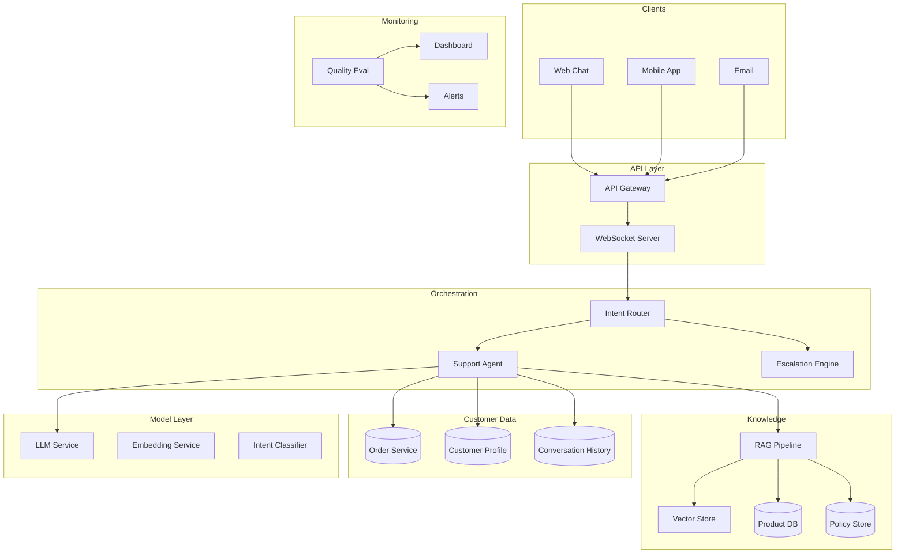
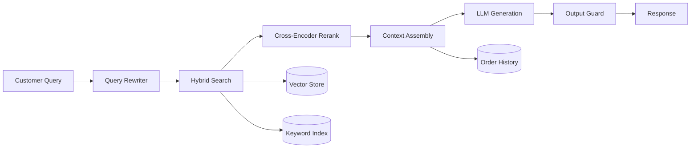

# System Design: AI-Powered Customer Support

## The Problem

> "Design an AI-powered customer support system for an e-commerce company with 10M customers and 100K support requests per day."

---

## Step 1: Requirements Gathering

### Functional Requirements

- Handle common support requests autonomously (order status, returns, product questions)
- Escalate complex issues to human agents with full context
- Support multi-turn conversations with memory
- Access product catalog, order history, and policies
- Handle multiple channels (web chat, email, mobile)
- Provide personalized responses based on customer history

### Non-Functional Requirements

| Requirement | Target |
|-------------|--------|
| Response latency | < 3 seconds for first response |
| Availability | 99.9% uptime |
| Resolution rate | > 70% without human escalation |
| Customer satisfaction | CSAT > 4.2/5 |
| Accuracy | < 2% factually incorrect responses |
| Security | SOC 2 compliant, PII protected |

---

## Step 2: Scale Estimation

- **100K requests/day** = ~1.2 requests/second average
- **Peak**: 5x average = ~6 RPS (sales events could be 20x)
- **Conversations**: Average 5 messages per conversation = 500K messages/day
- **Knowledge base**: ~50K products, ~500 policy documents
- **Storage**: ~2TB/year for conversation history
- **Token usage**: ~1000 tokens/message × 500K = 500M tokens/day

---

## Step 3: High-Level Architecture



---

## Step 4: Deep Dive — Key Components

### 4.1 Intent Router

The router classifies incoming messages to determine handling:

```
Categories:
├── Order Status (35%) → Deterministic lookup + template
├── Returns/Refunds (20%) → Policy RAG + Agent
├── Product Questions (25%) → Product RAG
├── Complaints (10%) → Agent with escalation readiness
├── Account Issues (5%) → Secure flow + human escalation
└── Other (5%) → General agent
```

For simple intents (order status), we bypass the LLM entirely — just query the order DB and format a response. This saves cost and improves latency.

### 4.2 RAG Pipeline for Product Knowledge



**Chunking strategy for products:**
- Each product gets a structured chunk (name, description, specs, FAQ)
- Policies chunked by section with overlapping context
- Customer-specific data injected at query time, never stored in vector DB

### 4.3 Agent for Multi-Step Resolution

The agent handles complex flows (returns, complaints) using tool-calling:

**Available tools:**
- `lookup_order(order_id)` — Get order details
- `check_return_eligibility(order_id)` — Policy check
- `initiate_return(order_id, reason)` — Start return process
- `apply_credit(customer_id, amount)` — Issue refund/credit
- `escalate_to_human(reason, priority)` — Hand off to human
- `search_knowledge(query)` — RAG search

**Guard rails:**
- Maximum 5 tool calls per conversation turn
- Monetary actions (refunds) capped at $50 without human approval
- Escalation triggered automatically for frustrated customers (sentiment detection)

---

## Step 5: Conversation Management and Memory

### Short-term memory (within conversation)
- Full message history kept in session (Redis)
- Summarized after 10 messages to keep context window manageable
- Key entities extracted and tracked (order IDs, product names)

### Long-term memory (across conversations)
- Customer preferences and past issues stored in profile
- Previous resolution patterns (what worked before)
- Injected into system prompt: "This customer previously had issue X resolved by Y"

### Session storage design:
```
Session (TTL: 24h):
  - conversation_id
  - customer_id  
  - messages[] (last 20)
  - summary (of older messages)
  - extracted_entities {}
  - escalation_risk_score
  - tools_used[]
```

---

## Step 6: Escalation to Human Agents

**Trigger conditions:**
1. Customer explicitly requests human
2. Sentiment score drops below threshold (3 consecutive negative messages)
3. Agent confidence below 0.6 for 2+ turns
4. Issue involves account security or legal
5. Monetary action exceeds agent authority

**Handoff design:**
- Generate a summary of the conversation for the human agent
- Include: issue, what was tried, customer sentiment, recommended action
- Human agent sees full conversation history
- Seamless transition (customer doesn't need to repeat information)

---

## Step 7: Quality Evaluation and Monitoring

### Automated Evaluation
| Metric | Method | Target |
|--------|--------|--------|
| Resolution rate | Tracking if issue resolved without escalation | > 70% |
| Factual accuracy | LLM-as-judge on sampled responses | > 98% |
| Policy compliance | Rule-based checks on actions taken | 100% |
| Response relevance | Embedding similarity to ideal responses | > 0.85 |
| Customer satisfaction | Post-conversation CSAT survey | > 4.2/5 |

### Human Review
- 5% random sample reviewed by QA team daily
- All escalated conversations reviewed
- All negative CSAT scores trigger review

### Real-time Monitoring
- Latency P50/P95/P99
- Error rates by intent category
- Escalation rate trends
- Cost per conversation

---

## Step 8: Security and PII Handling

- **PII detection**: Scan all messages for credit cards, SSNs, passwords
- **PII masking**: Replace with tokens before sending to LLM
- **Auth**: Customer authenticated via session token before accessing account data
- **Data retention**: Conversations retained 90 days, then anonymized
- **Access control**: Agent can only access data for the authenticated customer
- **Prompt injection defense**: Input sanitization + output validation
- **Audit log**: All tool actions logged with customer consent

---

## Step 9: Cost Analysis

### Per-conversation cost breakdown:
| Component | Cost |
|-----------|------|
| LLM tokens (avg 3K tokens/conv) | $0.03 |
| Embedding queries (3 per conv) | $0.001 |
| Infrastructure (compute, storage) | $0.005 |
| **Total per conversation** | **~$0.036** |

### Daily cost at 100K conversations:
- **AI cost**: ~$3,600/day = ~$108K/month
- **Human agent cost saved**: If 70% automated, that's 70K conversations × $5/conv = $350K/month saved
- **ROI**: ~3.2x cost savings

---

## Step 10: Deployment and Scaling

- **Deployment**: Kubernetes with auto-scaling based on queue depth
- **Model updates**: Canary deployment (5% → 25% → 100%)
- **Knowledge updates**: Daily sync of product catalog, instant for policy changes
- **Geographic**: Multi-region for latency (US, EU, APAC)
- **Disaster recovery**: Active-passive with < 5 min failover

---

## Key Architectural Decisions and Tradeoffs

| Decision | Choice | Tradeoff |
|----------|--------|----------|
| Simple intents bypass LLM | Yes | Saves cost + latency, but less flexible |
| Conversation summary vs full history | Summarize after 10 msgs | Loses nuance, but manages context window |
| Refund authority | $50 limit | Covers 90% of cases, 10% need human |
| Model choice | GPT-4o-mini for routing, GPT-4o for complex | Cost vs quality balance |
| Vector DB | Managed (Pinecone/Azure AI Search) | Cost vs operational burden |

---

## Scaling Discussion Points

When the interviewer asks "how does this scale to 10x?":

- **Horizontal scaling**: Stateless API tier scales trivially; conversation state in Redis/DynamoDB
- **Model bottleneck**: Batch similar queries, use model routing (cheap model for simple, expensive for complex)
- **Knowledge base growth**: Shard vector DB by product category; re-index incrementally
- **Multi-region**: Deploy models in each region to reduce latency; centralize analytics
- **Queue-based decoupling**: Async processing for non-real-time tasks (summarization, analytics)

## Cost Analysis Section

| Component | Monthly Cost (10K conversations/day) | Scaling Factor |
|-----------|--------------------------------------|----------------|
| LLM calls (routing) | ~$500 (GPT-4o-mini) | Linear with volume |
| LLM calls (complex) | ~$3,000 (GPT-4o, 20% of traffic) | Linear with volume |
| Vector DB | ~$200 (managed) | Sub-linear |
| Infrastructure | ~$800 (compute, Redis, queues) | Step function |
| **Total** | **~$4,500/month** | |
| **Cost per conversation** | **~$0.015** | Decreases at scale |

Compare: Human agent cost is ~$5-15 per conversation. Even at 50% automation, ROI is massive.

## Follow-up Questions to Expect

1. "How do you handle a customer who is angry and the AI keeps misunderstanding them?"
2. "What happens when your knowledge base has contradictory information?"
3. "How would you A/B test a new model version without degrading customer experience?"
4. "What's your strategy for handling PII in conversation logs?"
5. "How do you prevent the agent from making promises the company can't keep?"
