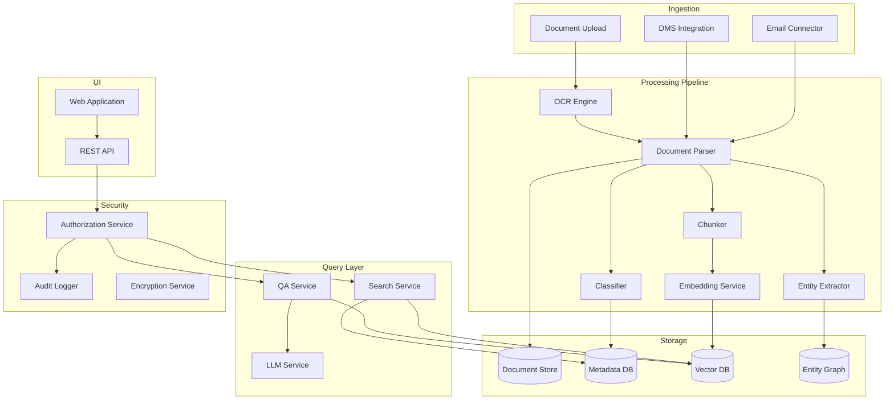
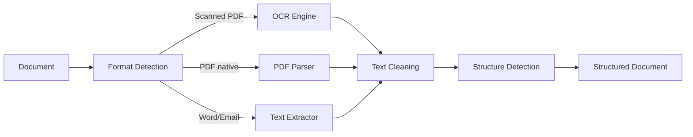
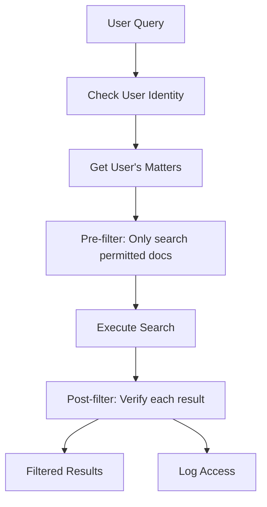

# System Design: Document Intelligence Platform for a Law Firm

## The Problem

> "Design a document intelligence platform for a large law firm that needs to process, classify, search, and extract information from millions of legal documents with strict security and compliance requirements."

---

## Step 1: Requirements

### Functional Requirements

- Ingest documents in multiple formats (PDF, Word, scanned images, emails)
- OCR for scanned/handwritten documents
- Automatic classification (contract, motion, brief, correspondence, etc.)
- Entity and clause extraction (parties, dates, obligations, amounts)
- Semantic search across all documents with natural language queries
- Question answering with citations to source documents
- Permission-based access (attorney-client privilege enforcement)
- Audit trail for all access and actions

### Non-Functional Requirements

| Requirement | Target |
|-------------|--------|
| Ingestion throughput | 10K documents/day |
| Search latency | < 2 seconds |
| QA latency | < 5 seconds |
| Extraction accuracy | > 95% for key entities |
| Availability | 99.9% during business hours |
| Compliance | Attorney-client privilege, data residency, retention policies |
| Security | Zero-trust, encryption at rest and in transit |

---

## Step 2: Scale Estimation

- **1M existing documents** (average 20 pages each = 20M pages)
- **10K new documents/day** = ~3.6M/year
- **50 active users** (attorneys, paralegals, associates)
- **Search queries**: ~500/day
- **QA queries**: ~200/day
- **Storage**: ~5TB for documents + ~500GB for embeddings + metadata
- **Embedding dimensions**: 1536 × 20M chunks = ~120GB vector storage

---

## Step 3: Architecture



---

## Step 4: Deep Dive — Document Ingestion Pipeline

### Multi-Format Processing



**OCR choices:**
- Azure AI Document Intelligence (best for legal docs — tables, handwriting)
- Fallback: Tesseract for simple scanned text
- Layout analysis preserves document structure (headers, paragraphs, tables, footnotes)

### Classification

Multi-label classifier trained on firm's document taxonomy:
- Contract (sub-types: NDA, MSA, SLA, Employment)
- Litigation (Motion, Brief, Memorandum, Order)
- Correspondence (Letter, Email, Memo)
- Corporate (Formation, Amendment, Resolution)

Approach: Fine-tuned classifier on firm's labeled data (~10K labeled examples). Falls back to LLM classification for low-confidence predictions.

### Entity Extraction

Key entities for legal documents:
- **Parties**: Names, roles (plaintiff, defendant, signatory)
- **Dates**: Execution date, effective date, expiration
- **Amounts**: Dollar values, percentages, limits
- **Clauses**: Termination, indemnity, non-compete, governing law
- **Obligations**: "shall", "must", "agrees to" patterns

Extraction uses a combination of:
1. Rule-based patterns for structured fields (dates, amounts)
2. NER model for parties and organizations
3. LLM-based extraction for complex clauses (with few-shot prompts)

### Chunking Strategy

Legal documents require special chunking:
- **Preserve section boundaries** — Never chunk mid-paragraph
- **Hierarchical chunks**: Section → Subsection → Paragraph
- **Metadata-enriched**: Each chunk carries (document_id, section_title, page_number, classification)
- **Overlap**: 100-token overlap between chunks for context continuity
- **Chunk size**: 500-800 tokens (legal language is dense)

---

## Step 5: Intelligent Search with Permissions

### Hybrid Search

```
User Query → Query Understanding → Hybrid Search → Permission Filter → Rerank → Results
```

**Hybrid approach:**
- Vector search (semantic similarity) — catches conceptual matches
- Keyword search (BM25) — catches exact terms, case numbers, statute citations
- Metadata filters — date ranges, document type, matter number
- Fusion: Reciprocal Rank Fusion to combine results

### Permission Controls



**Permission model:**
- Documents belong to Matters (cases/projects)
- Users are assigned to Matters with roles (Lead, Associate, Read-Only)
- Ethical walls: Some matters are walled off (conflict of interest)
- Chinese walls enforced at query time AND ingestion time

**Implementation:** Pre-filtering at the vector DB level using metadata. Each document tagged with `matter_id` and `access_level`. Search queries always include user's permitted matter list.

---

## Step 6: Question Answering with Citations

### QA Pipeline

1. **Query decomposition**: Complex questions split into sub-queries
2. **Multi-hop retrieval**: Answer may require synthesizing from multiple documents
3. **Citation tracking**: Every claim in the answer linked to source document + page
4. **Confidence scoring**: System indicates confidence level

### Citation Format

```
Answer: The non-compete clause in the Smith contract expires on March 15, 2025 [1], 
and applies only to the Northeast region [2].

Sources:
[1] Smith_Employment_Agreement_2023.pdf, Section 7.2, Page 12
[2] Smith_Employment_Agreement_2023.pdf, Section 7.3, Page 13
```

### Handling Contradictions

Legal documents often contain conflicting information (amendments supersede originals). The system:
- Identifies temporal ordering (later documents take precedence)
- Flags contradictions to the user
- Shows amendment chain

---

## Step 7: Compliance and Audit Trail

### Audit Requirements

Every interaction logged:
- Who accessed what document, when, from where
- What queries were run
- What AI-generated answers were produced
- What documents were cited in what context

### Data Retention

- Active matters: Full retention
- Closed matters: Archived per retention policy (typically 7-10 years)
- Privileged documents: Special handling, cannot be deleted without approval
- Right to delete: Complex in legal context (litigation hold overrides)

### Compliance Controls

- Data residency: All processing and storage within jurisdiction
- No data sent to external APIs without firm approval
- Model inference can be on-premise or in private cloud
- Regular access reviews (quarterly)

---

## Step 8: Security Architecture

| Layer | Control |
|-------|---------|
| Network | VPN/private network, no public endpoints |
| Authentication | SSO + MFA, session management |
| Authorization | RBAC + matter-based + ethical walls |
| Data at rest | AES-256 encryption, key management |
| Data in transit | TLS 1.3 |
| LLM security | Private deployment or Azure OpenAI (data not used for training) |
| PII | Detected and tagged, access logged |
| Prompt injection | Input validation, output filtering |

---

## Step 9: Evaluation

### Search Quality
- **Precision@10**: > 0.8 (8 of top 10 results are relevant)
- **Recall@50**: > 0.95 (miss fewer than 5% of relevant docs)
- **MRR**: > 0.7 (relevant result usually in top 3)

### QA Quality
- **Factual accuracy**: Verified against source documents, target > 97%
- **Citation accuracy**: Cited passages actually support the claim, target > 95%
- **Completeness**: Answer covers all relevant aspects

### Evaluation Process
- Golden dataset: 500 query-answer pairs reviewed by senior attorneys
- Weekly automated eval run against golden set
- Monthly human evaluation of 100 random QA interactions

---

## Step 10: Cost and Deployment

### Infrastructure Costs (Monthly)

| Component | Cost |
|-----------|------|
| Document storage (5TB) | $500 |
| Vector DB (managed, 120GB) | $2,000 |
| Compute (processing pipeline) | $3,000 |
| LLM inference (Azure OpenAI) | $5,000 |
| OCR processing | $2,000 |
| Total | ~$12,500/month |

### Deployment

- **Environment**: Azure (for compliance and enterprise features)
- **Processing**: Async pipeline with queue (handle bursts)
- **Search/QA**: Synchronous, auto-scaled based on load
- **Updates**: Blue-green deployment for zero-downtime updates
- **Backup**: Daily backups with 30-day retention, geo-redundant

### Key Tradeoff: On-Premise LLM vs Cloud

| Factor | Cloud (Azure OpenAI) | On-Premise (vLLM) |
|--------|---------------------|-------------------|
| Quality | Best models available | Smaller models |
| Cost | Pay per token | Fixed infra cost |
| Security | Data processing agreement | Full control |
| Maintenance | Managed | Team required |
| **Recommendation** | For most firms | For top-secret work |
