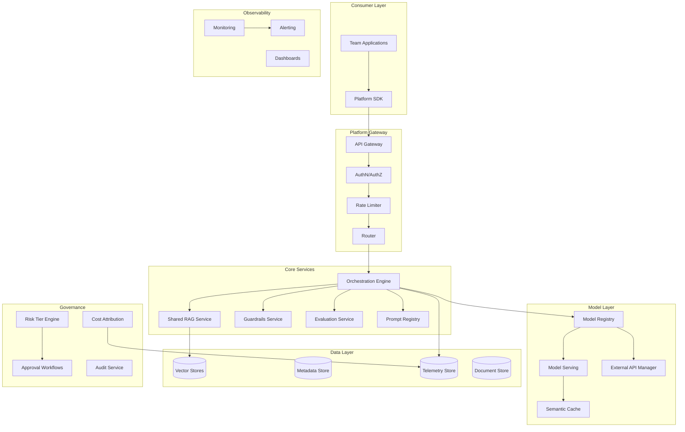
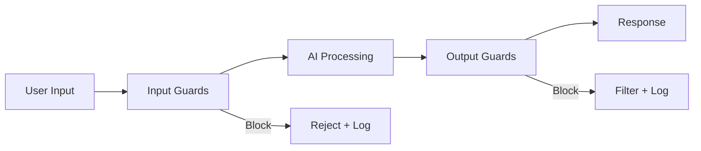

# System Design: Enterprise AI Platform

## The Problem

> "Design an enterprise AI platform for a Fortune 500 company that enables 50 teams to build, deploy, and govern 500+ AI use cases serving 10M requests per day."

---

## Step 1: Requirements

### Functional Requirements

- Self-service platform for teams to build AI applications
- Centralized model registry (internal models + external API management)
- Shared components: RAG infrastructure, evaluation, guardrails
- Multi-tenant isolation between teams
- Governance: approval workflows, risk tiering, compliance checks
- Observability: cost tracking, quality monitoring, usage analytics
- Prompt and template management

### Non-Functional Requirements

| Requirement | Target |
|-------------|--------|
| Availability | 99.95% (platform services) |
| Latency overhead | < 50ms added by platform layer |
| Onboarding time | New team productive in < 1 week |
| Scale | 10M requests/day, 50 teams, 500 use cases |
| Security | SOC 2, GDPR, industry-specific compliance |
| Cost visibility | Per-team, per-use-case cost attribution |

---

## Step 2: Scale Estimation

- **10M requests/day** = ~116 RPS average, ~1000 RPS peak
- **50 teams** × 10 use cases average = 500 active deployments
- **Token consumption**: ~10B tokens/day across all teams
- **Vector storage**: ~50 team knowledge bases, ~2TB total
- **Logs/telemetry**: ~100GB/day

---

## Step 3: Platform Architecture



---

## Step 4: Core Components Deep Dive

### 4.1 API Gateway & Multi-Tenant Routing

The gateway is the entry point for all AI requests:

```
Request → API Key validation → Team identification → Rate limiting → 
Risk tier check → Route to appropriate backend → Response
```

**Multi-tenant isolation:**
- Each team gets a namespace (API keys, resource quotas, configurations)
- Logical isolation by default (shared infrastructure, separated data)
- Physical isolation available for high-security teams (dedicated compute)
- Noisy neighbor protection via per-team rate limits and priority queues

### 4.2 Model Registry & Serving

**Registry manages:**
- Internal fine-tuned models (versioned, with eval scores)
- External model configurations (OpenAI, Anthropic, Azure OpenAI)
- Model routing rules (which model for which use case)
- A/B test configurations
- Fallback chains (primary → secondary → tertiary model)

**Serving patterns:**
- **Proxy mode**: Platform proxies requests to external APIs (adds governance)
- **Hosted mode**: Self-hosted models on GPU clusters (for sensitive data)
- **Hybrid mode**: Route based on data classification

### 4.3 Shared RAG Infrastructure

Teams don't build their own RAG — they use the platform's:

```
Team A: "I have 10K product docs" → Platform RAG (Team A's namespace)
Team B: "I have 5K support tickets" → Platform RAG (Team B's namespace)
```

**Shared components:**
- Ingestion pipeline (chunking, embedding, indexing)
- Vector store (per-team collections with isolation)
- Retrieval service (hybrid search, reranking)
- Configuration per team (chunk size, overlap, embedding model)

### 4.4 Guardrails Service

Centralized safety layer applied to ALL requests:



**Input guards:** Prompt injection detection, PII detection, topic restrictions
**Output guards:** Hallucination check, PII in output, brand safety, compliance

Teams can configure additional guards specific to their use case.

### 4.5 Evaluation Service

- **Pre-deployment**: Automated eval against golden datasets before any deployment
- **Post-deployment**: Continuous monitoring of quality metrics
- **Regression detection**: Alert if quality drops below threshold
- **Comparison**: Side-by-side evaluation of model/prompt versions

---

## Step 5: Governance Framework

### Risk Tiering

Every use case is classified by risk:

| Tier | Description | Requirements | Example |
|------|-------------|-------------|---------|
| Tier 1 | Internal, non-critical | Self-service approval | Internal FAQ bot |
| Tier 2 | Customer-facing, low risk | Manager approval + basic eval | Product recommendations |
| Tier 3 | Customer-facing, high risk | Architecture review + comprehensive eval | Financial advice |
| Tier 4 | Regulated/critical | Full review board + ongoing audit | Medical, legal, compliance |

### Approval Workflow

```
Tier 1: Auto-approve → Deploy
Tier 2: Team lead approval → Eval gate → Deploy  
Tier 3: Architecture review → Security review → Eval gate → Staged deploy
Tier 4: Review board → Legal review → Compliance → Eval gate → Staged deploy + monitoring
```

---

## Step 6: Self-Service Experience

### Team Onboarding (Day 1)

1. Team requests access → Auto-provisioned namespace
2. Receives: API keys, SDK, documentation, starter templates
3. Can immediately use: shared models, RAG service, evaluation tools
4. Quota: Default rate limits (scalable on request)

### Developer Experience

```python
# Platform SDK usage
from enterprise_ai import Platform

platform = Platform(team="product-team", api_key="...")

# Use shared RAG
response = platform.rag.query(
    collection="product-docs",
    query="What is our return policy?",
    model="gpt-4o-mini"
)

# Use guardrails automatically applied
response = platform.completion(
    model="gpt-4o",
    messages=[...],
    guardrails=["pii-filter", "brand-safety"]
)
```

---

## Step 7: Cost Allocation and Chargeback

### Cost Attribution Model

Every request tagged with:
- `team_id` — Which team
- `use_case_id` — Which application
- `model_id` — Which model used
- `tokens_in` / `tokens_out` — Token consumption
- `compute_seconds` — If using hosted models

### Chargeback Tiers

| Component | Pricing Model |
|-----------|---------------|
| External LLM tokens | Pass-through + 10% platform fee |
| Hosted model inference | Per-GPU-second |
| Vector storage | Per GB/month |
| RAG queries | Per query |
| Platform services | Fixed monthly per team |

### Budget Controls
- Per-team monthly budget caps
- Alerts at 50%, 80%, 100% of budget
- Auto-throttle at 100% (or allow overage with approval)

---

## Step 8: Security at Enterprise Scale

### Data Classification

| Level | Handling | Model Access |
|-------|----------|-------------|
| Public | Any model, any region | External APIs OK |
| Internal | Approved models only | Azure OpenAI (data protection) |
| Confidential | Private models only | Self-hosted, no external |
| Restricted | Isolated environment | Air-gapped compute |

### Network Security
- Platform services in private network
- External model access via private endpoints
- All traffic encrypted (TLS 1.3)
- No data egress without classification check

---

## Step 9: Platform Team Structure

### Recommended Team (Year 1)

| Role | Count | Responsibility |
|------|-------|---------------|
| Platform Engineering Lead | 1 | Architecture, roadmap |
| Backend Engineers | 3 | Core services, gateway, APIs |
| ML/AI Engineers | 2 | RAG, eval, model serving |
| DevOps/SRE | 2 | Infrastructure, reliability |
| Security Engineer | 1 | Governance, compliance |
| Developer Advocate | 1 | Docs, SDKs, team support |
| **Total** | **10** | |

---

## Step 10: Maturity Roadmap

### Year 1: Foundation

- API gateway with auth and rate limiting
- Model registry (external models)
- Basic RAG service
- Cost attribution
- Tier 1-2 governance

### Year 2: Scale

- Self-hosted model serving
- Advanced evaluation (automated regression)
- Full governance (all tiers)
- Semantic caching
- A/B testing infrastructure
- 25+ teams onboarded

### Year 3: Optimization

- AI-powered platform features (auto-optimization of prompts)
- Cross-team knowledge sharing (shared embeddings)
- Advanced analytics (ROI per use case)
- Industry-specific accelerators
- 50+ teams, 500+ use cases

---

## Key Architectural Decisions

| Decision | Rationale |
|----------|-----------|
| Shared platform vs team-owned | Consistency, governance, cost efficiency |
| Gateway pattern | Single control point for security and observability |
| Namespace isolation vs physical isolation | Cost-efficient default, physical for exceptions |
| SDK-first approach | Better DX, easier to enforce guardrails |
| Risk-tiered governance | Doesn't slow down low-risk innovation |
| Centralized RAG | Avoids 50 teams each building RAG poorly |
