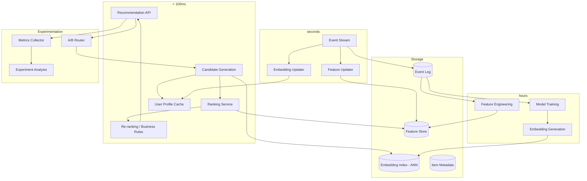
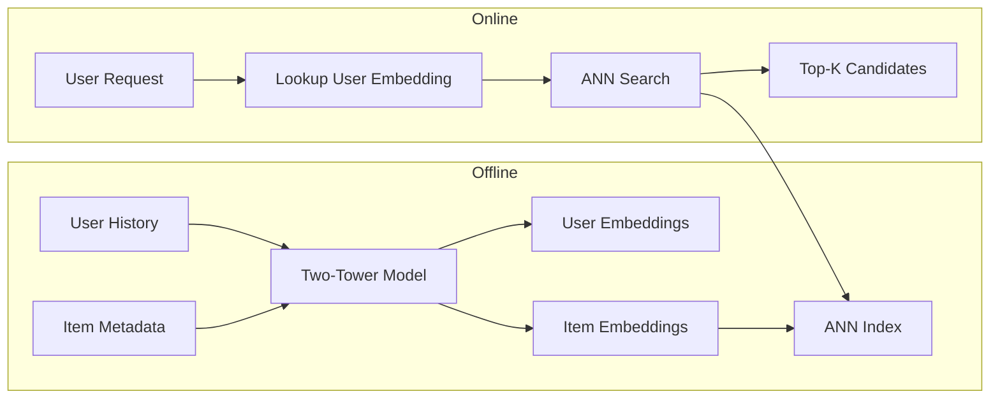
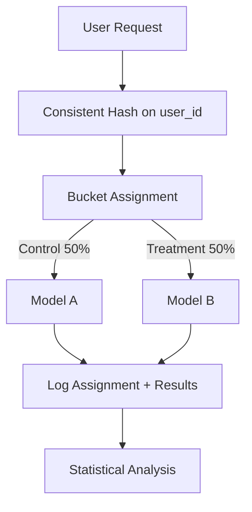

# System Design: Real-Time AI Recommendation Engine

## The Problem

> "Design a real-time AI recommendation engine for a content platform with 50M users, 1B daily events, and < 100ms latency requirement."

---

## Step 1: Requirements

### Functional Requirements

- Personalized content recommendations (articles, videos, products)
- Real-time adaptation (user clicks something → recommendations update immediately)
- Multiple recommendation surfaces (home feed, "more like this", search results)
- Support for A/B testing of recommendation algorithms
- Diversity and freshness controls (avoid filter bubbles)
- New user handling (cold start)

### Non-Functional Requirements

| Requirement | Target |
|-------------|--------|
| Latency (P99) | < 100ms |
| Throughput | 50K RPS peak |
| Freshness | Recommendations update within 5 seconds of user action |
| Availability | 99.99% |
| A/B test support | 20+ concurrent experiments |
| Scale | 50M users, 10M items, 1B events/day |

---

## Step 2: Scale Estimation

- **50M DAU** × ~20 recommendation requests/day = **1B recommendation requests/day**
- **Peak RPS**: ~50K (assuming 4x average)
- **Events**: 1B/day = ~12K events/second
- **User embeddings**: 50M × 256 dimensions × 4 bytes = ~50GB
- **Item embeddings**: 10M × 256 dimensions × 4 bytes = ~10GB
- **Feature store**: ~500GB (user features, item features, cross features)

---

## Step 3: Architecture



---

## Step 4: Deep Dive — Recommendation Pipeline

### Two-Stage Architecture

The system uses a **retrieval → ranking** pattern (like search engines):

**Stage 1: Candidate Generation (retrieve ~1000 candidates in < 20ms)**
- ANN (Approximate Nearest Neighbor) search on user embedding vs item embeddings
- Multiple candidate sources merged:
  - Collaborative filtering candidates (similar users liked these)
  - Content-based candidates (similar to what you've consumed)
  - Trending/popular items (popularity bias)
  - Editorial picks (business rules)

**Stage 2: Ranking (score ~1000 → top 50 in < 50ms)**
- ML ranking model scores each candidate
- Features: user features + item features + context (time, device, location)
- Model: Gradient-boosted trees or lightweight neural ranker
- Output: relevance score per candidate

**Stage 3: Re-ranking (business logic, < 10ms)**
- Diversity injection (don't show 5 articles on same topic)
- Freshness boost (prefer recent content)
- De-duplication (already seen)
- Business rules (promoted content, sponsorships)

### Embedding-Based Recommendations



**Two-tower model:**
- User tower: encodes user history, demographics, preferences → user embedding
- Item tower: encodes item content, metadata, engagement stats → item embedding
- Training: contrastive loss (bring user closer to items they engaged with)
- Update frequency: User embeddings updated near-real-time, item embeddings batch daily

---

## Step 5: Real-Time Feature Computation

### Feature Categories

| Category | Examples | Update Frequency |
|----------|----------|-----------------|
| User static | Age, location, signup date | Rare |
| User dynamic | Last 10 clicks, session duration | Real-time |
| Item static | Title, category, author | On publish |
| Item dynamic | View count, CTR, freshness | Minutes |
| Context | Time of day, device, referrer | Per-request |
| Cross | User-category affinity | Hourly |

### Real-Time Feature Pipeline

```
User clicks article → Event stream (Kafka) → Feature updater → Feature store (Redis)
                                           → Embedding updater → User embedding cache
```

The feature store uses a tiered architecture:
- **Hot tier (Redis)**: Last 1 hour of features, user embeddings — < 1ms reads
- **Warm tier (DynamoDB/Cassandra)**: Full feature history — < 10ms reads
- **Cold tier (S3/Data Lake)**: Training data, historical — batch access only

---

## Step 6: Model Serving at Scale

### Serving Requirements

- 50K RPS with < 50ms P99 for ranking
- Model size: ~100MB (gradient-boosted tree) or ~500MB (neural)
- Batch inference: Score 1000 candidates per request

### Serving Architecture

- **Model format**: ONNX for portability and optimization
- **Serving framework**: Custom gRPC service with batching
- **Hardware**: CPU-optimized (ranking models don't need GPU)
- **Scaling**: Horizontal auto-scale based on RPS and latency
- **Caching**: Cache scores for (user, item) pairs with short TTL (5 min)

### Fallback Strategy

```
Primary model → Secondary (simpler) model → Popularity-based fallback → Editorial picks
```

If ranking model latency exceeds budget, fall back to simpler heuristics rather than failing.

---

## Step 7: A/B Testing Infrastructure

### Experiment Routing



**Key design decisions:**
- Consistent hashing ensures user always sees same variant (no flickering)
- Support for multi-layer experiments (can test ranking AND UI simultaneously)
- Automatic statistical significance detection
- Guardrail metrics that auto-halt harmful experiments

### Metrics Tracked Per Experiment

- **Primary**: CTR, engagement time, conversion
- **Secondary**: Diversity of consumed content, session length
- **Guardrails**: Bounce rate, unsubscribes, complaints

---

## Step 8: Cold Start Problem

### New Users (No History)

Progressive approach:
1. **Zero interactions**: Show popular/trending items (non-personalized)
2. **1-5 interactions**: Content-based on those few signals
3. **5-20 interactions**: Lightweight collaborative filtering
4. **20+ interactions**: Full personalization model

### New Items (No Engagement Data)

- Content-based embedding from item metadata (title, description, category)
- Exploration budget: Reserve 10% of recommendations for new items
- Bandits: Multi-armed bandit for balancing explore vs exploit

---

## Step 9: Privacy and Consent

- **Data minimization**: Only collect what's needed for recommendations
- **Consent tiers**:
  - Basic: Popularity only (no personalization)
  - Standard: Personalization with engagement data
  - Full: Cross-platform, demographic-enhanced
- **Right to delete**: User embedding and features purged within 24h of request
- **Transparency**: Users can see why an item was recommended
- **Opt-out**: Easy toggle to disable personalization

---

## Step 10: Evaluation Metrics

### Offline Metrics (pre-deployment)

| Metric | What It Measures |
|--------|-----------------|
| NDCG@K | Ranking quality |
| Recall@K | Coverage of relevant items |
| Hit Rate | Did we recommend something they engaged with? |
| Diversity | How varied are recommendations? |
| Novelty | How surprising are recommendations? |

### Online Metrics (production)

| Metric | Target |
|--------|--------|
| CTR | > 5% |
| Engagement time | > 3 min average |
| Return rate | > 60% next-day return |
| Content diversity | Gini coefficient > 0.6 |
| User satisfaction | Survey CSAT > 4/5 |

---

## Key Architectural Tradeoffs

| Decision | Choice | Tradeoff |
|----------|--------|----------|
| Two-stage (retrieve + rank) | Yes | Sacrifices global optimality for latency |
| ANN vs exact search | ANN (HNSW) | ~95% recall for 100x speedup |
| Real-time features vs batch | Hybrid | Complexity for freshness |
| Single model vs ensemble | Single + reranking rules | Simpler to debug and update |
| User embedding update | Near-real-time (seconds) | Infra cost for responsiveness |
| Diversity injection | Post-ranking rules | May demote best items, but prevents bubbles |
