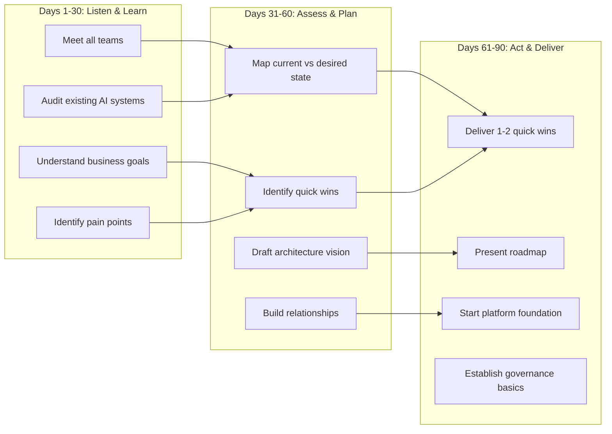

# Behavioral & Leadership Questions for AI Architects

## The STAR Framework

Every behavioral answer follows this structure:

| Component | What to Include | Time Allocation |
|-----------|----------------|-----------------|
| **Situation** | Context, company, challenge | 15% |
| **Task** | Your specific responsibility | 15% |
| **Action** | What YOU did (not the team) | 50% |
| **Result** | Measurable outcome, learnings | 20% |

### Rules for Great STAR Answers

1. **Be specific** — "Q3 2024 at Company X" not "at a previous job"
2. **Use numbers** — "Reduced latency from 5s to 800ms" not "improved performance"
3. **Own your contribution** — "I designed..." not "We did..."
4. **Include the learning** — What would you do differently?
5. **Keep it under 3 minutes** — Concise, not rambling

---

## Top Behavioral Questions with Answer Frameworks

### Q1: "Tell me about a time you made a technology decision that failed."

**What they're testing:** Humility, learning ability, decision-making process

**Answer framework:**
- Situation: What system, what decision, what constraints existed
- Why it seemed right at the time (show it was reasoned, not careless)
- How you detected the failure (monitoring? user feedback? performance?)
- What you did to course-correct
- What you learned and how it changed your decision-making process

**Example structure:**
> "At [Company], I chose to fine-tune a model for our support chatbot instead of using RAG. The reasoning was [X]. After 3 months, we found accuracy on new products was poor because the model couldn't learn new information without retraining. I migrated us to RAG, which took 4 weeks. The lesson: prefer architectures that allow incremental updates unless you have very stable knowledge domains."

---

### Q2: "How do you handle disagreements about architecture?"

**What they're testing:** Collaboration, influence without authority, decision frameworks

**Answer framework:**
- Acknowledge the disagreement without making the other person wrong
- Describe how you structured the conversation (data, prototypes, frameworks)
- Show you considered their perspective seriously
- Explain how a decision was reached (not "I won")
- Result: relationship preserved AND good technical outcome

---

### Q3: "Describe a time you had to simplify a complex system."

**What they're testing:** Ability to cut scope, pragmatism, communication

**Answer framework:**
- Describe the over-complex system and its costs (maintenance, incidents, onboarding)
- How you identified what to simplify (usage data, failure analysis)
- The pushback you faced (people attached to complexity)
- How you executed the simplification (incremental, not big bang)
- Measurable results (fewer incidents, faster onboarding, lower cost)

---

### Q4: "How do you balance innovation with reliability?"

**What they're testing:** Judgment, risk management, product maturity awareness

**Answer framework:**
- Describe your framework: separate innovation from production
- Sandbox environments for experimentation
- Gradual rollout patterns (canary, feature flags)
- Risk tiering: innovate freely in Tier 1, conservatively in Tier 4
- Example: shipped innovative feature via A/B test, measured before full rollout

---

### Q5: "Tell me about a time you had to convince stakeholders."

**What they're testing:** Influence, communication, strategic thinking

**Answer framework:**
- Who were the stakeholders, what was their concern
- How you framed the argument in THEIR language (business impact, risk, cost)
- What evidence you brought (prototype, data, industry examples)
- How you addressed objections
- Outcome and relationship impact

---

## Leadership Scenarios

### Scenario 1: First 90 Days as AI Architect at a New Company



**Key principles:**
- Don't redesign everything in week 1
- Earn trust through quick wins before proposing big changes
- Listen to what teams actually need, not what you think they should want
- Document the current state before proposing the future state

---

### Scenario 2: Building an AI Team from Scratch

**Phase 1 (Month 1-2): Foundation**
- Hire 1 senior ML engineer + 1 senior platform engineer
- Establish coding standards, eval practices, deployment patterns
- Deliver first use case with this small team

**Phase 2 (Month 3-6): Growth**
- Add specialists: RAG engineer, MLOps, security
- Establish team rituals (architecture reviews, eval reviews)
- Create internal documentation and patterns library

**Phase 3 (Month 6-12): Scale**
- Enable other teams via platform/self-service
- Hire developer advocate for internal enablement
- Transition from "doing AI" to "enabling AI"

**Hiring priorities by order:**
1. Senior ML/AI Engineer (can build end-to-end)
2. Platform Engineer (infra, reliability, scaling)
3. ML Engineer (specialized: RAG, fine-tuning, eval)
4. Security/Governance (compliance, controls)
5. Developer Advocate (docs, SDKs, support)

---

### Scenario 3: Migrating from Prototype to Production

**The conversation to have with stakeholders:**

> "The prototype took 2 weeks. Production will take 2-3 months. Here's why they're different:"

| Prototype | Production |
|-----------|------------|
| Works on happy path | Handles all edge cases |
| No security | Auth, PII handling, audit |
| No monitoring | Full observability |
| Manual deployment | CI/CD with rollback |
| No evaluation | Automated eval + regression tests |
| Single user | Thousands of concurrent users |
| No cost tracking | Per-request cost attribution |

**Migration checklist (teach teams this):**
1. Define SLA (latency, availability, accuracy)
2. Build evaluation suite (200+ test cases)
3. Add security layer (auth, PII, injection prevention)
4. Implement monitoring and alerting
5. Load test at 3x expected traffic
6. Create runbooks for failure scenarios
7. Canary deploy with automated rollback

---

### Scenario 4: Handling an AI Incident (Hallucination in Production)

**Incident response framework:**

```
Detect → Contain → Communicate → Investigate → Fix → Prevent
```

**Example response:**
1. **Detect**: Monitoring alerts on quality score drop
2. **Contain**: Feature flag to revert to previous prompt version (< 5 min)
3. **Communicate**: Notify affected teams, update status page
4. **Investigate**: Trace the issue — was it data change? model update? prompt?
5. **Fix**: Root cause was stale document in index → remove and reindex
6. **Prevent**: Add freshness check to ingestion pipeline, add this case to eval suite

**Post-incident review asks:**
- Why didn't we catch this in eval? (add to golden dataset)
- Why didn't we catch it sooner? (improve monitoring)
- What architectural change prevents recurrence?

---

### Scenario 5: Communicating AI Risk to Executives

**Framework: Risk as a business decision, not a technical one**

Don't say: "There's a 5% hallucination rate on our RAG system."
Do say: "In 5% of cases, the system may provide incorrect information. Here's what that means for the business and how we manage it."

**Communication template:**
1. **What the risk is** (plain English, no jargon)
2. **What the impact would be** (financial, reputational, regulatory)
3. **What we're doing about it** (controls, monitoring, mitigation)
4. **What residual risk remains** (after mitigation)
5. **What decision we need from you** (accept risk, invest more, delay launch)

---

## How to Demonstrate Architectural Thinking

Interviewers look for these signals:

1. **Tradeoff awareness** — Every decision has a cost. Name it.
2. **Scale thinking** — "This works at 1K requests but at 1M we'd need..."
3. **Failure thinking** — "What happens when X fails?"
4. **Evolution thinking** — "We'd start with A, then evolve to B as we learn..."
5. **Business connection** — "This matters because the business needs..."
6. **Simplicity preference** — "The simplest solution that meets requirements is..."

---

## The "It Depends" Trap

Saying "it depends" without follow-up is the #1 way to fail an architecture interview.

**Bad:** "Should you use RAG or fine-tuning?" → "It depends."

**Good:** "Should you use RAG or fine-tuning?" → "It depends on three factors. Let me give you a decision framework:
1. If you need current information → RAG
2. If you need behavioral change → fine-tuning  
3. If you need both → RAG with a fine-tuned model

For your specific case, I'd ask: how often does the knowledge change?"

**The pattern:**
1. Acknowledge the nuance (briefly)
2. Provide a decision framework (2-4 criteria)
3. Give a concrete recommendation for a specific scenario
4. Explain what would change your recommendation

This shows you can make decisions AND understand their contingencies.
