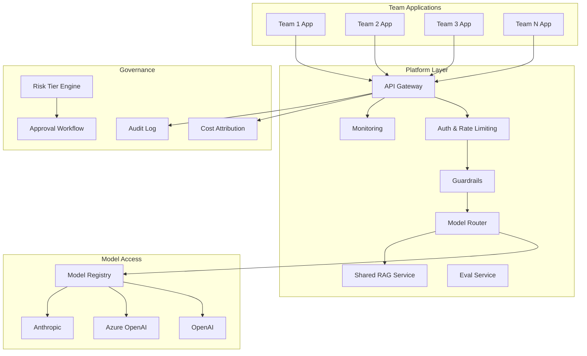
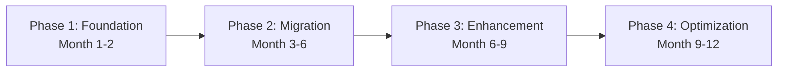

# Case Study: Migrating 20 Ad-Hoc AI Prototypes to a Governed Platform

## The Scenario

> "A mid-size company (5,000 employees) has 20 teams that independently built AI prototypes using various tools (OpenAI directly, LangChain apps, custom scripts). There's no governance, no shared infrastructure, no cost visibility. You've been hired as AI Architect to bring order. What do you do?"

---

## Current State Analysis

### What You'll Likely Find

| Problem | Impact |
|---------|--------|
| 20 separate OpenAI API keys | No cost attribution, no rate limiting |
| No evaluation | Unknown quality, no confidence in outputs |
| No security review | PII sent to APIs unprotected, prompt injection vulnerable |
| Duplicate effort | 5 teams built their own RAG pipelines |
| No monitoring | Teams don't know when things break |
| Shadow AI | More prototypes you don't even know about |
| Inconsistent quality | Some great, some dangerous |
| No governance | No approval process, no risk assessment |

### Assessment Process (Week 1-2)

1. **Inventory**: Find all AI usage (check billing, API key audit, survey teams)
2. **Classify**: Categorize each by risk tier, maturity, business value
3. **Interview**: Talk to each team — what works, what's painful
4. **Map dependencies**: What external services, data sources, users
5. **Identify risks**: PII exposure, hallucination in customer-facing, compliance gaps

---

## Target State Architecture



---

## Migration Strategy: Incremental (Not Big Bang)

**Why not big bang?**
- Teams are actively using their prototypes
- You can't pause business value delivery for months
- You need to earn trust before mandating changes
- You'll learn from early migrations

### The Phased Approach



---

## Quick Wins (First 30 Days)

### Week 1-2: Visibility
- Consolidate all API keys under one account (cost visibility overnight)
- Set up basic spend dashboards per team
- Identify the highest-risk prototypes (customer-facing + no eval)

### Week 3-4: Safety Net
- Deploy a shared API proxy (teams point their API calls through it)
- Add PII detection on the proxy (log, don't block yet)
- Add basic rate limiting (prevent runaway costs)
- Implement audit logging (who's calling what)

**Value delivered in 30 days:**
- Cost visibility (executives love this)
- Risk identification (security team loves this)
- No disruption to teams (they barely notice)

---

## Platform MVP (90 Days)

### What the MVP Includes

| Component | Capability |
|-----------|-----------|
| API Gateway | Auth, rate limiting, routing |
| Model Registry | Managed access to 3 providers |
| Basic Guardrails | PII detection, output length limits |
| Cost Dashboard | Per-team, per-use-case cost |
| SDK | Python SDK for easy migration |
| Eval Starter Kit | Template + 50-example golden datasets |
| Docs | Migration guide, best practices |

### Migration Approach for Teams

**Carrot, not stick:**
- "Migrate through our gateway and you get: cost dashboard, monitoring, guardrails for free"
- "Keep doing what you're doing, just point your API calls through us"
- Minimal code change: replace `openai.ChatCompletion.create()` with `platform.completion()`

### Priority Order for Migration

1. **Highest risk, easiest migration** — Customer-facing apps using OpenAI directly
2. **Highest value, willing teams** — Teams that want help (volunteer first)
3. **Duplicate efforts** — Teams doing the same thing (consolidate)
4. **Everything else** — Less critical internal tools

---

## Full Platform (12 Months)

### Month 3-6: Core Migration

- Migrate 10 highest-priority apps to platform
- Build shared RAG service (eliminate 5 duplicate pipelines)
- Implement risk tiering and approval workflow
- Add evaluation service with automated regression testing
- Security review of all Tier 3+ applications

### Month 6-9: Enhancement

- Self-service portal for new use cases
- Advanced guardrails (prompt injection, topic filtering)
- A/B testing infrastructure
- Cross-team knowledge sharing (shared embeddings)
- Semantic caching (30% cost reduction)

### Month 9-12: Optimization

- All 20 apps migrated
- Cost optimized (model routing: cheap for simple, expensive for complex)
- Full governance operational
- New teams can go from idea to production in < 1 week
- Internal AI marketplace (reusable components)

---

## Prioritization Framework

Use a 2×2 matrix:

```
                    HIGH BUSINESS VALUE
                         │
    Quick Wins           │        Strategic Bets
    (Do immediately)     │        (Plan carefully)
                         │
    ─────────────────────┼────────────────────────
                         │
    Deprioritize         │        Technical Debt
    (Maybe never)        │        (Schedule for later)
                         │
                    LOW BUSINESS VALUE

    ← EASY TO MIGRATE              HARD TO MIGRATE →
```

---

## Change Management

### Stakeholder Communication

| Audience | Message | Frequency |
|----------|---------|-----------|
| Executives | ROI, risk reduction, cost savings | Monthly |
| Team leads | Migration timeline, what's in it for them | Bi-weekly |
| Developers | SDK docs, migration guides, office hours | Weekly |
| Security/Legal | Compliance progress, risk reduction | Monthly |

### Handling Resistance

**"We don't want to change our working system"**
→ "You don't have to change your logic. Just route through our gateway. You get monitoring and guardrails for free."

**"The platform will slow us down"**
→ "Tier 1 (internal, low-risk) is self-service. No approval needed. You only need review for customer-facing or high-risk."

**"We have special requirements"**
→ "Let's talk. We can accommodate custom configurations within the platform namespace."

---

## Success Metrics

| Metric | 30 Days | 90 Days | 12 Months |
|--------|---------|---------|-----------|
| Cost visibility | 100% | 100% | 100% |
| Apps on platform | 0 | 5 | 20+ |
| Avg time to deploy new use case | N/A | 2 weeks | < 1 week |
| Security incidents | Unknown | Tracked | < 1/quarter |
| Eval coverage | 0% | 30% | 90% |
| Cost per request (avg) | Unknown | $0.05 | $0.03 (optimized) |
| Team satisfaction (survey) | Baseline | +10% | +30% |

---

## Risks and Mitigations

| Risk | Likelihood | Impact | Mitigation |
|------|-----------|--------|-----------|
| Teams refuse to migrate | High | Medium | Carrot approach, executive mandate as last resort |
| Platform becomes bottleneck | Medium | High | Self-service for Tier 1-2, SLA guarantees |
| Platform team too small | High | High | Prioritize ruthlessly, use managed services |
| Scope creep | High | Medium | Strict MVP definition, say no often |
| Production incident during migration | Medium | High | Canary migrations, instant rollback capability |
| Key person dependency | Medium | Medium | Document everything, pair programming |

---

## Lessons Learned (Common Patterns)

1. **Start with the proxy pattern** — Least disruptive first migration step
2. **Earn trust before mandating** — Deliver value, then ask for compliance
3. **The first 3 migrations teach you everything** — Don't over-plan; learn by doing
4. **Governance is a product** — Treat internal teams as customers
5. **Cost savings fund the platform** — Use saved money to justify platform investment
