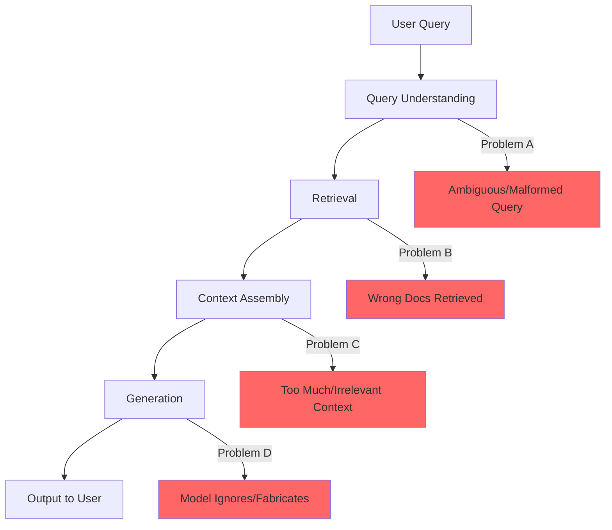
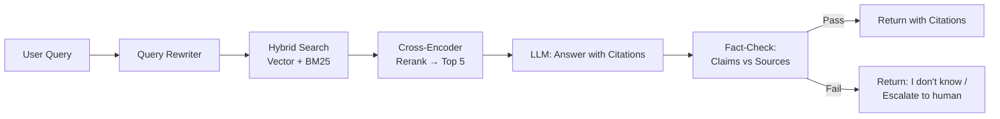

# Case Study: Fixing a RAG System with 30% Hallucination Rate

## The Scenario

> "Your company's RAG-based customer support bot has a 30% hallucination rate — meaning 30% of responses contain information not supported by the source documents. Customer trust is eroding. Fix it."

---

## Step 1: Diagnosis Framework

Before fixing anything, you must understand WHERE the problem is. A RAG system has multiple failure points:



### The 4 Root Causes of RAG Hallucination

| Root Cause | Symptom | Frequency |
|-----------|---------|-----------|
| **A: Bad Query** | User asks ambiguous question → retrieves wrong docs | ~15% |
| **B: Bad Retrieval** | Right question, wrong documents returned | ~40% |
| **C: Bad Context** | Right documents, but too much noise for model | ~20% |
| **D: Bad Generation** | Right context provided, model still fabricates | ~25% |

---

## Step 2: Root Cause Analysis

### Is It Retrieval? (Cause B — Most Common)

**How to diagnose:**
- Sample 100 hallucinated responses
- For each, check: were the correct source documents in the retrieved set?
- Calculate retrieval recall: what % of correct docs were found?

**Common retrieval failures:**
- Embedding model doesn't understand domain terminology
- Chunks too large (correct paragraph buried in irrelevant text)
- Chunks too small (missing necessary context)
- No hybrid search (missing exact keyword matches)
- Metadata not leveraged (searching all docs instead of relevant subset)

### Is It Generation? (Cause D)

**How to diagnose:**
- Take hallucinated responses where the correct context WAS provided
- The model had the right information but still fabricated

**Common generation failures:**
- Context window overwhelmed (too many chunks, model gets confused)
- Prompt doesn't strongly enough instruct "only use provided context"
- Model over-relies on parametric knowledge (training data overrides context)
- Conflicting information in context (model picks wrong one)

### Is It Data? (Underlying Cause)

**How to diagnose:**
- Are source documents themselves correct and current?
- Are there duplicate/conflicting documents?
- Is important information missing from the corpus?

**Common data issues:**
- Stale documents (product changed, docs weren't updated)
- Duplicate documents with conflicting information
- Missing documents (edge cases never documented)
- Poor document formatting (tables, images not processed correctly)

### Is It the Query? (Cause A)

**How to diagnose:**
- Look at hallucinated cases where retrieval found nothing relevant
- Were the user queries ambiguous, misspelled, or domain-jargon-heavy?

**Common query issues:**
- Ambiguous queries matching multiple topics
- User uses different terminology than documentation
- Multi-intent queries (asking 3 things at once)

---

## Step 3: Fix Prioritization

### Quick Wins (Week 1-2, High Impact, Low Effort)

| Fix | Addresses | Expected Impact |
|-----|-----------|-----------------|
| Add "only answer from provided context" to system prompt | Generation | -5% hallucination |
| Reduce retrieved chunks from 10 to 5 (less noise) | Context | -3% hallucination |
| Add confidence threshold (refuse to answer if low confidence) | All | -5% hallucination (by abstaining) |
| Remove stale/duplicate documents | Data | -3% hallucination |

### Medium-Term Fixes (Week 3-6)

| Fix | Addresses | Expected Impact |
|-----|-----------|-----------------|
| Switch to hybrid search (vector + keyword) | Retrieval | -5% hallucination |
| Implement reranking (cross-encoder) | Retrieval | -4% hallucination |
| Re-chunk documents with better strategy | Retrieval | -3% hallucination |
| Add query rewriting/expansion | Query | -3% hallucination |

### Architectural Changes (Month 2-3)

| Fix | Addresses | Expected Impact |
|-----|-----------|-----------------|
| Citation-grounded generation | Generation | -5% hallucination |
| Automated fact-checking step | Generation | -3% hallucination |
| Domain-specific embedding model | Retrieval | -3% hallucination |
| Query routing (different strategies per intent) | All | -2% hallucination |

---

## Step 4: Measurement Plan

### Defining Hallucination

Precise definition: "A response contains a claim that is not supported by the retrieved source documents AND is not a trivially true statement."

### Measurement Methods

| Method | Coverage | Accuracy | Cost |
|--------|----------|----------|------|
| Human review (gold standard) | 5% sample | ~95% | High |
| LLM-as-judge (automated) | 100% | ~85% | Medium |
| Citation verification (automated) | 100% for cited claims | ~90% | Low |
| User feedback ("was this helpful?") | Self-selected | ~70% | Very low |

### Weekly Scorecard

```
Week N Report:
- Total queries: 10,000
- Hallucination rate (LLM judge): 28% (↓2% from last week)
- Hallucination rate (human sample): 26% (↓4% from baseline)
- Retrieval recall@5: 72% (↑5%)
- "I don't know" rate: 8% (acceptable)
- User satisfaction: 3.5/5 (↑0.3)
```

---

## Step 5: Implementation Roadmap

### Week 1: Emergency Fixes + Measurement

- Set up automated hallucination measurement (LLM-as-judge on 100% of traffic)
- Implement confidence thresholds (refuse to answer when unsure)
- Tighten system prompt: explicit instructions to stay grounded
- Remove clearly stale documents (quick audit)

**Expected result:** 30% → 22% hallucination rate

### Week 2-3: Retrieval Improvements

- Implement hybrid search (BM25 + vector)
- Add cross-encoder reranking
- Re-chunk documents (semantic chunking, preserve section boundaries)
- Reduce context window noise (top 5 instead of top 10)

**Expected result:** 22% → 15% hallucination rate

### Week 4-6: Generation Improvements

- Citation-required generation: model must cite specific passages
- Post-generation fact-check: verify each claim against retrieved text
- Query rewriting: expand ambiguous queries before retrieval

**Expected result:** 15% → 8% hallucination rate

### Month 2-3: Architectural Improvements

- Domain-specific embedding model (fine-tuned on your docs)
- Query routing: different strategies for different query types
- Automated data freshness pipeline (detect and refresh stale docs)
- Contradiction detection in source documents

**Expected result:** 8% → 3-5% hallucination rate (with "I don't know" for uncertain cases)

---

## Step 6: Before/After Architecture

### Before (Broken)


**Problems:** No reranking, too many chunks, no grounding instructions, no verification.

### After (Fixed)



**Improvements at each step:**
1. **Query Rewriter**: Clarifies ambiguous queries, expands abbreviations
2. **Hybrid Search**: Catches both semantic AND exact matches
3. **Reranker**: Filters noise, only passes truly relevant docs
4. **Citation Generation**: Forces model to ground every claim
5. **Fact-Check**: Post-hoc verification catches remaining hallucinations

---

## Step 7: Lessons Learned

### Lessons for the Interview

1. **Diagnose before fixing** — Don't assume you know the cause. Measure first.

2. **Retrieval is usually the biggest problem** — Most hallucinations trace back to not finding the right documents, not the LLM being bad.

3. **Less context is often better** — 5 highly relevant chunks beat 20 vaguely relevant ones.

4. **"I don't know" is a valid answer** — A system that says "I'm not sure" 10% of the time with 95% accuracy on the rest is better than one that always answers with 70% accuracy.

5. **Measurement enables iteration** — Without automated hallucination measurement, you can't track progress.

6. **Layer your defenses** — No single fix solves hallucination. It's: better retrieval + better prompting + verification + abstention.

7. **Data quality is foundational** — Garbage in, garbage out. Stale/wrong source docs can't be fixed by better models.

---

## Interview Tips for This Case Study

When presented with this scenario:

1. **Don't jump to "use a better model"** — That's rarely the answer
2. **Show a diagnostic methodology** — Demonstrate you'd measure before acting
3. **Prioritize by impact and effort** — Quick wins first, architectural changes later
4. **Include measurement** — How will you KNOW it's getting better?
5. **Acknowledge tradeoffs** — Reducing hallucination may increase "I don't know" rate
6. **Give specific numbers** — "I'd expect this fix to reduce hallucination by ~5%"
