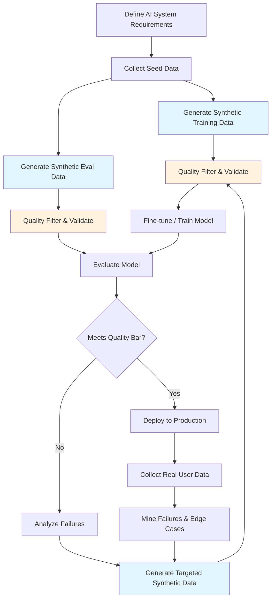

# Why Synthetic Data? The Foundation of Modern AI Development

## The "Practice Exam" Analogy

Think back to school. Your teacher couldn't give you the real final exam to practice with — that would defeat the purpose. Instead, they created **practice exams**: questions that tested the same skills, covered the same material, but were different enough that memorizing them wouldn't help on the real thing.

**Synthetic data is the practice exam for AI systems.**

It's artificially generated data that mimics the patterns, structure, and characteristics of real-world data — without being real. Just as a practice exam helps students prepare for the real thing, synthetic data helps AI systems learn patterns they'll encounter in production.

```
Real Data:     "Patient reports chest pain radiating to left arm, BP 180/95"
Synthetic:     "Patient presents with sharp abdominal pain post-meal, BP 145/90"
               ↑ Same format, realistic content, but never a real patient
```

The synthetic example follows the same structure (symptom + vitals), uses realistic medical language, but was never written about an actual human being.

---

## Why Real Data Isn't Enough

### 1. Cost of Human Annotation

Getting humans to label data is expensive and slow:

| Task | Cost per Example | Time per Example | To get 10K examples |
|------|-----------------|------------------|---------------------|
| Simple classification | $0.10 | 30 sec | $1,000 + 83 hours |
| Question-Answer pairs | $0.50 | 3 min | $5,000 + 500 hours |
| Complex reasoning chains | $2.00 | 10 min | $20,000 + 1,667 hours |
| Expert medical annotation | $5.00 | 15 min | $50,000 + 2,500 hours |

Synthetic generation with GPT-4 costs ~$0.03-0.10 per example and takes seconds.

### 2. Privacy Constraints

You often **cannot** use real data:
- Healthcare: HIPAA prohibits using patient records for training
- Finance: PII in transaction data can't be shared
- Education: Student records are protected (FERPA)
- Enterprise: Customer conversations contain sensitive info

Synthetic data gives you the patterns without the privacy risk.

### 3. Rare Edge Cases

Real data follows a power law — 80% of examples cover common cases. But AI systems fail on the **rare** cases:

```
Distribution of real customer queries:
━━━━━━━━━━━━━━━━━━━━━━━━━━━  "How do I reset my password?"  (40%)
━━━━━━━━━━━━━━━━━━━━           "What's your return policy?"   (25%)
━━━━━━━━━━━━                    "Track my order"              (15%)
━━━━━━                           "Billing dispute"            (10%)
━━━                              "Account compromised"         (5%)
━                                "Legal compliance question"   (3%)
                                 "Multi-product failure"       (2%)
                                 ← These rare cases are where AI fails
```

You'd need millions of real examples to get enough rare cases. Or you can **synthesize** thousands of rare cases directly.

### 4. Scale Requirements

Fine-tuning a model needs thousands of examples. Evaluating it properly needs hundreds of diverse test cases. Building these from scratch with real data takes months. Synthetic generation takes hours.

---

## Synthetic Data Use Cases in AI Systems

### 1. Training Data for Fine-Tuning

```
Goal: Teach a model to answer questions about your product
Real data available: 50 customer support tickets
Need: 5,000 instruction-response pairs
Solution: Use 50 real examples as seeds → generate 5,000 synthetic pairs
```

### 2. Evaluation Datasets (Golden Sets)

```
Goal: Measure RAG system accuracy before deployment
Need: 200 questions with verified correct answers across all difficulty levels
Solution: Generate questions from your knowledge base, verify answers
```

### 3. Testing Guardrails and Security

```
Goal: Ensure your AI won't generate harmful content
Need: 1,000 adversarial prompts (jailbreaks, injection attacks, harmful requests)
Solution: Synthetically generate attack variations to test defenses
```

### 4. Stress Testing at Scale

```
Goal: Test your system handles 10K concurrent diverse queries
Need: 10,000 realistic but unique queries
Solution: Generate varied queries across all user personas and topics
```

### 5. Augmenting Sparse Categories

```
Goal: Classifier needs balanced training data
Reality: 10,000 "positive" reviews, only 200 "negative" reviews
Solution: Generate 9,800 synthetic negative reviews to balance
```

### 6. Privacy-Safe Alternatives

```
Goal: Share a demo dataset with a vendor
Reality: Real data contains customer PII
Solution: Generate synthetic data with identical statistical properties
```

---

## Synthetic vs Real Data: Tradeoffs

| Dimension | Real Data | Synthetic Data | Winner |
|-----------|-----------|----------------|--------|
| **Cost** | $0.50-5.00/example | $0.03-0.10/example | Synthetic |
| **Speed** | Weeks to months | Hours to days | Synthetic |
| **Privacy** | Risky, needs anonymization | Inherently private | Synthetic |
| **Diversity** | Limited by what happened | Unlimited variation | Synthetic |
| **Authenticity** | Captures real patterns | May miss edge cases | Real |
| **Quality ceiling** | Bounded by reality | Bounded by generator | Real |
| **Distribution match** | Perfect (it IS the distribution) | Approximate | Real |
| **Rare events** | Sparse, hard to collect | Easy to generate | Synthetic |
| **Regulatory compliance** | Complex consent requirements | Generally simpler | Synthetic |
| **Staleness** | Reflects actual user behavior | Reflects model knowledge | Real |

**The answer is almost always: use BOTH.** Real data for calibration and validation, synthetic data for scale and coverage.

---

## The Dangers of Synthetic Data

### 1. Model Collapse

When you train a model on its own output (or output from similar models), each generation loses information. Like photocopying a photocopy:

```
Generation 0 (Real):     Rich, diverse, full distribution
Generation 1 (Synthetic): Slightly narrowed, some patterns amplified
Generation 2 (Synthetic): More homogeneous, losing tails
Generation 3 (Synthetic): Repetitive, mode-collapsed
...
Generation N:             Degenerate — repeats same patterns
```

**Prevention:** Always mix synthetic with real data. Never train on 100% synthetic.

### 2. Distribution Shift

The generator model has its own biases. GPT-4 writes in a particular style. If all your training data sounds like GPT-4, your fine-tuned model will too:

```
Real user queries:     "hey whats ur return policy lol"
                       "I NEED TO RETURN THIS NOW"
                       "Could you kindly assist me with a return?"

GPT-4 synthetic:      "I'd like to inquire about your return policy."
                       "Could you please provide information about returns?"
                       "I'm interested in understanding the return process."
                       ↑ All sound the same — too polished, too formal
```

**Prevention:** Inject style diversity explicitly. Generate from multiple personas.

### 3. Over-fitting to Synthetic Patterns

If your eval set is synthetic and your training set is synthetic (from the same model), you might get great eval scores that don't reflect real-world performance:

```
Synthetic train + Synthetic eval = 95% accuracy  ← misleading
Synthetic train + Real eval      = 72% accuracy  ← reality
```

**Prevention:** Always include real data in your evaluation set.

### 4. Hallucination Amplification

LLMs hallucinate. If you generate training data with an LLM, some of it will contain hallucinations. Training on hallucinated data teaches your model to hallucinate confidently.

**Prevention:** Fact-check synthetic data. Use grounded generation (generate from source docs).

---

## When NOT to Use Synthetic Data

| Scenario | Why Not |
|----------|---------|
| Final production evaluation | Must include real user failures |
| Measuring true user satisfaction | Synthetic can't capture real frustration |
| Detecting model regressions | Need consistent real-world benchmark |
| Legal/compliance evidence | Regulators want real data provenance |
| Training data for safety-critical systems | Synthetic may miss real failure modes |

**Rule of thumb:** Use synthetic data to **build** your system, real data to **validate** it.

---

## Synthetic Data in the AI Lifecycle



---

## The Bottom Line

Synthetic data is not a replacement for real data — it's a **multiplier**. 

- 50 real examples + synthetic generation = 5,000 training examples
- 20 real failures + synthetic variants = 200 edge case tests
- 0 real data (privacy) + synthetic generation = usable training set

The key is knowing **when** to use it, **how** to validate it, and **what** its limits are. The rest of this chapter teaches you exactly that.

---

## Synthetic Data Quality Metrics

How do you know if your synthetic data is actually good? Measure these:

| Metric | What It Measures | Target | How to Compute |
|--------|-----------------|--------|----------------|
| **Diversity score** | Vocabulary and structural variety | >0.7 (normalized) | Unique n-grams / total n-grams across dataset |
| **Faithfulness** | Factual accuracy vs source material | >95% | LLM-judge or human audit on sample |
| **Naturalness** | Does it sound like real data? | >4/5 human rating | Blind evaluation: mix synthetic + real, humans rate |
| **Distribution match** | Statistical similarity to real data | KL divergence <0.1 | Compare feature distributions (length, complexity, topics) |
| **Downstream utility** | Does training on it improve the model? | >baseline performance | Train with/without synthetic, compare eval scores |
| **Deduplication rate** | How much is near-duplicate? | <5% duplicates | MinHash or embedding similarity clustering |

## Validation Frameworks

### Three-Layer Validation

1. **Automated checks** (run on 100% of generated data)
   - Format validation (JSON schema, field presence)
   - Length bounds (not too short, not too long)
   - Language detection (correct language?)
   - Deduplication (remove near-duplicates)

2. **LLM-as-judge** (run on 100%, cheap model)
   - Relevance to the intended task
   - Factual consistency with source
   - No harmful/biased content
   - Appropriate difficulty level

3. **Human audit** (run on 5-10% sample)
   - Would this fool an expert into thinking it's real?
   - Is the label/annotation correct?
   - Does it cover the intended edge case?
   - Calibrate automated metrics against human judgment

## When NOT to Use Synthetic Data

| Scenario | Why Not | Alternative |
|----------|---------|-------------|
| **Safety-critical domains** (medical, legal) | Synthetic errors could cause real harm | Use real data with expert annotation |
| **Your real data distribution is unknown** | Can't validate synthetic matches reality | Collect real data first, then augment |
| **Model is already overfitting** | More data of same type won't help | Improve model architecture or regularization |
| **Regulatory compliance requires real data provenance** | Auditors need traceable data lineage | Use real data with proper consent |
| **The task requires genuine cultural/contextual nuance** | LLMs often generate "average" examples lacking authentic diversity | Crowdsource from diverse real users |
| **You haven't validated your eval pipeline** | Synthetic data quality depends on measuring it | Build golden dataset first |

## Cost Comparison: Synthetic vs Real Data Collection

| Method | Cost per 1,000 examples | Time | Quality | Diversity |
|--------|--------------------------|------|---------|-----------|
| Manual annotation (in-house) | $500-2,000 | 1-2 weeks | High | Medium |
| Crowdsourcing (MTurk/Scale) | $200-800 | 3-5 days | Medium | High |
| Synthetic (GPT-4 class) | $5-20 | Hours | Medium-High | Medium |
| Synthetic (open-source LLM) | $0.50-2 | Hours | Medium | Medium |
| Hybrid (seed real + synthetic augmentation) | $50-200 | 1-3 days | High | High |

**Key insight**: The hybrid approach almost always wins. Use expensive real data for seeds and validation, cheap synthetic data for volume and coverage. The 50 real + 5,000 synthetic pattern typically costs 10x less than 5,000 real examples while achieving 85-95% of the quality.
