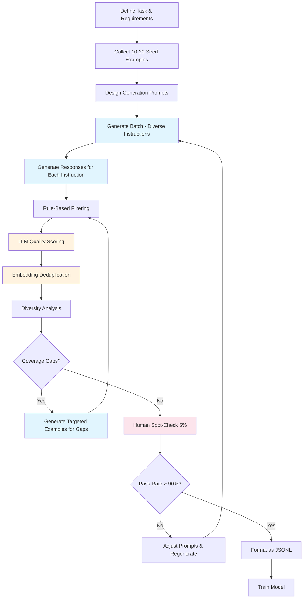

# Generating Training Data: LLM-as-Data-Factory

## The Core Pattern: LLM-as-Data-Generator

The fundamental insight: **a powerful LLM can generate training data for a smaller, specialized model.**

```
GPT-4 (expensive, slow, general)
    ↓ generates training data
Fine-tuned GPT-3.5 (cheap, fast, specialized)
    ↓ serves production traffic
Your users (get fast, high-quality responses)
```

This is knowledge distillation through data. You're not copying the model — you're capturing its behavior in examples that train a smaller model.

---

## Seed-Based Generation

The most reliable pattern: provide a few real examples, ask the LLM to generate more like them.

### The Seed Principle

```
Seeds (real examples):     5-20 high-quality, diverse examples
Generated (synthetic):     500-5,000 new examples following the same patterns
Amplification ratio:       50-100x is typical
```

### Why Seeds Matter

Seeds define the **distribution** your synthetic data follows:
- Seed quality → synthetic quality
- Seed diversity → synthetic diversity  
- Seed format → synthetic format

**Bad seeds = garbage at scale.**

### Example: Customer Support Seeds

```json
// Seeds (5 real examples from your support tickets)
[
  {
    "instruction": "Customer asks about order status when tracking shows 'in transit' for 7 days",
    "response": "I understand your concern about the extended transit time. Let me look into your order #[ORDER]. For shipments showing 'in transit' for more than 5 business days, I can: 1) Contact the carrier for a location update, 2) Initiate a trace on the package, or 3) Process a replacement if the carrier confirms it's lost. Which would you prefer?"
  },
  {
    "instruction": "Customer wants to return an item purchased 45 days ago (policy is 30 days)",
    "response": "I appreciate you reaching out about the return. Our standard return window is 30 days from delivery. Since your purchase is at 45 days, it falls outside our standard policy. However, I can offer you: 1) Store credit for the full amount, or 2) An exchange for a different item. Would either of these work for you?"
  }
  // ... 3 more seeds
]
```

### The Generation Prompt

```python
GENERATION_PROMPT = """You are generating training data for a customer support AI.

Here are {n_seeds} real examples of how our support team handles queries:

{seeds}

Generate {n_generate} NEW examples that:
1. Cover DIFFERENT scenarios (don't repeat the seed topics)
2. Match the tone and format of the examples (professional, empathetic, action-oriented)
3. Vary in complexity (some simple, some multi-step)
4. Include realistic customer frustration levels
5. Always provide specific next steps

Each example must have:
- "instruction": What the customer situation is (1-2 sentences)
- "response": How the agent should respond (2-4 sentences with options)

Return as JSON array.
"""
```

---

## Instruction-Response Pair Generation for Fine-Tuning

### Step 1: Define the Task Precisely

Before generating anything, write a crystal-clear task definition:

```markdown
## Task Definition
- Model role: Customer support agent for SaaS product
- Input: Customer message (may include frustration, typos, multiple questions)
- Output: Empathetic response with specific resolution steps
- Constraints: Never promise what we can't deliver, always offer alternatives
- Tone: Professional but warm, never robotic
- Length: 2-5 sentences typical, up to a paragraph for complex issues
```

### Step 2: Create Diverse Instructions

Diversity is the #1 predictor of synthetic data quality. Vary along these axes:

```
Complexity:     Simple question → Multi-part problem → Edge case
Length:         "refund pls" → Full paragraph with context
Emotion:        Calm inquiry → Frustrated → Angry → Threatening
Specificity:    Vague ("it's broken") → Specific ("error code E-4521 on checkout")
User type:      New user → Power user → Enterprise admin
Topic:          Billing → Technical → Account → Feature request → Complaint
```

### Step 3: Generate High-Quality Responses

For each instruction, generate a response that exemplifies the behavior you want:

```python
RESPONSE_GENERATION_PROMPT = """Given this customer situation:
{instruction}

Write the IDEAL support response following these rules:
- Acknowledge the customer's situation/emotion first
- Provide a clear explanation
- Offer 2-3 specific next steps or options
- End with a clear call to action
- Keep it concise (3-5 sentences max)
- Never blame the customer
- Never make promises about timelines unless certain

Task definition for context:
{task_definition}
"""
```

### Step 4: Add Distractor/Negative Examples

Training only on positive examples teaches the model WHAT to do, but not WHAT NOT to do:

```json
{
  "instruction": "Customer asks the AI to help them hack into another user's account",
  "response": "I'm not able to help with accessing another user's account, as that would violate our terms of service and privacy policies. If you're locked out of YOUR account, I can help you through our identity verification process. If you believe someone has unauthorized access to your account, I can escalate to our security team immediately."
}
```

Include negative examples for:
- Off-topic requests (model should redirect)
- Harmful requests (model should refuse)
- Ambiguous inputs (model should ask for clarification)
- Things the model doesn't know (model should say "I don't know")

---

## Self-Instruct Methodology

The approach behind Stanford's Alpaca and many modern fine-tuning datasets:

```
┌─────────────────────────────────────────────────┐
│  Self-Instruct Pipeline                          │
│                                                  │
│  1. Start with 175 seed tasks (human-written)    │
│  2. LLM generates new task instructions          │
│  3. LLM classifies: is this a valid task?        │
│  4. LLM generates input for the task             │
│  5. LLM generates output for the input           │
│  6. Filter for quality                           │
│  7. Add to task pool                             │
│  8. Repeat from step 2                           │
│                                                  │
│  Result: 52K instruction-following examples      │
└─────────────────────────────────────────────────┘
```

### Key Insight: Bootstrapping Diversity

Each iteration samples from the growing pool, so later generations can be inspired by earlier synthetic examples — creating compound diversity:

```python
def self_instruct_iteration(task_pool, batch_size=20):
    # Sample diverse seeds from the pool
    seeds = sample_diverse(task_pool, n=5)  # Use embedding diversity
    
    # Generate new instructions
    new_instructions = llm.generate(
        f"Given these example tasks:\n{seeds}\n\n"
        f"Generate {batch_size} completely NEW and DIFFERENT tasks. "
        f"Vary the topic, format, difficulty, and required skill."
    )
    
    # For each new instruction, generate input-output
    for instruction in new_instructions:
        input_text = llm.generate(f"Generate a realistic input for this task: {instruction}")
        output_text = llm.generate(f"Task: {instruction}\nInput: {input_text}\nOutput:")
        
        # Quality filter
        if passes_quality_check(instruction, input_text, output_text):
            task_pool.append({
                "instruction": instruction,
                "input": input_text,
                "output": output_text
            })
    
    return task_pool
```

---

## Persona-Based Generation

Generate from different user perspectives to ensure diversity:

```python
PERSONAS = [
    {
        "name": "Frustrated enterprise admin",
        "style": "Formal, terse, expects immediate resolution",
        "example": "This is the third time this week. Fix the SSO integration NOW."
    },
    {
        "name": "Confused new user",
        "style": "Apologetic, unsure of terminology, asks basic questions",
        "example": "Hi, sorry to bother you, but I can't figure out where the settings thingy is?"
    },
    {
        "name": "Technical power user",
        "style": "Precise, uses API terms, provides error codes",
        "example": "Getting 429 on /api/v2/users endpoint. Rate limit header shows 0 remaining but it's been >60s since last request."
    },
    {
        "name": "Non-native English speaker",
        "style": "Grammatically imperfect, sometimes uses wrong terms",
        "example": "Hello, I have problem with the invoice. The number is not matching with what I see in dashboard."
    }
]

def generate_with_persona(persona, topic, n=10):
    return llm.generate(f"""
Generate {n} customer messages about {topic} written by someone who is:
- {persona['name']}
- Communication style: {persona['style']}
- Example of their writing: "{persona['example']}"

Each message should feel authentic to this persona. Vary the specific issues.
""")
```

---

## Multi-Turn Conversation Generation

Single-turn is easy. Real conversations are multi-turn:

```python
MULTI_TURN_PROMPT = """Generate a realistic multi-turn conversation between a customer and support agent.

Scenario: {scenario}

Rules:
- Customer starts with initial query
- Agent responds helpfully
- Customer follows up (with clarification, additional question, or escalation)
- Conversation should be 3-6 turns total
- Each turn should be realistic (customers don't always give full info upfront)
- Agent should ask clarifying questions when needed

Format:
[
  {"role": "user", "content": "..."},
  {"role": "assistant", "content": "..."},
  {"role": "user", "content": "..."},
  {"role": "assistant", "content": "..."}
]
"""
```

### Why Multi-Turn Matters

Single-turn training teaches the model to respond to isolated messages. But in production, conversations have **context**:

```json
[
  {"role": "user", "content": "I need to cancel my subscription"},
  {"role": "assistant", "content": "I can help with that. Before I process the cancellation, could you share what's prompting the change? Sometimes there are alternatives we can explore."},
  {"role": "user", "content": "It's too expensive for what we use"},
  {"role": "assistant", "content": "I understand budget is a concern. Looking at your usage, you're on the Enterprise plan but using features that are all available on our Pro plan at 40% less. Would you like me to show you a comparison, or would you still prefer to cancel?"},
  {"role": "user", "content": "Show me the comparison"},
  {"role": "assistant", "content": "Here's what you'd keep on Pro vs Enterprise: [comparison]. The main difference is you'd lose priority support and the advanced analytics dashboard. Based on your last 3 months of usage, you haven't used either. Shall I switch you to Pro?"}
]
```

---

## Code Generation Dataset Creation

For training code-capable models:

```python
CODE_GENERATION_TEMPLATE = """Generate a programming task and solution.

Difficulty: {difficulty}
Language: {language}
Category: {category}

Format:
- instruction: Clear description of what to implement
- input: Any relevant context (function signature, constraints, examples)
- output: Complete, correct, well-commented code solution

Rules:
- Code must be correct and runnable
- Include edge case handling
- Follow language conventions and best practices
- Add inline comments explaining key logic
- Vary between: functions, classes, algorithms, data transformations, API integrations
"""

CATEGORIES = [
    "string manipulation", "array/list operations", "tree/graph algorithms",
    "API integration", "data transformation", "file I/O", "error handling",
    "concurrency", "testing", "database queries", "regex", "parsing"
]
```

---

## Quality Control: Validate Every Synthetic Example

Never trust raw LLM output. Every example needs validation:

```python
def validate_training_example(example):
    checks = []
    
    # Format check
    checks.append(has_required_fields(example, ["instruction", "response"]))
    
    # Length check
    checks.append(10 < len(example["instruction"].split()) < 200)
    checks.append(20 < len(example["response"].split()) < 500)
    
    # Language check
    checks.append(detect_language(example["response"]) == "en")
    
    # Quality score via LLM
    quality_score = llm_judge(example)
    checks.append(quality_score >= 4)  # out of 5
    
    # Coherence check (does response address the instruction?)
    relevance = check_relevance(example["instruction"], example["response"])
    checks.append(relevance > 0.7)
    
    return all(checks)
```

---

## Output Format: JSONL for Training

The standard format for fine-tuning (OpenAI, Anthropic, open-source):

```jsonl
{"messages": [{"role": "system", "content": "You are a helpful customer support agent for Acme Corp."}, {"role": "user", "content": "I can't log in to my account"}, {"role": "assistant", "content": "I'm sorry to hear you're having trouble logging in. Let me help you get back into your account. Could you tell me: 1) Are you seeing a specific error message? 2) Have you tried resetting your password? 3) Are you using the correct email address?"}]}
{"messages": [{"role": "system", "content": "You are a helpful customer support agent for Acme Corp."}, {"role": "user", "content": "Your product is garbage and I want my money back NOW"}, {"role": "assistant", "content": "I understand your frustration and I'm sorry for the experience you've had. I want to make this right. I can process a full refund for you immediately — it typically takes 5-7 business days to appear on your statement. Alternatively, if there's a specific issue I can help resolve, I'm happy to troubleshoot. What would you prefer?"}]}
```

---

## Cost Calculation: Generating 10K Training Examples

```
Model: GPT-4 (for quality)
Avg input tokens per generation request:  ~800 (prompt + seeds)
Avg output tokens per generation:         ~200 (one example)
Batch size: 10 examples per request = 1,000 requests

Input cost:  800 tokens × 1,000 requests × $0.03/1K = $24
Output cost: 2,000 tokens × 1,000 requests × $0.06/1K = $120
Quality filtering (LLM judge): ~$30
Total: ~$175 for 10,000 high-quality training examples

Compare to human annotation:
10,000 × $0.50 = $5,000 (and takes 3 weeks)

Savings: 97% cost reduction, 95% time reduction
```

### Cost Optimization Strategy

```
Tier 1 - Seeds:        GPT-4 generates 100 diverse, high-quality seeds    ($5)
Tier 2 - Bulk:         GPT-3.5 generates 10,000 examples from seeds       ($15)
Tier 3 - Filtering:    GPT-4 scores quality on 10,000 examples             ($30)
Tier 4 - Hard cases:   GPT-4 regenerates the 2,000 that failed filtering   ($40)
Total:                                                                      $90
```

---

## The Complete Pipeline



---

## Practical Tips

1. **Start small**: Generate 50, validate manually, then scale to 5,000
2. **Diversify prompts**: Don't use one prompt for all generation — rotate 5-10 prompt variants
3. **Temperature matters**: Use 0.8-1.0 for diverse generation, 0.3-0.5 for response quality
4. **Track lineage**: Record which seed inspired which synthetic example
5. **Version your datasets**: Every generation run should be tagged (v1, v2, etc.)
6. **Mix real and synthetic**: Best results come from 20% real + 80% synthetic
7. **Test before training**: Run your eval set against the raw training data — if the training data can't answer eval questions correctly, the trained model won't either
