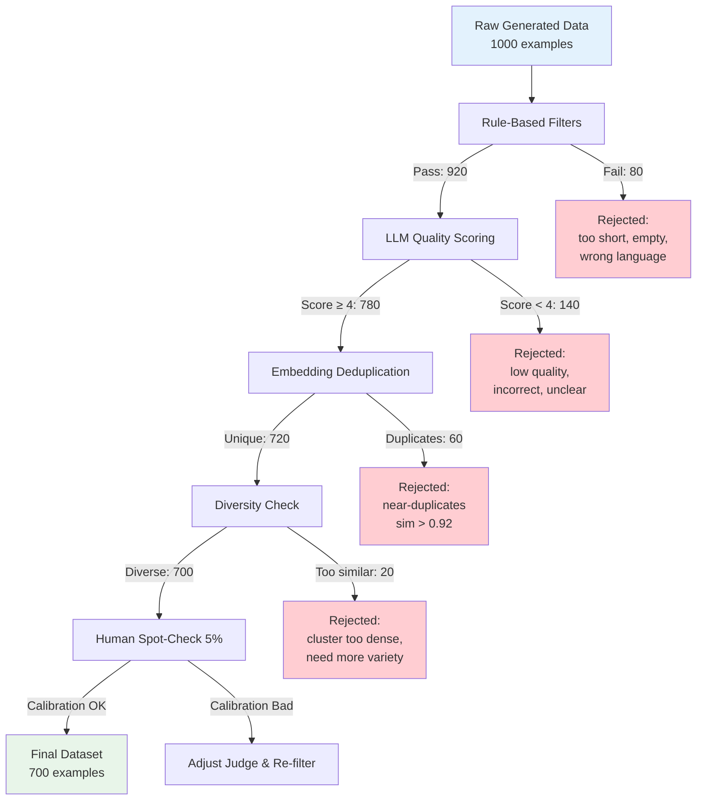

# Quality Filtering: Separating Gold from Garbage

## Why Filtering is Non-Negotiable

Raw LLM output has a ~10-30% garbage rate. If you train on garbage, you get a garbage model.

```
Generate 1,000 synthetic examples:
├── 700 (70%) — Good quality, ready to use
├── 150 (15%) — Mediocre, fixable with regeneration
├── 100 (10%) — Bad: wrong, incoherent, or off-topic
└──  50  (5%) — Dangerous: hallucinated facts, harmful content

Without filtering: you train on ALL 1,000 → model learns bad patterns
With filtering:    you train on 700-850 → model learns only good patterns
```

**The math:** A model trained on 700 high-quality examples outperforms one trained on 1,000 mixed-quality examples. Quality > Quantity, always.

---

## Quality Dimensions

### 1. Correctness
Is the content factually right?

```
✓ "Python 3.12 was released in October 2023"
✗ "Python 4.0 was released in 2024" (hallucination)
```

### 2. Coherence
Does it make logical sense?

```
✓ "To reset your password, click Settings > Security > Change Password"
✗ "To reset your password, first upgrade your plan then the password resets automatically"
```

### 3. Relevance
Is it on-topic for the intended use?

```
Task: Generate customer support responses
✓ "I can help you with that billing issue..."
✗ "The weather in Paris is lovely this time of year..."
```

### 4. Diversity
Is it sufficiently different from other examples?

```
✗ Example 1: "I'd be happy to help you with your account."
✗ Example 2: "I'd be glad to assist you with your account."
✗ Example 3: "I'd be pleased to help you with your account."
   ↑ These are essentially the same — keep only one
```

### 5. Difficulty
Is it the right difficulty level?

```
Target: medium difficulty
✗ "What color is the sky?" (too easy)
✗ "Derive the quantum chromodynamics equations" (too hard)
✓ "Explain how database indexing improves query performance" (just right)
```

### 6. Safety
No harmful content?

```
✗ Contains personal information (even synthetic PII is risky in training)
✗ Contains harmful instructions
✗ Contains biased/discriminatory content
✓ Clean, professional, safe content
```

---

## Filtering Techniques

### 1. Rule-Based Filters (Fast, Cheap, First Pass)

```python
def rule_based_filter(example):
    """Fast checks that catch obvious garbage. Cost: ~0"""
    
    reasons = []
    text = example.get("response", "")
    
    # Length checks
    if len(text.split()) < 10:
        reasons.append("too_short")
    if len(text.split()) > 1000:
        reasons.append("too_long")
    
    # Format checks
    if text.strip() == "":
        reasons.append("empty")
    if text.startswith("I cannot") or text.startswith("I'm sorry, but as an AI"):
        reasons.append("refusal_pattern")  # Model refused instead of generating
    
    # Language check
    if not is_primarily_english(text):
        reasons.append("wrong_language")
    
    # Repetition check
    sentences = text.split(". ")
    if len(sentences) > 3 and len(set(sentences)) < len(sentences) * 0.5:
        reasons.append("repetitive")
    
    # PII patterns
    if re.search(r'\b\d{3}-\d{2}-\d{4}\b', text):  # SSN pattern
        reasons.append("contains_pii")
    
    # Markdown artifacts
    if "```" in text and text.count("```") % 2 != 0:
        reasons.append("malformed_markdown")
    
    return {"pass": len(reasons) == 0, "reasons": reasons}
```

### 2. LLM-as-Judge Filtering

Use a different (or same) LLM to score quality:

```python
JUDGE_PROMPT = """Rate the quality of this training example on a 1-5 scale.

Task context: {task_description}

Instruction: {instruction}
Response: {response}

Score each dimension:
- Correctness (1-5): Is the information accurate?
- Helpfulness (1-5): Does it actually help with the instruction?
- Clarity (1-5): Is it well-written and easy to understand?
- Completeness (1-5): Does it fully address the instruction?

Overall score (1-5): Weighted average

Scoring guide:
5 = Excellent, could be shown as a best-practice example
4 = Good, minor issues but usable for training
3 = Acceptable, borderline — might help or might add noise
2 = Poor, has significant issues that would teach bad patterns
1 = Reject, factually wrong, incoherent, or harmful

Output JSON: {{"correctness": N, "helpfulness": N, "clarity": N, "completeness": N, "overall": N, "reasoning": "..."}}
"""

def llm_judge_filter(example, threshold=4):
    score = call_llm(JUDGE_PROMPT.format(
        task_description=example["task"],
        instruction=example["instruction"],
        response=example["response"]
    ))
    return score["overall"] >= threshold
```

### 3. Embedding-Based Deduplication

Near-duplicates add no value and can cause overfitting:

```python
from sentence_transformers import SentenceTransformer
from sklearn.metrics.pairwise import cosine_similarity
import numpy as np

def deduplicate(examples, similarity_threshold=0.92):
    """Remove examples that are too similar to each other."""
    
    model = SentenceTransformer('all-MiniLM-L6-v2')
    
    # Embed all examples
    texts = [e["instruction"] + " " + e["response"] for e in examples]
    embeddings = model.encode(texts)
    
    # Find duplicates
    keep = []
    removed = []
    
    for i, example in enumerate(examples):
        is_duplicate = False
        for j in keep:
            sim = cosine_similarity([embeddings[i]], [embeddings[j]])[0][0]
            if sim > similarity_threshold:
                is_duplicate = True
                removed.append({"index": i, "duplicate_of": j, "similarity": sim})
                break
        
        if not is_duplicate:
            keep.append(i)
    
    return [examples[i] for i in keep], removed
```

### 4. Self-Consistency Check

Generate the answer twice — if it's inconsistent, the question might be ambiguous or the answer unreliable:

```python
def self_consistency_check(instruction, n_samples=3):
    """Generate multiple responses and check agreement."""
    
    responses = [generate_response(instruction) for _ in range(n_samples)]
    
    # Check semantic similarity between responses
    embeddings = embed(responses)
    avg_similarity = np.mean([
        cosine_similarity([embeddings[i]], [embeddings[j]])[0][0]
        for i in range(len(responses))
        for j in range(i+1, len(responses))
    ])
    
    # High agreement = reliable, low agreement = unreliable
    return {
        "consistent": avg_similarity > 0.8,
        "agreement_score": avg_similarity,
        "best_response": responses[0]  # or pick by quality score
    }
```

### 5. Human Spot-Check

No automated system is perfect. Sample for human review:

```python
def human_spot_check(examples, sample_rate=0.05):
    """Sample 5% for manual review to calibrate automated filters."""
    
    sample = random.sample(examples, int(len(examples) * sample_rate))
    
    # Present to human reviewers
    for example in sample:
        print(f"Instruction: {example['instruction']}")
        print(f"Response: {example['response']}")
        print(f"Auto-score: {example['quality_score']}")
        human_score = input("Human score (1-5): ")
        example["human_score"] = int(human_score)
    
    # Calculate correlation between auto and human scores
    auto_scores = [e["quality_score"] for e in sample]
    human_scores = [e["human_score"] for e in sample]
    correlation = np.corrcoef(auto_scores, human_scores)[0][1]
    
    print(f"Auto-Human correlation: {correlation:.2f}")
    if correlation < 0.7:
        print("WARNING: Automated scoring poorly calibrated. Adjust judge prompt.")
    
    return sample, correlation
```

---

## The Filtering Pipeline



---

## Acceptance Criteria

Set thresholds BEFORE generating:

```yaml
quality_thresholds:
  rule_based:
    min_length_words: 15
    max_length_words: 500
    required_language: "en"
    no_pii: true
    no_repetition: true
  
  llm_judge:
    min_overall_score: 4.0  # out of 5
    min_correctness: 4.0    # non-negotiable
    min_helpfulness: 3.5    # slightly more lenient
    min_clarity: 3.5
  
  deduplication:
    max_similarity: 0.92    # cosine similarity threshold
  
  diversity:
    min_cluster_distance: 0.3  # examples in same topic must be this different
    max_examples_per_cluster: 20  # no more than 20 examples about same topic
  
  overall:
    target_acceptance_rate: 0.70  # expect 70% pass rate
    min_acceptance_rate: 0.50     # below 50% → fix generation prompts
    max_acceptance_rate: 0.95     # above 95% → filters too lenient
```

---

## Metrics: What to Track

```python
def generate_filtering_report(original, filtered, rejections):
    """Generate a report on the filtering process."""
    
    report = {
        "input_count": len(original),
        "output_count": len(filtered),
        "acceptance_rate": len(filtered) / len(original),
        "rejection_breakdown": Counter([r["reason"] for r in rejections]),
        "quality_distribution": {
            "5_stars": sum(1 for e in filtered if e["score"] == 5),
            "4_stars": sum(1 for e in filtered if e["score"] == 4),
        },
        "diversity_score": calculate_diversity(filtered),
        "avg_quality_score": np.mean([e["score"] for e in filtered]),
    }
    
    return report
```

Example report:
```
═══════════════════════════════════════
  FILTERING REPORT
═══════════════════════════════════════
  Input:           1,000 examples
  Output:            720 examples
  Acceptance rate:   72%
  
  Rejection reasons:
  ├── Low quality score:   140 (50%)
  ├── Too short/long:       60 (21%)
  ├── Near-duplicate:        50 (18%)
  ├── Repetitive content:    20  (7%)
  └── Safety concerns:       10  (4%)
  
  Quality distribution (accepted):
  ├── 5 stars: 280 (39%)
  └── 4 stars: 440 (61%)
  
  Diversity score: 0.84 (good)
  Avg quality:     4.39
═══════════════════════════════════════
```

---

## Cost of Quality

Filtering isn't free, but it's worth it:

```
Generation cost (1,000 examples):        $17.50
Rule-based filtering:                     $0.00 (CPU only)
LLM judge scoring (1,000 examples):       $5.25
Embedding + dedup computation:            $0.50
Human spot-check (50 examples × $1):     $50.00
─────────────────────────────────────────────────
Total with filtering:                    $73.25
Total without filtering:                 $17.50

Cost increase: ~4x
Quality improvement: Prevents catastrophic training failures

ROI: One bad training run costs 10-100x more than filtering
(GPU time wasted, model quality degraded, debugging time)
```

---

## Common Pitfalls

1. **Filtering too aggressively**: If acceptance rate < 50%, fix your generation prompts instead
2. **Filtering too leniently**: If acceptance rate > 95%, your threshold is too low
3. **Not tracking rejection reasons**: You can't improve what you don't measure
4. **Using same model for generation and judging**: Leads to self-reinforcing biases
5. **Skipping deduplication**: Results in model memorizing phrases instead of learning patterns
6. **One-size-fits-all thresholds**: Difficult examples need different criteria than easy ones

---

## When to Re-generate vs Filter

```
Acceptance rate > 70%  →  Filter and use (normal)
Acceptance rate 50-70% →  Filter, but also improve prompts for next batch
Acceptance rate < 50%  →  Stop. Fix generation prompts. Don't waste money filtering garbage.
```
