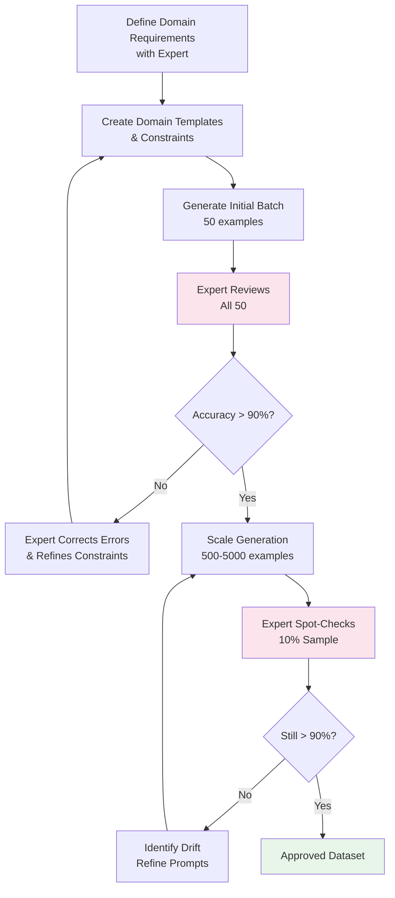

# Domain-Specific Generation: When Generic Won't Cut It

## Why Domain-Specific Data is Hard

Each domain has invisible rules that generic generation violates:

```
Generic AI response to "chest pain":
"You might be experiencing chest pain due to various reasons. Try resting and see if it improves."

Medical-domain response:
"Chest pain requires immediate assessment. Key differentiators: Is it substernal? Radiating to jaw/arm? Associated with dyspnea or diaphoresis? If any acute features present, this warrants emergent evaluation. Please clarify onset, duration, and associated symptoms."
```

The generic version is **dangerous** in a medical context. Domain-specific generation must capture:
- **Vocabulary**: Technical terms used correctly
- **Style**: Appropriate formality and structure
- **Constraints**: What MUST and MUST NOT be said
- **Regulations**: Legal requirements for the domain
- **Risk tolerance**: How cautious responses must be

---

## Domain Adaptation Strategies

### 1. Domain Vocabulary Injection

```python
DOMAIN_VOCABULARY = {
    "medical": {
        "terms": ["differential diagnosis", "contraindication", "prognosis", "etiology",
                  "comorbidity", "prophylaxis", "pathophysiology", "sequelae"],
        "abbreviations": ["BP", "HR", "CBC", "CMP", "MRI", "CT", "PRN", "BID"],
        "instruction": "Use clinical terminology naturally. Abbreviate standard terms."
    },
    "legal": {
        "terms": ["pursuant to", "notwithstanding", "hereinafter", "indemnification",
                  "force majeure", "fiduciary duty", "precedent", "statute of limitations"],
        "abbreviations": ["LLC", "IP", "NDA", "SLA", "TOS", "GDPR", "SOX"],
        "instruction": "Use precise legal language. Reference applicable statutes."
    },
    "financial": {
        "terms": ["EBITDA", "amortization", "liquidity ratio", "yield curve",
                  "market capitalization", "P/E ratio", "hedge", "derivative"],
        "abbreviations": ["YoY", "QoQ", "ROI", "IRR", "NPV", "AUM", "NAV"],
        "instruction": "Use standard financial terminology. Include quantitative context."
    }
}
```

### 2. Style Matching

```python
DOMAIN_STYLES = {
    "medical": {
        "tone": "Clinical, objective, evidence-based",
        "structure": "Assessment → Plan → Follow-up",
        "example": "Patient presents with 3-day history of progressive dyspnea. "
                   "SpO2 92% on RA. Assessment: Likely community-acquired pneumonia. "
                   "Plan: CXR, CBC, start empiric antibiotics pending cultures."
    },
    "legal": {
        "tone": "Formal, precise, hedged with qualifications",
        "structure": "Issue → Rule → Application → Conclusion",
        "example": "The contract's force majeure clause (Section 12.4) may be triggered "
                   "by the supply chain disruption, provided the party can demonstrate "
                   "that performance was rendered impossible, not merely more expensive."
    },
    "customer_support": {
        "tone": "Warm, empathetic, action-oriented",
        "structure": "Acknowledge → Explain → Resolve → Follow-up",
        "example": "I completely understand how frustrating this must be. The charge "
                   "you're seeing is our annual renewal — I should have notified you earlier. "
                   "I've issued a full refund. You'll see it in 3-5 business days."
    }
}
```

### 3. Constraint Injection

```python
DOMAIN_CONSTRAINTS = {
    "medical": [
        "NEVER provide a definitive diagnosis — always recommend professional evaluation",
        "ALWAYS mention seeking emergency care for life-threatening symptoms",
        "NEVER recommend specific medications without noting 'consult your physician'",
        "Include severity indicators and red flags",
        "Cite evidence levels when possible (e.g., 'Level A evidence supports...')"
    ],
    "legal": [
        "ALWAYS include 'this is not legal advice' disclaimer",
        "NEVER guarantee legal outcomes",
        "Reference jurisdiction-specific variations",
        "Note when statute of limitations may apply",
        "Distinguish between civil and criminal implications"
    ],
    "financial": [
        "ALWAYS include 'past performance does not guarantee future results'",
        "NEVER provide specific buy/sell recommendations",
        "Include risk disclaimers for investment topics",
        "Note regulatory considerations (SEC, FINRA)",
        "Distinguish between informational and advisory content"
    ]
}
```

### 4. Regulation Awareness

```python
REGULATORY_REQUIREMENTS = {
    "healthcare_US": {
        "regulations": ["HIPAA", "HITECH", "FDA guidelines"],
        "requirements": [
            "No storage or reference to PHI (Protected Health Information)",
            "De-identification standards per Safe Harbor method",
            "Cannot constitute medical device per FDA SaMD guidance"
        ]
    },
    "financial_US": {
        "regulations": ["SEC regulations", "FINRA rules", "SOX compliance"],
        "requirements": [
            "Clear distinction between information and advice",
            "Suitability disclosures for any investment discussion",
            "Record-keeping awareness for compliance"
        ]
    }
}
```

---

## Domain Examples

### Healthcare: Patient Query Generation

```python
HEALTHCARE_GENERATOR = """Generate realistic patient queries for a healthcare AI assistant.

Domain rules:
- Patients describe symptoms in lay terms (not medical jargon)
- Include demographic hints naturally (age, gender when relevant)
- Vary urgency levels: routine check → concerning → emergent
- Include medication questions, symptom inquiries, and follow-up questions
- Some queries should be about caregiver situations ("my mother has...")

Generate {n} patient queries with appropriate AI responses.

Response rules:
{constraints}

Format each as:
{{
  "patient_query": "...",
  "ai_response": "...",
  "urgency_level": "routine|concerning|emergent",
  "category": "symptom|medication|preventive|follow_up|caregiver"
}}
"""
```

Example output:
```json
{
  "patient_query": "I've been having headaches almost every day for the past two weeks. They're mostly behind my eyes and get worse when I'm at the computer. Should I be worried?",
  "ai_response": "Daily headaches lasting two weeks do warrant attention. The pattern you describe — behind the eyes, worsened by screen time — is consistent with tension headaches or eye strain, but persistent daily headaches should be evaluated by a healthcare provider to rule out other causes. In the meantime: Are you experiencing any vision changes, nausea, fever, or neck stiffness? These would warrant more urgent evaluation. I'd recommend scheduling an appointment with your primary care provider within the next week.",
  "urgency_level": "concerning",
  "category": "symptom"
}
```

### Legal: Contract Clause Generation

```python
LEGAL_GENERATOR = """Generate realistic legal queries and responses for a legal research assistant.

Domain rules:
- Users range from lawyers (technical) to business owners (non-technical)
- Responses must NEVER constitute legal advice (always disclaim)
- Reference applicable law when possible
- Note jurisdictional variations
- For contract questions, identify relevant clauses and their implications

Categories:
- Contract interpretation
- Regulatory compliance
- Employment law
- Intellectual property
- Liability and risk

Generate {n} legal queries with appropriate responses.
{constraints}
"""
```

### Financial: Earnings Analysis Generation

```python
FINANCIAL_GENERATOR = """Generate realistic financial analysis queries and responses.

Context: An AI assistant helping analysts and investors understand financial data.

Domain rules:
- Use standard financial metrics (EBITDA, P/E, EPS, etc.)
- Include quantitative reasoning
- Note limitations of historical data
- Distinguish between facts and opinions/projections
- Include appropriate disclaimers

Categories:
- Earnings analysis ("What drove the revenue miss?")
- Risk assessment ("What are the key risks for this sector?")
- Comparison ("How does Company A compare to peers?")
- Trend analysis ("What's the trajectory of margins?")
- Compliance ("What reporting requirements apply?")

Generate {n} financial queries with appropriate responses.
{constraints}
"""
```

### Customer Support: Multi-Domain Patterns

```python
SUPPORT_GENERATOR = """Generate customer support interactions for a {product_type} company.

Patterns to cover:
1. Complaint → Resolution (happy path)
2. Complaint → Escalation (can't resolve at first level)
3. Technical issue → Troubleshooting → Fix
4. Billing dispute → Investigation → Credit/Explanation
5. Feature request → Acknowledgment → Alternative suggestion
6. Confusion → Clarification → Education

Tone: Empathetic, professional, solution-oriented
Constraints:
- Never promise things outside policy
- Always offer alternatives when saying no
- Escalate appropriately (know limits of AI)
- Handle angry customers without defensiveness
"""
```

---

## Template-Based Generation for Structured Domains

When domain output has strict structure, use templates:

```python
# Medical: SOAP Note Template
SOAP_TEMPLATE = """
Subjective: {patient_complaint}. Duration: {duration}. Associated symptoms: {associated}. Denies {negatives}.
Objective: VS: {vitals}. Physical exam: {exam_findings}.
Assessment: {diagnosis_list}
Plan: {treatment_plan}
"""

# Legal: Case Brief Template
CASE_BRIEF_TEMPLATE = """
Case: {case_name}
Court: {court}
Date: {date}
Issue: {legal_issue}
Rule: {applicable_rule}
Application: {how_rule_applies}
Holding: {court_decision}
Significance: {why_it_matters}
"""

# Financial: Earnings Summary Template
EARNINGS_TEMPLATE = """
Company: {company} | Ticker: {ticker}
Quarter: {quarter} | Report Date: {date}
Revenue: {revenue} ({rev_change}% YoY) | Consensus: {consensus}
EPS: {eps} ({eps_change}% YoY) | Est: {eps_est}
Key drivers: {drivers}
Guidance: {guidance}
Risks: {risks}
"""

def generate_from_template(template, domain, n=20):
    """Use LLM to fill templates with realistic domain content."""
    return llm.generate(f"""
Fill this template {n} times with realistic {domain} content.
Each instance should be completely different (different scenarios/patients/cases).

Template:
{template}

Generate {n} filled instances as JSON array.
""")
```

---

## Expert Validation Requirements Per Domain

| Domain | Validation Required | Who Validates | Frequency |
|--------|-------------------|---------------|-----------|
| Medical | Clinical accuracy check | Licensed physician | 100% of safety-critical, 20% general |
| Legal | Legal accuracy check | Practicing attorney | 100% of advice-like, 10% informational |
| Financial | Regulatory compliance | Compliance officer | 100% of advisory, 5% factual |
| Customer Support | Tone & policy check | Senior support lead | 10% random sample |
| Technical | Code/accuracy check | Senior engineer | 30% of technical content |

---

## Compliance Considerations

```
Can you use synthetic medical data for training?
├── For informational AI (symptom education): Yes, with disclaimers
├── For diagnostic AI (SaMD): Requires FDA regulatory pathway regardless
├── For training clinicians: Yes, common in medical education
└── For patient-facing advice: Depends on jurisdiction + must not constitute "practice of medicine"

Can you use synthetic financial data for training?
├── For informational AI: Yes, with standard disclaimers
├── For trading algorithms: Synthetic data alone is insufficient (SEC scrutiny)
├── For robo-advisors: Must meet fiduciary standards regardless of training data source
└── For internal analysis tools: Yes, widely accepted practice
```

---

## The "Domain Expert in the Loop" Pattern



The expert doesn't review everything at scale — they calibrate early, then spot-check. This makes domain-specific generation feasible while maintaining quality.

---

## Key Takeaways

1. **Generic prompts produce generic data** — invest time in domain-specific prompt engineering
2. **Constraints prevent harm** — especially in medical, legal, and financial domains
3. **Expert time is expensive** — use it for calibration, not bulk review
4. **Templates ensure structure** — critical for domains with strict output formats
5. **Regulations don't disappear** because data is synthetic — compliance requirements still apply
6. **Start narrow, expand** — generate for one sub-domain well before covering the whole field
