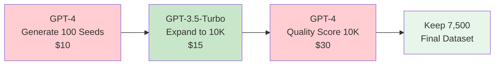
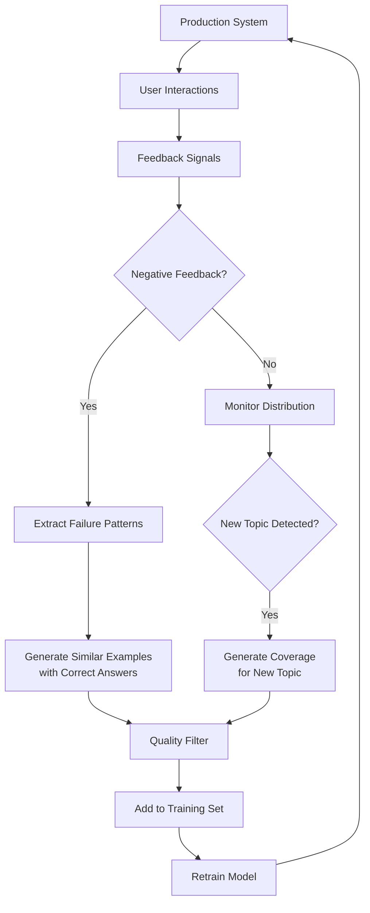
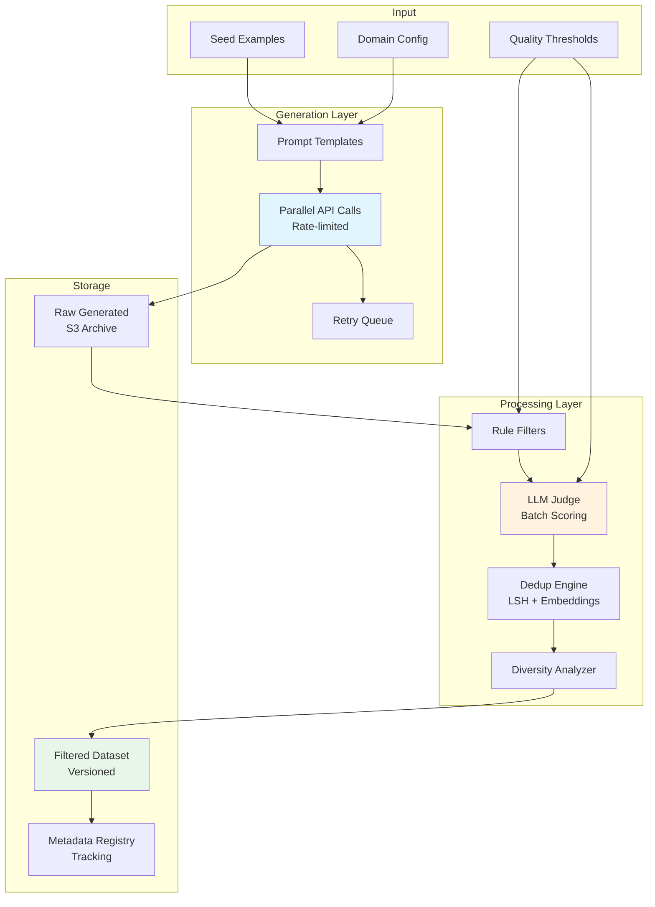

# Scaling Synthetic Data Generation

## The Scale Challenge

Generating 50 examples is easy. Generating 100K quality examples requires infrastructure.

```
Scale         | Approach              | Time      | Cost (GPT-4)
─────────────┼───────────────────────┼───────────┼─────────────
50            | Manual prompting      | 30 min    | $5
500           | Script + single API   | 2 hours   | $50
5,000         | Parallel generation   | 4 hours   | $500
50,000        | Pipeline + tiered     | 1-2 days  | $2,000
500,000       | Full infrastructure   | 1 week    | $10,000
```

---

## Parallel Generation with Rate Limit Management

```python
import asyncio
import aiohttp
from asyncio import Semaphore

class RateLimitedGenerator:
    def __init__(self, rpm_limit=500, tpm_limit=150000):
        self.rpm_semaphore = Semaphore(rpm_limit // 60)  # per-second rate
        self.tokens_per_minute = tpm_limit
        self.request_count = 0
        self.token_count = 0
        self.last_reset = time.time()
    
    async def generate_batch(self, prompts, max_concurrent=50):
        semaphore = Semaphore(max_concurrent)
        results = []
        
        async def generate_one(prompt):
            async with semaphore:
                await self.wait_for_rate_limit()
                result = await self.call_api(prompt)
                return result
        
        tasks = [generate_one(p) for p in prompts]
        results = await asyncio.gather(*tasks, return_exceptions=True)
        
        # Retry failures with exponential backoff
        failures = [(i, r) for i, r in enumerate(results) if isinstance(r, Exception)]
        for idx, error in failures:
            await asyncio.sleep(2 ** (failures.index((idx, error))))
            results[idx] = await self.call_api(prompts[idx])
        
        return results
    
    async def wait_for_rate_limit(self):
        """Simple token bucket rate limiting."""
        while self.request_count >= self.rpm_limit:
            await asyncio.sleep(1)
            if time.time() - self.last_reset > 60:
                self.request_count = 0
                self.last_reset = time.time()
        self.request_count += 1
```

---

## Cost Optimization: Tiered Generation

The key insight: use expensive models for quality-critical steps, cheap models for bulk.



```python
TIER_CONFIG = {
    "seed_generation": {
        "model": "gpt-4",
        "purpose": "Create diverse, high-quality seed examples",
        "count": 100,
        "temperature": 0.9
    },
    "bulk_expansion": {
        "model": "gpt-3.5-turbo",
        "purpose": "Expand seeds into thousands of variations",
        "count": 10000,
        "temperature": 0.8
    },
    "quality_scoring": {
        "model": "gpt-4",
        "purpose": "Score every example, reject low quality",
        "threshold": 4.0
    },
    "hard_regeneration": {
        "model": "gpt-4",
        "purpose": "Regenerate failed examples at higher quality",
        "count": "~2000 (failures from bulk)"
    }
}
```

---

## Deduplication at Scale

At 100K+ examples, pairwise comparison is O(n²) — too slow.

### Locality-Sensitive Hashing (LSH)

```python
from datasketch import MinHash, MinHashLSH

def deduplicate_at_scale(examples, threshold=0.8):
    """O(n) approximate deduplication using MinHash LSH."""
    
    lsh = MinHashLSH(threshold=threshold, num_perm=128)
    minhashes = {}
    
    for i, example in enumerate(examples):
        # Create MinHash from word shingles
        mh = MinHash(num_perm=128)
        words = example["text"].lower().split()
        for shingle in [" ".join(words[j:j+3]) for j in range(len(words)-2)]:
            mh.update(shingle.encode('utf8'))
        
        minhashes[i] = mh
        
        # Check for duplicates before inserting
        duplicates = lsh.query(mh)
        if not duplicates:
            lsh.insert(i, mh)
    
    # Get unique indices
    unique_indices = set(lsh.keys)
    return [examples[i] for i in sorted(unique_indices)]
```

### Embedding Clustering for Diversity

```python
from sklearn.cluster import MiniBatchKMeans

def ensure_diversity(examples, embeddings, max_per_cluster=50):
    """Cluster examples and cap each cluster to prevent topic dominance."""
    
    n_clusters = len(examples) // 20  # ~20 examples per cluster
    kmeans = MiniBatchKMeans(n_clusters=n_clusters, batch_size=1000)
    labels = kmeans.fit_predict(embeddings)
    
    diverse_set = []
    for cluster_id in range(n_clusters):
        cluster_indices = [i for i, l in enumerate(labels) if l == cluster_id]
        # Keep at most max_per_cluster from each cluster
        selected = cluster_indices[:max_per_cluster]
        diverse_set.extend([examples[i] for i in selected])
    
    return diverse_set
```

---

## Version Control for Synthetic Datasets

Synthetic datasets are code artifacts — version them:

```yaml
# dataset_registry.yaml
datasets:
  customer_support_v1:
    created: "2024-01-15"
    generator_model: "gpt-4-0125"
    seed_count: 20
    generated_count: 5000
    filtered_count: 3750
    acceptance_rate: 0.75
    quality_scores:
      mean: 4.3
      median: 4.0
      std: 0.5
    storage: "s3://datasets/customer-support/v1/"
    git_tag: "dataset-cs-v1"
    
  customer_support_v2:
    created: "2024-02-20"
    changes: "Added escalation scenarios, fixed tone issues"
    generator_model: "gpt-4-0125"
    seed_count: 35
    generated_count: 7000
    filtered_count: 5600
    acceptance_rate: 0.80
    storage: "s3://datasets/customer-support/v2/"
    git_tag: "dataset-cs-v2"
```

### Storage Options

| Approach | Best For | Limitations |
|----------|----------|-------------|
| Git (raw) | < 100 examples, markdown | Size limits |
| Git-LFS | < 10K examples, JSONL | Slow for large files |
| DVC | Any size, linked to git | Requires remote storage |
| S3/GCS + registry | Production scale | Need metadata management |
| HuggingFace Datasets | Sharing/collaboration | Public by default |

---

## A/B Testing Synthetic Data Quality

Don't guess which dataset is better — test it:

```python
def ab_test_datasets(dataset_a, dataset_b, eval_set, base_model):
    """Train two models on different datasets, compare on same eval."""
    
    model_a = fine_tune(base_model, dataset_a, suffix="v1")
    model_b = fine_tune(base_model, dataset_b, suffix="v2")
    
    scores_a = evaluate(model_a, eval_set)
    scores_b = evaluate(model_b, eval_set)
    
    return {
        "dataset_a": {"size": len(dataset_a), "eval_score": scores_a["mean"]},
        "dataset_b": {"size": len(dataset_b), "eval_score": scores_b["mean"]},
        "winner": "a" if scores_a["mean"] > scores_b["mean"] else "b",
        "significance": statistical_test(scores_a["raw"], scores_b["raw"])
    }
```

---

## Continuous Generation from Production Feedback

The best synthetic data comes from real failures:



```python
def continuous_improvement_loop(production_logs, current_dataset):
    """Mine production for improvement opportunities."""
    
    # 1. Find failures
    failures = [log for log in production_logs 
                if log["thumbs_down"] or log["escalated"]]
    
    # 2. Cluster failures by type
    failure_clusters = cluster_by_topic(failures)
    
    # 3. For each cluster, generate targeted training data
    new_examples = []
    for cluster in failure_clusters:
        if cluster["count"] > 5:  # recurring failure
            examples = generate_for_failure_mode(
                failure_examples=cluster["examples"][:5],
                n_generate=cluster["count"] * 10  # 10x amplification
            )
            new_examples.extend(examples)
    
    # 4. Filter and add to dataset
    filtered = quality_filter(new_examples)
    updated_dataset = current_dataset + filtered
    
    return updated_dataset
```

---

## Scalable Pipeline Architecture



---

## Practical Checklist for Scaling

```markdown
□ Set up rate limiting BEFORE running at scale (avoid API bans)
□ Use tiered models (GPT-4 seeds, GPT-3.5 bulk, GPT-4 judging)
□ Implement retry with exponential backoff
□ Stream results to disk (don't hold 100K examples in memory)
□ Version every dataset with metadata (model, date, config)
□ Run deduplication BEFORE quality scoring (save money)
□ Track cost per accepted example (your efficiency metric)
□ Set up monitoring for generation quality drift over batches
□ Human review every 10th batch (calibration check)
□ A/B test before replacing production dataset
```
