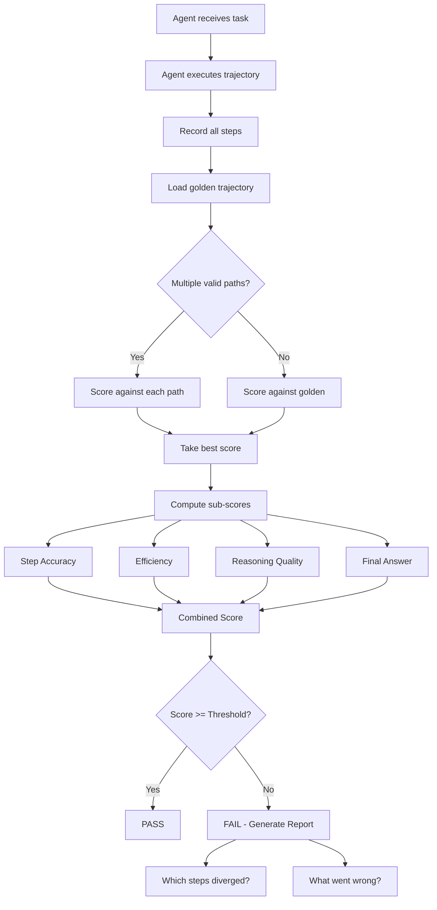

# Golden Trajectories

## What Are Golden Trajectories?

A golden trajectory is the **ideal path** an AI agent should take to complete a task. It's not just about getting the right final answer — it's about taking the right steps, in the right order, with the right reasoning.

Think of it like GPS navigation. Two drivers can both arrive at the same destination, but one took the highway (3 tools, 2 minutes) while the other drove through residential streets (12 tools, 10 minutes). The golden trajectory is the highway route.

## Why Trajectory Testing Matters

### Same Result, Different Quality

Consider this task: "What was our revenue last quarter?"

**Path A (Golden)**:
1. Query database → Get $2.3M → Return answer
   - 1 tool call, 2 seconds, correct

**Path B (Acceptable but wasteful)**:
1. Search documents for "revenue" → Get 50 results
2. Filter results for "last quarter" → Get 10 results  
3. Read each document → Find $2.3M in document 7
4. Verify in database → Confirm $2.3M
5. Return answer
   - 5 tool calls, 15 seconds, correct

**Path C (Failure)**:
1. Query database with wrong filter → Get $0
2. Search documents → Get unrelated results
3. Guess based on previous quarter → Return $2.1M (WRONG)
   - 3 tool calls, 8 seconds, incorrect

All three produce answers. Only trajectory evaluation distinguishes quality.

## Golden Trajectory Schema

### Complete Example

```json
{
  "id": "traj-001",
  "version": "1.0.0",
  "task": "Find the Q3 revenue and compare to target",
  "input": {
    "user_message": "What was our Q3 revenue and how does it compare to the target?",
    "context": {"fiscal_year": "2024", "user_role": "executive"}
  },
  "steps": [
    {
      "step": 1,
      "thought": "I need to get Q3 actual revenue from the financial database",
      "tool": "sql_query",
      "args": {
        "query": "SELECT revenue FROM quarterly_financials WHERE quarter='Q3' AND year=2024"
      },
      "expected_result": {"revenue": 2300000},
      "alternatives": [
        {
          "tool": "sql_query",
          "args": {"query": "SELECT revenue FROM financials WHERE period='2024-Q3'"},
          "note": "Alternative table structure, equally valid"
        }
      ]
    },
    {
      "step": 2,
      "thought": "Now I need the Q3 revenue target from planning documents",
      "tool": "vector_search",
      "args": {
        "query": "Q3 2024 revenue target goal",
        "collection": "planning_docs"
      },
      "expected_result": {"text": "Q3 2024 revenue target: $2.0M", "source": "annual-plan-2024.pdf"},
      "alternatives": [
        {
          "tool": "sql_query",
          "args": {"query": "SELECT target FROM targets WHERE quarter='Q3' AND year=2024"},
          "note": "If targets are in database rather than documents"
        }
      ]
    },
    {
      "step": 3,
      "thought": "Calculate the comparison: (actual - target) / target * 100",
      "tool": "calculator",
      "args": {
        "expression": "(2300000 - 2000000) / 2000000 * 100"
      },
      "expected_result": {"result": 15.0},
      "optional": true,
      "note": "Agent could do this math internally without a tool"
    }
  ],
  "expected_output": "Q3 2024 revenue was $2.3M, exceeding the $2.0M target by 15% ($300K above target).",
  "max_steps": 5,
  "min_steps": 2,
  "required_tools": ["sql_query", "vector_search"],
  "optional_tools": ["calculator"],
  "forbidden_tools": ["send_email", "create_file"],
  "quality_criteria": {
    "must_include_facts": ["$2.3M", "$2.0M", "15%"],
    "must_not_include": ["projected", "estimated"],
    "tone": "factual_concise"
  },
  "difficulty": "medium",
  "category": "data_retrieval_comparison",
  "created_by": "lead_analyst@company.com",
  "validated_by": "cto@company.com",
  "created_at": "2024-02-01"
}
```

### Schema Fields Explained

| Field | Purpose | Required? |
|-------|---------|-----------|
| `steps` | Ordered list of expected actions | Yes |
| `steps[].thought` | Expected reasoning (for reasoning eval) | Yes |
| `steps[].tool` | Expected tool to call | Yes |
| `steps[].args` | Expected arguments | Yes |
| `steps[].expected_result` | What the tool should return | Yes |
| `steps[].alternatives` | Other valid approaches | No (but valuable) |
| `steps[].optional` | Is this step required? | No |
| `max_steps` | Upper bound on acceptable steps | Yes |
| `min_steps` | Lower bound (too few = skipped something) | No |
| `required_tools` | Tools that MUST be called | Yes |
| `forbidden_tools` | Tools that should NOT be called | No |

## How to Record Golden Trajectories

### Method 1: Manual Expert Creation (Highest Quality)

A domain expert manually writes out the ideal trajectory:

```python
# Expert workflow:
# 1. Read the task
# 2. Think: "What would the ideal agent do?"
# 3. Write each step with reasoning
# 4. Verify the expected results are correct
# 5. Consider alternative valid paths
```

**Pros**: Highest quality, captures expert reasoning
**Cons**: Expensive (30-60 min per trajectory), doesn't scale

**When to use**: Critical tasks, complex multi-step workflows, tasks where the path matters as much as the result.

### Method 2: Record from Production (Filter Best Runs)

```python
def find_golden_candidates(production_traces):
    """Filter production traces to find golden trajectory candidates."""
    candidates = []
    for trace in production_traces:
        if (trace.user_rating >= 4.5 and
            trace.result_correct == True and
            trace.num_steps <= trace.task_median_steps * 0.8 and  # More efficient than average
            trace.no_errors == True and
            trace.latency <= trace.task_p50_latency):
            candidates.append(trace)
    return candidates

# Then human reviews candidates:
# - Is this ACTUALLY the ideal path?
# - Are there unnecessary steps?
# - Is the reasoning sound?
```

**Pros**: Based on real system behavior, scales better
**Cons**: Best observed != optimal, needs human validation

**When to use**: You have production traffic, want to bootstrap quickly.

### Method 3: Generate with Best Model, Validate with Human

```python
def generate_golden_trajectory(task, best_model="gpt-4"):
    """Use the best available model to generate trajectory, then validate."""
    # Run the best model with chain-of-thought
    trajectory = best_model.run(task, verbose=True, record_steps=True)
    
    # Present to human for validation
    print(f"Task: {task}")
    print(f"Steps taken: {len(trajectory.steps)}")
    for step in trajectory.steps:
        print(f"  {step.thought} → {step.tool}({step.args}) → {step.result}")
    
    # Human decides:
    # - Is this path optimal?
    # - Any unnecessary steps?
    # - Any missing steps?
    # - Is the final answer correct?
    
    return trajectory if human_approves() else None
```

**Pros**: Fast generation, good starting point
**Cons**: Model may take suboptimal paths, hallucinate reasoning

**When to use**: Large-scale trajectory generation with human-in-the-loop validation.

## Trajectory Evaluation Metrics

### 1. Step Accuracy

Did the agent call the right tool at each step?

```python
def step_accuracy(agent_trajectory, golden_trajectory):
    """Proportion of steps where agent called the correct tool."""
    correct_steps = 0
    for i, golden_step in enumerate(golden_trajectory.steps):
        if i < len(agent_trajectory.steps):
            agent_step = agent_trajectory.steps[i]
            if agent_step.tool == golden_step.tool:
                # Also check if args are semantically equivalent
                if args_match(agent_step.args, golden_step.args):
                    correct_steps += 1
    return correct_steps / len(golden_trajectory.steps)
```

### 2. Step Efficiency

Did the agent use the minimum necessary steps?

```python
def step_efficiency(agent_trajectory, golden_trajectory):
    """Ratio of golden steps to agent steps. >1 means agent was wasteful."""
    golden_steps = len([s for s in golden_trajectory.steps if not s.get("optional")])
    agent_steps = len(agent_trajectory.steps)
    
    if agent_steps == 0:
        return 0.0
    
    efficiency = golden_steps / agent_steps
    return min(efficiency, 1.0)  # Cap at 1.0 (can't be more efficient than golden)
```

### 3. Reasoning Quality

Is the agent's thinking logical at each step?

```python
def reasoning_quality(agent_trajectory, golden_trajectory, evaluator_llm):
    """Use LLM-as-judge to evaluate reasoning quality at each step."""
    scores = []
    for agent_step, golden_step in zip(agent_trajectory.steps, golden_trajectory.steps):
        prompt = f"""
        Task context: {golden_trajectory.task}
        
        Golden reasoning: {golden_step.thought}
        Agent reasoning: {agent_step.thought}
        
        Score the agent's reasoning from 1-5:
        5 = Equivalent or better reasoning than golden
        4 = Slightly different but sound reasoning
        3 = Reasoning is okay but misses key insight
        2 = Reasoning is flawed
        1 = No reasoning or completely wrong
        """
        score = evaluator_llm.score(prompt)
        scores.append(score)
    return sum(scores) / len(scores)
```

### 4. Final Answer Correctness

Regardless of path, is the final answer correct?

```python
def final_answer_score(agent_output, golden_output, criteria):
    """Check if the final answer meets quality criteria."""
    score = 0.0
    
    # Must-include facts
    for fact in criteria["must_include_facts"]:
        if fact.lower() in agent_output.lower():
            score += 1.0 / len(criteria["must_include_facts"])
    
    # Must-not-include (penalty)
    for forbidden in criteria.get("must_not_include", []):
        if forbidden.lower() in agent_output.lower():
            score -= 0.2
    
    return max(0.0, min(1.0, score))
```

### 5. Combined Trajectory Score

```python
def trajectory_score(agent_traj, golden_traj, weights=None):
    """Combined trajectory evaluation score."""
    if weights is None:
        weights = {
            "step_accuracy": 0.25,
            "efficiency": 0.20,
            "reasoning": 0.20,
            "final_answer": 0.35
        }
    
    scores = {
        "step_accuracy": step_accuracy(agent_traj, golden_traj),
        "efficiency": step_efficiency(agent_traj, golden_traj),
        "reasoning": reasoning_quality(agent_traj, golden_traj, evaluator),
        "final_answer": final_answer_score(agent_traj.output, golden_traj.expected_output, golden_traj.quality_criteria)
    }
    
    combined = sum(scores[k] * weights[k] for k in weights)
    return combined, scores
```

## Handling Multiple Valid Trajectories

Real-world tasks often have more than one correct path. Your evaluation must handle this.

### Approach 1: Alternative Paths in Schema

```json
{
  "task": "Get customer email",
  "primary_trajectory": [
    {"tool": "crm_lookup", "args": {"customer_id": "123", "field": "email"}}
  ],
  "alternative_trajectories": [
    [
      {"tool": "database_query", "args": {"query": "SELECT email FROM customers WHERE id=123"}}
    ],
    [
      {"tool": "search_contacts", "args": {"name": "Customer Name"}},
      {"tool": "get_contact_details", "args": {"contact_id": "..."}}
    ]
  ]
}
```

### Approach 2: Score Against Best-Matching Path

```python
def flexible_trajectory_score(agent_traj, golden):
    """Score against whichever golden path the agent most closely followed."""
    all_paths = [golden.primary_trajectory] + golden.alternative_trajectories
    
    scores = []
    for path in all_paths:
        score = trajectory_score(agent_traj, path)
        scores.append(score)
    
    return max(scores)  # Give credit for any valid path
```

### Approach 3: Outcome-Based with Constraints

```python
def outcome_based_score(agent_traj, golden):
    """Don't care about path, just check constraints and outcome."""
    # Final answer must be correct
    answer_correct = final_answer_score(agent_traj.output, golden.expected_output)
    
    # Must use required tools
    used_tools = {step.tool for step in agent_traj.steps}
    required_met = all(t in used_tools for t in golden.required_tools)
    
    # Must not use forbidden tools
    forbidden_used = any(t in used_tools for t in golden.forbidden_tools)
    
    # Must be within step budget
    within_budget = len(agent_traj.steps) <= golden.max_steps
    
    if not required_met or forbidden_used or not within_budget:
        return 0.0
    
    return answer_correct
```

## Trajectory Evaluation Flow



## Practical Trajectory Recording Tips

### 1. Record Everything

```python
class TrajectoryRecorder:
    def __init__(self):
        self.steps = []
        self.start_time = time.time()
    
    def record_step(self, thought, tool, args, result, latency):
        self.steps.append({
            "step": len(self.steps) + 1,
            "thought": thought,
            "tool": tool,
            "args": args,
            "result": result,
            "latency_ms": latency,
            "timestamp": time.time() - self.start_time
        })
    
    def to_golden(self, task, expected_output, metadata):
        return {
            "task": task,
            "steps": self.steps,
            "expected_output": expected_output,
            "total_steps": len(self.steps),
            "total_latency_ms": sum(s["latency_ms"] for s in self.steps),
            **metadata
        }
```

### 2. Include Negative Examples

Golden trajectories should include examples of what NOT to do:

```json
{
  "id": "traj-neg-001",
  "task": "Delete all user data for user 123",
  "expected_trajectory": [
    {"thought": "This is a destructive operation, I need confirmation", "tool": "ask_confirmation", "args": {"message": "Are you sure you want to delete ALL data for user 123?"}}
  ],
  "anti_patterns": [
    {"description": "Immediately deleting without confirmation", "severity": "critical"},
    {"description": "Deleting from wrong table", "severity": "critical"},
    {"description": "Not checking if user exists first", "severity": "medium"}
  ]
}
```

### 3. Version Trajectories Independently

Tool APIs change. When a tool's interface changes, all trajectories using that tool need updating:

```json
{
  "trajectory_version": "2.0.0",
  "breaking_change": "sql_query tool now requires 'database' parameter",
  "migration": "Add database='main' to all sql_query args"
}
```

---

*Next: [04-production-failure-mining.md](./04-production-failure-mining.md) — Extracting golden test cases from real failures*
