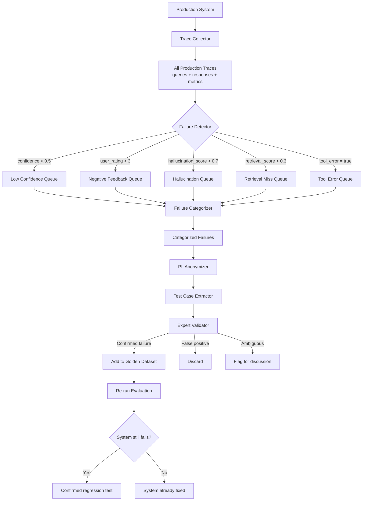
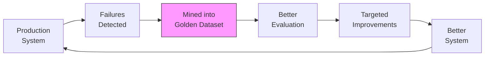

# Production Failure Mining

## The Best Golden Dataset Examples Come from REAL Failures

Here's a counterintuitive truth: your most valuable test cases aren't the ones an expert imagines — they're the ones that actually broke your system in production.

Synthetic test cases test what you *think* might go wrong. Production failures test what *actually* goes wrong. The overlap is surprisingly small.

## What Is Failure Mining?

Failure mining is the systematic process of:
1. Detecting failures in production
2. Extracting the failing input + context
3. Determining the correct answer
4. Adding it to your golden dataset

It turns every production failure into a permanent regression test.

## Sources of Failures

### 1. Low Confidence Responses

```python
# The model itself signals uncertainty
failure_indicators = {
    "low_confidence": response.confidence < 0.5,
    "hedging_language": any(w in response.text for w in ["I think", "possibly", "not sure", "might be"]),
    "short_response": len(response.text) < 20 and query.expected_detail == "high"
}
```

### 2. User Thumbs-Down Feedback

The most direct signal. When a user explicitly says "this is wrong," you have a confirmed failure.

```python
class FeedbackFailure:
    query: str
    response: str
    user_rating: int  # 1-5, failures = 1 or 2
    user_comment: str  # Optional: "This is completely wrong, the answer is..."
    timestamp: datetime
```

### 3. Hallucination Detections

When your hallucination detector flags a response:

```python
hallucination_signals = {
    "ungrounded_claims": claims_not_in_context(response, retrieved_contexts),
    "contradicts_source": contradicts_retrieved_docs(response, retrieved_contexts),
    "fabricated_entities": entities_not_in_knowledge_base(response),
    "impossible_numbers": numbers_outside_reasonable_range(response)
}
```

### 4. Retrieval Misses

When the retrieval system fails to find relevant context:

```python
retrieval_failures = {
    "no_results": len(retrieved_docs) == 0,
    "low_relevance": max_relevance_score < 0.3,
    "wrong_topic": topic_mismatch(query, retrieved_docs),
    "missing_key_doc": known_relevant_doc_not_retrieved(query)
}
```

### 5. Tool Errors (Agent Systems)

```python
tool_failures = {
    "wrong_tool": agent.selected_tool != expected_tool,
    "wrong_args": agent.tool_args != expected_args,
    "tool_exception": agent.tool_call raised Exception,
    "infinite_loop": agent.steps > max_steps,
    "redundant_calls": agent.same_tool_called_repeatedly
}
```

### 6. Escalations to Human Agents

When the AI system gives up and escalates to a human, that's a failure worth studying.

### 7. Slow Responses (Latency > SLO)

Latency failures often indicate the system took a wasteful path:
- Too many retrieval attempts
- Agent looping
- Unnecessarily large context windows

## The Failure Mining Pipeline



### Step 1: Collect Production Traces

Log EVERYTHING for every request:

```python
@dataclass
class ProductionTrace:
    # Request
    trace_id: str
    timestamp: datetime
    query: str
    user_id: str  # For PII handling later
    session_context: dict
    
    # Retrieval
    retrieved_docs: List[Document]
    retrieval_scores: List[float]
    retrieval_latency_ms: int
    
    # Generation
    response: str
    confidence_score: float
    generation_latency_ms: int
    model_used: str
    tokens_used: int
    
    # Agent (if applicable)
    tool_calls: List[ToolCall]
    reasoning_steps: List[str]
    total_steps: int
    
    # Outcome
    user_rating: Optional[int]
    user_feedback: Optional[str]
    hallucination_score: float
    escalated: bool
    error: Optional[str]
```

### Step 2: Filter Failures

```python
def identify_failures(traces: List[ProductionTrace]) -> List[ProductionTrace]:
    failures = []
    for trace in traces:
        failure_reasons = []
        
        if trace.confidence_score < 0.5:
            failure_reasons.append("low_confidence")
        if trace.user_rating and trace.user_rating <= 2:
            failure_reasons.append("negative_feedback")
        if trace.hallucination_score > 0.7:
            failure_reasons.append("hallucination")
        if not trace.retrieved_docs or max(trace.retrieval_scores, default=0) < 0.3:
            failure_reasons.append("retrieval_miss")
        if trace.error:
            failure_reasons.append("error")
        if trace.escalated:
            failure_reasons.append("escalated")
        if trace.total_steps and trace.total_steps > 10:
            failure_reasons.append("agent_loop")
        
        if failure_reasons:
            trace.failure_reasons = failure_reasons
            failures.append(trace)
    
    return failures
```

### Step 3: Categorize

```python
FAILURE_CATEGORIES = {
    "retrieval_failure": "System couldn't find relevant information",
    "generation_failure": "System found info but generated wrong answer",
    "hallucination": "System generated claims not in source material",
    "tool_failure": "Agent used wrong tool or wrong arguments",
    "reasoning_failure": "Agent's reasoning chain was flawed",
    "coverage_gap": "Question about topic not in knowledge base",
    "ambiguity_failure": "Ambiguous query handled incorrectly",
    "format_failure": "Correct content but wrong format/structure"
}

def categorize_failure(trace: ProductionTrace) -> str:
    if "retrieval_miss" in trace.failure_reasons:
        if topic_in_knowledge_base(trace.query):
            return "retrieval_failure"
        else:
            return "coverage_gap"
    elif "hallucination" in trace.failure_reasons:
        return "hallucination"
    elif "error" in trace.failure_reasons and trace.tool_calls:
        return "tool_failure"
    else:
        return "generation_failure"
```

### Step 4: Extract Test Case

```python
def extract_test_case(trace: ProductionTrace, category: str) -> dict:
    """Convert a production failure into a golden dataset test case."""
    
    # Anonymize PII
    anonymized_query = anonymize(trace.query)
    
    test_case = {
        "id": f"mined-{trace.trace_id[:8]}",
        "source": "production_failure_mining",
        "mined_at": datetime.now().isoformat(),
        "original_trace_id": trace.trace_id,
        "query": anonymized_query,
        "failure_category": category,
        "failure_reasons": trace.failure_reasons,
        "incorrect_response": trace.response,  # What the system said (wrong)
        "expected_answer": None,  # TO BE FILLED BY EXPERT
        "relevant_context": None,  # TO BE FILLED BY EXPERT
        "difficulty": "hard",  # Mined failures are typically hard
        "notes": f"System confidence was {trace.confidence_score:.2f}. Category: {category}"
    }
    
    return test_case
```

### Step 5: Expert Validates

An expert reviews each mined case:

```
┌─────────────────────────────────────────────────────────┐
│ FAILURE REVIEW: mined-a3f8b2c1                          │
│                                                         │
│ Query: "What's the cancellation fee for monthly plans?" │
│                                                         │
│ System response: "The cancellation fee is $50."         │
│ Confidence: 0.35                                        │
│ Category: generation_failure                            │
│                                                         │
│ Retrieved context:                                      │
│ "Monthly plans have no cancellation fee. Annual plans   │
│  have a $50 early termination fee."                     │
│                                                         │
│ ─────────────────────────────────────────────────────── │
│ Expert assessment:                                      │
│ [x] Confirmed failure (system was wrong)                │
│ [ ] False positive (system was actually correct)        │
│ [ ] Ambiguous (multiple valid answers)                  │
│                                                         │
│ Correct answer: "Monthly plans have no cancellation     │
│ fee. Only annual plans have a $50 early termination     │
│ fee."                                                   │
│                                                         │
│ Root cause: System confused monthly and annual plan     │
│ policies - likely retrieved the right doc but misread   │
│ which plan the fee applies to.                          │
└─────────────────────────────────────────────────────────┘
```

### Step 6: Add to Golden Dataset

```python
validated_case = {
    "id": "mined-a3f8b2c1",
    "question": "What's the cancellation fee for monthly plans?",
    "relevant_contexts": [
        "Monthly plans have no cancellation fee. Annual plans have a $50 early termination fee."
    ],
    "expected_answer": "Monthly plans have no cancellation fee. Only annual plans have a $50 early termination fee.",
    "difficulty": "hard",
    "category": "policy_lookup",
    "query_type": "factual",
    "source": "failure_mining",
    "failure_type": "generation_failure",
    "notes": "Tests discrimination between similar policies for different plan types"
}
```

### Step 7: Re-run Evaluation

After fixing the system, verify:
- Does the system now pass this test case?
- Did the fix break any other test cases? (regression)

## Automating Failure Detection

### Quality Score Monitoring

```python
class QualityMonitor:
    def __init__(self, window_size=100):
        self.scores = deque(maxlen=window_size)
        self.alert_threshold = 0.1  # 10% drop triggers alert
    
    def add_score(self, score):
        self.scores.append(score)
        
        if len(self.scores) >= self.scores.maxlen:
            recent_avg = mean(list(self.scores)[-20:])
            historical_avg = mean(list(self.scores)[:-20])
            
            if (historical_avg - recent_avg) / historical_avg > self.alert_threshold:
                self.trigger_alert(
                    f"Quality dropped {((historical_avg - recent_avg)/historical_avg)*100:.1f}% "
                    f"from {historical_avg:.3f} to {recent_avg:.3f}"
                )
```

### Anomaly Detection on Query Types

```python
def detect_new_query_patterns(recent_failures, historical_failures):
    """Find failure patterns that are NEW (not seen before)."""
    recent_embeddings = embed(recent_failures)
    historical_embeddings = embed(historical_failures)
    
    # Cluster recent failures
    clusters = cluster(recent_embeddings, min_cluster_size=3)
    
    for cluster in clusters:
        # Check if this cluster is far from any historical cluster
        min_distance = min_distance_to_historical(cluster, historical_embeddings)
        if min_distance > threshold:
            alert(f"New failure pattern detected: {summarize(cluster)}")
```

### Cluster Analysis on Failed Queries

```python
def analyze_failure_clusters(failures, n_clusters=10):
    """Group failures to find systemic issues."""
    embeddings = embed([f.query for f in failures])
    clusters = kmeans(embeddings, n_clusters)
    
    for cluster_id, members in clusters.items():
        print(f"\nCluster {cluster_id} ({len(members)} failures):")
        print(f"  Common topic: {extract_topic(members)}")
        print(f"  Common failure type: {mode([m.failure_category for m in members])}")
        print(f"  Example: {members[0].query}")
        print(f"  → Suggests: {suggest_fix(members)}")
```

## The Failure Flywheel



Each revolution of the flywheel:
1. System runs in production → some queries fail
2. Failures are detected and mined
3. Golden dataset grows with real failure cases
4. Evaluation becomes more realistic
5. Team fixes the specific failure modes
6. System improves
7. Fewer failures occur (but new ones emerge)
8. Those new failures get mined → cycle continues

Over time: golden dataset becomes increasingly representative of real-world difficulty.

## Real Example: 1000 Production Queries → Test Cases

```
Input: 1000 production queries over 1 week

Step 1: Filter failures
├── Low confidence (< 0.5): 83 queries
├── Negative feedback: 31 queries  
├── Hallucination detected: 22 queries
├── Retrieval miss: 45 queries
├── Tool errors: 12 queries
├── Escalated: 8 queries
└── Total unique failures: 127 (some overlap)

Step 2: Deduplicate
├── Remove near-duplicates: -35
└── Unique failures: 92

Step 3: Categorize
├── Retrieval failures: 38
├── Generation failures: 24
├── Hallucinations: 15
├── Coverage gaps: 10
└── Tool failures: 5

Step 4: Extract test cases
├── All 92 converted to test case format
└── PII anonymized

Step 5: Expert validation
├── Confirmed failures: 67
├── False positives: 15 (system was actually right)
├── Ambiguous: 10 (no clear correct answer)
└── Validated test cases: 67

Step 6: Quality filter
├── Clear correct answer exists: 52
├── Sufficient context available: 48
└── Final test cases added to golden dataset: 48

Result: 1000 queries → 48 new golden dataset examples (4.8% yield)
```

## Failure Mining Cadence

| Team Size | Mining Frequency | Expected Yield |
|-----------|-----------------|----------------|
| Small (< 5) | Weekly batch | 10-20 cases/week |
| Medium (5-15) | Daily automated + weekly review | 20-50 cases/week |
| Large (15+) | Continuous pipeline | 50-100 cases/week |

## Cost-Benefit Analysis

```
Cost of mining 50 test cases:
- Automated pipeline: ~$5 (compute)
- Expert validation: ~5 hours × $100/hr = $500
- Total: ~$550

Value of 50 mined test cases:
- Catches regressions that would affect ~5% of users
- At 10,000 daily queries: 500 failed queries/day prevented
- At $2/failed query cost (support, churn): $1,000/day saved
- ROI: 182x in first day alone
```

Failure mining is one of the highest-ROI activities in AI system quality.

---

*Next: [05-dataset-versioning.md](./05-dataset-versioning.md) — How to version and manage golden datasets over time*
