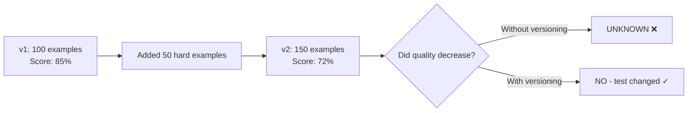
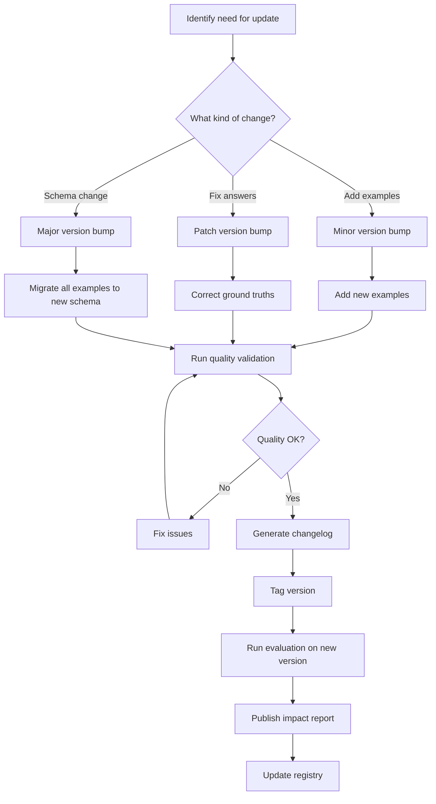

# Dataset Versioning

## Why Version Your Datasets

You version your code. You version your APIs. You version your models. **You must version your golden datasets.**

The reason is simple: if you change your golden dataset and don't version it, all past evaluation results become meaningless. You can't compare today's score to last month's score if the test changed.

```
March: System scores 85% on golden dataset
April: Add 50 hard examples to golden dataset  
April: System scores 72% on golden dataset

Did the system get worse? NO. The test got harder.
Without versioning, you can't tell the difference.
```

## The Problem



## Versioning Strategies

### Strategy 1: Append-Only

Never delete or modify existing examples. Only add new ones.

```
golden-dataset-v1.0.0.json  →  100 examples
golden-dataset-v1.1.0.json  →  150 examples (original 100 + 50 new)
golden-dataset-v1.2.0.json  →  180 examples (previous 150 + 30 new)
```

**Pros**: Complete history, can always re-evaluate on old version
**Cons**: Can't fix wrong answers without a new major version

### Strategy 2: Semantic Versioning

Apply semver to datasets:

| Change Type | Version Bump | Example |
|-------------|-------------|---------|
| Add examples (same schema) | Minor (1.0→1.1) | Added 50 new questions |
| Fix incorrect answers | Patch (1.0.0→1.0.1) | Fixed 3 wrong ground truths |
| Change schema | Major (1.x→2.0) | Added "difficulty" field |
| Remove examples | Minor (1.0→1.1) | Removed 10 duplicates |
| Rebalance distribution | Minor | Changed difficulty ratios |

```
v1.0.0 - Initial golden dataset (100 examples)
v1.0.1 - Fixed 3 incorrect ground truth answers
v1.1.0 - Added 50 examples from failure mining
v1.2.0 - Added 30 edge case examples
v2.0.0 - Schema change: added "reasoning_required" field
v2.1.0 - Added 40 reasoning-heavy examples
```

### Strategy 3: Time-Stamped Snapshots

```
golden-dataset-2024-01-15.json
golden-dataset-2024-02-01.json
golden-dataset-2024-03-01.json
```

**Pros**: Simple, clear timeline
**Cons**: No semantic meaning to changes, harder to track what changed

### Recommended: Semantic Versioning + Timestamps

```json
{
  "dataset_name": "rag-golden",
  "version": "2.1.0",
  "created_at": "2024-03-01T10:00:00Z",
  "schema_version": "2.0",
  "example_count": 220,
  "changelog": "Added 40 reasoning examples from February failure mining"
}
```

## Tools and Storage

### Option 1: JSON + Git (Simple, works for < 10K examples)

```bash
golden-datasets/
├── .git/
├── rag-golden/
│   ├── dataset.json
│   ├── schema.json
│   └── metadata.json
├── agent-golden/
│   ├── dataset.json
│   └── schema.json
└── CHANGELOG.md
```

Tag versions: `git tag rag-golden-v2.1.0`

### Option 2: Git-LFS (For larger datasets)

```bash
# Track large JSON files with LFS
git lfs track "*.json"
git lfs track "*.jsonl"

# Same workflow as git, but large files stored efficiently
git add golden-dataset.json
git commit -m "v2.1.0: Add 40 reasoning examples"
git tag golden-v2.1.0
```

### Option 3: DVC (Data Version Control)

```bash
# Initialize DVC
dvc init

# Track dataset
dvc add golden-dataset.json

# Push to remote storage (S3, GCS, Azure Blob)
dvc push

# Tag version
git add golden-dataset.json.dvc
git commit -m "v2.1.0"
git tag golden-v2.1.0
```

### Option 4: Dataset Registry (Enterprise)

```python
class DatasetRegistry:
    def register(self, dataset, version, metadata):
        """Register a new dataset version."""
        record = {
            "name": dataset.name,
            "version": version,
            "storage_path": f"s3://datasets/{dataset.name}/{version}/data.json",
            "metadata": metadata,
            "registered_at": datetime.now(),
            "registered_by": current_user()
        }
        self.db.insert(record)
        self.upload(dataset, record["storage_path"])
    
    def load(self, name, version="latest"):
        """Load a specific version of a dataset."""
        record = self.db.find(name=name, version=version)
        return self.download(record["storage_path"])
    
    def list_versions(self, name):
        """List all versions of a dataset."""
        return self.db.find_all(name=name, order_by="version")
```

## Dataset Registry Schema

```json
{
  "registry_entry": {
    "name": "rag-golden",
    "version": "2.1.0",
    "description": "Golden dataset for RAG system evaluation, covering policy, technical, and billing queries",
    "created_by": "evaluation-team@company.com",
    "created_at": "2024-03-01T10:00:00Z",
    "schema_version": "2.0",
    
    "statistics": {
      "total_examples": 220,
      "categories": {"policy": 55, "technical": 70, "billing": 50, "edge_cases": 45},
      "difficulty": {"easy": 66, "medium": 88, "hard": 66},
      "query_types": {"factual": 100, "reasoning": 60, "comparison": 35, "unanswerable": 25}
    },
    
    "quality": {
      "inter_annotator_agreement": 0.84,
      "answer_validity_rate": 0.97,
      "last_validated": "2024-02-28",
      "validators": ["expert1@company.com", "expert2@company.com"]
    },
    
    "lineage": {
      "derived_from": "rag-golden-v2.0.0",
      "additions_source": "february_failure_mining",
      "additions_count": 40,
      "removals_count": 0,
      "modifications_count": 2
    },
    
    "storage": {
      "format": "jsonl",
      "size_bytes": 524288,
      "path": "s3://ml-datasets/golden/rag-golden/v2.1.0/dataset.jsonl",
      "checksum": "sha256:abc123..."
    }
  }
}
```

## Comparison Across Versions

### What Changed?

```python
def dataset_diff(v1_path, v2_path):
    """Compare two dataset versions."""
    v1 = load_dataset(v1_path)
    v2 = load_dataset(v2_path)
    
    v1_ids = {ex["id"] for ex in v1}
    v2_ids = {ex["id"] for ex in v2}
    
    added = v2_ids - v1_ids
    removed = v1_ids - v2_ids
    common = v1_ids & v2_ids
    
    # Check for modifications in common examples
    modified = []
    for id in common:
        ex1 = next(e for e in v1 if e["id"] == id)
        ex2 = next(e for e in v2 if e["id"] == id)
        if ex1 != ex2:
            modified.append({"id": id, "changes": diff(ex1, ex2)})
    
    return {
        "added": len(added),
        "removed": len(removed),
        "modified": len(modified),
        "unchanged": len(common) - len(modified),
        "details": {"added_ids": added, "removed_ids": removed, "modified": modified}
    }
```

### Impact on Evaluation Scores

```python
def version_impact_analysis(system, v1_dataset, v2_dataset):
    """Measure how dataset version change affects scores."""
    score_v1 = evaluate(system, v1_dataset)
    score_v2 = evaluate(system, v2_dataset)
    
    # Evaluate on just the new examples
    new_examples = [ex for ex in v2_dataset if ex["id"] not in {e["id"] for e in v1_dataset}]
    score_new = evaluate(system, new_examples) if new_examples else None
    
    return {
        "score_on_v1": score_v1,
        "score_on_v2": score_v2,
        "delta": score_v2 - score_v1,
        "score_on_new_examples": score_new,
        "interpretation": interpret_delta(score_v1, score_v2, score_new)
    }

def interpret_delta(v1_score, v2_score, new_score):
    if v2_score < v1_score and new_score and new_score < v1_score:
        return "Score dropped because new examples are harder (dataset got more challenging)"
    elif v2_score < v1_score and (new_score is None or new_score >= v1_score):
        return "Score dropped on existing examples - possible regression"
    else:
        return "Score stable or improved"
```

## Dataset Versioning Workflow



## Changelog Best Practices

```markdown
# Golden Dataset Changelog

## [2.1.0] - 2024-03-01
### Added
- 40 reasoning examples from February failure mining
- 15 multi-hop questions requiring 2+ document synthesis

### Changed  
- Updated 2 ground truth answers (pricing changed in Feb)

### Quality
- IAA: 0.84 (up from 0.82)
- New examples validated by: expert1, expert2

## [2.0.0] - 2024-02-01
### Breaking
- Schema change: added "reasoning_required" boolean field
- All existing examples migrated (reasoning_required=false by default)

### Added
- 30 examples with explicit reasoning requirements
```

## Key Principles

1. **Never compare scores across different dataset versions** without noting the version
2. **Always re-run baseline** when you release a new dataset version
3. **Keep old versions accessible** — you may need to re-evaluate historical results
4. **Document WHY** examples were added/removed/changed
5. **Automate versioning** — make it part of your CI/CD for datasets

---

*Next: [06-dataset-quality-validation.md](./06-dataset-quality-validation.md) — Ensuring your golden dataset is actually golden*
