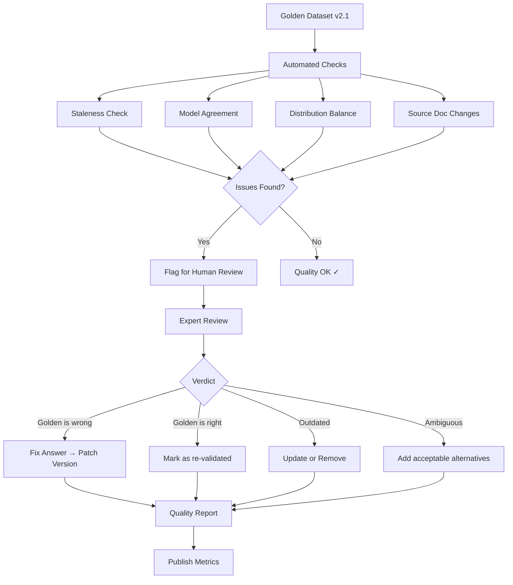

# Dataset Quality Validation

## The Meta-Problem

Your golden dataset is the ground truth against which everything else is measured. But what measures the golden dataset itself? **Who watches the watchmen?**

A golden dataset with incorrect answers is worse than no golden dataset — it gives you false confidence. You think you're measuring quality, but you're measuring against a broken ruler.

## Quality Dimensions

### 1. Correctness

Are the ground truth answers actually correct?

```python
# Signals of correctness issues:
correctness_red_flags = [
    "Multiple top models consistently disagree with golden answer",
    "Domain expert finds error during review",
    "Source document was updated but golden answer wasn't",
    "Golden answer contradicts other golden answers in the set"
]
```

### 2. Consistency

Do similar questions have similar expected answers? Are formatting conventions consistent?

```python
# Inconsistency examples:
inconsistent_pair = {
    "example_1": {"q": "What's the free tier limit?", "a": "100 requests/day"},
    "example_2": {"q": "How many requests on free tier?", "a": "The limit is 100 API calls per 24 hours"},
    # Same fact, different format/wording — is this intentional?
}
```

### 3. Coverage

Does the golden dataset cover the full distribution of real queries?

```python
def coverage_score(golden_dataset, production_queries_sample):
    """Measure what % of real query types are represented."""
    production_topics = cluster_topics(production_queries_sample)
    golden_topics = cluster_topics([ex["question"] for ex in golden_dataset])
    
    covered = 0
    for topic in production_topics:
        if nearest_neighbor_distance(topic, golden_topics) < threshold:
            covered += 1
    
    return covered / len(production_topics)
```

### 4. Balance

Is any category over/under-represented?

```python
def balance_score(golden_dataset):
    """Check distribution across categories."""
    categories = Counter(ex["category"] for ex in golden_dataset)
    total = sum(categories.values())
    
    # Chi-square test against expected distribution
    expected = {cat: total * weight for cat, weight in TARGET_DISTRIBUTION.items()}
    chi_sq = sum((categories[c] - expected[c])**2 / expected[c] for c in expected)
    
    return {"chi_square": chi_sq, "distribution": categories, "expected": expected}
```

### 5. Difficulty Distribution

```
Target:  Easy 30% | Medium 40% | Hard 30%
Actual:  Easy 60% | Medium 30% | Hard 10%  ← Problem: not testing hard cases
```

### 6. Freshness

Do answers reflect the current state of knowledge?

```python
def freshness_score(golden_dataset):
    """What % of answers have been verified recently?"""
    now = datetime.now()
    fresh_count = sum(
        1 for ex in golden_dataset
        if (now - parse_date(ex["validated_at"])).days <= 90
    )
    return fresh_count / len(golden_dataset)
```

## Validation Techniques

### 1. Expert Review (Random Sample)

```python
def expert_review_protocol(golden_dataset, sample_rate=0.10):
    """Sample 10% for expert re-validation."""
    sample = random.sample(golden_dataset, int(len(golden_dataset) * sample_rate))
    
    review_results = []
    for example in sample:
        result = {
            "id": example["id"],
            "reviewer": assigned_expert,
            "verdict": None,  # correct / incorrect / outdated / ambiguous
            "corrected_answer": None,
            "notes": None
        }
        review_results.append(result)
    
    # Compute validity rate
    valid = sum(1 for r in review_results if r["verdict"] == "correct")
    validity_rate = valid / len(review_results)
    
    # Extrapolate: if 10% sample has 5% errors, expect ~5% errors in full set
    estimated_errors = int((1 - validity_rate) * len(golden_dataset))
    
    return {
        "sample_size": len(sample),
        "validity_rate": validity_rate,
        "estimated_total_errors": estimated_errors,
        "flagged_for_correction": [r for r in review_results if r["verdict"] != "correct"]
    }
```

### 2. Cross-Validation (Internal Consistency)

Split the dataset and check if evaluation scores are consistent across splits:

```python
def cross_validation_check(golden_dataset, system, n_splits=5):
    """If scores vary wildly across splits, dataset may have quality issues."""
    splits = k_fold_split(golden_dataset, n_splits)
    scores = [evaluate(system, split) for split in splits]
    
    score_std = std(scores)
    score_mean = mean(scores)
    cv = score_std / score_mean  # Coefficient of variation
    
    if cv > 0.15:  # >15% variation across splits
        # Find which split has outlier score
        outlier_splits = [i for i, s in enumerate(scores) if abs(s - score_mean) > 2 * score_std]
        return {"status": "WARNING", "cv": cv, "outlier_splits": outlier_splits}
    
    return {"status": "OK", "cv": cv}
```

### 3. Model Agreement Check

If 3+ different strong models ALL disagree with the golden answer, the golden answer might be wrong:

```python
def model_agreement_validation(golden_dataset, models=["gpt-4", "claude-3", "gemini"]):
    """Flag examples where all models disagree with golden answer."""
    suspicious = []
    
    for example in golden_dataset:
        model_answers = {m: run_model(m, example["question"]) for m in models}
        
        # Check if any model agrees with golden
        agreements = sum(
            1 for ans in model_answers.values()
            if semantic_similarity(ans, example["expected_answer"]) > 0.8
        )
        
        if agreements == 0:  # No model agrees with golden
            suspicious.append({
                "id": example["id"],
                "golden_answer": example["expected_answer"],
                "model_answers": model_answers,
                "action": "REVIEW - all models disagree with golden answer"
            })
    
    return suspicious
```

### 4. Temporal Validation

```python
def temporal_validation(golden_dataset, knowledge_base):
    """Check if golden answers are still accurate given current knowledge."""
    outdated = []
    
    for example in golden_dataset:
        # Find current version of source documents
        current_sources = knowledge_base.get_current(example.get("source_docs", []))
        
        for source in current_sources:
            if source.last_modified > parse_date(example["validated_at"]):
                # Source was updated after golden answer was validated
                outdated.append({
                    "id": example["id"],
                    "answer_validated": example["validated_at"],
                    "source_updated": source.last_modified,
                    "action": "RE-VALIDATE - source document changed"
                })
    
    return outdated
```

## Quality Metrics

### Inter-Annotator Agreement (IAA)

Target: Kappa > 0.8 for production datasets.

```python
def compute_iaa(annotations_1, annotations_2):
    """Cohen's Kappa for two annotators."""
    assert len(annotations_1) == len(annotations_2)
    n = len(annotations_1)
    
    # Observed agreement
    po = sum(1 for a, b in zip(annotations_1, annotations_2) if a == b) / n
    
    # Expected agreement by chance
    labels = set(annotations_1 + annotations_2)
    pe = sum(
        (annotations_1.count(l) / n) * (annotations_2.count(l) / n)
        for l in labels
    )
    
    kappa = (po - pe) / (1 - pe) if pe < 1 else 1.0
    return kappa
```

| Kappa | Interpretation | Action |
|-------|---------------|--------|
| > 0.8 | Excellent | Dataset ready for production |
| 0.6 - 0.8 | Good | Acceptable, resolve disagreements |
| 0.4 - 0.6 | Moderate | Needs work, clarify guidelines |
| < 0.4 | Poor | Redesign annotation process |

### Answer Validity Rate

```
Target: > 95% of golden answers confirmed correct on re-review
```

### Coverage Score

```
Target: > 80% of production query types represented in golden dataset
```

### Freshness Score

```
Target: > 90% of answers verified within last 90 days
```

## The Quality Review Process

### Quarterly Review Cycle

```
Month 1, Week 1:
├── Run automated staleness detection
├── Run model agreement validation
└── Flag examples for human review

Month 1, Week 2-3:
├── Expert reviews flagged examples
├── Expert reviews random 10% sample
└── Document findings

Month 1, Week 4:
├── Fix confirmed errors (patch version)
├── Remove outdated examples
├── Plan additions for gaps found
└── Publish quality report
```

### Automated Staleness Detection

```python
def staleness_check(golden_dataset, max_age_days=90):
    """Run weekly: flag examples not validated recently."""
    now = datetime.now()
    stale = []
    
    for example in golden_dataset:
        age = (now - parse_date(example["validated_at"])).days
        if age > max_age_days:
            stale.append({
                "id": example["id"],
                "age_days": age,
                "last_validated": example["validated_at"],
                "priority": "high" if age > 180 else "medium"
            })
    
    if stale:
        alert(f"{len(stale)} examples are stale (>{max_age_days} days since validation)")
    
    return sorted(stale, key=lambda x: x["age_days"], reverse=True)
```

### Expert Re-Validation of Contested Examples

When a system "fails" on a golden example but the failure seems suspicious:

```python
def contest_golden_answer(example_id, system_answer, reason):
    """Allow teams to contest golden answers they believe are wrong."""
    contest = {
        "example_id": example_id,
        "contested_by": current_user(),
        "system_answer": system_answer,
        "reason": reason,
        "status": "pending_review"
    }
    
    # Assign to expert for adjudication
    # Expert decides: golden answer correct OR system answer correct OR both valid
    return contest
```

## Quality Validation Pipeline



## Quality Report Template

```markdown
# Golden Dataset Quality Report
## Dataset: rag-golden v2.1.0 | Date: 2024-03-15

### Summary
| Metric | Value | Target | Status |
|--------|-------|--------|--------|
| Total examples | 220 | 200+ | ✅ |
| IAA (Kappa) | 0.84 | > 0.8 | ✅ |
| Answer validity | 96% | > 95% | ✅ |
| Coverage | 82% | > 80% | ✅ |
| Freshness | 91% | > 90% | ✅ |
| Balance (χ²) | 4.2 | < 10 | ✅ |

### Issues Found
- 8 examples flagged stale (> 90 days)
- 2 examples where all 3 models disagree with golden
- 1 source document updated since validation

### Actions Taken
- Re-validated 8 stale examples (7 confirmed, 1 updated)
- Reviewed 2 contested examples (1 golden was wrong → fixed)
- Re-validated 1 example against updated source (answer unchanged)

### Distribution
- Easy: 31% | Medium: 39% | Hard: 30% ← On target
- Topics: policy 25%, technical 32%, billing 23%, edge 20% ← Acceptable
```

## Anti-Patterns to Avoid

1. **Never validating after initial creation** — answers go stale
2. **Only one annotator** — no way to measure reliability
3. **Accepting LLM output as ground truth** — defeats the purpose
4. **Ignoring model disagreement signals** — models disagreeing is a useful signal
5. **Letting dataset grow without quality checks** — bigger != better if quality degrades

---

*This concludes the concept files for Golden Dataset Engineering. See the `programs/` directory for hands-on implementations.*
