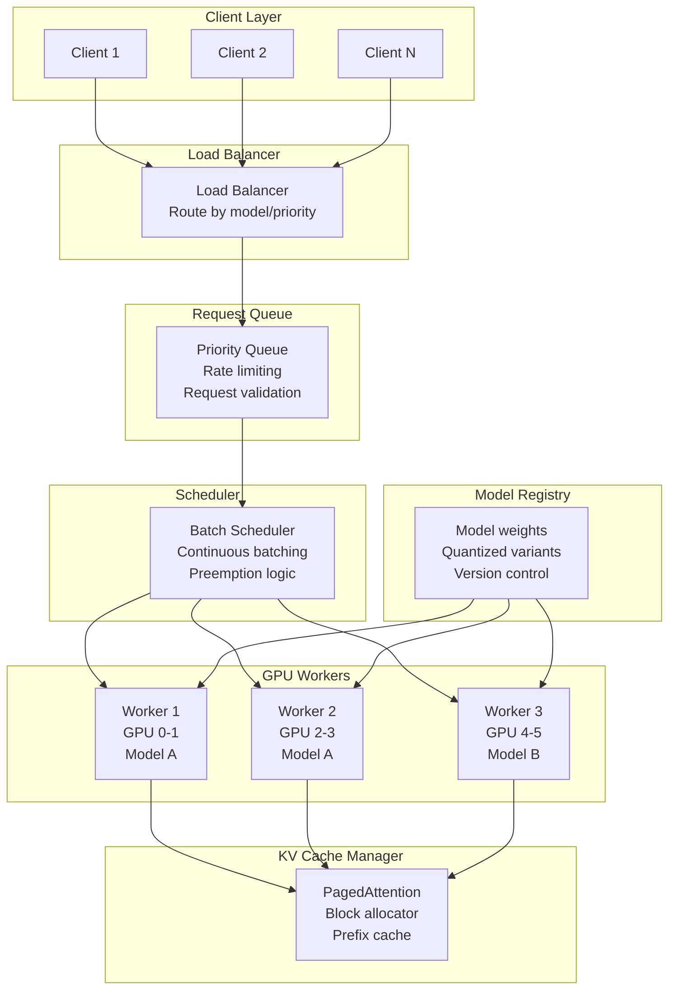

# Model Serving Fundamentals

## The "Restaurant Kitchen" Analogy

Model serving is like running a restaurant kitchen:
- **Orders come in** (user prompts/requests)
- **Kitchen processes them** (GPU runs inference)
- **Meals go out** (generated responses)

The challenge: your kitchen (GPU) is EXTREMELY expensive ($5-8/hr for an H100).
You must keep it busy every second, serving as many orders as possible,
while keeping wait times acceptable.

A poorly-run kitchen: one chef handling one order at a time, idle between steps.
A well-run kitchen: multiple orders in flight, chefs never idle, continuous output.

---

## How LLM Inference Works at a Low Level

LLM inference has TWO distinct phases. Understanding this is critical for optimization.

### Phase 1: Prefill (Processing the Input)

```
Input: "What is the capital of France?"
       [tok1] [tok2] [tok3] [tok4] [tok5] [tok6]

Prefill processes ALL input tokens IN PARALLEL:
┌─────────────────────────────────────────────┐
│  GPU processes tok1, tok2, tok3, tok4, tok5, │
│  tok6 simultaneously in one forward pass     │
└─────────────────────────────────────────────┘
```

**Characteristics:**
- All input tokens processed in ONE forward pass
- Highly parallelizable (GPU loves this - massive matrix multiplications)
- **Compute-bound**: limited by GPU FLOPS (computation speed)
- Time scales sub-linearly with input length (thanks to parallelism)
- Produces KV cache entries for all input tokens

### Phase 2: Decode (Generating the Output)

```
Generate: "The" → "capital" → "of" → "France" → "is" → "Paris" → "."

Each token requires a SEPARATE forward pass:
Step 1: [all input + "The"]           → predict "capital"
Step 2: [all input + "The capital"]   → predict "of"
Step 3: [all input + "The capital of"] → predict "France"
...
```

**Characteristics:**
- Generates ONE token per forward pass
- Sequential: each token depends on all previous tokens
- **Memory-bound**: limited by GPU memory bandwidth (reading model weights)
- GPU is underutilized (reading weights for just 1 token computation)
- This is why decode is SLOW relative to prefill

### Why Prefill is Fast but Decode is Slow

```
Prefill:  Process 1000 tokens → 1 forward pass  → ~50ms
Decode:   Generate 100 tokens → 100 forward passes → ~2000ms

The GPU during prefill: 80%+ utilization (doing heavy math)
The GPU during decode:  10-30% utilization (mostly reading memory)
```

The fundamental issue: during decode, the GPU reads the ENTIRE model (billions of params)
from memory just to produce a single token. The computation-to-memory ratio is terrible.

---

## Key Metrics for Model Serving

### Time to First Token (TTFT)

```
User sends request ──────────────── First token appears
                    ↑ TTFT ↑

TTFT = network_latency + queue_wait + prefill_time
```

- **Good**: < 200ms (feels instant)
- **Acceptable**: 200-500ms (slight pause)
- **Poor**: > 1s (user notices delay)
- **Dominated by**: prefill time for long inputs, queue wait under load

### Tokens Per Second (Throughput)

```
Total tokens generated across ALL requests per second.

Server throughput = tokens_per_request × concurrent_requests / avg_latency
```

- **Per-request**: 30-100 tokens/sec (user-facing)
- **Server-wide**: 1000-50000 tokens/sec (depends on batching + hardware)
- **Why it matters**: directly determines cost-per-token

### Inter-Token Latency (ITL)

```
Token N generated ──── Token N+1 generated
                  ↑ ITL ↑
```

- **Good**: < 30ms (feels like streaming)
- **Acceptable**: 30-80ms (readable streaming)
- **Poor**: > 100ms (choppy, frustrating)
- **Human reading speed**: ~250 words/min ≈ ~5 tokens/sec ≈ 200ms between tokens

### Requests Per Second (QPS)

```
Total requests the system can handle per second.
QPS = concurrent_requests / avg_request_duration
```

### GPU Utilization

```
Percentage of GPU compute being used.
- Idle GPU: 0% (wasting $5-8/hr)
- Single request decode: 10-30%
- Well-batched serving: 70-90%
- Prefill phase: 80-95%
```

---

## Model Serving Frameworks Comparison

### vLLM

- **Key innovation**: PagedAttention (virtual memory for KV cache)
- **Features**: Continuous batching, prefix caching, tensor parallelism
- **Best for**: Production serving with high throughput requirements
- **Language**: Python (with C++/CUDA kernels)
- **Deployment**: Docker, Kubernetes, direct

### TGI (Text Generation Inference)

- **By**: HuggingFace
- **Features**: Flash attention, quantization, streaming
- **Best for**: Quick deployment of HuggingFace models
- **Language**: Rust + Python
- **Deployment**: Docker (official HF containers)

### TensorRT-LLM

- **By**: NVIDIA
- **Features**: Kernel fusion, INT4/INT8, in-flight batching
- **Best for**: Maximum performance on NVIDIA GPUs
- **Language**: C++ with Python bindings
- **Deployment**: Triton Inference Server

### Ray Serve

- **By**: Anyscale
- **Features**: Model composition, autoscaling, multi-model
- **Best for**: Complex pipelines, multi-model serving
- **Language**: Python
- **Deployment**: Ray cluster, Kubernetes

### Triton Inference Server

- **By**: NVIDIA
- **Features**: Multi-framework, ensemble, dynamic batching
- **Best for**: Mixed model types (not just LLMs)
- **Language**: C++ with client libraries
- **Deployment**: Docker, Kubernetes

### Ollama

- **By**: Community
- **Features**: Simple CLI, GGUF models, easy model management
- **Best for**: Local development, experimentation
- **Language**: Go + llama.cpp
- **Deployment**: Local binary, Docker

### Comparison Table

| Framework | Throughput | Latency | Ease of Deploy | Multi-GPU | Quantization | Production-Ready |
|-----------|-----------|---------|---------------|-----------|-------------|-----------------|
| vLLM | ★★★★★ | ★★★★ | ★★★★ | ★★★★★ | ★★★★ | ★★★★★ |
| TGI | ★★★★ | ★★★★ | ★★★★★ | ★★★★ | ★★★★ | ★★★★ |
| TensorRT-LLM | ★★★★★ | ★★★★★ | ★★ | ★★★★★ | ★★★★★ | ★★★★ |
| Ray Serve | ★★★ | ★★★ | ★★★ | ★★★★★ | ★★★ | ★★★★ |
| Triton | ★★★★ | ★★★★ | ★★ | ★★★★★ | ★★★★ | ★★★★★ |
| Ollama | ★★ | ★★★ | ★★★★★ | ★ | ★★★★ | ★★ |

---

## Hardware Requirements by Model Size

### Memory Calculation

```
Model memory (FP16) = num_parameters × 2 bytes
Model memory (INT8) = num_parameters × 1 byte
Model memory (INT4) = num_parameters × 0.5 bytes

Total GPU memory needed = model_weights + KV_cache + activation_memory + overhead
```

### Requirements Table

| Model Size | FP16 Memory | Min GPU Config | Recommended Config |
|-----------|-------------|----------------|-------------------|
| 7B | 14 GB | 1x RTX 4090 (24GB) | 1x A100-40GB |
| 13B | 26 GB | 1x A100-40GB | 1x A100-80GB |
| 34B | 68 GB | 1x A100-80GB | 2x A100-40GB |
| 70B | 140 GB | 2x A100-80GB | 4x A100-40GB |
| 180B | 360 GB | 5x A100-80GB | 8x A100-80GB |
| 405B | 810 GB | 10x A100-80GB | 16x A100-80GB |

**Note**: These are MINIMUM for model weights only. Production needs 2-3x more for KV cache and batching.

### GPU Memory Breakdown (70B model, production)

```
Model weights (FP16):     140 GB
KV cache (32 concurrent):  40 GB  (varies with context length)
Activation memory:          5 GB
Framework overhead:         5 GB
─────────────────────────────────
Total needed:             190 GB → 3x A100-80GB minimum
```

---

## Architecture Diagram



---

## Quick Start: Serving a Model with vLLM

```bash
# Install
pip install vllm

# Serve a 7B model
python -m vllm.entrypoints.openai.api_server \
    --model meta-llama/Llama-2-7b-chat-hf \
    --tensor-parallel-size 1 \
    --max-model-len 4096 \
    --gpu-memory-utilization 0.9

# Query it (OpenAI-compatible API)
curl http://localhost:8000/v1/completions \
    -H "Content-Type: application/json" \
    -d '{"model": "meta-llama/Llama-2-7b-chat-hf", "prompt": "Hello", "max_tokens": 50}'
```

---

## Key Takeaways

1. **Prefill is compute-bound, decode is memory-bound** - different optimization strategies needed
2. **GPU utilization is everything** - an idle GPU is burning money
3. **Batching is the #1 lever** - goes from 10% to 80%+ utilization
4. **KV cache is the main memory bottleneck** - limits concurrency
5. **Choose framework based on your needs** - vLLM for most production, TensorRT-LLM for max perf
6. **Model size determines hardware** - plan GPU budget before choosing model
