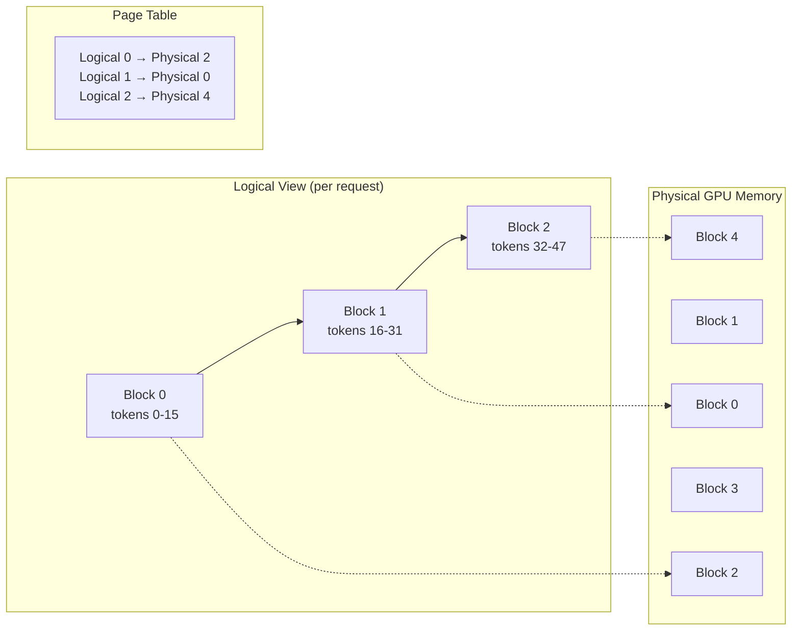
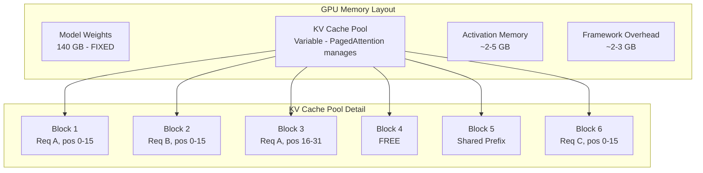

# KV Cache Deep Dive

## What is the KV Cache?

The KV cache is the **"memory of what the model has already read."**

Think of it like reading a book: without KV cache, every time you want to understand the next word,
you'd have to re-read the ENTIRE book from page 1. With KV cache, you remember what you've already
read and only need to look at the new word.

---

## The Problem: Why We Need KV Cache

### Without KV Cache (Naive Approach)

```
Generating "The capital of France is Paris."

Step 1: Process ["The"]                                    → predict "capital"
Step 2: Process ["The", "capital"]                         → predict "of"
Step 3: Process ["The", "capital", "of"]                   → predict "France"
Step 4: Process ["The", "capital", "of", "France"]         → predict "is"
Step 5: Process ["The", "capital", "of", "France", "is"]   → predict "Paris"

Total attention computations: 1 + 2 + 3 + 4 + 5 = 15 (O(n²))
```

Every step re-processes ALL previous tokens through attention. For a 1000-token generation,
that's 500,000 redundant attention computations!

### With KV Cache

```
Step 1: Process ["The"], STORE K,V for "The"              → predict "capital"
Step 2: Process ["capital"], REUSE K,V for "The"          → predict "of"
Step 3: Process ["of"], REUSE K,V for "The","capital"     → predict "France"
Step 4: Process ["France"], REUSE K,V for all previous    → predict "is"
Step 5: Process ["is"], REUSE K,V for all previous        → predict "Paris"

New computations per step: 1 (only the new token!) → O(n) total
```

**Speedup: from O(n²) to O(n) - the difference between 10 seconds and 0.02 seconds for long sequences.**

---

## How KV Cache Works (Technical Detail)

### Transformer Attention Refresher

In each attention layer, for each token:
```
Q (Query)  = token_embedding × W_q   → "What am I looking for?"
K (Key)    = token_embedding × W_k   → "What do I contain?"
V (Value)  = token_embedding × W_v   → "What information do I provide?"

Attention(Q, K, V) = softmax(Q × K^T / √d) × V
```

### During Prefill Phase

```
Input: "What is the capital of France?"
       [tok1, tok2, tok3, tok4, tok5, tok6]

For EACH layer (e.g., 80 layers in Llama-70B):
  Compute K1, K2, K3, K4, K5, K6  (keys for all tokens)
  Compute V1, V2, V3, V4, V5, V6  (values for all tokens)
  Store in KV cache: [(K1,V1), (K2,V2), ..., (K6,V6)]
  
  Compute attention using all Q, K, V together (parallel!)
```

### During Decode Phase

```
Generating token 7 ("The"):

For EACH layer:
  Compute K7, V7 (key and value for NEW token only)
  Append to cache: [(K1,V1), ..., (K6,V6), (K7,V7)]
  
  Compute Q7 (query for new token)
  Attention = softmax(Q7 × [K1..K7]^T / √d) × [V1..V7]
  
  Only K7, V7 are NEW computation. K1-K6, V1-V6 are READ from cache.
```

---

## KV Cache Memory Calculation

### Formula

```
KV_cache_memory = 2 × num_layers × num_kv_heads × head_dim × seq_len × batch_size × bytes_per_element
                  ↑                 ↑                          ↑          ↑
                  K and V           GQA reduces this           grows!     grows!
```

### Example: Llama-2 70B

```
Parameters:
- num_layers = 80
- num_kv_heads = 8 (GQA: 8 KV heads shared across 64 query heads)
- head_dim = 128
- seq_len = 4096
- batch_size = 1
- bytes_per_element = 2 (FP16)

KV_cache = 2 × 80 × 8 × 128 × 4096 × 1 × 2
         = 2 × 80 × 8 × 128 × 4096 × 2
         = 1,073,741,824 bytes
         = ~1 GB per request (with GQA!)
```

### Example: Llama-2 70B WITHOUT GQA (hypothetical, 64 KV heads)

```
KV_cache = 2 × 80 × 64 × 128 × 4096 × 1 × 2
         = 8,589,934,592 bytes
         = ~8 GB per request!
```

### Scaling with Concurrency

```
┌─────────────────────────────────────────────────────────┐
│ Llama-2 70B (with GQA), 4K context, FP16 KV cache      │
├─────────────────────────────────────────────────────────┤
│ 1 concurrent request:    ~1 GB  KV cache                │
│ 8 concurrent requests:   ~8 GB  KV cache                │
│ 32 concurrent requests: ~32 GB  KV cache                │
│ 64 concurrent requests: ~64 GB  KV cache                │
├─────────────────────────────────────────────────────────┤
│ Model weights (FP16):   140 GB                          │
│ A100-80GB × 2 = 160 GB total                            │
│ Available for KV cache: ~20 GB → max ~20 concurrent!    │
└─────────────────────────────────────────────────────────┘
```

### Longer Context = Much More Memory

| Model | Context | KV per Request | Max Concurrent (on remaining memory) |
|-------|---------|---------------|--------------------------------------|
| Llama-70B | 4K | 1 GB | ~20 |
| Llama-70B | 8K | 2 GB | ~10 |
| Llama-70B | 32K | 8 GB | ~2 |
| Llama-70B | 128K | 32 GB | <1 (need more GPUs!) |

---

## KV Cache Management Strategies

### 1. Static Allocation

```
Pre-allocate max_seq_len × max_batch_size memory upfront.

┌──────────────────────────────────────┐
│ Request 1: "Hi" (2 tokens)           │
│ Allocated: [██░░░░░░░░░░░░░░░░░░]   │  ← 4096 slots allocated
│ Used:      [██]                       │  ← 2 slots used
│ Waste:     4094 slots (99.9%!)        │
└──────────────────────────────────────┘
```

**Problem**: Most requests use far less than max context. 60-80% memory wasted.

### 2. Dynamic Allocation

```
Allocate exact memory needed, grow as sequence extends.

Request 1: "Hi" → allocate 2 slots → grow to 3, 4, 5... as tokens generate
```

**Problem**: Memory fragmentation. Frequent allocation/deallocation creates gaps.

### 3. PagedAttention (vLLM's Breakthrough)

Inspired by **operating system virtual memory paging**.

#### The Idea

Instead of contiguous memory per request, divide KV cache into fixed-size **blocks (pages)**:

```
Physical KV Cache Memory (GPU):
┌────┬────┬────┬────┬────┬────┬────┬────┬────┬────┐
│ B0 │ B1 │ B2 │ B3 │ B4 │ B5 │ B6 │ B7 │ B8 │ B9 │
└────┴────┴────┴────┴────┴────┴────┴────┴────┴────┘

Each block holds KV for 16 tokens (configurable block size).

Request A (45 tokens): needs 3 blocks → assigned B0, B3, B7 (non-contiguous!)
Request B (20 tokens): needs 2 blocks → assigned B1, B4
Request C (10 tokens): needs 1 block  → assigned B2
```

#### Page Table (like OS page table)

```
┌─────────────────────────────────────┐
│ Request A Page Table:               │
│   Logical Block 0 → Physical B0    │
│   Logical Block 1 → Physical B3    │
│   Logical Block 2 → Physical B7    │
├─────────────────────────────────────┤
│ Request B Page Table:               │
│   Logical Block 0 → Physical B1    │
│   Logical Block 1 → Physical B4    │
├─────────────────────────────────────┤
│ Request C Page Table:               │
│   Logical Block 0 → Physical B2    │
└─────────────────────────────────────┘
```

#### Benefits

1. **Near-zero waste**: Only allocate blocks as needed (last block may have some waste)
2. **No fragmentation**: Fixed-size blocks, any free block works
3. **Memory sharing**: Multiple requests can share blocks (prefix caching!)
4. **Efficient**: Waste drops from 60-80% to < 4%



---

## Prefix Caching

### The Observation

In production, 90%+ of requests share the same system prompt:

```
System: "You are a helpful assistant for Acme Corp. You should be professional,
         accurate, and concise. Follow these guidelines: ..."
         (500 tokens)

User 1: "What's the return policy?"        → System + User1
User 2: "How do I track my order?"          → System + User2
User 3: "What are your business hours?"     → System + User3
```

All three requests compute identical KV cache for the 500-token system prompt!

### How Prefix Caching Works

```
First request: Compute KV for system prompt → store in shared prefix cache
Subsequent requests: REUSE cached KV, only compute KV for user-specific tokens

┌─────────────────────────────────────────────────┐
│ Shared Prefix Cache (system prompt KV)          │
│ ████████████████████████████████████████         │
└───────┬──────────────┬──────────────┬───────────┘
        │              │              │
   ┌────▼────┐   ┌────▼────┐   ┌────▼────┐
   │ User 1  │   │ User 2  │   │ User 3  │
   │ KV only │   │ KV only │   │ KV only │
   └─────────┘   └─────────┘   └─────────┘
```

### Savings

```
Without prefix caching:
  100 requests × 500 tokens × prefill_cost = 50,000 token-computations

With prefix caching:
  1 × 500 tokens (first request) + 100 × user_tokens_only
  
If user messages average 50 tokens:
  Without: 100 × 550 = 55,000 computations
  With:    500 + 100 × 50 = 5,500 computations → 10x savings!
```

---

## KV Cache Compression Techniques

### 1. KV Cache Quantization

```
Standard:   KV in FP16 (2 bytes per element)
Quantized:  KV in INT8 (1 byte per element) → 50% memory reduction
Aggressive: KV in INT4 (0.5 bytes per element) → 75% memory reduction

Quality impact: minimal for INT8, slight degradation for INT4
```

### 2. Sliding Window Attention

```
Instead of caching ALL previous tokens, only cache the last N:

Full context (4096 tokens cached):
[████████████████████████████████████████████████████████]

Sliding window (last 1024 tokens cached):
[                                    ████████████████████]

Memory: 4x reduction
Tradeoff: Model "forgets" very old context
Used by: Mistral (window=4096), some efficient architectures
```

### 3. Grouped-Query Attention (GQA)

```
Standard Multi-Head Attention (MHA):
  64 query heads, 64 key heads, 64 value heads
  KV cache: 64 × head_dim × seq_len × 2 bytes

Grouped-Query Attention (GQA):
  64 query heads, 8 key heads, 8 value heads (8:1 ratio)
  KV cache: 8 × head_dim × seq_len × 2 bytes → 8x reduction!

Used by: Llama-2 70B, Llama-3, Mistral, most modern models
Quality impact: negligible (trained with GQA from start)
```

### 4. Multi-Query Attention (MQA)

```
Extreme version of GQA:
  64 query heads, 1 key head, 1 value head
  KV cache: 1 × head_dim × seq_len × 2 bytes → 64x reduction!

Used by: Falcon, PaLM
Quality impact: slight degradation vs GQA
```

---

## The KV Cache Bottleneck at Scale

### The Fundamental Tradeoff

```
GPU Memory = Model Weights + KV Cache + Overhead

Fixed: Model weights (e.g., 140GB for 70B FP16)
Variable: KV cache grows with:
  - More concurrent requests (batch size)
  - Longer context per request
  
You CANNOT have both high concurrency AND long context.
```

### Visualization

```
Total GPU Memory: 160 GB (2× A100-80GB)
Model Weights:    140 GB (fixed)
Available:         20 GB (for KV cache)

Option A: Many short requests
  20 GB ÷ 0.25 GB/request (1K context) = 80 concurrent requests ✓

Option B: Few long requests  
  20 GB ÷ 8 GB/request (32K context) = 2 concurrent requests ✗

Option C: Moderate balance
  20 GB ÷ 1 GB/request (4K context) = 20 concurrent requests ↔
```

### Solutions to the Bottleneck

| Strategy | How It Helps | Tradeoff |
|----------|-------------|----------|
| Quantize KV cache (INT8) | 2x more requests | Tiny quality loss |
| Use GQA model | 8x less KV per request | Must be trained with it |
| Quantize model weights (INT4) | Frees memory for KV | Some quality loss |
| Add more GPUs | More total memory | More cost |
| Limit max context | Less KV per request | Feature limitation |
| Offload KV to CPU | Unlimited capacity | Latency penalty |

---

## Memory Layout Diagram



---

## Practical Implications

### For System Designers

1. **Always calculate KV cache budget** before promising SLAs on concurrency
2. **Use GQA models** (Llama-3, Mistral) - they have 8x less KV overhead
3. **Enable prefix caching** for production (almost all requests share system prompts)
4. **Set max_model_len** conservatively - don't allocate for 128K if avg request is 2K
5. **Monitor KV cache utilization** - when it's full, requests queue

### For Capacity Planning

```
Required concurrent requests: 100
Average context length: 4096 tokens
Model: Llama-3 70B (GQA, 8 KV heads)

KV per request = 2 × 80 × 8 × 128 × 4096 × 2 = 1 GB
Total KV needed = 100 × 1 GB = 100 GB

Model weights (FP16) = 140 GB
Total GPU memory = 140 + 100 + 10 (overhead) = 250 GB
GPUs needed = 250 ÷ 80 = 4× A100-80GB (minimum)
```

---

## Key Takeaways

1. **KV cache eliminates O(n²) → O(n)** - without it, LLM serving would be impossibly slow
2. **Memory grows linearly** with both sequence length and batch size
3. **PagedAttention** reduces waste from 60-80% to <4% (massive improvement)
4. **Prefix caching** is a must for production (10x savings on shared prompts)
5. **GQA** is the architectural solution (8x less KV memory, minimal quality loss)
6. **KV cache is the bottleneck** that limits how many users you can serve simultaneously
