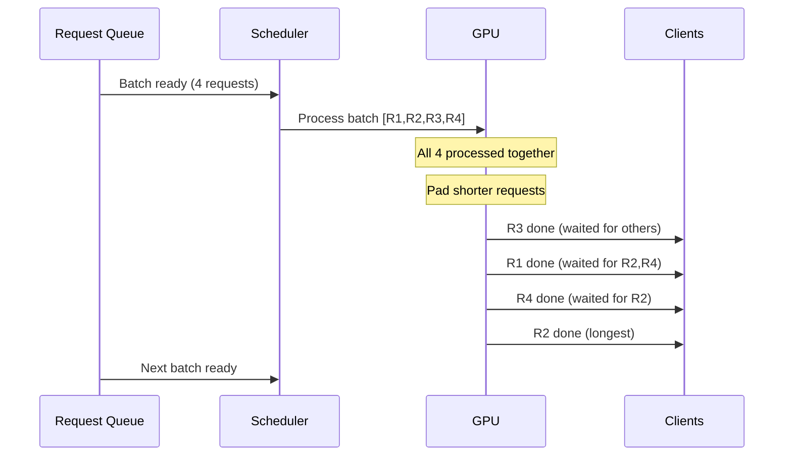
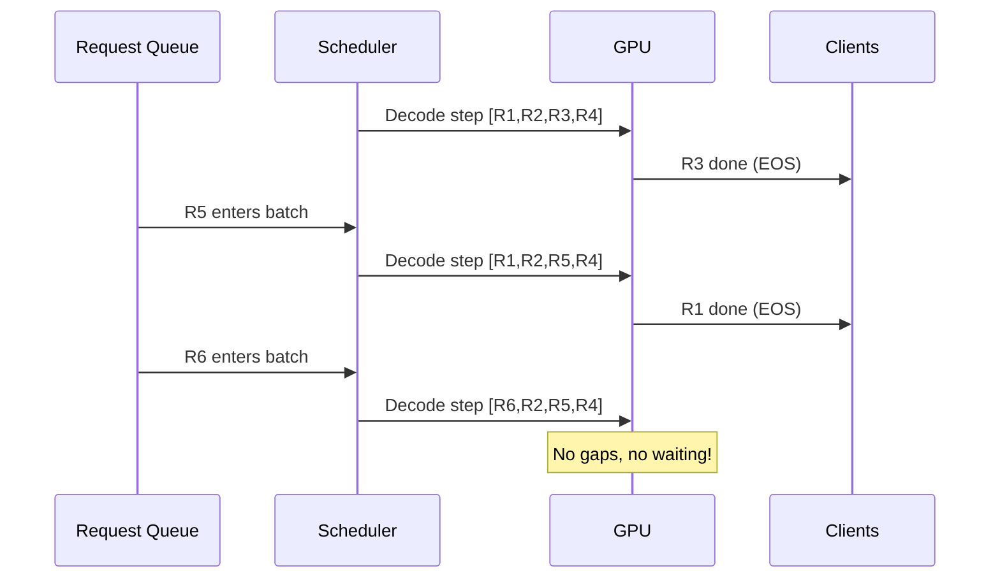

# Batching Strategies for Model Serving

## Why Batching Matters

GPUs are expensive ($5-8/hr for H100). During decode, a single request uses only 10-30% of GPU compute.
Batching multiple requests together amortizes the cost of reading model weights from memory.

```
Single request decode:
  Read 140GB of weights → compute 1 token → 10% GPU utilization

Batch of 32 requests:
  Read 140GB of weights → compute 32 tokens → 70%+ GPU utilization

Same memory read cost, 32x more useful work!
```

**Batching is the single most impactful optimization for serving throughput.**

---

## The Problem: Naive Serving

```
Request Queue: [R1, R2, R3, R4, R5, R6, R7, R8]

Naive approach (one at a time):
┌────────────────────────────────────────────────────┐
│ Time: ──────────────────────────────────────────►  │
│                                                    │
│ GPU: [R1 processing][R2 processing][R3...]         │
│       (10% util)    (10% util)                     │
│                                                    │
│ R8 waits for: R1+R2+R3+R4+R5+R6+R7 to finish      │
└────────────────────────────────────────────────────┘

Throughput: ~10-30 tokens/sec total. Terrible.
```

---

## Strategy 1: Static Batching

### How It Works

Wait for N requests, then process them all together as a fixed batch.

```
Batch size = 4

Collect: [R1, R2, R3, R4] → Process together
Wait for ALL to finish
Collect: [R5, R6, R7, R8] → Process together
```

### The "Waiting Problem"

```
Batch: [R1 (50 tokens), R2 (200 tokens), R3 (10 tokens), R4 (150 tokens)]

Time ──────────────────────────────────────────────────►
R1:  [████████████████████░░░░░░░░░░░░░░░░░░░░░░░░░░░░] done at t=50, waits
R2:  [████████████████████████████████████████████████████████████] done at t=200
R3:  [██████░░░░░░░░░░░░░░░░░░░░░░░░░░░░░░░░░░░░░░░░░░] done at t=10, waits
R4:  [████████████████████████████████████████████░░░░░░] done at t=150, waits

R3 finishes at t=10 but WAITS until t=200 for R2 to finish!
GPU is padded (wasted) for finished requests.
New requests can't start until the ENTIRE batch completes.
```

### Metrics
- **Throughput**: 3-5x better than naive
- **Latency**: High variance (short requests penalized)
- **GPU utilization**: 30-50% (padding waste)

---

## Strategy 2: Dynamic Batching

### How It Works

Group requests by similar expected output length. Process similar-length requests together.

```
Incoming: [R1(short), R2(long), R3(short), R4(long), R5(short)]

Bucket by length:
  Short batch: [R1, R3, R5] → process together (less padding)
  Long batch:  [R2, R4]     → process together (less padding)
```

### Improvement Over Static

```
Short batch: [R1(50), R3(30), R5(40)]
  Max length: 50, waste: (50-30) + (50-40) = 30 tokens padding
  
vs Static: [R1(50), R2(200), R3(30), R4(150)]
  Max length: 200, waste: 150 + 0 + 170 + 50 = 370 tokens padding
```

### Metrics
- **Throughput**: 5-8x better than naive
- **Latency**: Better than static (less padding)
- **GPU utilization**: 40-60%
- **Drawback**: Still waits for batch to complete before accepting new requests

---

## Strategy 3: Continuous Batching (The Breakthrough)

### Core Idea

Don't wait for all requests in a batch to finish. When one request completes,
immediately slot in a new request.

**The "conveyor belt" analogy**: Items enter and exit the belt independently.
The belt never stops.

### How It Works - Step by Step

```
Time step 1: Batch = [R1, R2, R3, R4]  (all active)
Time step 2: Batch = [R1, R2, R3, R4]  (R3 generates EOS)
Time step 3: Batch = [R1, R2, R5, R4]  (R3 replaced by R5 immediately!)
Time step 4: Batch = [R1, R2, R5, R4]  (R1 generates EOS)
Time step 5: Batch = [R6, R2, R5, R4]  (R1 replaced by R6 immediately!)
```

### Visualization

```
Time ──────────────────────────────────────────────────────►

Slot 0: [R1████████████][R5██████████████████][R9████████]
Slot 1: [R2████████████████████████████████████████████████]
Slot 2: [R3████][R6████████████████][R10██████████████████]
Slot 3: [R4████████████████████][R7██████][R8████████████]

         ↑ No gaps! As soon as one finishes, next starts.
         GPU stays at maximum utilization.
```

### Why It's 10-23x Better

1. **No padding waste**: Each request runs exactly as long as needed
2. **No idle slots**: Finished requests immediately replaced
3. **No batch boundaries**: Continuous flow of requests
4. **Better latency**: New requests start immediately (no waiting for batch to form)

### Implementation Detail (Iteration-Level Scheduling)

```python
# Pseudocode for continuous batching
while True:
    # Each iteration = one decode step for all active requests
    active_batch = get_active_requests()
    
    # Remove completed requests
    for req in active_batch:
        if req.last_token == EOS or req.length >= max_length:
            active_batch.remove(req)
            send_response(req)
    
    # Fill empty slots with waiting requests
    while len(active_batch) < max_batch_size and queue.has_requests():
        new_req = queue.pop()
        run_prefill(new_req)  # Compute KV cache for input
        active_batch.add(new_req)
    
    # Run one decode step for all active requests
    new_tokens = decode_step(active_batch)
    for req, token in zip(active_batch, new_tokens):
        req.append_token(token)
        stream_to_client(req, token)
```

### Metrics
- **Throughput**: 10-23x better than naive, 3-5x better than static
- **Latency**: Excellent (no waiting for batch formation)
- **GPU utilization**: 70-90%

---

## Strategy 4: Chunked Prefill

### The Problem with Long Prompts

```
Without chunked prefill:
  Request A: 10,000 token prompt arrives
  Prefill takes 500ms (processing all 10K tokens)
  
  During those 500ms: ALL decode requests in the batch are BLOCKED
  → 32 users experience 500ms stall in their streaming output!
```

### Solution: Split Prefill into Chunks

```
Request A (10K tokens) split into chunks of 512:

Iteration 1: Prefill chunk 1 (tokens 0-511)    + Decode for [R2,R3,R4]
Iteration 2: Prefill chunk 2 (tokens 512-1023)  + Decode for [R2,R3,R4]
...
Iteration 20: Prefill chunk 20 (tokens 9728-9999) + Decode for [R2,R3,R4]
Iteration 21: Request A joins decode batch        + Decode for [R2,R3,R4,A]
```

### Benefits

- **Decode requests never stall** (interleaved with prefill chunks)
- **Consistent inter-token latency** for streaming users
- **Tradeoff**: TTFT for long prompts increases slightly

---

## Batching Parameters

### max_batch_size

```
max_batch_size = available_GPU_memory_for_KV / KV_per_request

Example:
  GPU memory for KV: 40 GB
  KV per request (4K context): 1 GB
  max_batch_size = 40
```

Larger batch = higher throughput but higher per-request latency.

### max_waiting_time

How long to wait for more requests before processing a partial batch.

```
Low (10ms):  Good for latency, may process tiny batches
High (100ms): Good for throughput, adds latency for early arrivals
Production:   Usually 10-50ms
```

### max_tokens_per_batch (Token Budget)

```
Instead of limiting by request count, limit by TOTAL tokens in batch.

max_tokens = 4096

Batch could be:
  - 4 requests × 1024 tokens each = 4096 ✓
  - 1 request × 4096 tokens = 4096 ✓  
  - 16 requests × 256 tokens each = 4096 ✓
```

This prevents OOM from a batch of all-long-context requests.

---

## Scheduling Algorithms

### FCFS (First Come First Served)

```
Queue: [R1, R2, R3, R4, R5]
Process: R1 first, R2 next, etc.

+ Simple, fair in arrival order
- Short requests stuck behind long ones
```

### Shortest Job First (SJF)

```
Queue: [R1(long), R2(short), R3(medium)]
Process: R2 first, R3 next, R1 last

+ Minimizes average latency
- Long requests may starve
- Must estimate output length (hard for LLMs!)
```

### Priority-Based

```
Queue: [R1(free), R2(paid), R3(free), R4(enterprise)]
Process: R4 first, R2 next, R1, R3

+ Business value alignment
- Free tier users may wait excessively
```

### Fair Queuing (Multi-Tenant)

```
Tenant A: [R1, R2, R3, R4, R5]  (heavy user)
Tenant B: [R6]                    (light user)
Tenant C: [R7, R8]               (moderate user)

Round-robin across tenants: R1, R6, R7, R2, R8, R3, R4, R5
Each tenant gets fair share regardless of request volume.
```

---

## Real Performance Numbers

### Throughput Comparison (Llama-70B on 4× A100-80GB)

| Strategy | Tokens/sec (server) | Avg Latency | GPU Utilization |
|----------|-------------------|-------------|-----------------|
| No batching | 30 | 50ms/tok | 10% |
| Static batch=8 | 180 | 55ms/tok | 35% |
| Static batch=32 | 500 | 70ms/tok | 55% |
| Dynamic batch=32 | 650 | 60ms/tok | 60% |
| Continuous batch | 1500 | 45ms/tok | 80% |
| Continuous + chunked prefill | 1800 | 40ms/tok | 85% |

### Latency Distribution

```
Continuous batching:
  P50 latency: 35ms/token
  P90 latency: 55ms/token
  P99 latency: 80ms/token

Static batching:
  P50 latency: 50ms/token
  P90 latency: 150ms/token (blocked by long requests!)
  P99 latency: 300ms/token
```

---

## Mermaid Diagrams

### Static Batching Flow



### Continuous Batching Flow



---

## Key Takeaways

1. **Continuous batching is mandatory** for production - 10-23x throughput over naive
2. **Chunked prefill** prevents long prompts from blocking decode (critical for streaming UX)
3. **Batch size is limited by KV cache memory** - not just compute
4. **Scheduling matters for multi-tenant** - use fair queuing to prevent tenant starvation
5. **Token budget** is better than request-count limit for heterogeneous workloads
6. **All modern frameworks** (vLLM, TGI, TensorRT-LLM) implement continuous batching
