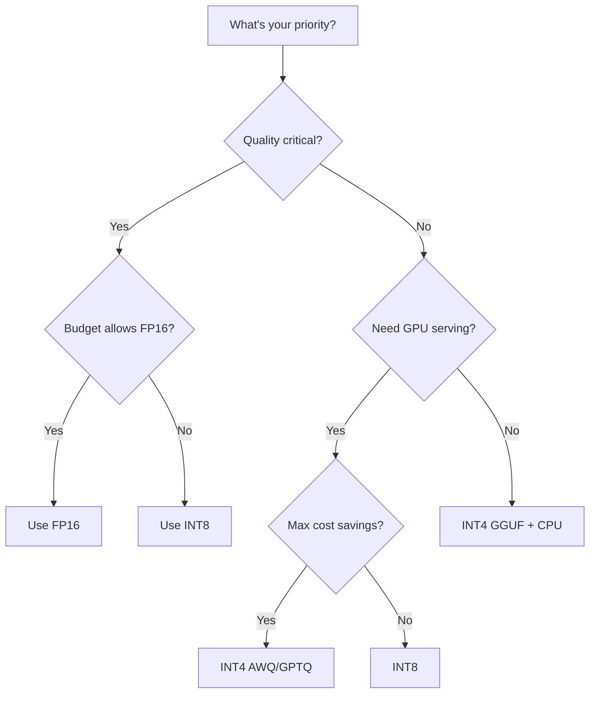

# Quantization for Serving

## What is Quantization?

**The "JPEG for model weights" analogy:**

A RAW photo (FP16) stores every pixel with perfect precision. A JPEG (INT4) stores an approximation
that looks nearly identical to humans but is 4x smaller. You trade tiny, often imperceptible quality
loss for massive storage and speed gains.

Quantization reduces the numerical precision of model weights from high-precision floating point
to lower-precision integers.

---

## Why Quantize?

```
Smaller model = 
  ✓ Fits in fewer/cheaper GPUs
  ✓ More memory for KV cache (more concurrent requests)
  ✓ Faster inference (less memory to read)
  ✓ Lower cost per token

70B model at FP16: 140 GB → needs 2× A100-80GB ($8/hr)
70B model at INT4:  35 GB → needs 1× A100-40GB ($2.5/hr)
                                    → 70% cost reduction!
```

---

## Quantization Levels

### Precision Hierarchy

```
FP32  ████████████████████████████████  4 bytes/weight  (training only)
FP16  ████████████████                  2 bytes/weight  (standard inference)
BF16  ████████████████                  2 bytes/weight  (better dynamic range)
INT8  ████████                          1 byte/weight   (good production choice)
INT4  ████                              0.5 bytes/weight (cost-optimized)
INT3  ███                               0.375 bytes     (experimental)
INT2  ██                                0.25 bytes      (research only)
```

### FP32 (32-bit Floating Point)
- 1 sign bit + 8 exponent bits + 23 mantissa bits
- Range: ±3.4 × 10^38
- Used for: Training (master weights), never for inference

### FP16 / BF16 (16-bit)
- FP16: 1 sign + 5 exponent + 10 mantissa (more precision, less range)
- BF16: 1 sign + 8 exponent + 7 mantissa (less precision, more range)
- **Standard for inference** - negligible quality loss vs FP32
- BF16 preferred for LLMs (handles large values better)

### INT8 (8-bit Integer)
- 256 possible values per weight
- 50% memory reduction vs FP16
- Quality loss: ~0.1% on benchmarks (barely measurable)
- **Sweet spot for quality-sensitive production**

### INT4 (4-bit Integer)
- 16 possible values per weight
- 75% memory reduction vs FP16
- Quality loss: 1-3% depending on method
- **Best cost/quality tradeoff for most use cases**

### INT3 / INT2 (Experimental)
- Significant quality degradation (5-15%)
- Active research area
- May work for specific narrow tasks

---

## Quantization Methods

### Post-Training Quantization (PTQ)

Quantize a pre-trained model without retraining. Fast and easy.

#### Round-To-Nearest (RTN)
```
Simply round each weight to nearest quantized value.

FP16 weight: 0.3742
INT4 grid:   [..., 0.25, 0.375, 0.5, ...]
Rounded to:  0.375

+ Extremely fast (seconds)
- Crude, highest quality loss
- Outlier weights cause disproportionate errors
```

#### GPTQ (GPT Quantization)
```
Uses calibration data to find optimal quantization.
Minimizes reconstruction error layer-by-layer.

Process:
1. Run ~128 calibration samples through model
2. For each layer, find quantization that minimizes output error
3. Use Hessian information to prioritize important weights

+ Much better quality than RTN (especially at INT4)
+ Fast: quantize 70B in ~4 hours on 1 GPU
- Requires calibration data
- Static: quantization is fixed after calibration
```

#### AWQ (Activation-Aware Weight Quantization)
```
Key insight: 1% of weights are much more important than others.
These "salient" weights correspond to large activation channels.

Process:
1. Identify important weight channels (via activation magnitudes)
2. Scale up important channels before quantization
3. Scale down corresponding activations to compensate
4. Quantize all weights (important ones preserved better)

+ Best quality at INT4 (often better than GPTQ)
+ Fast quantization
+ Hardware-friendly (no mixed precision needed)
```

#### GGUF/GGML (llama.cpp format)
```
Quantization format optimized for CPU inference.
Multiple quant levels: Q2_K, Q3_K, Q4_K, Q5_K, Q6_K, Q8_0

+ Runs on CPU (no GPU required!)
+ Multiple precision options per model
+ Great for local development
- Slower than GPU-based serving
- Community-maintained quantizations
```

### Quantization-Aware Training (QAT)

Train the model knowing it will be quantized. Simulates quantization during training.

```
Forward pass: use quantized weights (simulate precision loss)
Backward pass: use full-precision gradients (straight-through estimator)

+ Best quality (model adapts to quantization)
- Expensive: requires full training run
- Rarely used for serving (PTQ good enough)
- Used by: some specialized edge models
```

---

## Quality Impact

### Benchmark Comparison (Llama-2 70B on MMLU)

| Precision | Method | MMLU Score | Δ from FP16 | Memory |
|-----------|--------|-----------|-------------|--------|
| FP16 | - | 68.9% | baseline | 140 GB |
| INT8 | Per-channel | 68.8% | -0.1% | 70 GB |
| INT4 | GPTQ-128g | 68.1% | -0.8% | 35 GB |
| INT4 | AWQ | 68.4% | -0.5% | 35 GB |
| INT4 | RTN | 66.5% | -2.4% | 35 GB |
| INT3 | GPTQ | 64.2% | -4.7% | 26 GB |
| INT2 | GPTQ | 55.1% | -13.8% | 17.5 GB |

### Qualitative Impact

```
FP16 → INT8:  Users cannot tell the difference. Use freely.
FP16 → INT4 (AWQ/GPTQ): Slight degradation on complex reasoning.
                          Fine for chat, summarization, most tasks.
FP16 → INT4 (RTN): Noticeable on nuanced tasks. Avoid for production.
FP16 → INT3: Clearly degraded. Only for cost-extreme scenarios.
FP16 → INT2: Substantially worse. Research only.
```

---

## Memory Savings Table

### 70B Parameter Model

| Precision | Memory | GPU Configuration | Approx. Cloud Cost/hr |
|-----------|--------|-------------------|----------------------|
| FP16 | 140 GB | 2× A100-80GB | $7-8 |
| INT8 | 70 GB | 1× A100-80GB | $3.5-4 |
| INT4 (GPTQ) | 35 GB | 1× A100-40GB | $2-2.5 |
| INT4 (GGUF) | 35 GB | CPU (64GB RAM) | $0.5-1 |

### Additional Benefit: More Room for KV Cache

```
2× A100-80GB (160 GB total):

FP16 model (140 GB):
  Remaining for KV: 20 GB → ~20 concurrent requests (4K ctx)

INT8 model (70 GB):
  Remaining for KV: 90 GB → ~90 concurrent requests (4K ctx)
  
INT4 model (35 GB) on 1× A100-80GB:
  Remaining for KV: 45 GB → ~45 concurrent requests (4K ctx)

Quantization doesn't just save money - it multiplies concurrency!
```

---

## Speed Impact

### Why Smaller = Faster

```
LLM decode is MEMORY-BOUND:
  Time per token ∝ bytes_of_model_read / memory_bandwidth

A100 memory bandwidth: 2 TB/s

FP16 (140 GB): 140 GB / 2 TB/s = 70ms per token
INT8 (70 GB):   70 GB / 2 TB/s = 35ms per token → 2x faster!
INT4 (35 GB):   35 GB / 2 TB/s = 17ms per token → 4x faster!

(Simplified - actual numbers vary due to compute overhead of dequantization)
```

### Real-World Speed Comparison (single request, 70B)

| Precision | Tokens/sec (decode) | Speedup |
|-----------|-------------------|---------|
| FP16 | 15 | 1x |
| INT8 | 25 | 1.7x |
| INT4 | 35 | 2.3x |

Note: Speedup is less than theoretical because dequantization adds compute overhead.

---

## How to Choose Quantization

### Decision Framework



### Recommendations by Use Case

| Use Case | Recommended | Why |
|----------|------------|-----|
| Medical/Legal (high stakes) | FP16 or INT8 | Cannot risk quality loss |
| Customer chatbot | INT4 (AWQ) | Good quality, great cost |
| Code generation | INT8 | Code is sensitive to precision |
| Summarization | INT4 (GPTQ) | Robust to quantization |
| Internal search/RAG | INT4 (AWQ) | Cost-effective, quality sufficient |
| Local development | INT4 (GGUF) | Runs on laptop |
| Edge/mobile | INT4 or lower | Memory-constrained |
| Batch processing (offline) | INT4 (AWQ) | Maximize throughput |

### Practical Tips

1. **Always benchmark YOUR use case** - generic benchmarks may not reflect your tasks
2. **AWQ > GPTQ > RTN** for INT4 quality (generally)
3. **Group size matters**: GPTQ-128g > GPTQ-1024g (smaller groups = better quality, slightly more memory)
4. **INT8 is almost free** quality-wise - default to it if FP16 is too expensive
5. **Test edge cases**: quantization hurts most on rare/complex patterns
6. **Combine with KV cache quantization**: model INT4 + KV INT8 = maximum efficiency

---

## Quantization in Practice

### vLLM with AWQ

```bash
# Serve AWQ-quantized model
python -m vllm.entrypoints.openai.api_server \
    --model TheBloke/Llama-2-70B-Chat-AWQ \
    --quantization awq \
    --tensor-parallel-size 1 \
    --max-model-len 4096
```

### vLLM with GPTQ

```bash
python -m vllm.entrypoints.openai.api_server \
    --model TheBloke/Llama-2-70B-Chat-GPTQ \
    --quantization gptq \
    --tensor-parallel-size 1
```

### llama.cpp with GGUF (CPU)

```bash
# Download GGUF model
wget https://huggingface.co/TheBloke/Llama-2-70B-Chat-GGUF/resolve/main/llama-2-70b-chat.Q4_K_M.gguf

# Run with llama.cpp
./main -m llama-2-70b-chat.Q4_K_M.gguf -p "Hello" -n 100
```

---

## Key Takeaways

1. **INT8 is nearly free** - 0.1% quality loss for 50% memory savings. Use it always.
2. **INT4 (AWQ) is the sweet spot** for cost-sensitive production - 1% loss for 75% savings.
3. **Quantization multiplies concurrency** - less model memory = more KV cache room.
4. **Faster inference** - less memory to read per token = more tokens/sec.
5. **Choose method carefully** - AWQ > GPTQ > RTN for quality at same bit-width.
6. **Always benchmark on YOUR data** - generic benchmarks don't tell the full story.
