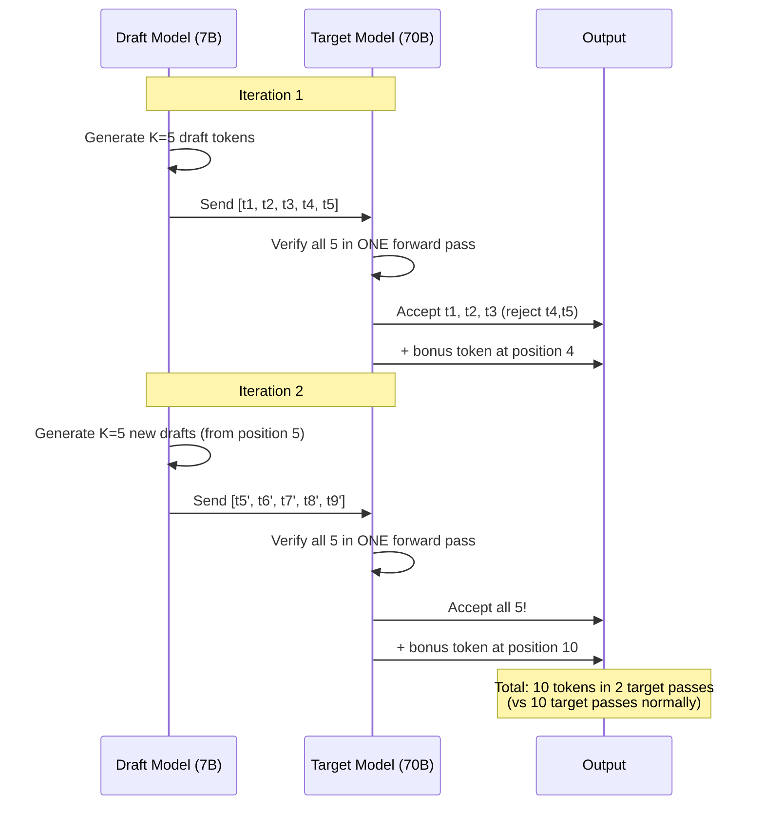

# Speculative Decoding

## The "Rough Draft Then Verify" Analogy

Imagine writing an essay:
- **Slow way**: Write each sentence perfectly, one word at a time, consulting a dictionary for every word.
- **Fast way**: Quickly draft 5 sentences, then have an expert review them all at once.
  The expert can verify all 5 in the time it takes to write 1, and most of your draft is correct anyway.

Speculative decoding applies this principle: a small fast model drafts tokens,
and the large accurate model verifies them in bulk.

---

## The Core Insight

**Verification is cheaper than generation.**

```
Generation (autoregressive):
  Token 1 → forward pass → Token 2 → forward pass → Token 3 → forward pass
  3 sequential forward passes of the large model

Verification (parallel):
  [Token 1, Token 2, Token 3] → ONE forward pass → [accept/reject each]
  1 forward pass of the large model (like prefill - parallelizable!)
```

This works because checking "are these tokens correct?" is the same operation as prefill,
which processes all tokens in parallel.

---

## How Speculative Decoding Works

### Step-by-Step

```
Target model: 70B (large, slow, accurate)
Draft model:  7B  (small, fast, approximate)
Speculation length: K=5 tokens

Step 1: Draft model generates 5 candidate tokens (fast!)
  Draft: "The capital of France is"
         [t1]  [t2]     [t3] [t4]    [t5]

Step 2: Target model verifies ALL 5 in one forward pass
  Target checks probability of each token:
    t1 "The"     → P_target = 0.85, P_draft = 0.80  ✓ Accept
    t2 "capital" → P_target = 0.72, P_draft = 0.65  ✓ Accept
    t3 "of"      → P_target = 0.95, P_draft = 0.90  ✓ Accept
    t4 "France"  → P_target = 0.60, P_draft = 0.55  ✓ Accept
    t5 "is"      → P_target = 0.88, P_draft = 0.82  ✓ Accept

Step 3: All 5 accepted! We got 5 tokens from 1 target model forward pass!
  (+ 1 bonus token from target's own prediction after position 5)

Result: 6 tokens from 1 target forward pass instead of 6 target forward passes.
```

### When Rejection Happens

```
Step 1: Draft generates: "The capital of France was"
Step 2: Target verifies:
    t1 "The"     → ✓ Accept (P_target ≥ P_draft)
    t2 "capital" → ✓ Accept
    t3 "of"      → ✓ Accept
    t4 "France"  → ✓ Accept
    t5 "was"     → ✗ REJECT (target would say "is" not "was")

Step 3: Accept t1-t4, reject t5. Sample from adjusted distribution for position 5.
  Result: 5 tokens from 1 target forward pass (still great!).
  
Next iteration: draft continues from "...France is"
```

### Acceptance Criterion

```
For each token position i:
  If P_target(token_i) ≥ P_draft(token_i):
    Always accept
  Else:
    Accept with probability P_target(token_i) / P_draft(token_i)
    If rejected: sample from (P_target - P_draft) distribution (normalized)

This guarantees the output distribution is IDENTICAL to the target model alone.
Speculative decoding changes speed, NOT quality.
```

---

## Why This Works

### Token Difficulty Distribution

```
Most tokens in natural language are "easy" (predictable):
  "The cat sat on the ___"  → "mat" (obvious, any model gets it)
  "def hello_world():___"   → "\n" (obvious formatting)

Only some tokens are "hard" (require deep reasoning):
  "The integral of x² is ___"  → "x³/3" (needs knowledge)

Distribution of token difficulty:
  Easy (small model correct):  70-85% of tokens
  Hard (only large model):     15-30% of tokens
```

The small model is fast because it's 5-10x smaller. If it gets 70%+ of tokens right,
speculative decoding provides a substantial speedup.

---

## Speedup Analysis

### Theoretical Speedup

```
α = acceptance rate (fraction of draft tokens accepted)
K = speculation length (tokens drafted per iteration)
c = cost ratio (draft_time / target_time, typically 0.05-0.1)

Expected tokens per iteration = (1 - α^(K+1)) / (1 - α) for geometric acceptance

Speedup ≈ expected_tokens_per_iteration / (1 + K × c)
```

### Practical Speedups

| Acceptance Rate | K | Approx Speedup |
|----------------|---|---------------|
| 60% | 3 | 1.5x |
| 70% | 4 | 2.0x |
| 80% | 5 | 2.5x |
| 85% | 5 | 2.8x |
| 90% | 6 | 3.2x |

### Real-World Numbers

```
Llama-2 70B + Llama-2 7B draft:
  - Code generation: 2.5x speedup (high acceptance, predictable syntax)
  - Creative writing: 1.8x speedup (lower acceptance, more varied)
  - Math reasoning: 1.5x speedup (many "hard" tokens)
  
Average across tasks: ~2x speedup
```

---

## Requirements

### Draft Model Selection

```
Must have:
  ✓ Same vocabulary/tokenizer as target model
  ✓ Much smaller (5-10x fewer parameters)
  ✓ Same model family preferred (similar distribution)

Good pairs:
  Target: Llama-3 70B  →  Draft: Llama-3 8B
  Target: Mistral 22B  →  Draft: Mistral 7B
  Target: GPT-4        →  Draft: GPT-3.5 (used internally by OpenAI)

Bad pairs:
  Target: Llama-3 70B  →  Draft: Mistral 7B (different vocabulary!)
  Target: GPT-4        →  Draft: Llama-3 8B  (completely different training)
```

### Hardware Considerations

```
Both models must fit in GPU memory:

Target 70B (FP16): 140 GB
Draft 7B (FP16):    14 GB
Total:             154 GB → fits in 2× A100-80GB

Or with quantization:
Target 70B (INT4):  35 GB
Draft 7B (FP16):    14 GB
Total:              49 GB → fits in 1× A100-80GB!
```

---

## Variants

### Self-Speculative Decoding

```
Use EARLY layers of the same model as the draft.

70B model has 80 layers:
  Draft: Run only first 20 layers → predict token
  Verify: Run all 80 layers on candidates

+ No separate draft model needed
+ Perfect vocabulary alignment
- Less speedup (draft is still somewhat expensive)
- Requires model architecture support
```

### Medusa

```
Add multiple prediction heads to the target model itself.

Standard model: 1 prediction head → next token
Medusa model:   K prediction heads → next K tokens simultaneously

Head 1: predicts token at position +1
Head 2: predicts token at position +2
Head 3: predicts token at position +3

Tree-based verification: explore multiple candidate sequences

+ No separate model needed
+ Single forward pass generates candidates AND verifies
- Requires fine-tuning the extra heads
- Quality of later heads degrades
```

### Lookahead Decoding

```
Use n-gram patterns from the model's own generation as drafts.

If model has generated "The cat sat on the mat. The cat"
  n-gram cache: "The cat" → likely followed by "sat on the"
  
Use cached n-grams as draft tokens.

+ No draft model needed at all
+ Zero additional memory
- Only works after enough context is generated
- Limited to repetitive/predictable text
```

---

## When to Use Speculative Decoding

### Good Use Cases

| Scenario | Why It Works |
|----------|-------------|
| Long generation (500+ output tokens) | Amortizes draft model overhead |
| Latency-sensitive single requests | Reduces wall-clock time per token |
| Code generation | Highly predictable syntax (high acceptance) |
| Translation | Many tokens are deterministic |
| Summarization | Often follows predictable patterns |

### When NOT to Use

| Scenario | Why It Doesn't Help |
|----------|-------------------|
| Very short outputs (<20 tokens) | Draft overhead not amortized |
| High-throughput batch serving | Batching already maximizes GPU, speculative adds complexity |
| Tasks with low acceptance rate | Hard tasks where small model is wrong often |
| Memory-constrained deployment | Draft model takes additional GPU memory |
| Already compute-saturated GPU | No spare cycles for draft model |

---

## Speculative Decoding Flow



---

## Key Takeaways

1. **Output is identical** to target model - speculative decoding is lossless
2. **2-3x speedup** on average for well-matched model pairs
3. **Best for latency** (single request speed), not throughput (batch serving)
4. **Acceptance rate is key** - measure it for your use case before committing
5. **Same vocabulary required** - limits draft model choices
6. **Complementary to quantization** - use both for maximum speed
7. **Production adoption growing** - OpenAI, Anthropic use variants internally
