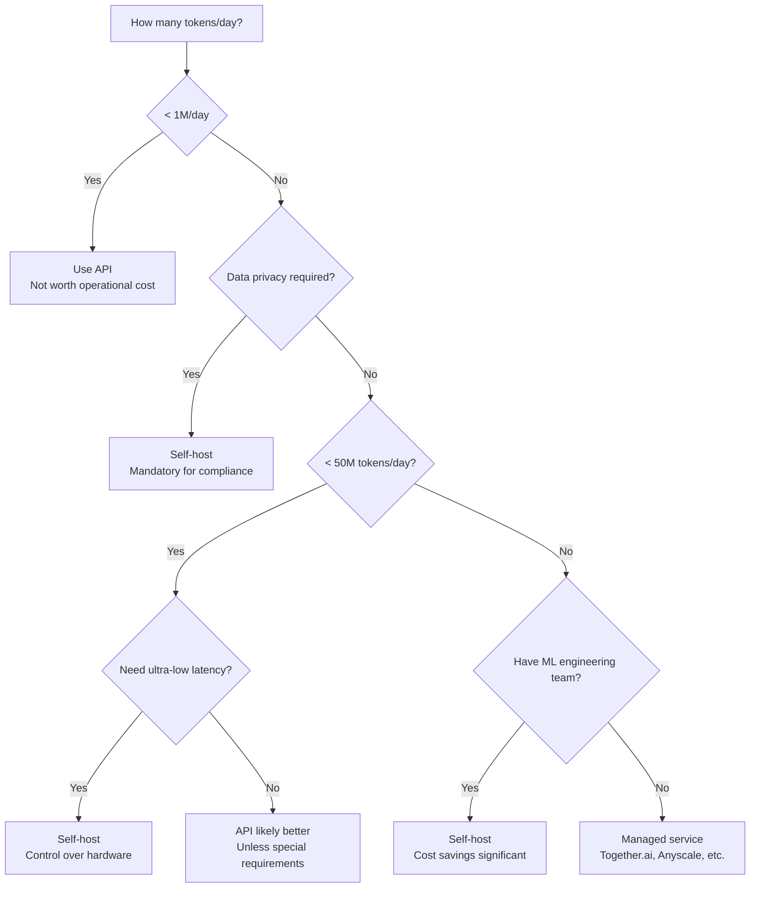
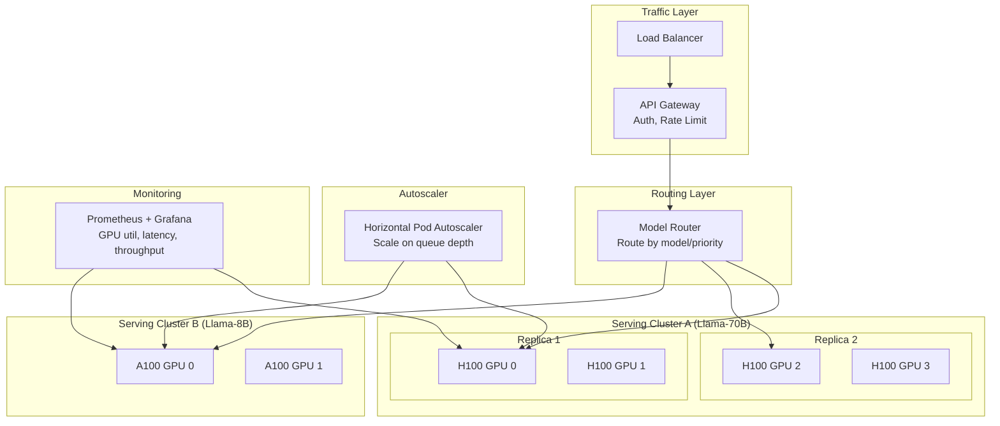

# GPU Economics for AI Serving

## GPU Options for AI Serving

### Comparison Table

| GPU | VRAM | Memory BW | FP16 TFLOPS | Cloud $/hr | Best For |
|-----|------|-----------|-------------|-----------|----------|
| H100 SXM | 80 GB | 3.35 TB/s | 990 | $4-8 | Largest models, max performance |
| H100 PCIe | 80 GB | 2.0 TB/s | 756 | $3-5 | Production serving |
| A100 SXM | 80 GB | 2.0 TB/s | 312 | $3-4 | Production workhorse |
| A100 PCIe | 40 GB | 1.5 TB/s | 312 | $2-3 | 7-13B models |
| L40S | 48 GB | 864 GB/s | 366 | $1.5-2 | Inference-optimized |
| A10G | 24 GB | 600 GB/s | 125 | $1-1.5 | Small models, embedding |
| T4 | 16 GB | 320 GB/s | 65 | $0.35 | INT8 inference, tiny models |
| RTX 4090 | 24 GB | 1.0 TB/s | 330 | N/A (buy) | Development, small prod |

### Key Metrics That Matter for Serving

```
For decode (sequential token generation):
  → Memory Bandwidth is KING (model weights read every token)
  → H100: 3.35 TB/s vs T4: 320 GB/s = 10x faster decode

For prefill (parallel input processing):
  → Compute (TFLOPS) matters more
  → H100: 990 TFLOPS vs A100: 312 TFLOPS = 3x faster prefill

For concurrency:
  → VRAM determines max batch size
  → 80GB > 48GB > 24GB > 16GB
```

---

## Cost-Per-Token Calculation

### Formula

```
cost_per_token = GPU_cost_per_hour / tokens_served_per_hour

tokens_served_per_hour = tokens_per_second × 3600
```

### Example: Self-Hosted H100 vs OpenAI

```
Self-hosted H100 serving Llama-3 70B (INT4):
  GPU cost: $5/hr
  Throughput (continuous batching): 3000 tokens/sec
  Tokens per hour: 3000 × 3600 = 10,800,000
  Cost per token: $5 / 10,800,000 = $0.00000046/token

OpenAI GPT-4o:
  Input: $0.0000025/token
  Output: $0.000010/token
  Average: ~$0.000005/token

Self-hosted is ~10x cheaper per token at this scale!
But: you need consistent volume to justify the operational overhead.
```

### Break-Even Analysis

```
Fixed costs of self-hosting:
  - Engineering time: $15-30K/month (DevOps, ML engineers)
  - GPU reservation: $3,600-5,000/month (1× H100 reserved)
  - Monitoring/infra: $500-1,000/month
  Total overhead: ~$20-35K/month

Variable cost per token (self-hosted): $0.00000046
Variable cost per token (API): $0.000005

Break-even:
  monthly_overhead / (API_cost - self_host_cost) = break-even tokens
  $25,000 / ($0.000005 - $0.00000046) = ~5.5 billion tokens/month
  ≈ 185M tokens/day

Simpler rule of thumb:
  < 10M tokens/day  → Use API (no contest)
  10-100M tokens/day → Depends on team, privacy, latency needs
  > 100M tokens/day → Self-host almost certainly cheaper
```

---

## Model Parallelism Strategies

### Tensor Parallelism (TP)

Split individual layers across GPUs. Each GPU holds a slice of every layer.

```
Layer 1: [GPU0 has cols 0-2047] [GPU1 has cols 2048-4095]
Layer 2: [GPU0 has cols 0-2047] [GPU1 has cols 2048-4095]
...

Every token requires ALL GPUs to communicate (AllReduce) at every layer.
```

**Effect**: Reduces latency (parallel computation within each layer)
**Cost**: High inter-GPU communication (need NVLink)
**Best for**: Latency-sensitive serving, TP=2-8 on single node

### Pipeline Parallelism (PP)

Split model into stages, each stage on different GPU(s).

```
GPU 0: Layers 0-19    → processes, sends to GPU 1
GPU 1: Layers 20-39   → processes, sends to GPU 2
GPU 2: Layers 40-59   → processes, sends to GPU 3
GPU 3: Layers 60-79   → produces output

Requests pipeline through stages (microbatching).
```

**Effect**: Enables larger batch sizes (each GPU needs less memory)
**Cost**: Pipeline bubbles (some GPU idle time)
**Best for**: Multi-node deployment, very large models

### Data Parallelism (DP)

Replicate entire model on multiple GPU sets. Split requests across replicas.

```
Replica 1 (GPU 0-1): handles requests 1-50
Replica 2 (GPU 2-3): handles requests 51-100
Replica 3 (GPU 4-5): handles requests 101-150

No inter-replica communication needed!
```

**Effect**: Linear throughput scaling
**Cost**: Each replica needs full model memory
**Best for**: Throughput scaling, easy horizontal scaling

### Combined Strategies in Production

```
Typical 70B deployment (8× A100-80GB):

Option A: TP=4, DP=2
  - 2 replicas, each using 4 GPUs with tensor parallelism
  - Good balance of latency and throughput

Option B: TP=2, DP=4
  - 4 replicas, each using 2 GPUs
  - Higher throughput, slightly higher latency

Option C: TP=8, DP=1
  - 1 replica using all 8 GPUs
  - Lowest latency, but limited throughput
```

---

## Self-Hosting vs API Decision Tree



### Decision Matrix

| Factor | Favors API | Favors Self-Host |
|--------|-----------|-----------------|
| Volume | < 10M tokens/day | > 100M tokens/day |
| Team | No ML ops team | Experienced ML infra team |
| Privacy | No sensitive data | PII, healthcare, legal data |
| Latency | P99 < 500ms OK | Need P99 < 100ms |
| Model | Standard (GPT-4, Claude) | Custom/fine-tuned model |
| Budget | Predictable, variable costs OK | Capital available, want lower unit cost |
| Uptime | 99.9% from provider | Need custom SLA, multi-region |

---

## Capacity Planning

### Step-by-Step Process

```
1. Estimate demand:
   expected_QPS = daily_requests / 86400
   tokens_per_request = avg_input_tokens + avg_output_tokens

2. Calculate required throughput:
   required_tokens_per_sec = expected_QPS × tokens_per_request × safety_factor
   (safety_factor = 1.5-2x for peak traffic)

3. Determine per-GPU throughput:
   tokens_per_GPU = benchmark your model on target GPU with continuous batching

4. Calculate GPU count:
   num_GPUs = required_tokens_per_sec / tokens_per_GPU
   (round up, add redundancy)
```

### Example Capacity Plan

```
Requirements:
  - Llama-3 70B serving
  - 1000 requests/minute peak
  - Average 500 input + 200 output tokens
  - P99 latency < 2 seconds TTFT
  - 99.9% uptime

Calculations:
  Peak QPS = 1000/60 = 17 QPS
  Tokens/sec needed = 17 × 700 × 1.5 (safety) = 17,850 tokens/sec
  
  Per-GPU throughput (70B INT4 on H100): ~3000 tokens/sec
  GPUs for serving = 17,850 / 3000 = 6 H100s
  
  Redundancy (N+2 for 99.9%): 8 H100s
  
  TP=2 (for latency), so: 4 replicas × 2 GPUs each = 8 GPUs ✓

Cost:
  8 × H100 at $5/hr = $40/hr = $29,200/month
  vs API at $0.000005/token × 17,850 × 3600 × 24 × 30 = $231,000/month!
  
  Self-host saves: ~$200K/month at this scale
```

---

## GPU Fleet Architecture



---

## Cost Optimization Strategies

### 1. Use Spot/Preemptible Instances (30-70% savings)

```
Spot instance cost: $1.5-2.5/hr for A100 (vs $3-4 on-demand)
Risk: instance can be reclaimed with 30s-2min warning
Mitigation: multiple replicas, graceful request draining
```

### 2. Right-Size GPU Selection

```
Don't use H100 for a 7B model!
  7B model: A10G ($1/hr) is sufficient
  13B model: L40S ($1.5/hr) or A100-40GB ($2/hr)
  70B model: H100 ($5/hr) justified
```

### 3. Autoscaling

```
Night (low traffic):   2 replicas  = $10/hr
Day (normal traffic):  4 replicas  = $20/hr
Peak (spike):          8 replicas  = $40/hr

vs Fixed 8 replicas:   $40/hr × 24 = $960/day
vs Autoscaled:         ~$500/day (48% savings)
```

### 4. Request Routing Optimization

```
Route simple requests to smaller/cheaper models:
  "What time is it?" → 8B model (A10G, $1/hr)
  "Explain quantum computing" → 70B model (H100, $5/hr)

Potential savings: 40-60% if significant traffic is simple
```

---

## Key Takeaways

1. **Memory bandwidth determines decode speed** - choose GPUs with high bandwidth
2. **Break-even is ~50-100M tokens/day** for self-hosting vs API
3. **Tensor parallelism for latency**, data parallelism for throughput
4. **Capacity plan with 1.5-2x safety factor** - traffic is bursty
5. **Quantization compounds savings** - INT4 means fewer GPUs needed
6. **Autoscaling + spot instances** can reduce costs 50-70%
7. **Always calculate total cost** including engineering, not just GPU hours
