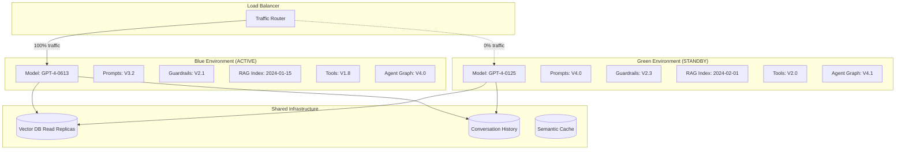
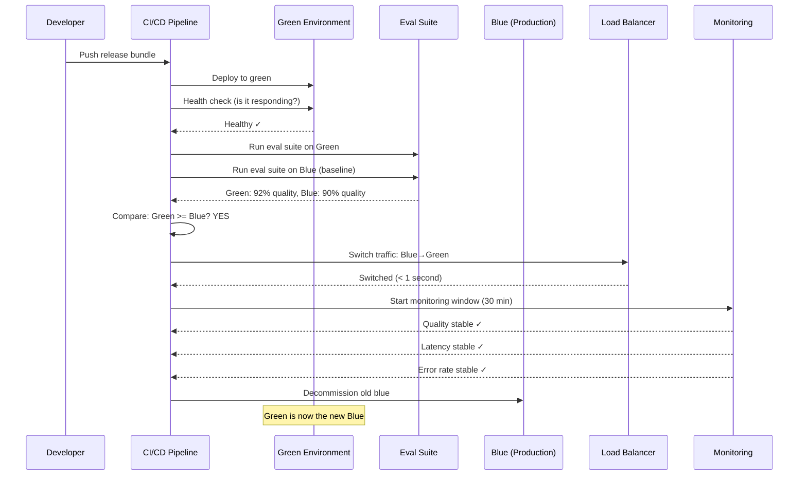

# Blue-Green Deployment for AI Systems

## What is Blue-Green Deployment?

### The "Two Identical Restaurants" Analogy

Imagine you own a restaurant and want to completely renovate it — new menu, new kitchen equipment, new staff training. You can't just close for 3 weeks. Instead:

- **Blue Restaurant**: Your current restaurant, serving customers right now
- **Green Restaurant**: An identical building next door where you set up everything new
- **The Switch**: When green is ready and tested, you move the "OPEN" sign from blue to green
- **Safety Net**: If customers hate the new menu, move the sign back to blue instantly

That's blue-green deployment. Two identical environments, one active, instant switching.

### Traditional Blue-Green vs AI Blue-Green

| Aspect | Traditional App | AI System |
|--------|----------------|-----------|
| What you deploy | Code binary | Model + prompts + configs + indices |
| How you test | Unit tests pass | Eval suite passes + quality >= current |
| What can go wrong | Crashes, errors | Silent quality degradation, hallucinations |
| Rollback urgency | Minutes acceptable | Seconds required (hallucinations harm users) |
| Validation time | Seconds | Minutes to hours (need samples) |

## Why AI Needs Blue-Green Deployment

### You Can't Just "Deploy and See"

Traditional software has a clear signal: it either works or crashes. AI systems fail silently:

**Problem 1: Silent Quality Degradation**
```
Old model: "The capital of France is Paris" ✓
New model: "The capital of France is Paris" ✓  (seems fine...)

Old model: "Summarize this legal contract" → accurate 95% of time
New model: "Summarize this legal contract" → accurate 88% of time ← INVISIBLE WITHOUT EVAL
```

**Problem 2: Edge Case Hallucinations**
```
New model works great on common queries.
But on rare medical questions, it now confidently gives wrong answers.
You won't discover this from a few manual tests.
```

**Problem 3: Rollback Must Be Instant**
```
If new model is hallucinating medical advice:
- Traditional: "We'll fix it in the next deploy" (hours) ← UNACCEPTABLE
- Blue-green: Switch back in < 5 seconds ← REQUIRED
```

### The Cost of Getting It Wrong

```
Impact Formula:
  damage = hallucination_rate × traffic_volume × time_to_detect × severity

Example:
  5% hallucination rate × 10,000 req/hr × 2 hours to detect × HIGH severity
  = 1,000 users received harmful hallucinations
```

## Blue-Green Architecture for AI

### Environment Layout



### What You Deploy: The AI Release Bundle

It's not just a model. It's everything together:

```yaml
# ai-release-bundle.yaml
apiVersion: ai/v1
kind: ReleaseBundle
metadata:
  name: release-2024-02-01
  version: 4.1.0
spec:
  model:
    provider: azure-openai
    name: gpt-4
    version: "0125-preview"
    deployment: "prod-gpt4-0125"
  
  prompts:
    version: "4.0"
    templates:
      system: "prompts/system-v4.txt"
      rag: "prompts/rag-context-v4.txt"
      guardrail: "prompts/guardrail-check-v2.3.txt"
  
  guardrails:
    version: "2.3"
    config: "guardrails/production-v2.3.yaml"
    thresholds:
      toxicity: 0.1
      hallucination: 0.15
      pii_detection: true
  
  rag:
    index_version: "2024-02-01"
    embedding_model: "text-embedding-3-large"
    chunk_strategy: "semantic-v2"
    vector_db: "pinecone"
    index_name: "prod-knowledge-2024-02-01"
  
  tools:
    version: "2.0"
    definitions: "tools/definitions-v2.yaml"
    endpoints:
      search: "https://api.internal/search/v3"
      calculator: "https://api.internal/calc/v2"
  
  agent:
    graph_version: "4.1"
    definition: "agents/main-graph-v4.1.yaml"
    max_iterations: 10
    timeout_seconds: 120
```

### Why Bundle Everything Together

```
WRONG: Deploy model update separately from prompt update
  → New model + old prompts = undefined behavior
  → Prompts were tuned for old model's quirks

RIGHT: Deploy everything as atomic unit
  → New model + new prompts + new guardrails = tested together
  → Eval suite validated this exact combination
```

## The Blue-Green Deployment Process

### Step-by-Step



### Detailed Process

```
Phase 1: Build Green Environment (5-15 min)
├── Pull new release bundle from registry
├── Spin up green instances (same spec as blue)
├── Load model weights into GPU memory
├── Initialize vector DB connections
├── Load prompt templates
├── Configure guardrails
└── Run health checks (all systems responding)

Phase 2: Validation (10-60 min)
├── Run golden dataset evaluation (500-2000 test cases)
│   ├── Faithfulness tests
│   ├── Hallucination detection tests
│   ├── Latency measurements
│   ├── Edge case tests
│   └── Safety/guardrail tests
├── Run same evaluation on blue (current baseline)
├── Statistical comparison
│   ├── Quality: green >= blue - 2% (allow small variance)
│   ├── Latency: green P95 <= blue P95 × 1.1
│   ├── Error rate: green errors <= blue errors × 1.05
│   └── Safety: zero safety regressions allowed
└── Gate decision: PASS or FAIL

Phase 3: Switch (< 5 seconds)
├── Update load balancer configuration
├── DNS-level switch (if applicable)
├── Verify: first requests hitting green successfully
└── Log: switch timestamp for monitoring

Phase 4: Monitoring Window (30 min)
├── Real-time quality scoring (sample 10% of requests)
├── Latency percentile tracking
├── Error rate monitoring
├── User feedback signals
└── Automated rollback triggers active

Phase 5: Stabilization
├── If stable 30 min: mark green as "production"
├── Keep blue alive for 2 hours (fast rollback)
├── After 2 hours: decommission blue
└── Update records: green is now "blue" for next deploy
```

## Database and State Considerations

### Shared vs Isolated State

```
SHARED (both environments access):
├── Conversation history store
│   └── Reason: users shouldn't lose context on switch
├── Vector DB read replicas
│   └── Reason: both need to answer RAG queries
├── User preferences/profiles
│   └── Reason: consistent experience
└── Audit logs
    └── Reason: continuous compliance record

ISOLATED (per environment):
├── Semantic cache
│   └── Reason: different model = different outputs = cache invalid
├── Model weights/artifacts
│   └── Reason: whole point of blue-green
├── Prompt templates
│   └── Reason: versioned with release bundle
└── Guardrail configs
    └── Reason: versioned with release bundle
```

### Vector DB Handling

```
Option A: Shared Index (simpler)
├── Both environments query same index
├── Index updates happen independently of model deploys
├── Risk: new model might interpret embeddings differently
└── Best for: same embedding model across versions

Option B: Blue-Green Indexes (safer)
├── Blue queries index-v1, Green queries index-v2
├── Complete isolation
├── Higher cost (2x storage)
└── Best for: embedding model changes or chunk strategy changes

Option C: Shared with Version Routing
├── Single vector DB with version metadata
├── Query filter: version=current_deployment_version
├── Cost-effective but more complex
└── Best for: incremental index updates
```

### Cache Warming Strategy

```python
# Green environment starts with cold cache
# Strategy: pre-warm with common queries

def warm_cache(green_env, common_queries):
    """Pre-warm green's semantic cache before switching traffic."""
    # Get top 1000 most common queries from last 24 hours
    for query in common_queries[:1000]:
        # Fire-and-forget to green (builds cache)
        green_env.process_query(query, cache_only=True)
    
    # Measure cache hit rate
    hit_rate = green_env.cache_stats()['hit_rate']
    print(f"Cache warmed: {hit_rate:.1%} hit rate")
    # Target: >60% hit rate before switching
```

## Cost Analysis

### Infrastructure Cost During Deployment

```
Normal operation (blue only):
├── 8 × A100 GPUs: $256/hr
├── Load balancer: $5/hr
├── Vector DB: $50/hr
└── Total: ~$311/hr

During deployment (blue + green):
├── Blue: $311/hr
├── Green: $311/hr (identical)
├── Eval infrastructure: $20/hr
└── Total: ~$642/hr (2x for deployment window)

Deployment window: ~1 hour
Extra cost per deploy: ~$331

With 2 deploys/week: ~$662/week extra = ~$2,648/month
vs. cost of one bad deployment reaching all users: $$$$$
```

### Cost Optimization

```
Strategy 1: Smaller green for eval only
├── Green uses 2 GPUs (enough for eval)
├── Scale green to full 8 GPUs only after switch decision
├── Saves: 75% of green cost during eval phase

Strategy 2: Shared GPU clusters
├── Green borrows GPUs from batch processing pool
├── Batch jobs pause during deployment window
├── Saves: 100% of extra GPU cost

Strategy 3: Off-peak deployments
├── Deploy during low-traffic hours (2 AM)
├── Green needs fewer GPUs to handle low traffic
├── Gradually scale up green as traffic increases
```

## Rollback Scenarios

### Instant Rollback (< 5 seconds)

```
Trigger: Any of these during monitoring window
├── Quality score drops > 5% below blue baseline
├── Error rate exceeds 5%
├── Latency P95 exceeds 2x blue baseline
├── Any safety guardrail violation spike
├── Manual trigger by on-call engineer

Action:
├── Load balancer switches back to blue (< 1 second)
├── Green continues running (for investigation)
├── Alert: "Rollback executed, investigating"
├── Green logs preserved for post-mortem
```

### Rollback After Blue Decommissioned

```
Situation: Green has been production for 3 hours, blue is gone
Problem: Quality issue discovered

Recovery:
├── Option A: Redeploy old release bundle as new green (5-15 min)
├── Option B: Switch to last-known-good container image (2-5 min)
├── Option C: Failover to backup provider while rebuilding (< 1 min)

Prevention:
├── Keep blue alive for 4+ hours after switch
├── Store last 3 release bundles ready-to-deploy
├── Maintain backup provider always warm
```

## Common Pitfalls

### Pitfall 1: Testing Green in Isolation

```
WRONG: Eval green with synthetic data only
WHY: Real traffic has patterns you can't simulate

BETTER: After eval passes, send shadow traffic to green
├── Copy 10% of real requests to green
├── Don't use green's responses (still serving from blue)
├── Compare green responses to blue responses
├── Detect quality differences on real data
```

### Pitfall 2: Ignoring Conversation Continuity

```
WRONG: Switch all traffic atomically mid-conversation
WHY: User was talking to Model A, suddenly talking to Model B

BETTER: Sticky sessions during transition
├── Existing conversations: continue on blue until complete
├── New conversations: start on green
├── Max overlap period: 2 hours
├── After overlap: all traffic on green
```

### Pitfall 3: Not Testing the Switch Mechanism

```
WRONG: Only test during real deployments
WHY: If switch mechanism fails, you can't rollback either

BETTER: Regular switch drills
├── Weekly: switch blue→green→blue with no changes
├── Verify: switch time < 5 seconds
├── Verify: zero dropped requests during switch
├── Verify: monitoring detects the switch
```

## Implementation Checklist

```
□ Two identical environments provisioned
□ Release bundle versioning system
□ Automated eval suite (golden dataset)
□ Quality comparison automation
□ Load balancer with instant switching
□ Monitoring with auto-rollback triggers
□ Cache warming strategy
□ Conversation continuity handling
□ Cost tracking per environment
□ Runbook for manual rollback
□ Regular switch drills scheduled
□ Post-deployment quality dashboard
```

## Key Takeaways

1. **Blue-green for AI = deploy the entire system, not just the model**
2. **Validate quality BEFORE switching traffic (eval suite is mandatory)**
3. **Rollback must be instant (< 5 seconds) because AI failures are silent**
4. **The deployment unit is the "Release Bundle" — everything versioned together**
5. **Keep blue alive long enough for confidence (hours, not minutes)**
6. **Cost is 2x during deployment, but that's cheap vs. cost of bad deploy**
