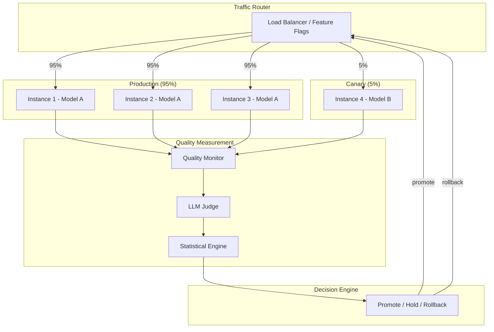
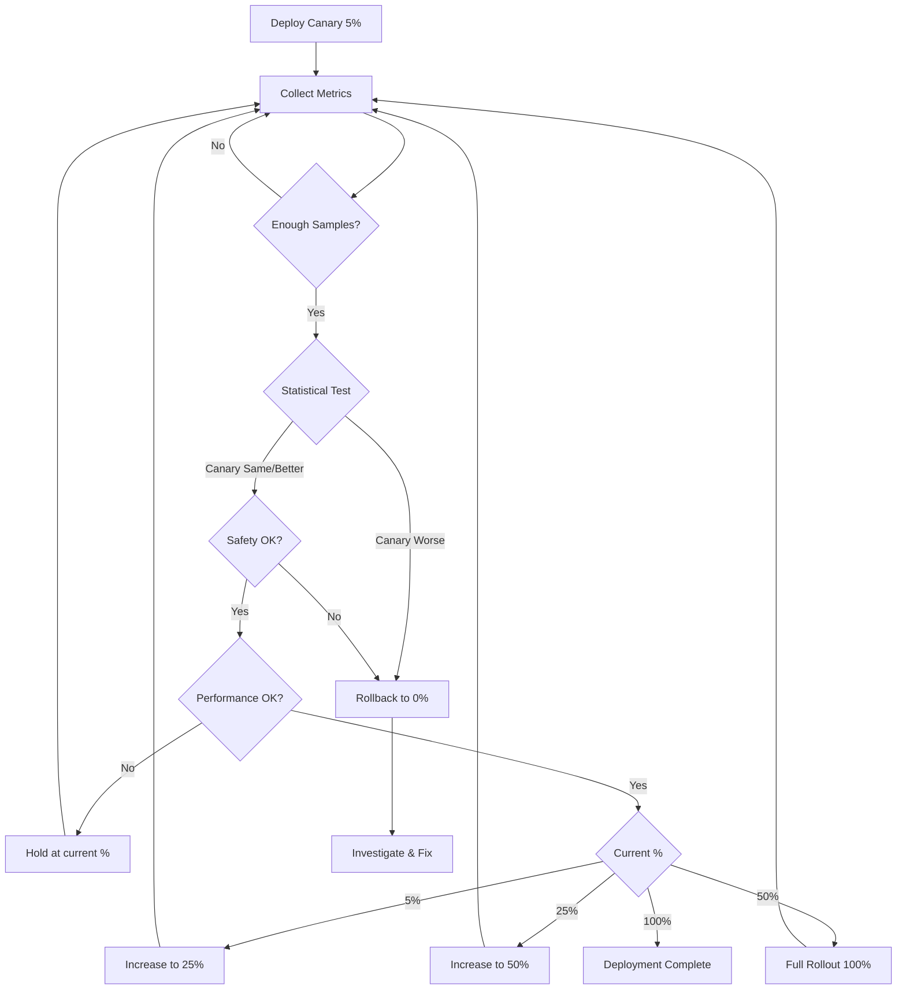

# Canary Deployment with Quality Gates for AI

## What is Canary Deployment?

### The "Canary in the Coal Mine" Analogy

Coal miners used to bring canaries into mines. If toxic gas was present, the canary would die first, warning miners to evacuate. The canary was exposed to danger so the majority stayed safe.

In deployment:
- **The canary**: A small percentage of traffic (5%) routed to the new version
- **The mine**: Production traffic with real users
- **Toxic gas**: Quality degradation, hallucinations, latency spikes
- **Warning signal**: Metrics from canary compared to production
- **Evacuation**: Rollback canary if metrics are bad

### Why Canary > Blue-Green for AI

Blue-green tests with synthetic data. Canary tests with **real users**:

```
Blue-Green Limitation:
├── Eval suite: 2000 golden test cases
├── Real traffic: 50,000+ unique queries/day
├── Gap: eval can't cover all real-world patterns
└── Result: model passes eval but fails on real edge cases

Canary Advantage:
├── Tests with actual user queries
├── Measures actual user satisfaction
├── Catches long-tail issues eval misses
├── Provides statistical proof of quality
└── Result: confidence with real-world evidence
```

### Canary vs Blue-Green: When to Use Each

| Scenario | Use Blue-Green | Use Canary |
|----------|---------------|------------|
| Major model change (GPT-3.5 → GPT-4) | ✓ (too risky for canary) | After blue-green validates |
| Prompt optimization | | ✓ (measure real improvement) |
| Guardrail config change | ✓ (safety-critical) | |
| RAG index update | | ✓ (measure retrieval quality) |
| Minor model version update | | ✓ |
| Combined: use blue-green first, then canary | ✓ then → | → ✓ |

## Canary Deployment Process for AI

### Architecture



### Step-by-Step Process

```
Step 1: Deploy Canary (5 min)
├── Deploy new version to canary instance(s)
├── Health check: canary is responding
├── Verify: canary uses correct release bundle
└── Enable: route 5% of traffic to canary

Step 2: Measure Quality (hours to days)
├── Every request to canary:
│   ├── Log: query, response, latency, tokens
│   ├── Score: run LLM judge on sample (10-20%)
│   └── Track: errors, timeouts, guardrail triggers
├── Every request to production:
│   ├── Same logging and scoring
│   └── Same metrics tracked
└── Continuous comparison: canary metrics vs production metrics

Step 3: Statistical Decision (when enough samples)
├── Calculate: statistical significance of quality difference
├── If canary significantly BETTER: promote (increase traffic %)
├── If canary significantly WORSE: rollback (0% traffic)
├── If no significant difference: hold (keep collecting data)
└── If safety violation: immediate rollback (no statistics needed)

Step 4: Gradual Promotion
├── 5% → 25%: increase if quality maintained for 24h
├── 25% → 50%: increase if quality maintained for 24h
├── 50% → 100%: full rollout if quality maintained for 24h
└── Total promotion time: 3-7 days (patience > speed)

Step 5: Cleanup
├── Remove old version instances
├── Update "production" label to new version
├── Archive canary metrics for future reference
└── Reset canary infrastructure for next deployment
```

## Traffic Splitting Strategies

### Strategy 1: Random Split

```python
def route_request(request):
    """Route 5% of requests randomly to canary."""
    if random.random() < 0.05:
        return "canary"
    return "production"
```

**Pros**: Simple, even distribution of query types
**Cons**: Same user might flip between versions (inconsistent experience)

### Strategy 2: User-Based (Sticky)

```python
def route_request(request):
    """Route specific users to canary (consistent experience)."""
    user_hash = hash(request.user_id) % 100
    if user_hash < 5:  # 5% of users
        return "canary"
    return "production"
```

**Pros**: Consistent user experience, can measure per-user satisfaction
**Cons**: Canary users might have different usage patterns than average

### Strategy 3: Query-Type Based

```python
def route_request(request):
    """Route specific query types to canary."""
    # Test new model on "safe" queries first
    if request.query_type in ["general_knowledge", "summarization"]:
        if random.random() < 0.10:  # 10% of safe queries
            return "canary"
    # Keep "risky" queries on production
    # (medical, legal, financial)
    return "production"
```

**Pros**: Limit blast radius for sensitive queries
**Cons**: Doesn't test canary on the hardest cases

### Strategy 4: Tenant-Based

```python
def route_request(request):
    """Route specific tenants to canary (B2B)."""
    canary_tenants = ["internal-team", "beta-customer-A", "beta-customer-B"]
    if request.tenant_id in canary_tenants:
        return "canary"
    return "production"
```

**Pros**: Controlled blast radius, can get explicit feedback from beta tenants
**Cons**: Small sample size, tenant-specific patterns

### Hybrid Strategy (Recommended)

```python
def route_request(request):
    """Hybrid: sticky users + query safety + override."""
    # Safety override: never canary for critical queries
    if request.is_safety_critical:
        return "production"
    
    # Sticky user assignment
    user_hash = hash(request.user_id) % 100
    if user_hash < 5:
        return "canary"
    
    return "production"
```

## Quality Metrics for Canary Comparison

### Metrics to Measure

```yaml
quality_metrics:
  faithfulness:
    description: "Does response accurately reflect source data?"
    measurement: "LLM judge scores 1-5"
    comparison: "canary_avg vs production_avg"
    threshold: "canary >= production - 0.1"
  
  hallucination_rate:
    description: "% of responses containing unsupported claims"
    measurement: "LLM judge binary (hallucinated: yes/no)"
    comparison: "canary_rate vs production_rate"
    threshold: "canary_rate <= production_rate + 2%"
  
  relevance:
    description: "Does response answer the user's question?"
    measurement: "LLM judge scores 1-5"
    comparison: "canary_avg vs production_avg"
    threshold: "canary >= production - 0.2"

performance_metrics:
  latency_p50:
    threshold: "canary <= production × 1.2"
  latency_p95:
    threshold: "canary <= production × 1.5"
  error_rate:
    threshold: "canary <= production + 1%"
  timeout_rate:
    threshold: "canary <= production + 0.5%"

cost_metrics:
  tokens_per_request:
    threshold: "canary <= production × 1.3"
  cost_per_request:
    threshold: "canary <= production × 1.5"

safety_metrics:
  guardrail_trigger_rate:
    threshold: "canary <= production × 1.2"
  toxicity_detected:
    threshold: "canary = 0 (zero tolerance)"
  pii_leak_rate:
    threshold: "canary = 0 (zero tolerance)"
```

### Scoring Pipeline

```
For each canary request (sample 20%):
├── Store: (query, response, context, metadata)
├── LLM Judge evaluation:
│   ├── Faithfulness: 1-5 score
│   ├── Relevance: 1-5 score
│   ├── Hallucination: yes/no
│   └── Completeness: 1-5 score
├── Automated checks:
│   ├── Response length (within expected range?)
│   ├── Format correct (JSON/markdown as expected?)
│   ├── Citations present (if RAG query)?
│   └── Tool calls valid?
└── Aggregate into hourly/daily metrics
```

## Statistical Significance for AI

### The Problem

```
Day 1 results:
  Production: 4.2/5 faithfulness (n=1000)
  Canary: 4.1/5 faithfulness (n=50)

Question: Is canary actually worse, or is this just random variance?
Answer: With only 50 samples, we CAN'T TELL. Need more data.
```

### Sample Size Calculation

```
Formula: n = (z² × p × (1-p)) / e²

Where:
  z = z-score for confidence level (1.96 for 95% confidence)
  p = expected proportion (e.g., 0.90 for 90% faithfulness)
  e = margin of error (e.g., 0.05 for ±5%)

Example: Detect 5% faithfulness drop with 95% confidence
  n = (1.96² × 0.90 × 0.10) / 0.05²
  n = (3.84 × 0.09) / 0.0025
  n = 0.346 / 0.0025
  n = 138 samples minimum per group

For detecting smaller differences (2%):
  n = (1.96² × 0.90 × 0.10) / 0.02²
  n = 0.346 / 0.0004
  n = 864 samples minimum per group
```

### Time to Decision

```
Given:
  Total traffic: 10,000 requests/day
  Canary split: 5% → 500 requests/day to canary
  Scoring sample: 20% → 100 scored canary requests/day

To detect 5% quality drop (need 138 samples):
  Time = 138 / 100 = 1.4 days ≈ 2 days

To detect 2% quality drop (need 864 samples):
  Time = 864 / 100 = 8.6 days ≈ 9 days

Trade-off:
  Larger canary % → faster decision, more users at risk
  Smaller canary % → slower decision, fewer users at risk
```

### Statistical Test Implementation

```python
from scipy import stats
import numpy as np

def is_canary_acceptable(production_scores, canary_scores, alpha=0.05):
    """
    Two-sample t-test: is canary significantly WORSE than production?
    Using one-sided test (we only care if canary is worse).
    """
    # Null hypothesis: canary >= production
    # Alternative: canary < production (canary is worse)
    t_stat, p_value = stats.ttest_ind(
        canary_scores, production_scores, 
        alternative='less'  # one-sided: is canary less?
    )
    
    if p_value < alpha:
        return "REJECT: canary is significantly worse"
    else:
        return "ACCEPT: no evidence canary is worse"

def has_enough_samples(n_canary, n_production, min_samples=138):
    """Check if we have enough samples for a valid decision."""
    return n_canary >= min_samples and n_production >= min_samples

def canary_decision(production_scores, canary_scores):
    """Make promotion/rollback/hold decision."""
    if not has_enough_samples(len(canary_scores), len(production_scores)):
        return "HOLD: insufficient samples"
    
    result = is_canary_acceptable(production_scores, canary_scores)
    
    if "REJECT" in result:
        return "ROLLBACK: canary quality is worse"
    
    # Check if canary is significantly BETTER
    t_stat, p_value = stats.ttest_ind(
        canary_scores, production_scores,
        alternative='greater'
    )
    if p_value < 0.05:
        return "PROMOTE: canary quality is better"
    
    return "PROMOTE: canary quality is equivalent (not worse)"
```

## Auto-Promotion Rules

### Promotion Criteria (ALL must be true)

```yaml
auto_promotion:
  conditions:
    quality:
      - metric: faithfulness
        rule: "canary_avg >= production_avg - 0.1 for 3 consecutive days"
      - metric: hallucination_rate
        rule: "canary_rate <= production_rate + 2% for 3 consecutive days"
    
    performance:
      - metric: latency_p95
        rule: "canary_p95 <= production_p95 × 1.1 for 2 consecutive days"
      - metric: error_rate
        rule: "canary_errors <= production_errors + 1% for 2 consecutive days"
    
    cost:
      - metric: cost_per_request
        rule: "canary_cost <= production_cost × 1.15"
    
    safety:
      - metric: safety_violations
        rule: "canary_violations == 0 for entire canary period"
    
    statistical:
      - rule: "minimum 200 scored samples collected"
      - rule: "p-value < 0.05 for non-inferiority test"
  
  promotion_schedule:
    - from: 5%
      to: 25%
      after: "conditions met for 24 hours"
    - from: 25%
      to: 50%
      after: "conditions met for 24 hours"
    - from: 50%
      to: 100%
      after: "conditions met for 24 hours"
```

### Promotion Flow



## Auto-Rollback Triggers

### Immediate Rollback (No Statistics Needed)

```yaml
immediate_rollback_triggers:
  - condition: "any safety guardrail violation detected"
    action: "instant rollback, page on-call"
  
  - condition: "error_rate > 10%"
    action: "instant rollback"
  
  - condition: "latency_p95 > 30 seconds"
    action: "instant rollback"
  
  - condition: "canary instance unhealthy (no response for 30s)"
    action: "instant rollback"
  
  - condition: "PII detected in response"
    action: "instant rollback, security alert"
```

### Statistical Rollback (After Enough Data)

```yaml
statistical_rollback_triggers:
  - condition: "hallucination_rate > production + 5% (p < 0.05)"
    action: "rollback within 5 minutes"
  
  - condition: "faithfulness < production - 0.3 (p < 0.05)"
    action: "rollback within 5 minutes"
  
  - condition: "cost_per_request > production × 2"
    action: "rollback within 15 minutes"
  
  - condition: "user_satisfaction (thumbs down) > production × 1.5"
    action: "rollback within 30 minutes"
```

### Rollback Process

```
Rollback Execution (< 30 seconds total):
├── T+0s: Trigger detected
├── T+1s: Alert fired to monitoring
├── T+2s: Load balancer updated (canary traffic → 0%)
├── T+3s: Verify: no new requests reaching canary
├── T+5s: Canary instances marked "quarantined"
├── T+10s: On-call engineer paged
├── T+30s: Automated incident ticket created
└── Canary kept running for investigation (read-only)
```

## Advanced Patterns

### Multi-Metric Canary Scoring

```python
def composite_canary_score(metrics):
    """
    Combine multiple metrics into single canary health score.
    Score 0-100: below 70 = rollback, 70-85 = hold, above 85 = promote.
    """
    weights = {
        'faithfulness': 0.30,
        'hallucination_free': 0.25,
        'latency_acceptable': 0.20,
        'error_free': 0.15,
        'cost_acceptable': 0.10
    }
    
    scores = {
        'faithfulness': min(100, metrics['faithfulness_avg'] / 4.5 * 100),
        'hallucination_free': max(0, 100 - metrics['hallucination_rate'] * 500),
        'latency_acceptable': min(100, metrics['prod_p95'] / metrics['canary_p95'] * 100),
        'error_free': max(0, 100 - metrics['error_rate'] * 1000),
        'cost_acceptable': min(100, metrics['prod_cost'] / metrics['canary_cost'] * 100),
    }
    
    composite = sum(scores[k] * weights[k] for k in weights)
    return composite
```

### Dark Canary (Shadow Mode)

```
Pattern: Test canary WITHOUT serving its responses to users

Flow:
├── User sends request
├── Request goes to production (user gets production response)
├── Request ALSO goes to canary (silently, in background)
├── Compare: canary response vs production response
├── Measure: would canary have been better/worse?
└── Decide: promote to real canary only if shadow results are good

Use when:
├── Very risky changes (new model family)
├── Safety-critical applications
├── First deployment of AI system (no trust yet)
└── Compliance requirement: prove quality before exposing users
```

### Progressive Canary with Segments

```
Week 1: Internal users only (5% = just your team)
├── Fix obvious issues
├── Gather baseline metrics

Week 2: Beta users (5% = opted-in external users)  
├── Real queries but from informed users
├── Explicit feedback collection

Week 3: General canary (5% = random production users)
├── True production test
├── Statistical comparison

Week 4: Promotion (5% → 25% → 50% → 100%)
├── Gradual rollout with monitoring
└── Full deployment
```

## Operational Considerations

### Canary Duration Planning

```
Factor: Traffic volume → higher volume = faster decisions
Factor: Quality sensitivity → more sensitive = need more samples  
Factor: Deployment urgency → more urgent = accept higher risk %
Factor: Change magnitude → bigger change = longer canary period

Typical durations:
├── Prompt tweak: 2-3 days canary
├── Model version update: 5-7 days canary
├── New model family: 7-14 days canary (+ shadow period before)
├── RAG index update: 3-5 days canary
└── Guardrail change: 1-2 days canary (mostly safety monitoring)
```

### Cost of Canary

```
Extra infrastructure: ~5-10% (just one extra instance)
Extra evaluation: LLM judge calls on 20% of canary traffic
  - 500 canary requests/day × 20% judged = 100 judge calls/day
  - At $0.03/judge call = $3/day
  - Monthly: ~$90/month for quality monitoring

Total canary overhead: <<< cost of bad deployment
```

## Key Takeaways

1. **Canary tests with REAL traffic — catches what eval suites miss**
2. **Statistical significance is required — don't make decisions on small samples**
3. **Patience > speed — 3-7 days of canary saves months of incident recovery**
4. **Auto-rollback on safety violations — no statistics needed, instant action**
5. **Gradual promotion (5→25→50→100) — each step builds confidence**
6. **Combine with blue-green: blue-green validates, canary confirms with real traffic**
