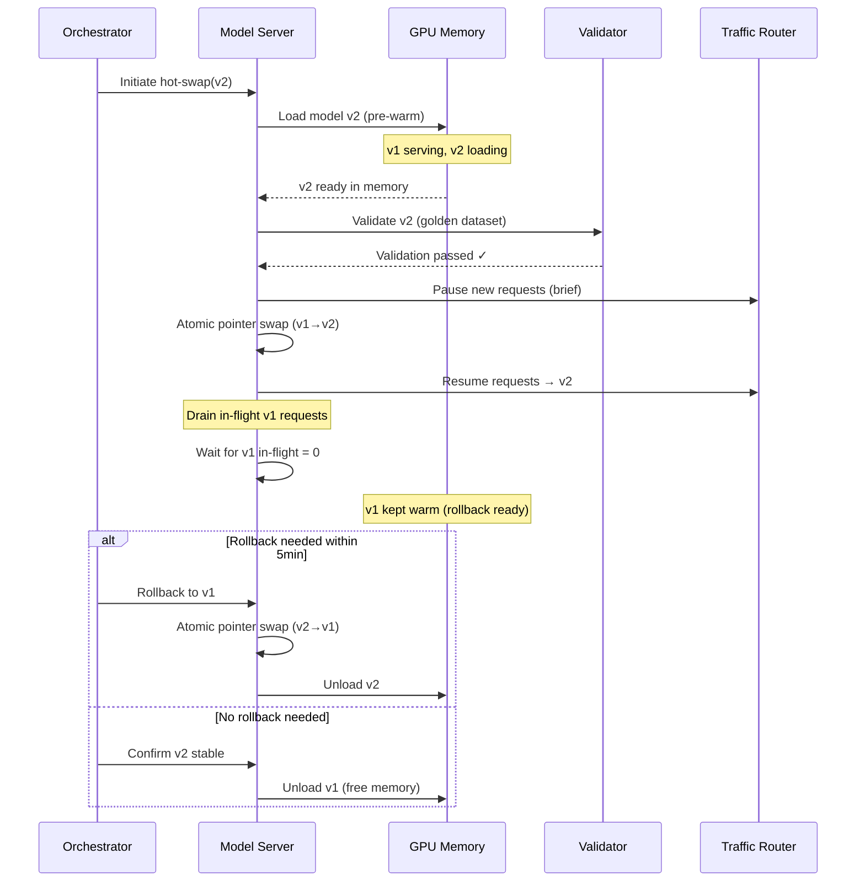

# Model Hot-Swap Architecture

## Why Model Hot-Swap

Zero-downtime model replacement is essential for:
- **Security patches**: CVE in a model dependency requires immediate update
- **Performance upgrades**: new model version is 2x faster at same quality
- **Cost optimization**: switching to cheaper model that meets quality bar
- **Compliance**: model must be replaced due to licensing or data handling changes
- **Quality improvements**: fine-tuned version ready to replace base model

In production systems serving thousands of requests per second, even seconds of downtime means failed requests, broken user experiences, and SLA violations.

## Architecture: Version-Aware Model Server

```python
class ModelServer:
    def __init__(self):
        self.active_model: Model = None
        self.standby_model: Model = None
        self.active_version: str = None
        self.standby_version: str = None
        self.state: ServerState = ServerState.SERVING
        self.in_flight_requests: AtomicCounter = AtomicCounter(0)
        
    async def serve(self, request: InferenceRequest) -> InferenceResponse:
        self.in_flight_requests.increment()
        try:
            model = self.active_model
            return await model.infer(request)
        finally:
            self.in_flight_requests.decrement()
    
    async def hot_swap(self, new_version: str):
        """Zero-downtime model replacement"""
        # Phase 1: Load new model alongside active
        self.standby_model = await self.load_model(new_version)
        self.standby_version = new_version
        
        # Phase 2: Validate new model
        if not await self.validate(self.standby_model):
            await self.unload_model(self.standby_model)
            raise ValidationError(f"Model {new_version} failed validation")
        
        # Phase 3: Atomic swap
        old_model = self.active_model
        self.active_model = self.standby_model  # atomic pointer swap
        self.active_version = new_version
        
        # Phase 4: Drain old model
        await self.drain(old_model)
        
        # Phase 5: Keep old model warm for rollback
        self.standby_model = old_model
```

## Hot-Swap Sequence Diagram



## Graceful Drain

Never kill in-flight requests. The drain process:

```python
async def drain(self, old_model: Model, timeout_seconds: int = 30):
    """Wait for all in-flight requests to complete on old model"""
    deadline = time.time() + timeout_seconds
    
    while old_model.in_flight_count > 0:
        if time.time() > deadline:
            # Force-complete remaining requests with error
            logger.warning(f"Drain timeout: {old_model.in_flight_count} requests remaining")
            old_model.force_drain()
            break
        await asyncio.sleep(0.1)
    
    logger.info(f"Drain complete for model {old_model.version}")
```

**Key considerations:**
- Set drain timeout based on your p99 latency (e.g., if p99 is 5s, drain timeout = 30s)
- Monitor drain duration as a metric
- Alert if drain consistently hits timeout (indicates request handling issues)

## Pre-Warming

Loading a model into GPU memory takes time. Pre-warm before swap:

```python
async def pre_warm(self, model_path: str, version: str) -> Model:
    """Load model into GPU memory without serving traffic"""
    
    # Allocate GPU memory for new model
    gpu_slot = await self.gpu_manager.reserve_slot(
        memory_required=model.memory_footprint,
        purpose="pre-warm"
    )
    
    # Load weights into GPU
    model = await Model.load(
        path=model_path,
        version=version,
        gpu_slot=gpu_slot,
        warmup_requests=100  # run inference on dummy data to warm caches
    )
    
    # Verify model responds correctly
    warmup_response = await model.infer(self.warmup_request)
    assert warmup_response.status == "ok"
    
    return model
```

**Pre-warming timeline:**
- Small model (7B params): 10-30 seconds
- Medium model (70B params): 1-5 minutes
- Large model (400B+ params): 5-15 minutes

## Validation Gate

Never swap to a model that hasn't been validated:

```python
async def validate(self, model: Model) -> bool:
    """Run golden dataset through new model before swap"""
    
    golden_dataset = await self.load_golden_dataset()
    results = []
    
    for sample in golden_dataset:
        response = await model.infer(sample.input)
        score = self.evaluator.score(
            response=response,
            expected=sample.expected_output,
            metrics=["accuracy", "latency", "format_compliance"]
        )
        results.append(score)
    
    # Aggregate scores
    avg_accuracy = mean([r.accuracy for r in results])
    p99_latency = percentile([r.latency for r in results], 99)
    format_pass_rate = mean([r.format_compliance for r in results])
    
    # All gates must pass
    gates = [
        avg_accuracy >= self.config.min_accuracy,      # e.g., 0.95
        p99_latency <= self.config.max_latency_ms,     # e.g., 2000ms
        format_pass_rate >= self.config.min_format,     # e.g., 0.99
    ]
    
    if not all(gates):
        logger.error(f"Validation failed: accuracy={avg_accuracy}, "
                    f"latency_p99={p99_latency}, format={format_pass_rate}")
        return False
    
    return True
```

## Atomic Pointer Swap

The actual switch must be instantaneous:

```python
# Using atomic reference (language-dependent implementation)
import threading

class AtomicModelReference:
    def __init__(self, model: Model):
        self._lock = threading.Lock()
        self._model = model
    
    def swap(self, new_model: Model) -> Model:
        """Atomic swap - returns old model"""
        with self._lock:
            old = self._model
            self._model = new_model
            return old
    
    @property
    def current(self) -> Model:
        return self._model

# In practice with async frameworks:
# - Use asyncio locks for Python async
# - Use AtomicReference in Java
# - Use std::atomic in C++
# - Use load balancer weight shifting for distributed swap
```

## Rollback Strategy

Keep the old model warm for instant revert:

```yaml
rollback_policy:
  warm_standby_duration: "5 minutes"  # keep old model in GPU memory
  cold_standby_duration: "24 hours"   # keep old model on disk
  rollback_triggers:
    - error_rate_increase: "> 5% above baseline"
    - latency_increase: "> 50% above p99 baseline"
    - quality_score_drop: "> 10% below baseline"
    - manual_trigger: "ops team can trigger instantly"
  
  automatic_rollback:
    enabled: true
    evaluation_window: "2 minutes post-swap"
    metrics_source: "real-time inference metrics"
```

```python
async def rollback(self):
    """Instant rollback to previous model version"""
    if self.standby_model is None:
        raise RollbackError("No standby model available for rollback")
    
    # Swap back (standby is the old model we kept warm)
    old_new = self.active_model
    self.active_model = self.standby_model
    self.active_version = self.standby_model.version
    
    # Now the failed new model becomes standby (or unload it)
    await self.unload_model(old_new)
    self.standby_model = None
    
    logger.critical(f"ROLLBACK complete: now serving {self.active_version}")
    await self.alert_ops("Model rollback executed")
```

## Memory Management

Running two models simultaneously requires careful GPU memory management:

```yaml
gpu_memory_strategy:
  # For hot-swap, you need headroom for 2 models
  total_gpu_memory: "80GB (A100)"
  
  normal_operation:
    active_model: "40GB"
    kv_cache: "30GB"
    overhead: "10GB"
  
  during_hot_swap:
    active_model: "40GB"
    new_model_loading: "40GB"  # Requires reducing KV cache temporarily
    kv_cache: "reduced to 0GB during swap"
    
  strategies:
    - "Use model quantization to reduce memory per model"
    - "Temporarily reduce batch size during swap"
    - "Use CPU offloading for standby model weights"
    - "Reserve dedicated GPU for swap operations in multi-GPU setup"
    - "Use memory-mapped files for fast reload"
```

### Multi-GPU Swap Strategy

```python
class MultiGPUSwapStrategy:
    """For models spanning multiple GPUs"""
    
    async def rolling_swap(self, nodes: List[GPUNode], new_version: str):
        """Swap one node at a time, maintaining capacity"""
        for node in nodes:
            # Remove node from load balancer
            await self.lb.remove(node)
            
            # Swap model on this node
            await node.hot_swap(new_version)
            
            # Validate this node
            if not await self.validate_node(node):
                await node.rollback()
                raise SwapError(f"Node {node.id} failed validation")
            
            # Re-add to load balancer
            await self.lb.add(node)
            
            # Brief pause to verify metrics
            await asyncio.sleep(30)
```

## Anti-Patterns

### Cold Swap (Downtime)
- **What**: Stop old model, load new model, start serving
- **Impact**: 30s-15min downtime depending on model size
- **Fix**: Pre-warm new model before swap

### No Validation Before Swap
- **What**: Deploy new model directly to production
- **Impact**: Bad model serves live traffic, quality drops
- **Fix**: Always validate against golden dataset

### No Rollback Path
- **What**: Unload old model immediately after swap
- **Impact**: If new model fails, recovery takes minutes (reload from disk)
- **Fix**: Keep old model warm in memory for rollback window

### Swap During Peak Traffic
- **What**: Trigger hot-swap during highest traffic period
- **Impact**: Reduced capacity during swap (memory contention)
- **Fix**: Schedule swaps during low-traffic windows when possible

### No Drain Period
- **What**: Kill in-flight requests during swap
- **Impact**: Users see errors, retry storms
- **Fix**: Always drain gracefully with timeout

## Staff Considerations: Fleet-Wide Hot-Swap

For a fleet of GPU nodes serving the same model:

```yaml
fleet_swap_strategy:
  approach: "rolling"
  batch_size: "10% of fleet at a time"
  validation_between_batches: true
  automatic_pause_on_error: true
  
  sequence:
    1. "Validate new model on canary node (1 node)"
    2. "Monitor canary for 5 minutes"
    3. "Swap 10% of fleet"
    4. "Monitor for 2 minutes"
    5. "Swap next 10%"
    6. "Repeat until 100%"
    7. "Keep rollback capacity for 30 minutes"
    
  coordination:
    - "Distributed lock prevents concurrent swaps"
    - "Central orchestrator tracks swap progress"
    - "Health checks gate each batch"
    - "Single command to halt/rollback entire fleet"
```

**Key staff decisions:**
1. How much spare GPU capacity to maintain for swap headroom
2. Whether to use rolling swap (slower, safer) or synchronized swap (faster, riskier)
3. Rollback window duration (cost of keeping old model warm vs risk)
4. Automation level (fully automated vs human-approved gates)

---

*Next: [05-progressive-delivery-for-ai.md](./05-progressive-delivery-for-ai.md)*
