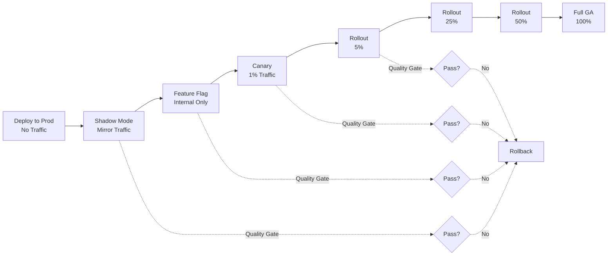

# Progressive Delivery for AI

## Beyond Basic Canary

Basic canary deploys split traffic by percentage. Progressive delivery is a full lifecycle with quality gates, feature flags, shadow testing, and automated rollback at every stage.

## Progressive Delivery Lifecycle

```
Deploy → Shadow Mode → Feature Flag (internal) → Canary (1%) → 
Gradual Rollout (5% → 25% → 50% → 100%) → Full GA
```

Each stage has:
- Entry criteria (what must be true to enter)
- Quality gates (what's measured during)
- Exit criteria (what must be true to advance)
- Rollback triggers (what causes automatic revert)

## Progressive Delivery Pipeline



## Quality Gates

### Automated Evaluation at Each Stage

```python
class QualityGate:
    def __init__(self, stage: str, config: GateConfig):
        self.stage = stage
        self.config = config
    
    async def evaluate(self, metrics: StageMetrics) -> GateResult:
        checks = {
            "latency": metrics.p99_latency <= self.config.max_latency_ms,
            "error_rate": metrics.error_rate <= self.config.max_error_rate,
            "quality_score": metrics.avg_quality >= self.config.min_quality,
            "cost_per_request": metrics.cost <= self.config.max_cost,
            "guardrail_violations": metrics.violations <= self.config.max_violations,
        }
        
        passed = all(checks.values())
        return GateResult(
            stage=self.stage,
            passed=passed,
            checks=checks,
            recommendation="advance" if passed else "rollback"
        )

# Gate configurations get stricter as rollout increases
gates = {
    "shadow": GateConfig(max_latency_ms=5000, max_error_rate=0.05, min_quality=0.85),
    "canary": GateConfig(max_latency_ms=3000, max_error_rate=0.02, min_quality=0.90),
    "rollout_25": GateConfig(max_latency_ms=2500, max_error_rate=0.01, min_quality=0.92),
    "rollout_50": GateConfig(max_latency_ms=2000, max_error_rate=0.005, min_quality=0.95),
}
```

## Feature Flags for AI

### Model Version Per User Segment

```python
class AIFeatureFlags:
    def get_model_version(self, user: User, use_case: str) -> str:
        # Internal dogfooding
        if user.is_internal_employee:
            return "gpt-4o-2024-08-new"
        
        # Beta testers
        if user.in_segment("ai-beta"):
            return "gpt-4o-2024-08-new"
        
        # A/B test
        if self.ab_test("model-upgrade-q3").variant(user) == "treatment":
            return "gpt-4o-2024-08-new"
        
        # Default: stable version
        return "gpt-4o-2024-05-stable"
    
    def get_prompt_version(self, user: User, feature: str) -> str:
        """Prompt versions can also be feature-flagged"""
        if self.flag(f"{feature}-new-prompt").enabled_for(user):
            return "v2"
        return "v1"
```

### A/B Test Integration

```yaml
ab_test_config:
  name: "model-upgrade-q3-2024"
  hypothesis: "GPT-4o August version improves user satisfaction by 5%"
  
  variants:
    control:
      model: "gpt-4o-2024-05"
      prompt: "v1"
      allocation: 50%
    treatment:
      model: "gpt-4o-2024-08"
      prompt: "v1"  # only change one variable
      allocation: 50%
  
  metrics:
    primary: "user_satisfaction_rating"
    secondary: ["task_completion_rate", "response_latency", "cost_per_session"]
    guardrail: ["error_rate", "safety_violation_rate"]
  
  duration: "2 weeks"
  minimum_sample_size: 10000
  statistical_significance: 0.95
```

## Shadow Mode

New model processes all traffic, but results are discarded. Only metrics are collected.

```python
class ShadowDeployment:
    def __init__(self, primary: Model, shadow: Model):
        self.primary = primary
        self.shadow = shadow
    
    async def serve(self, request: Request) -> Response:
        # Primary serves the actual response
        primary_response = await self.primary.infer(request)
        
        # Shadow processes in background (non-blocking)
        asyncio.create_task(self._shadow_process(request, primary_response))
        
        return primary_response
    
    async def _shadow_process(self, request: Request, primary_response: Response):
        try:
            shadow_response = await self.shadow.infer(request)
            
            # Compare responses
            comparison = self.compare(primary_response, shadow_response)
            
            # Record metrics (never affect user)
            await self.metrics.record({
                "shadow_latency": shadow_response.latency,
                "shadow_quality": shadow_response.quality_score,
                "response_similarity": comparison.similarity,
                "regression_detected": comparison.is_regression,
            })
        except Exception as e:
            # Shadow failures never affect production
            logger.warning(f"Shadow model error: {e}")
```

**Shadow mode duration**: Typically 1-3 days, enough to see traffic patterns across peak/off-peak.

## Traffic Mirroring

Duplicate requests to new model for side-by-side comparison:

```yaml
traffic_mirror_config:
  mode: "async-mirror"  # don't add latency to primary path
  sample_rate: 0.1      # mirror 10% of traffic (cost control)
  
  comparison_metrics:
    - semantic_similarity    # are responses saying the same thing?
    - format_compliance      # does new model follow output format?
    - latency_difference     # is new model faster/slower?
    - token_count_difference # is new model more/less verbose?
    - safety_score_difference # any safety regressions?
  
  alerting:
    regression_threshold: 0.1  # alert if >10% worse on any metric
    sample_size_for_alert: 1000  # need enough samples before alerting
```

## Multi-Dimensional Rollout

### By Geography

```yaml
rollout_by_geo:
  stage_1: ["us-west-2"]        # lowest traffic region first
  stage_2: ["us-east-1"]        # primary US region
  stage_3: ["eu-west-1"]        # EU (different compliance)
  stage_4: ["ap-southeast-1"]   # APAC
  
  wait_between_stages: "4 hours"
  rollback_scope: "per-region"  # can rollback individual regions
```

### By Customer Tier

```yaml
rollout_by_tier:
  stage_1: "internal"           # dogfooding
  stage_2: "free_tier"          # lowest business risk
  stage_3: "pro_tier"           # medium business risk
  stage_4: "enterprise_tier"    # highest business risk, last
  
  rationale: "Enterprise customers have SLAs; validate on lower tiers first"
```

### By Use Case

```yaml
rollout_by_use_case:
  stage_1: "autocomplete"       # low-stakes, high-volume
  stage_2: "summarization"      # medium-stakes
  stage_3: "code_generation"    # high-stakes, complex
  stage_4: "customer_support"   # user-facing, reputation risk
```

## Automated Rollback Triggers

```python
class RollbackController:
    def __init__(self, config: RollbackConfig):
        self.config = config
        self.baseline_metrics = None
    
    async def monitor(self, current_metrics: Metrics) -> Action:
        # Latency spike
        if current_metrics.p99_latency > self.baseline_metrics.p99_latency * 1.5:
            return Action.ROLLBACK, "Latency 50%+ above baseline"
        
        # Quality drop
        if current_metrics.quality_score < self.baseline_metrics.quality_score * 0.9:
            return Action.ROLLBACK, "Quality 10%+ below baseline"
        
        # Cost increase
        if current_metrics.cost_per_request > self.config.max_cost:
            return Action.PAUSE, "Cost exceeds budget"
        
        # Error rate
        if current_metrics.error_rate > self.config.max_error_rate:
            return Action.ROLLBACK, "Error rate exceeds threshold"
        
        # Guardrail violations
        if current_metrics.safety_violations > self.config.max_violations:
            return Action.ROLLBACK, "Safety violation spike"
        
        return Action.CONTINUE, "All metrics healthy"
```

### Rollback Speed Requirements

```yaml
rollback_sla:
  detection_time: "< 30 seconds"    # metrics pipeline latency
  decision_time: "< 10 seconds"     # automated, no human approval
  execution_time: "< 60 seconds"    # traffic shift back to old model
  total_time: "< 2 minutes"         # from regression to recovery
  
  # For manual rollback (human in loop):
  manual_detection: "< 5 minutes"   # alert → human acknowledges
  manual_execution: "< 2 minutes"   # single command/button
```

## Observability Integration

### Dashboards for Each Rollout Stage

```yaml
progressive_delivery_dashboard:
  panels:
    - title: "Rollout Progress"
      type: "gauge"
      metric: "rollout_percentage"
      thresholds: [1, 5, 25, 50, 100]
    
    - title: "Quality: New vs Old"
      type: "comparison_chart"
      metrics: ["new_model_quality", "old_model_quality"]
      alert_on: "new < old - 0.05"
    
    - title: "Latency: New vs Old"
      type: "comparison_chart"
      metrics: ["new_model_p99", "old_model_p99"]
    
    - title: "Error Rate by Model Version"
      type: "timeseries"
      group_by: "model_version"
    
    - title: "Cost Impact"
      type: "counter"
      metric: "projected_monthly_cost_delta"
    
    - title: "Rollback Events"
      type: "event_log"
      filter: "event_type=rollback"
```

### Structured Logging for Rollout

```python
# Every inference request includes rollout context
logger.info("inference_complete", extra={
    "model_version": "gpt-4o-2024-08",
    "rollout_stage": "canary",
    "rollout_percentage": 1,
    "feature_flag": "model-upgrade-q3",
    "user_segment": "beta",
    "latency_ms": 1250,
    "quality_score": 0.94,
    "tokens_used": 450,
    "cost_usd": 0.0023,
})
```

## Anti-Patterns

### Big-Bang Model Deployments
- **What**: Replace model for 100% of traffic at once
- **Impact**: If model is bad, all users affected simultaneously
- **Fix**: Always use progressive rollout, even for "minor" updates

### No Shadow Testing
- **What**: Skip shadow mode, go directly to canary
- **Impact**: Discover regressions only when they affect real users
- **Fix**: Shadow test for at least 24 hours before any live traffic

### Percentage-Only Rollout
- **What**: Roll out by random percentage without considering dimensions
- **Impact**: May not catch issues specific to regions, tiers, or use cases
- **Fix**: Multi-dimensional rollout (geo + tier + use case)

### Manual Quality Assessment
- **What**: Human reviews model output at each stage
- **Impact**: Slow, inconsistent, doesn't scale
- **Fix**: Automated eval metrics with clear pass/fail thresholds

### No Bake Time
- **What**: Advance through stages as fast as gates pass
- **Impact**: Miss time-dependent issues (daily patterns, edge cases)
- **Fix**: Minimum time at each stage (e.g., 4 hours at canary minimum)

## Case Study: How OpenAI Rolls Out New Model Versions

**Observed patterns from GPT-4 → GPT-4 Turbo → GPT-4o rollouts:**

1. **Preview/Beta period**: Model available under explicit opt-in (new model name)
2. **Parallel availability**: Old and new versions coexist for months
3. **Default switch**: Change default model for new conversations
4. **Deprecation notice**: 6+ months warning before old version removal
5. **Enterprise pinning**: Enterprise customers can pin to specific versions

**Lessons for internal platforms:**
- Never surprise your users with model changes
- Long parallel availability windows reduce migration pressure
- Version pinning for critical workloads
- Clear communication at every stage
- Deprecation is a process, not an event

---

*Next: [06-disaster-recovery-for-ai.md](./06-disaster-recovery-for-ai.md)*
