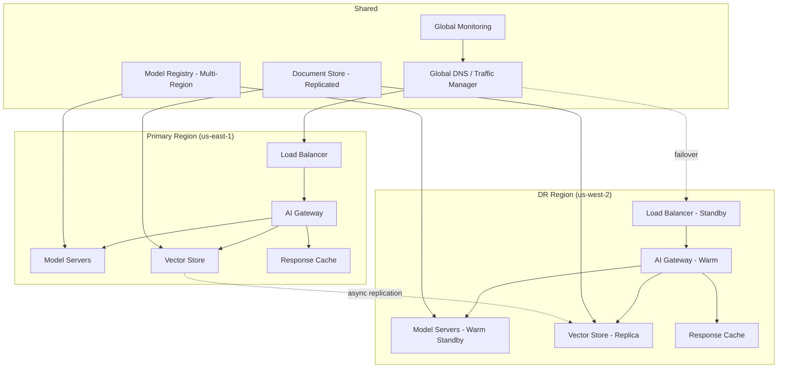

# Disaster Recovery for AI Systems

## AI-Specific Disasters

Traditional DR covers server failures and data loss. AI systems have unique failure modes:

### Model Corruption
- Model weights corrupted during deployment or storage
- Fine-tuning gone wrong (catastrophic forgetting)
- Poisoned training data affecting model behavior

### Embedding Drift
- Embedding model updated, all stored vectors now incompatible
- Semantic search returns irrelevant results
- RAG system silently degrades

### Knowledge Poisoning
- Malicious or incorrect documents ingested into knowledge base
- Vector store contains harmful content
- RAG system confidently returns wrong answers

### Prompt Injection at Scale
- Adversarial inputs compromise system prompts across many sessions
- Automated attacks exploiting model behavior
- Cascading failures as injected outputs feed into other systems

### Provider Outage
- OpenAI/Anthropic/cloud provider completely unavailable
- API rate limits hit unexpectedly
- Region-wide GPU failures

## RPO/RTO for AI Systems

```yaml
recovery_objectives:
  model_serving:
    rto: "5 minutes"     # max acceptable downtime
    rpo: "0"             # no data loss (stateless inference)
    justification: "User-facing, immediate business impact"
  
  vector_store:
    rto: "30 minutes"    # can serve degraded without RAG
    rpo: "24 hours"      # daily snapshots acceptable
    justification: "Can fallback to model-only responses"
  
  eval_pipeline:
    rto: "4 hours"       # not user-facing
    rpo: "1 week"        # eval data is reproducible
    justification: "Internal tool, no immediate user impact"
  
  fine_tuned_models:
    rto: "1 hour"        # fallback to base model
    rpo: "N/A"           # models are artifacts, not data
    justification: "Can serve base model while recovering"
```

## DR Architecture for AI Platform



## Multi-Region AI Deployment

### Active-Active

Both regions serve production traffic simultaneously.

```yaml
active_active:
  pros:
    - "Zero failover time (already serving)"
    - "Better latency for geographically distributed users"
    - "No cold-start on failover"
  cons:
    - "2x cost (full capacity in both regions)"
    - "Vector store consistency challenges"
    - "Model version sync required"
    - "Complex routing logic"
  
  when_to_use:
    - "RPO/RTO near zero required"
    - "Global user base"
    - "Budget allows 2x infrastructure"
```

### Active-Passive

Primary serves all traffic; DR region stays warm.

```yaml
active_passive:
  pros:
    - "Lower cost (DR at reduced capacity)"
    - "Simpler consistency model"
    - "Clear primary/secondary roles"
  cons:
    - "Failover takes minutes"
    - "DR region may have cold caches"
    - "GPU warm-up time on failover"
  
  when_to_use:
    - "RTO of 5-15 minutes acceptable"
    - "Cost-sensitive"
    - "Single-region user base"
    
  warm_standby_config:
    model_servers: "loaded but not serving (GPU memory warm)"
    vector_store: "async replica, < 1 hour lag"
    gateway: "running, health-checked, no traffic"
```

## Model Rollback

### Instant Revert to Known-Good Version

```python
class ModelRollbackService:
    def __init__(self, registry: ModelRegistry):
        self.registry = registry
    
    async def rollback(self, service: str, reason: str):
        """Revert to last known-good model version"""
        
        # Find last known-good version
        good_version = await self.registry.get_last_known_good(service)
        
        # Trigger hot-swap to good version
        await self.hot_swap_service.swap(
            service=service,
            target_version=good_version,
            skip_validation=False,  # still validate, even in emergency
            priority="critical"
        )
        
        # Record incident
        await self.incident_service.create(
            severity="P1",
            title=f"Model rollback: {service} → {good_version}",
            reason=reason
        )
    
    async def mark_known_good(self, service: str, version: str):
        """Mark a version as known-good after successful bake period"""
        await self.registry.set_known_good(service, version)
```

### Model Version Pinning

```yaml
version_pinning:
  production_services:
    chatbot:
      model: "gpt-4o-2024-05-13"
      pinned: true
      pin_reason: "Validated for compliance, do not auto-upgrade"
      next_review: "2024-09-01"
    
    search:
      model: "text-embedding-3-small"
      pinned: true
      pin_reason: "Embedding change requires full re-index"
      
    classification:
      model: "gpt-4o-mini-2024-07-18"
      pinned: false
      auto_upgrade: "minor versions only"
```

## Data Recovery: Rebuilding Vector Indexes

```python
class VectorStoreRecovery:
    async def rebuild_from_source(self, index_name: str):
        """Full rebuild of vector index from source documents"""
        
        # Step 1: Get all source documents
        documents = await self.document_store.list_all(index=index_name)
        logger.info(f"Rebuilding index {index_name} from {len(documents)} documents")
        
        # Step 2: Create new index (don't modify existing)
        new_index = f"{index_name}_rebuild_{timestamp()}"
        await self.vector_store.create_index(new_index)
        
        # Step 3: Re-embed all documents
        for batch in chunked(documents, size=100):
            embeddings = await self.embedding_service.embed_batch(batch)
            await self.vector_store.upsert(new_index, embeddings)
        
        # Step 4: Validate new index
        validation_passed = await self.validate_index(new_index)
        if not validation_passed:
            raise RecoveryError("Rebuilt index failed validation")
        
        # Step 5: Atomic swap
        await self.vector_store.swap_alias(index_name, new_index)
        
        # Step 6: Keep old index for rollback
        # Delete after 48 hours if no issues
```

**Recovery time estimates:**
- 10K documents: ~10 minutes
- 100K documents: ~1-2 hours
- 1M documents: ~8-12 hours
- 10M documents: ~3-5 days

## Graceful Degradation

### Fallback Chain

```python
class DegradationChain:
    async def serve(self, request: Request) -> Response:
        # Level 0: Full capability (primary model + RAG)
        try:
            return await self.full_pipeline(request)
        except PrimaryModelUnavailable:
            pass
        
        # Level 1: Fallback model (simpler/smaller model)
        try:
            return await self.fallback_model(request)
        except FallbackModelUnavailable:
            pass
        
        # Level 2: Cached responses (semantic similarity match)
        cached = await self.cache.find_similar(request, threshold=0.9)
        if cached:
            return Response(
                content=cached.content,
                metadata={"degraded": True, "source": "cache"}
            )
        
        # Level 3: Template responses
        template = self.get_template_response(request.intent)
        if template:
            return Response(
                content=template,
                metadata={"degraded": True, "source": "template"}
            )
        
        # Level 4: Human escalation
        return Response(
            content="I'm unable to help right now. Connecting you with a human agent.",
            metadata={"degraded": True, "source": "human_escalation"}
        )
```

### Degradation Levels

```yaml
degradation_levels:
  level_0_full:
    description: "Everything working"
    capability: "Full AI with RAG, guardrails, personalization"
    
  level_1_reduced_model:
    description: "Primary model down, using fallback"
    capability: "AI responses, possibly lower quality"
    user_impact: "Slightly less accurate responses"
    trigger: "Primary model error rate > 10%"
    
  level_2_cached:
    description: "All models down, serving cached responses"
    capability: "Pre-computed answers for common queries"
    user_impact: "Limited to known questions, stale data"
    trigger: "All model endpoints unavailable"
    
  level_3_static:
    description: "Cache miss, serving template responses"
    capability: "Generic helpful responses with links"
    user_impact: "No AI capability, basic guidance only"
    trigger: "Cache miss + all models down"
    
  level_4_human:
    description: "Complete AI failure, route to humans"
    capability: "Human agents handle requests"
    user_impact: "Slower response, but accurate"
    trigger: "Level 3 + request requires specific answer"
```

## Incident Response Playbook

### Detection

```yaml
detection_signals:
  automated:
    - error_rate_spike: "> 5% for 2 minutes"
    - latency_spike: "p99 > 10s for 3 minutes"
    - quality_score_drop: "avg score < 0.7 for 5 minutes"
    - guardrail_violation_spike: "> 10% of requests"
    - provider_health: "upstream API returning 5xx"
    
  manual:
    - user_reports: "support tickets about AI quality"
    - team_observation: "output looks wrong/harmful"
    - security_alert: "prompt injection pattern detected"
```

### Triage

```yaml
triage_decision_tree:
  is_safety_issue:
    yes: "Immediately disable affected endpoint, P0"
    no: "Continue triage"
  
  is_total_outage:
    yes: "Activate DR failover, P1"
    no: "Continue triage"
  
  is_quality_degradation:
    partial: "Enable degradation level 1, P2"
    severe: "Rollback to known-good model, P1"
  
  is_cost_issue:
    yes: "Enable rate limiting, investigate, P3"
```

### Containment → Recovery → Post-Mortem

```yaml
containment:
  actions:
    - "Activate degradation level appropriate to severity"
    - "Rollback model if quality issue"
    - "Failover region if infrastructure issue"
    - "Block malicious inputs if attack"
    - "Disable affected feature flag if partial"

recovery:
  actions:
    - "Deploy fix or known-good version"
    - "Rebuild vector index if corrupted"
    - "Restore from backup if data loss"
    - "Gradually restore traffic after fix"
    - "Validate with golden dataset before full restore"

post_mortem:
  within_48_hours:
    - "Timeline of events"
    - "Root cause analysis"
    - "What detection caught it / what missed"
    - "Customer impact assessment"
    - "Action items with owners and deadlines"
    - "How to prevent recurrence"
```

## Testing DR: Chaos Drills

### AI-Specific Chaos Tests

```yaml
chaos_drills:
  monthly:
    - name: "Kill primary model mid-request"
      action: "Terminate model server process"
      expected: "Requests fail over to fallback within 30s"
    
    - name: "Corrupt model response"
      action: "Inject garbage into model output"
      expected: "Guardrails catch and block, fallback activated"
    
    - name: "Provider API timeout"
      action: "Add 30s latency to upstream API"
      expected: "Circuit breaker opens, fallback model serves"

  quarterly:
    - name: "Full region failover"
      action: "Disable all AI services in primary region"
      expected: "DR region takes over within RTO target"
    
    - name: "Vector store corruption"
      action: "Delete 50% of vectors from index"
      expected: "Quality monitoring detects, rebuild triggered"
    
    - name: "Embedding model change simulation"
      action: "Swap embedding model without re-indexing"
      expected: "Similarity scores drop, alert fires, rollback"

  annual:
    - name: "Complete provider outage simulation"
      action: "Block all traffic to AI provider APIs"
      expected: "Degradation chain activates cleanly through all levels"
```

## Cost of DR

### Maintaining Warm Standby GPU Capacity

```yaml
dr_cost_model:
  active_active:
    gpu_cost: "2x production (full duplication)"
    storage_cost: "2x (replicated vector stores)"
    network_cost: "Cross-region replication traffic"
    total_overhead: "~100% of production cost"
    
  active_passive_warm:
    gpu_cost: "1.3-1.5x (GPUs allocated but underutilized)"
    storage_cost: "1.5x (replicated with slight lag)"
    network_cost: "Replication traffic (lower)"
    total_overhead: "~30-50% of production cost"
    
  active_passive_cold:
    gpu_cost: "1.0x (no DR GPUs until failover)"
    storage_cost: "1.2x (cold storage backups)"
    network_cost: "Minimal"
    total_overhead: "~10-20% of production cost"
    rto_penalty: "15-30 minutes (GPU allocation + model load)"
```

### Cost Optimization for DR

- **Spot/preemptible GPUs** for warm standby (accept eviction risk for DR)
- **Smaller model in DR** (use 7B model as fallback for 70B primary)
- **Shared DR capacity** across services (not all will fail simultaneously)
- **Response cache** as first line of defense (cheapest "availability")

## Anti-Patterns

### No Fallback Model
- **Impact**: Single point of failure; one model down = total outage
- **Fix**: Always have a simpler fallback (even if quality is lower)

### Single-Region AI
- **Impact**: Region outage = complete AI unavailability
- **Fix**: At minimum, active-passive in second region

### No Model Version Pinning
- **Impact**: Provider updates model, your system breaks silently
- **Fix**: Pin to specific versions, test before upgrading

### DR Plan Never Tested
- **Impact**: Discover DR doesn't work during actual disaster
- **Fix**: Monthly chaos drills, quarterly full failover tests

### Over-Engineering DR
- **Impact**: Spending 100% overhead for a system that's non-critical
- **Fix**: Match DR investment to actual business risk

## Staff Decision: DR Investment vs Business Risk

```yaml
decision_framework:
  questions:
    - "What's the revenue impact per minute of AI downtime?"
    - "Can users accomplish their task without AI (degraded experience)?"
    - "Are there regulatory requirements for availability?"
    - "What's the reputational damage of AI failure?"
    - "How often do failures actually occur?"
  
  recommendation_matrix:
    high_revenue_high_frequency:
      strategy: "Active-active, full redundancy"
      budget: "80-100% overhead"
      
    high_revenue_low_frequency:
      strategy: "Active-passive warm standby"
      budget: "30-50% overhead"
      
    low_revenue_any_frequency:
      strategy: "Graceful degradation + cold standby"
      budget: "10-20% overhead"
      
    non_critical:
      strategy: "Degradation chain only, no separate DR"
      budget: "5% overhead (caching layer)"
```

**Staff principle**: DR is insurance. Size your investment to the risk, not to theoretical perfection. A well-tested degradation chain is worth more than an untested multi-region failover.

---

*Previous: [05-progressive-delivery-for-ai.md](./05-progressive-delivery-for-ai.md)*
