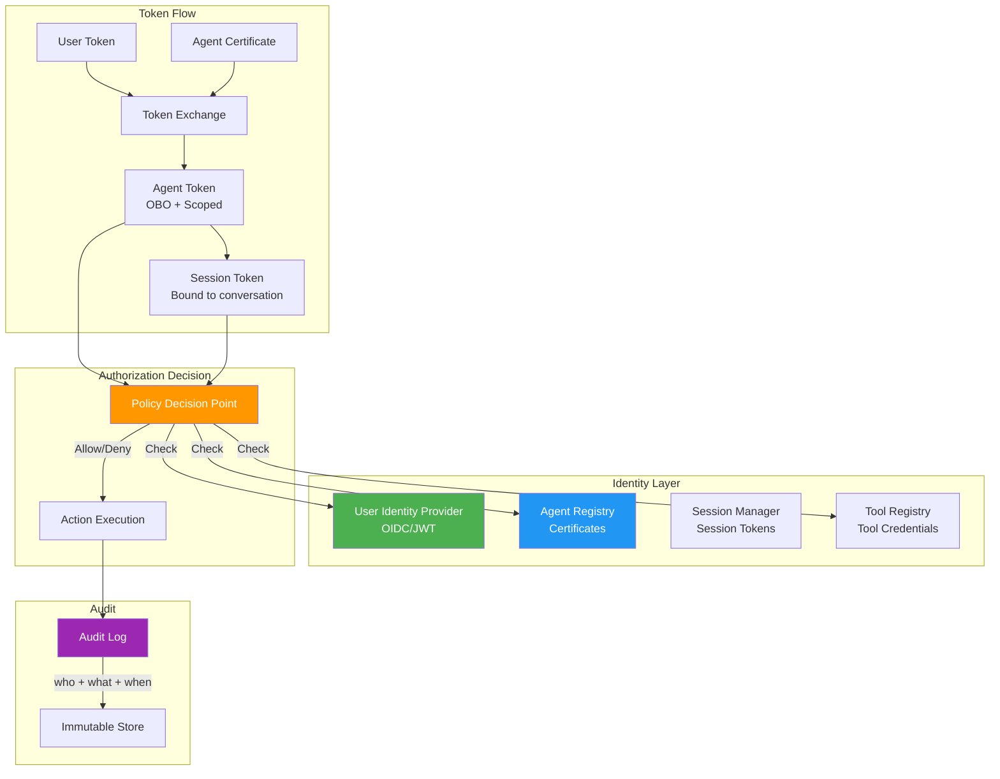

# Agent Identity Fundamentals

## The Identity Problem

> "Who is acting — the user, the agent, or the system?"

In traditional software, identity is straightforward: a user authenticates, gets a token, and that token represents them throughout the request lifecycle. In AI systems, this model breaks down because there are multiple actors in every request:

1. **The Human User** — initiated the request
2. **The AI Agent** — interprets and executes the request
3. **The System/Platform** — hosts and orchestrates everything
4. **External Tools** — called by the agent to fulfill the request

When an AI agent queries a database "on behalf of" a user, whose permissions apply? When it calls an external API, who is responsible? When it produces harmful output, who is accountable?

Without a clear identity model, you get:
- **Security holes**: agent uses system-level permissions for user requests
- **Audit gaps**: can't trace who did what
- **Compliance failures**: can't prove who accessed sensitive data
- **Accountability void**: no clear responsibility chain

---

## Agent Identity vs User Identity vs Service Identity

| Dimension | User Identity | Agent Identity | Service Identity |
|-----------|--------------|----------------|------------------|
| **Represents** | A human being | An AI agent instance | A backend service |
| **Authentication** | Password, MFA, biometrics | Certificate, client_id/secret | mTLS, service account |
| **Lifetime** | Long-lived (years) | Medium (days-months) | Long-lived (years) |
| **Permissions** | Based on role/attributes | Scoped to user + task | Full service permissions |
| **Accountability** | Human is responsible | Human + system share | System owner responsible |
| **Credential type** | JWT via OIDC | Certificate + JWT | Service account key |
| **Can be revoked** | Yes (disable account) | Yes (revoke certificate) | Yes (rotate key) |
| **Audit trail** | Actions by user | Actions by agent for user | Service-to-service calls |
| **Example** | `user:alice@corp.com` | `agent:assistant-v2/session-xyz` | `service:rag-pipeline` |

---

## The "Confused Deputy" Problem

The **confused deputy** problem occurs when an agent has its own system-level permissions but acts on behalf of a user who has fewer permissions.

```
┌─────────────────────────────────────────────────────────────────┐
│ CONFUSED DEPUTY SCENARIO                                         │
│                                                                   │
│ User (can read 5 files) → Agent (can read ALL files)             │
│                                                                   │
│ User asks: "Summarize the Q4 earnings report"                    │
│ Agent has access to ALL documents (it's a service)               │
│ Agent retrieves confidential board documents (user can't see!)   │
│ Agent returns summary including confidential information         │
│                                                                   │
│ RESULT: User sees data they shouldn't have access to             │
└─────────────────────────────────────────────────────────────────┘
```

**Why this happens:**
- Agent authenticates as itself (service identity)
- Service identity has broad permissions (needs to serve all users)
- No mechanism to "scope down" to the requesting user's permissions
- Agent doesn't check "would this user be allowed to see this?"

**The fix:** On-Behalf-Of delegation — agent always acts WITH user's permissions, not its own.

---

## Identity Model for AI Systems

### 1. User Identity
The human who initiated the request.

```
{
  "sub": "user_abc123",
  "email": "alice@company.com",
  "roles": ["analyst", "engineering"],
  "groups": ["team-data", "dept-engineering"],
  "iss": "https://auth.company.com",
  "iat": 1705312000,
  "exp": 1705315600
}
```

- **Source**: OIDC/JWT from identity provider (Entra ID, Okta, Auth0)
- **Purpose**: represents the human's identity and permissions
- **Scope**: everything the human is allowed to do

### 2. Agent Identity
The AI agent itself — a distinct entity with its own credentials.

```
{
  "sub": "agent:coordinator-v2",
  "agent_type": "coordinator",
  "version": "2.1.0",
  "capabilities": ["rag_search", "tool_call", "summarize"],
  "max_scope": ["read:documents", "read:databases"],
  "registered_at": "2024-01-01T00:00:00Z",
  "certificate_thumbprint": "SHA256:abc123..."
}
```

- **Source**: service principal / managed identity / certificate
- **Purpose**: identifies WHICH agent is executing
- **Scope**: maximum capabilities the agent CAN have (ceiling)

### 3. Session Identity
The specific conversation or task — binds user + agent for a bounded interaction.

```
{
  "session_id": "sess_789xyz",
  "user_id": "user_abc123",
  "agent_id": "agent:coordinator-v2",
  "created_at": "2024-01-15T10:00:00Z",
  "expires_at": "2024-01-15T11:00:00Z",
  "effective_scope": ["read:documents/engineering/*"],
  "delegation_chain": ["user_abc123 → coordinator-v2"],
  "tools_authorized": ["search", "summarize"]
}
```

- **Source**: created when user starts interacting with agent
- **Purpose**: bounds what this specific interaction can do
- **Scope**: intersection of user permissions AND agent capabilities

### 4. Tool Identity
Each external tool the agent calls has its own identity.

```
{
  "tool_id": "tool:database-query-v1",
  "tool_type": "read",
  "endpoints_allowed": ["db.internal:5432"],
  "max_rows": 1000,
  "allowed_tables": ["sales", "products"],
  "requires_approval": false
}
```

- **Source**: registered in tool registry with its own credentials
- **Purpose**: isolate tool access, limit blast radius
- **Scope**: what this specific tool can access

---

## Agent Identity Lifecycle

### 1. Registration
Agent gets a formal identity in the system.

```python
# Agent registration
agent_identity = {
    "agent_id": "agent:coordinator-v2",
    "client_id": "a1b2c3d4-e5f6-7890-abcd-ef1234567890",
    "certificate": generate_certificate(valid_days=90),
    "max_permissions": ["read:documents", "call:tools"],
    "owner": "platform-team@company.com",
    "registered_by": "admin:bob",
    "registered_at": "2024-01-01T00:00:00Z"
}
```

### 2. Authentication
Agent proves its identity on every request.

```python
# Agent authenticates using certificate
token = authenticate_agent(
    client_id="a1b2c3d4-e5f6-7890-abcd-ef1234567890",
    certificate=load_certificate("/certs/agent-coord-v2.pem"),
    scope="read:documents"
)
```

### 3. Authorization
Determine what the agent is allowed to do in this context.

```python
# Effective permissions = intersection of:
# 1. Agent's maximum permissions
# 2. User's permissions (OBO)
# 3. Session's granted scope
effective_permissions = (
    agent.max_permissions
    & user.permissions
    & session.granted_scope
)
```

### 4. Audit
All agent actions logged against its identity.

```python
audit_log.record({
    "agent_id": "agent:coordinator-v2",
    "user_id": "user_abc123",
    "session_id": "sess_789xyz",
    "action": "vector_search",
    "target": "collection:engineering-docs",
    "result": "allowed",
    "timestamp": "2024-01-15T10:23:45Z"
})
```

### 5. Rotation
Credentials rotate automatically before expiry.

```python
# Automated rotation every 90 days
if certificate.expires_in_days < 14:
    new_cert = generate_certificate(valid_days=90)
    update_agent_certificate(agent_id, new_cert)
    revoke_certificate(old_cert)
    notify_owner("Certificate rotated for agent:coordinator-v2")
```

### 6. Revocation
Instantly disable a compromised agent.

```python
# Emergency revocation
revoke_agent(
    agent_id="agent:coordinator-v2",
    reason="Potential compromise detected",
    revoked_by="security-team",
    immediate=True  # Don't wait for token expiry
)
# All active sessions terminated
# All cached tokens invalidated
# Alert sent to security team
```

---

## The Core Principle

> **"Agents should have the MINIMUM permissions needed, scoped to the user's permissions."**

This means:
1. Agent's effective permissions = `min(agent_max, user_permissions, task_requirements)`
2. Never give an agent standing permissions it doesn't need
3. Prefer just-in-time elevation over broad access
4. Every permission grant has an expiry
5. Default deny: if not explicitly allowed, it's forbidden

---

## Real-World Analogy: Agent as Lawyer

| Legal World | AI System |
|-------------|-----------|
| Client (person) | User (human) |
| Lawyer (professional) | AI Agent |
| Bar license | Agent registration/certificate |
| Power of Attorney | On-Behalf-Of token |
| Scope of representation | Permission scope |
| Court jurisdiction | System boundaries |
| Legal privilege | Data access controls |
| Case file | Session context |
| Bar association | Agent registry |
| Disbarment | Agent revocation |

Key insight: A lawyer has a bar license (their own identity/credential), but they can ONLY act within the scope their client authorizes them for. They can't represent client A using permissions from client B's case.

---

## Identity Model Architecture



---

## Summary

| Concept | Key Point |
|---------|-----------|
| Identity Problem | Multiple actors in every AI request |
| Confused Deputy | Agent must not use its own elevated permissions for user requests |
| Four Identities | User, Agent, Session, Tool — all distinct |
| Lifecycle | Register → Authenticate → Authorize → Audit → Rotate → Revoke |
| Core Principle | Minimum permissions, scoped to user |
| Analogy | Agent = Lawyer (own credentials, client's case scope) |

The identity model is the **foundation** of AI security. Without it, you cannot build delegation, permission-aware RAG, multi-tenant isolation, or tool authorization. Everything else in this module builds on this foundation.
