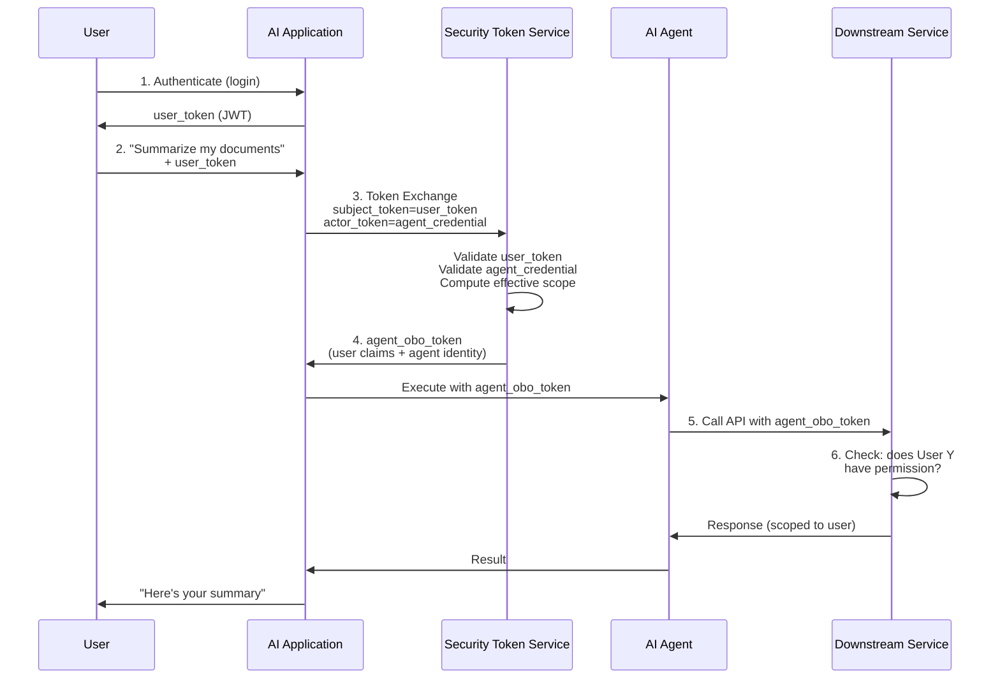
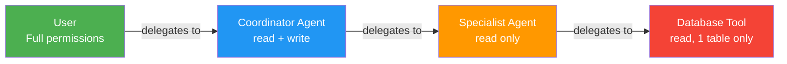
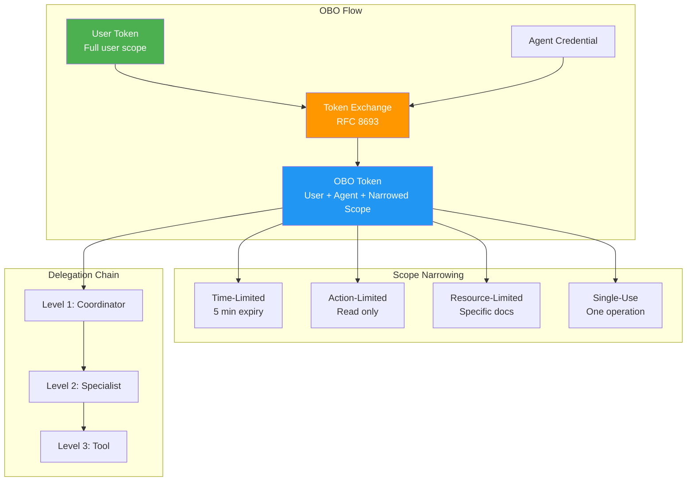

# On-Behalf-Of and Delegation

## What is On-Behalf-Of (OBO)?

On-Behalf-Of is an authorization pattern where an agent acts **WITH the user's permissions**, not its own. The agent's token carries both identities: "I am Agent X, acting on behalf of User Y."

The downstream service sees both and can:
1. Verify the agent is legitimate (agent identity)
2. Check what the USER is allowed to do (user identity)
3. Apply the user's permissions (not the agent's)

This solves the confused deputy problem: the agent can never access more than the user can.

---

## OAuth2 On-Behalf-Of Flow



### Step-by-Step Breakdown

**Step 1: User authenticates**
```
POST /oauth/token
grant_type=authorization_code
code=abc123
redirect_uri=https://app.company.com/callback

Response:
{
  "access_token": "eyJ...(user_token)",
  "token_type": "Bearer",
  "expires_in": 3600,
  "scope": "openid profile documents.read documents.write"
}
```

**Step 2: User calls AI system**
```
POST /api/chat
Authorization: Bearer <user_token>
{
  "message": "Summarize my Q4 sales documents"
}
```

**Step 3: AI system exchanges token**
```
POST /oauth/token
grant_type=urn:ietf:params:oauth:grant-type:token-exchange
subject_token=<user_token>
subject_token_type=urn:ietf:params:oauth:token-type:access_token
actor_token=<agent_client_assertion>
actor_token_type=urn:ietf:params:oauth:token-type:jwt
scope=documents.read  # NARROWER than user's full scope
resource=https://documents-api.company.com
```

**Step 4: STS returns OBO token**
```json
{
  "access_token": "eyJ...(obo_token)",
  "token_type": "Bearer",
  "expires_in": 300,
  "scope": "documents.read"
}
```

Decoded OBO token:
```json
{
  "sub": "user_abc123",
  "act": {
    "sub": "agent:coordinator-v2",
    "client_id": "a1b2c3d4..."
  },
  "scope": "documents.read",
  "aud": "https://documents-api.company.com",
  "exp": 1705312300,
  "iat": 1705312000
}
```

**Step 5: Agent calls downstream with OBO token**
```
GET /api/documents?filter=sales&quarter=Q4
Authorization: Bearer <obo_token>
```

**Step 6: Downstream checks USER's permissions**
```python
# Downstream service logic
def handle_request(token):
    user_id = token.claims["sub"]       # user_abc123
    agent_id = token.claims["act"]["sub"]  # agent:coordinator-v2
    
    # Check USER's permissions (not agent's)
    if not user_has_access(user_id, resource="sales-docs"):
        raise Forbidden("User does not have access")
    
    # Log that it was agent acting on behalf of user
    audit_log(user=user_id, agent=agent_id, action="read", resource="sales-docs")
    
    return get_documents(filter="sales", quarter="Q4")
```

---

## Token Exchange (RFC 8693)

RFC 8693 defines the standard token exchange protocol.

### Request Format

```
POST /oauth/token HTTP/1.1
Content-Type: application/x-www-form-urlencoded

grant_type=urn:ietf:params:oauth:grant-type:token-exchange
&subject_token=<user's access token>
&subject_token_type=urn:ietf:params:oauth:token-type:access_token
&actor_token=<agent's client assertion>
&actor_token_type=urn:ietf:params:oauth:token-type:jwt
&scope=<narrowed scope>
&resource=<target service>
&audience=<target service identifier>
```

### Parameters

| Parameter | Required | Description |
|-----------|----------|-------------|
| `grant_type` | Yes | Always `urn:ietf:params:oauth:grant-type:token-exchange` |
| `subject_token` | Yes | The user's token (who we're acting on behalf of) |
| `subject_token_type` | Yes | Type of subject token |
| `actor_token` | No | The agent's credential (who is doing the acting) |
| `actor_token_type` | No | Type of actor token |
| `scope` | No | Requested scope (must be ≤ subject's scope) |
| `resource` | No | Target resource URI |
| `audience` | No | Target service identifier |

### Scope Narrowing

The exchanged token MUST have equal or fewer permissions:

```
User's scope:       documents.read documents.write admin.read
Requested scope:    documents.read
Granted scope:      documents.read  ← NARROWER

User's scope:       documents.read
Requested scope:    documents.read documents.write admin.read
Granted scope:      ERROR: cannot exceed subject's scope
```

---

## Delegation Chains

In complex AI systems, delegation happens across multiple levels:



### Scope Narrows at Each Level

```
Level 0 - User:
  Scope: documents.*, databases.*, admin.*
  
Level 1 - Coordinator Agent:
  Scope: documents.read, databases.read, databases.write
  (No admin access - not needed for this task)

Level 2 - Specialist Agent:
  Scope: databases.read
  (Only needs to read, coordinator narrows further)

Level 3 - Database Tool:
  Scope: databases.read:table=sales
  (Only one specific table)
```

### Token Chain

```json
{
  "sub": "user_abc123",
  "delegation_chain": [
    {
      "actor": "agent:coordinator-v2",
      "delegated_at": "2024-01-15T10:00:00Z",
      "scope_granted": ["documents.read", "databases.read", "databases.write"]
    },
    {
      "actor": "agent:db-specialist-v1",
      "delegated_at": "2024-01-15T10:00:01Z",
      "scope_granted": ["databases.read"]
    },
    {
      "actor": "tool:database-query-v1",
      "delegated_at": "2024-01-15T10:00:02Z",
      "scope_granted": ["databases.read:table=sales"]
    }
  ],
  "effective_scope": ["databases.read:table=sales"],
  "exp": 1705312300
}
```

### Delegation Chain Properties

1. **Monotonically narrowing**: each level has ≤ scope of parent
2. **Independently revocable**: revoking level 1 kills levels 2 and 3
3. **Fully auditable**: every level recorded in token
4. **Time-bounded**: each delegation has its own expiry
5. **Traceable**: downstream can see the full chain

---

## Scope Limitation Patterns

### Time-Limited
```python
# Agent token expires in 5 minutes (not the user's 1 hour)
obo_token = exchange_token(
    user_token=user_token,
    agent_credential=agent_cert,
    expires_in=300  # 5 minutes
)
```

### Action-Limited
```python
# Agent can only read, even if user can read+write
obo_token = exchange_token(
    user_token=user_token,
    agent_credential=agent_cert,
    scope="documents.read"  # Exclude documents.write
)
```

### Resource-Limited
```python
# Agent can only access specific documents
obo_token = exchange_token(
    user_token=user_token,
    agent_credential=agent_cert,
    scope="documents.read",
    resource="https://docs.company.com/collections/engineering"
)
```

### Single-Use
```python
# Token valid for exactly one operation
obo_token = exchange_token(
    user_token=user_token,
    agent_credential=agent_cert,
    scope="payments.execute",
    single_use=True,  # Invalidated after first use
    jti="unique-transaction-id-xyz"
)
```

---

## The "Least Privilege for Agents" Principle

### Rule 1: Agent should NEVER have more access than the user
```
WRONG:  Agent scope > User scope  (agent sees data user can't)
RIGHT:  Agent scope ≤ User scope  (always bounded by user)
```

### Rule 2: Agent should have LESS access than user
```
User scope:   documents.read, documents.write, admin.read, billing.manage
Agent scope:  documents.read  (only what this task needs)
```

### Rule 3: Prefer just-in-time elevation
```python
# DON'T: Give agent write access "just in case"
agent_token = exchange(scope="documents.read documents.write")

# DO: Start with read, elevate when needed
agent_token = exchange(scope="documents.read")

# Later, when write is needed:
if agent_needs_to_write:
    elevated_token = exchange(
        scope="documents.write",
        justification="User confirmed: save summary to docs",
        approval_id="approval_123"
    )
```

---

## Anti-Patterns

### 1. Agent Using Service Account (DANGEROUS)

```python
# ❌ WRONG: Agent uses its own service account with full permissions
def handle_user_request(user_message):
    # Agent authenticates as itself - has access to EVERYTHING
    service_token = get_service_token(scope="*")
    docs = fetch_documents(token=service_token, query=user_message)
    return summarize(docs)
    # Problem: returns docs the user shouldn't see!
```

```python
# ✅ RIGHT: Agent uses OBO token scoped to user
def handle_user_request(user_token, user_message):
    obo_token = exchange_token(user_token, scope="documents.read")
    docs = fetch_documents(token=obo_token, query=user_message)
    return summarize(docs)
    # Only returns docs the user is allowed to see
```

### 2. Agent Caching User Tokens Too Long

```python
# ❌ WRONG: Cache user token for "performance"
class AgentTokenCache:
    def get_token(self, user_id):
        if user_id in self.cache:  # Cached for hours!
            return self.cache[user_id]
        # Problem: user might have lost permissions since caching

# ✅ RIGHT: Short-lived OBO tokens, re-exchange as needed
class AgentTokenManager:
    def get_token(self, user_token, scope):
        obo = exchange_token(user_token, scope, expires_in=300)
        return obo  # 5-minute token, always fresh permissions
```

### 3. Agent Accessing Resources Without User Context

```python
# ❌ WRONG: No user context passed to downstream
def agent_search(query):
    results = vector_db.search(query)  # No permission filter!
    return results

# ✅ RIGHT: User context flows through entire chain
def agent_search(query, user_context):
    user_groups = user_context.groups
    results = vector_db.search(
        query,
        filter={"allowed_groups": {"$in": user_groups}}
    )
    return results
```

---

## Summary



| Concept | Key Takeaway |
|---------|-------------|
| OBO | Agent acts with user's permissions, not its own |
| Token Exchange | Standard protocol (RFC 8693) for creating OBO tokens |
| Scope Narrowing | Each delegation level has fewer permissions |
| Delegation Chain | Multi-level delegation, fully auditable |
| Limitation Patterns | Time, action, resource, single-use |
| Least Privilege | Agent gets minimum needed, bounded by user |
| Anti-patterns | Never use service accounts, never cache tokens long, always pass user context |
