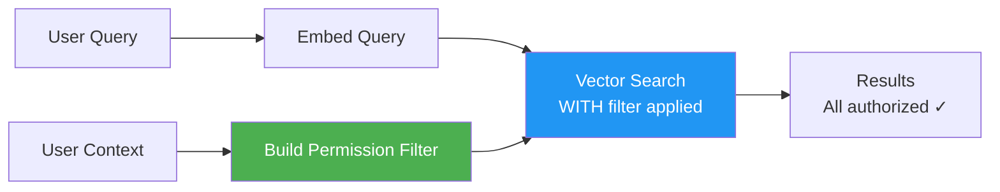
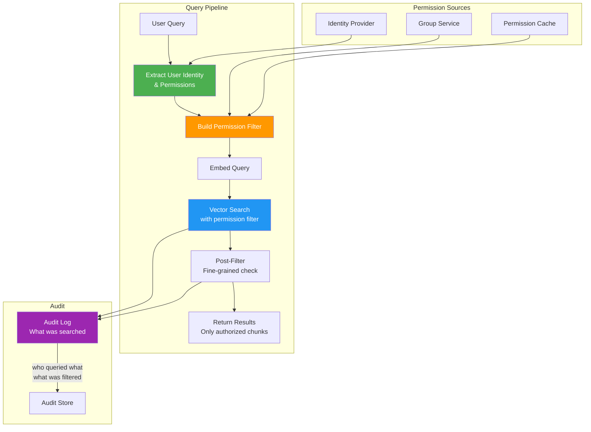

# Permission-Aware RAG

## The Problem

Standard RAG retrieves documents based on semantic similarity alone. But in enterprise systems, **not every user should see every document**. A query like "What's the company revenue?" might match:
- Public earnings reports (everyone can see)
- Internal financial projections (finance team only)
- Board-confidential strategy documents (executives only)

If RAG ignores permissions, it becomes a **data exfiltration tool** — users can extract information from documents they were never meant to access, simply by asking the right question.

---

## Permission Models for RAG

### Document-Level ACL (Access Control List)

```json
{
  "document_id": "doc_001",
  "title": "Q4 Revenue Analysis",
  "content": "Revenue grew 23% YoY...",
  "acl": {
    "allowed_users": ["alice", "bob"],
    "allowed_groups": ["finance", "executives"],
    "denied_users": ["contractor_jane"],
    "public": false
  }
}
```

### Folder-Level Inheritance

```
/documents/
├── /public/          → everyone can read
│   └── press-release.pdf
├── /engineering/     → engineering group
│   ├── /designs/    → inherits engineering
│   └── /secrets/    → engineering + security-cleared
├── /finance/         → finance group
│   └── /board/      → executives only (overrides parent)
```

### Attribute-Based Access Control (ABAC)

```python
# Access rules based on user attributes
rules = [
    {
        "resource_tag": "confidentiality:top-secret",
        "required_attributes": {
            "clearance_level": ">=4",
            "department": "in:[security, executive]",
            "location": "in:[us, uk]"  # Data residency
        }
    },
    {
        "resource_tag": "confidentiality:internal",
        "required_attributes": {
            "employee_type": "in:[full-time, contractor-cleared]"
        }
    }
]
```

### Relationship-Based (ReBAC)

```
# Google Zanzibar-style relationship tuples
document:doc_001#viewer@user:alice
document:doc_001#viewer@group:finance#member
folder:engineering#viewer@group:engineering#member
document:doc_002#viewer@folder:engineering#viewer  # inheritance
```

---

## Implementation Strategies

### Strategy 1: Pre-Filter (Permissions BEFORE Vector Search)

```python
def search_with_prefilter(query: str, user: User) -> list[Document]:
    # 1. Get user's accessible document set
    user_groups = get_user_groups(user.id)
    
    # 2. Build permission filter
    permission_filter = {
        "$or": [
            {"acl.allowed_users": {"$in": [user.id]}},
            {"acl.allowed_groups": {"$in": user_groups}},
            {"acl.public": True}
        ]
    }
    
    # 3. Vector search WITH filter (only searches allowed docs)
    results = vector_db.search(
        query_embedding=embed(query),
        filter=permission_filter,
        top_k=10
    )
    
    return results
```



| Pros | Cons |
|------|------|
| Guaranteed secure | Smaller search space |
| No information leakage | May miss relevant results |
| Simple mental model | Filter complexity in vector DB |
| Efficient (less data scanned) | Permission metadata in every chunk |

### Strategy 2: Post-Filter (Vector Search First, Then Filter)

```python
def search_with_postfilter(query: str, user: User) -> list[Document]:
    # 1. Search ALL documents (no permission check yet)
    all_results = vector_db.search(
        query_embedding=embed(query),
        top_k=50  # Fetch more to account for filtering
    )
    
    # 2. Filter results based on permissions
    user_groups = get_user_groups(user.id)
    authorized_results = []
    
    for doc in all_results:
        if user_can_access(user, doc):
            authorized_results.append(doc)
            if len(authorized_results) >= 10:
                break
    
    return authorized_results
```

| Pros | Cons |
|------|------|
| Better search quality | May return empty results |
| Simpler indexing | Information leakage through scores |
| Works with any vector DB | Inefficient (fetches unauthorized docs) |
| | Timing attacks possible |

**Information leakage risk:**
```
# Even without seeing content, attacker learns:
# - "10 results were filtered" → documents EXIST about this topic
# - Score patterns reveal document existence
# - Empty results after filtering → sensitive docs exist but user can't see them
```

### Strategy 3: Hybrid Approach

```python
def search_hybrid(query: str, user: User, tenant: Tenant) -> list[Document]:
    # Coarse pre-filter: tenant isolation (fast, always applied)
    tenant_filter = {"tenant_id": tenant.id}
    
    # Vector search within tenant
    results = vector_db.search(
        query_embedding=embed(query),
        filter=tenant_filter,
        top_k=30
    )
    
    # Fine post-filter: document-level permissions
    authorized = [
        doc for doc in results
        if user_can_access(user, doc)
    ][:10]
    
    return authorized
```

Best of both worlds:
- Tenant isolation via pre-filter (critical security boundary)
- Document-level permissions via post-filter (finer granularity)

---

## Scaling Permissions to Millions of Documents

### Challenge
- 10M documents in vector store
- Each has its own ACL
- Checking per-document permissions on every query is expensive
- Users belong to multiple groups (10-50 groups each)

### Solution 1: Permission Denormalization at Index Time

```python
# When indexing a document, flatten all permissions into the chunk
def index_document(doc, acl):
    # Resolve all groups to get full list of allowed entities
    allowed_entities = set()
    allowed_entities.update(acl.allowed_users)
    for group in acl.allowed_groups:
        allowed_entities.update(get_group_members(group))
    
    # Store with chunk
    chunk_metadata = {
        "content": doc.content,
        "allowed_entities": list(allowed_entities),  # Denormalized
        "embedding": embed(doc.content)
    }
    vector_db.upsert(chunk_metadata)
```

**Tradeoff:** Fast queries but expensive re-indexing when group membership changes.

### Solution 2: Group-Based Permissions

```python
# Instead of checking 10M docs, check user's ~20 groups
def build_filter(user):
    groups = get_user_groups(user.id)  # ~20 groups
    return {
        "allowed_groups": {"$overlap": groups}
    }
# Vector DB checks: does doc's allowed_groups overlap with user's groups?
# Much faster than per-user checks
```

### Solution 3: Permission Cache

```python
class PermissionCache:
    """Cache user's accessible document set with TTL."""
    
    def __init__(self, ttl_seconds=300):
        self.cache = {}
        self.ttl = ttl_seconds
    
    def get_accessible_docs(self, user_id: str) -> set:
        if user_id in self.cache and not self.cache[user_id].expired:
            return self.cache[user_id].doc_ids
        
        # Recompute from source of truth
        doc_ids = compute_accessible_docs(user_id)
        self.cache[user_id] = CacheEntry(doc_ids, ttl=self.ttl)
        return doc_ids
```

### Solution 4: Hierarchical Permissions

```python
# Inherit permissions from parent folders
# Only store overrides at document level
permission_tree = {
    "/": {"groups": ["all-employees"]},
    "/engineering": {"groups": ["engineering"]},
    "/engineering/ml": {"inherit": True},  # Inherits from /engineering
    "/engineering/ml/secret.md": {"groups": ["ml-leads"]},  # Override
}

def resolve_permissions(doc_path):
    """Walk up the tree, use nearest explicit permission."""
    parts = doc_path.split("/")
    for i in range(len(parts), 0, -1):
        path = "/".join(parts[:i])
        if path in permission_tree and not permission_tree[path].get("inherit"):
            return permission_tree[path]["groups"]
    return permission_tree["/"]["groups"]
```

---

## Permission Propagation

### When User Leaves a Group

```python
# Event: user "alice" removed from "finance" group
def handle_group_membership_change(user_id, group_id, action):
    if action == "remove":
        # Option A: Invalidate cache (eventual consistency)
        permission_cache.invalidate(user_id)
        
        # Option B: If using denormalized permissions, re-index
        affected_docs = get_docs_with_group_permission(group_id)
        for doc in affected_docs:
            reindex_permissions(doc)  # Expensive!
        
        # Option C: Real-time filter (always check live)
        # No action needed - permissions checked at query time
```

### When Document Permissions Change

```python
# Event: document permissions updated
def handle_permission_change(doc_id, new_acl):
    # Update metadata in vector store
    vector_db.update_metadata(
        doc_id=doc_id,
        metadata={"allowed_groups": new_acl.allowed_groups}
    )
    
    # Invalidate any cached results containing this doc
    result_cache.invalidate_by_doc(doc_id)
```

### Consistency Tradeoffs

| Approach | Consistency | Performance | Complexity |
|----------|-------------|-------------|------------|
| Real-time check | Strong | Slow (check on every query) | Low |
| Cache with short TTL | Eventual (5 min) | Fast | Medium |
| Denormalized at index | Eventual (re-index lag) | Fastest | High |
| Event-driven update | Near real-time | Fast | High |

---

## Permission-Aware Search Architecture



---

## Testing Permissions

### Cross-Tenant Leakage Test

```python
def test_cross_tenant_isolation():
    """Verify tenant A cannot see tenant B's documents."""
    # Index docs for both tenants
    index_doc("Secret Plan", tenant="tenant_a", groups=["all"])
    index_doc("Public Info", tenant="tenant_b", groups=["all"])
    
    # Search as tenant_a user
    results = search("plan", user=tenant_a_user)
    
    # Must only see tenant_a docs
    assert all(r.tenant_id == "tenant_a" for r in results)
    assert not any("tenant_b" in r.metadata for r in results)
```

### Permission Escalation Test

```python
def test_no_permission_escalation():
    """User should not see docs beyond their permission level."""
    # Index confidential doc
    index_doc("Board Strategy 2025", groups=["executives"])
    
    # Search as regular employee
    results = search("board strategy", user=regular_employee)
    
    # Must return empty (or unrelated public docs)
    assert not any("Board Strategy" in r.content for r in results)
```

### Stale Permission Test

```python
def test_permission_revocation():
    """After removing user from group, they lose access."""
    # User starts with access
    add_to_group("alice", "finance")
    results = search("revenue", user=alice)
    assert len(results) > 0
    
    # Remove from group
    remove_from_group("alice", "finance")
    invalidate_cache("alice")
    
    # Should no longer see finance docs
    results = search("revenue", user=alice)
    finance_docs = [r for r in results if "finance" in r.metadata["groups"]]
    assert len(finance_docs) == 0
```

---

## Summary

| Strategy | When to Use | Security Level |
|----------|-------------|----------------|
| Pre-filter | High-security environments | Highest |
| Post-filter | Quality-first, low-risk data | Medium |
| Hybrid | Multi-tenant + document ACLs | High |

Key principles:
1. **Never trust the search alone** — always enforce permissions
2. **Default deny** — if permission state is unknown, deny access
3. **Test rigorously** — cross-tenant, escalation, and staleness tests
4. **Audit everything** — log what was accessed AND what was filtered out
5. **Performance vs security** — when in doubt, choose security
