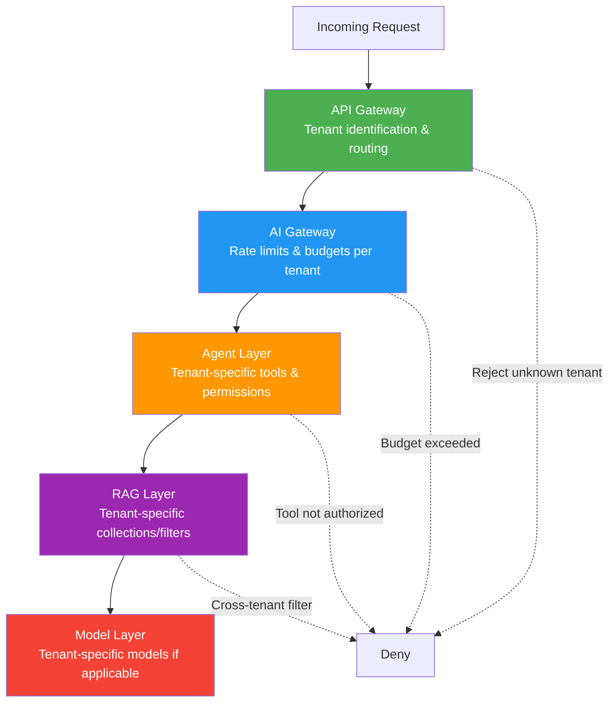
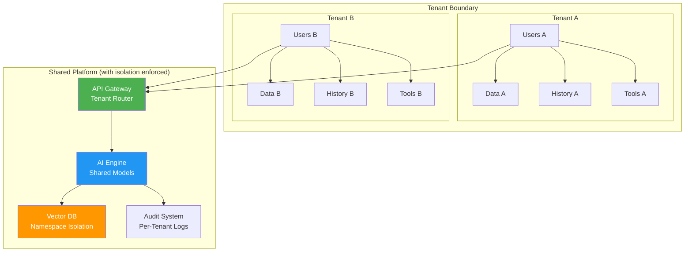

# Multi-Tenant Authorization

## The "Apartment Building" Analogy

A multi-tenant AI platform is like an apartment building:
- **Building** = the AI platform (shared infrastructure)
- **Apartments** = tenants (each company/organization)
- **Residents** = users within each tenant
- **Mailroom** = shared services (model inference, vector DB)
- **Keys** = authentication credentials
- **Building rules** = platform-wide policies
- **Apartment rules** = tenant-specific policies

Residents in apartment A should NEVER accidentally receive mail for apartment B, walk into apartment B, or even know what's inside apartment B.

---

## Isolation Levels

### 1. Tenant Data Isolation
```
Tenant A's documents ←──── WALL ────→ Tenant B's documents
Tenant A's embeddings ←── WALL ────→ Tenant B's embeddings
Tenant A's chat history ← WALL ────→ Tenant B's chat history
```

### 2. Model Isolation
| Approach | Isolation | Cost | Use Case |
|----------|-----------|------|----------|
| Shared base model | Low | $ | Most SaaS platforms |
| Tenant-specific fine-tuned | Medium | $$ | Industry-specific needs |
| Dedicated model instance | High | $$$ | Regulated industries |
| On-premise deployment | Maximum | $$$$ | Government/military |

### 3. Conversation Isolation
- Chat history stored per-tenant
- Context windows never leak across tenants
- Shared models must not memorize tenant-specific data
- Session state scoped to tenant + user

### 4. Cost Isolation
```json
{
  "tenant_id": "acme_corp",
  "billing": {
    "token_usage": {"input": 1250000, "output": 430000},
    "api_calls": 8500,
    "storage_gb": 12.5,
    "monthly_budget": 5000,
    "current_spend": 3200
  }
}
```

---

## Implementation Patterns

### Pattern 1: Separate Database Per Tenant (Maximum Isolation)

```
┌─────────────────────────────────────────────┐
│ Platform Layer                                │
├──────────────┬──────────────┬───────────────┤
│ Tenant A DB  │ Tenant B DB  │ Tenant C DB   │
│ - vectors    │ - vectors    │ - vectors     │
│ - documents  │ - documents  │ - documents   │
│ - chat hist  │ - chat hist  │ - chat hist   │
│ - audit logs │ - audit logs │ - audit logs  │
└──────────────┴──────────────┴───────────────┘
```

Pros: strongest isolation, easy compliance, simple deletion
Cons: expensive, hard to manage at scale, no resource sharing

### Pattern 2: Shared DB with Row-Level Security

```sql
-- PostgreSQL Row-Level Security
CREATE POLICY tenant_isolation ON documents
    USING (tenant_id = current_setting('app.current_tenant'));

-- Every query automatically filtered
SET app.current_tenant = 'acme_corp';
SELECT * FROM documents WHERE content LIKE '%revenue%';
-- Only returns acme_corp documents, even without explicit WHERE
```

### Pattern 3: Namespace-Based Vector DB Isolation

```python
# ChromaDB: separate collections per tenant
def get_tenant_collection(tenant_id: str):
    return chroma_client.get_or_create_collection(
        name=f"tenant_{tenant_id}",
        metadata={"tenant": tenant_id}
    )

# Pinecone: namespace isolation
def search_tenant(query_embedding, tenant_id: str):
    return index.query(
        vector=query_embedding,
        namespace=tenant_id,  # Isolated namespace
        top_k=10
    )
```

### Pattern 4: Tenant-Specific Encryption Keys

```python
# Each tenant has its own encryption key
def encrypt_document(content: str, tenant_id: str) -> bytes:
    tenant_key = key_vault.get_key(f"tenant-{tenant_id}-doc-key")
    return encrypt(content, tenant_key)

# Even if data leaks, it's encrypted with a different key
# Tenant A's key cannot decrypt Tenant B's data
```

---

## Authorization at Each Layer



### API Gateway Layer
```python
def identify_tenant(request):
    # Extract tenant from JWT, subdomain, or API key
    token = decode_jwt(request.headers["Authorization"])
    tenant_id = token.claims["tenant_id"]
    
    # Verify tenant exists and is active
    tenant = tenant_registry.get(tenant_id)
    if not tenant or tenant.status != "active":
        raise Unauthorized("Invalid or inactive tenant")
    
    # Route to correct backend
    request.context["tenant"] = tenant
    return route_to_backend(tenant.region)
```

### AI Gateway Layer
```python
def check_tenant_limits(tenant, request):
    usage = get_current_usage(tenant.id)
    
    if usage.monthly_spend >= tenant.budget_limit:
        raise RateLimited("Monthly budget exceeded")
    
    if usage.requests_per_minute >= tenant.rpm_limit:
        raise RateLimited("Rate limit exceeded")
    
    if request.model not in tenant.allowed_models:
        raise Forbidden(f"Model {request.model} not in tenant plan")
```

### Agent Layer
```python
def get_tenant_tools(tenant):
    """Each tenant has different tools available."""
    base_tools = ["search", "summarize", "calculate"]
    
    if tenant.plan == "enterprise":
        base_tools += ["database_query", "api_call", "code_execute"]
    
    if tenant.custom_tools:
        base_tools += tenant.custom_tools
    
    return base_tools
```

### RAG Layer
```python
def tenant_scoped_search(query, tenant_id, user):
    """Every search is scoped to tenant."""
    collection = get_tenant_collection(tenant_id)
    
    user_groups = get_user_groups(user.id, tenant_id)
    
    results = collection.query(
        query_embeddings=[embed(query)],
        where={"allowed_groups": {"$in": user_groups}},
        n_results=10
    )
    return results
```

---

## Cross-Tenant Prevention

### Defense in Depth

```python
class CrossTenantGuard:
    """Multiple layers of cross-tenant prevention."""
    
    def validate_request(self, request, tenant_id):
        # Layer 1: Input validation
        self._validate_tenant_in_token(request, tenant_id)
        
        # Layer 2: Query sanitization
        self._inject_tenant_filter(request, tenant_id)
        
        # Layer 3: Output validation
        # (applied after getting results)
    
    def validate_response(self, response, tenant_id):
        # Verify no cross-tenant data in response
        for item in response.data:
            if item.tenant_id != tenant_id:
                audit_log.alert(
                    event="cross_tenant_leak_prevented",
                    tenant=tenant_id,
                    leaked_tenant=item.tenant_id
                )
                response.data.remove(item)
        return response
    
    def _inject_tenant_filter(self, request, tenant_id):
        """Force tenant filter on every database query."""
        if hasattr(request, 'query'):
            request.query.filters["tenant_id"] = tenant_id
```

### Audit Cross-Tenant Access Attempts

```python
# Log every potential cross-tenant access
def audit_cross_tenant(event_type, requesting_tenant, target_tenant, details):
    audit_log.write({
        "severity": "HIGH",
        "event": "cross_tenant_access_attempt",
        "requesting_tenant": requesting_tenant,
        "target_tenant": target_tenant,
        "details": details,
        "timestamp": utcnow(),
        "alert": True  # Trigger real-time alert
    })
```

---

## Compliance Requirements Per Tenant

Different tenants may have different regulatory requirements:

| Tenant | Industry | Requirements |
|--------|----------|-------------|
| HealthCo | Healthcare | HIPAA: encrypt PHI, audit all access, 6-year retention |
| BankCorp | Finance | SOX: immutable audit logs, segregation of duties |
| EuroTech | EU company | GDPR: data residency in EU, right to deletion |
| GovAgency | Government | FedRAMP: US data centers, cleared personnel |

```python
def apply_tenant_compliance(tenant, operation):
    """Apply tenant-specific compliance rules."""
    if "HIPAA" in tenant.compliance:
        operation.encrypt_at_rest = True
        operation.audit_level = "verbose"
        operation.data_retention = "6_years"
    
    if "GDPR" in tenant.compliance:
        operation.data_region = "eu-west-1"
        operation.supports_deletion = True
        operation.anonymize_logs = True
    
    if "SOX" in tenant.compliance:
        operation.immutable_audit = True
        operation.dual_approval_for_changes = True
```

---

## Multi-Tenant Authorization Architecture



---

## Summary

| Layer | Isolation Mechanism |
|-------|-------------------|
| Network | Tenant-specific endpoints or routing |
| API Gateway | Tenant identification + validation |
| Data | Separate DBs, namespaces, or RLS |
| Encryption | Per-tenant keys |
| Model | Shared with guardrails, or dedicated |
| Audit | Per-tenant audit streams |
| Compliance | Tenant-specific policy enforcement |
