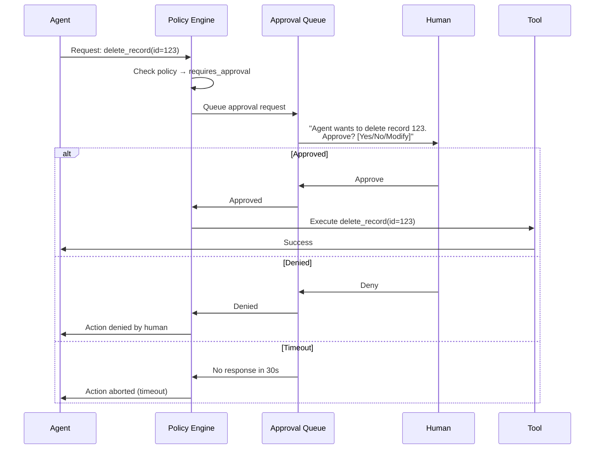
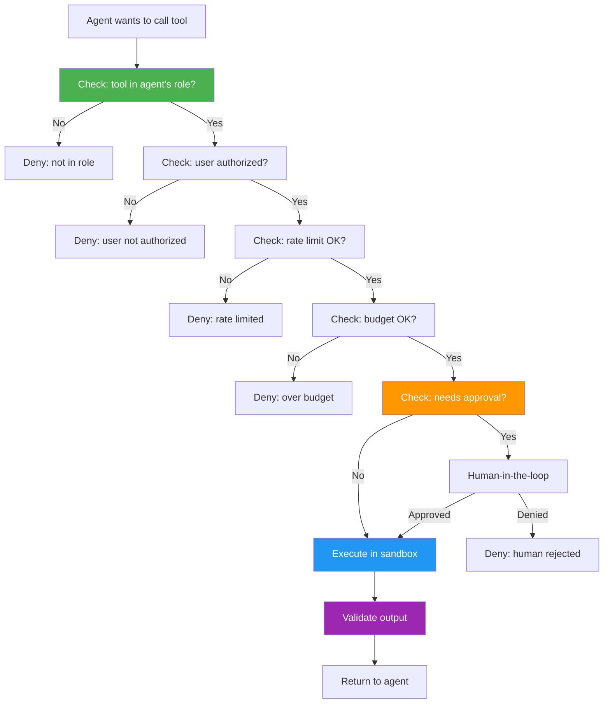

# Tool Authorization

## The Problem

AI agents call tools to interact with the world. But not all tools are safe:
- A "search" tool is harmless (read-only)
- A "send email" tool can spam customers
- A "delete database" tool can destroy data
- A "call external API" tool can exfiltrate data

Without tool authorization, an agent can:
1. Call any tool regardless of risk
2. Perform destructive actions without approval
3. Exfiltrate data through external tool calls
4. Exceed cost budgets via expensive tools

---

## Tool Permission Model

### Tool Risk Categories

| Category | Risk Level | Examples | Default Policy |
|----------|-----------|----------|----------------|
| **Read** | Low | Search, lookup, calculate, summarize | Auto-approve |
| **Write** | Medium | Update record, send email, create ticket | Require context |
| **Destructive** | High | Delete data, close account, revoke access | Require approval |
| **External** | Variable | Call 3rd-party API, upload file | Require approval |
| **Financial** | High | Execute payment, modify billing | Require dual approval |

### Tool Registry

```python
TOOL_REGISTRY = {
    "vector_search": {
        "category": "read",
        "risk": "low",
        "requires_approval": False,
        "rate_limit": "100/min",
        "cost": 0
    },
    "send_email": {
        "category": "write",
        "risk": "medium",
        "requires_approval": True,
        "rate_limit": "10/min",
        "cost": 0.001,
        "reversible": False
    },
    "delete_record": {
        "category": "destructive",
        "risk": "high",
        "requires_approval": True,
        "approval_type": "explicit_human",
        "rate_limit": "5/hour",
        "cost": 0,
        "reversible": False
    },
    "external_api_call": {
        "category": "external",
        "risk": "variable",
        "requires_approval": True,
        "allowed_endpoints": ["api.approved-vendor.com"],
        "blocked_endpoints": ["*"],  # Default deny
        "data_exfiltration_check": True
    }
}
```

---

## Authorization Policies for Tools

### Role-Based Tool Access

```python
TOOL_PERMISSIONS_BY_ROLE = {
    "basic_agent": {
        "allowed": ["vector_search", "summarize", "calculate"],
        "denied": ["delete_record", "execute_payment", "external_api_call"]
    },
    "admin_agent": {
        "allowed": ["*"],
        "denied": [],
        "requires_approval": ["delete_record", "execute_payment"]
    },
    "customer_facing_agent": {
        "allowed": ["vector_search", "create_ticket", "send_email"],
        "denied": ["delete_record", "database_query", "external_api_call"]
    }
}
```

### User-Scoped Tool Access

```python
def get_authorized_tools(agent, user):
    """Agent can only use tools the USER is authorized for."""
    agent_tools = get_agent_role_tools(agent.role)
    user_tools = get_user_authorized_tools(user)
    
    # Intersection: only tools both agent AND user can use
    effective_tools = agent_tools & user_tools
    return effective_tools
```

### Action-Based Policies

```python
def evaluate_tool_action(tool_call, context):
    """Evaluate whether a specific tool invocation is allowed."""
    tool = TOOL_REGISTRY[tool_call.name]
    
    # Check 1: Is tool in agent's allowed list?
    if tool_call.name not in context.agent.allowed_tools:
        return Deny("Tool not in agent's allowed list")
    
    # Check 2: Does user have permission for this action?
    if not user_can_use_tool(context.user, tool_call.name):
        return Deny("User not authorized for this tool")
    
    # Check 3: Does this specific invocation need approval?
    if tool["requires_approval"]:
        return PendingApproval(tool_call, context)
    
    # Check 4: Rate limit
    if rate_limiter.exceeded(tool_call.name, context.agent.id):
        return Deny("Rate limit exceeded")
    
    # Check 5: Budget
    if context.session.remaining_budget < tool["cost"]:
        return Deny("Budget exceeded")
    
    return Allow(tool_call)
```

### Budget-Based Policies

```python
class ToolBudgetManager:
    def check_budget(self, tool_call, session):
        tool = TOOL_REGISTRY[tool_call.name]
        estimated_cost = tool["cost"]
        
        if session.spent + estimated_cost > session.budget:
            return Deny(f"Would exceed budget: ${session.spent + estimated_cost} > ${session.budget}")
        
        # Track spending
        session.spent += estimated_cost
        return Allow()
```

---

## Human-in-the-Loop for Dangerous Tools



### Approval Patterns

```python
class ApprovalManager:
    def request_approval(self, tool_call, context, timeout=30):
        approval_request = {
            "id": generate_id(),
            "agent_id": context.agent.id,
            "user_id": context.user.id,
            "tool": tool_call.name,
            "parameters": tool_call.params,
            "risk_level": TOOL_REGISTRY[tool_call.name]["risk"],
            "explanation": context.agent.reasoning,  # Why agent wants this
            "timeout": timeout,
            "created_at": utcnow()
        }
        
        # Send to human
        notify_human(context.user, approval_request)
        
        # Wait for response
        response = wait_for_approval(approval_request["id"], timeout)
        
        if response is None:
            return AbortAction("Approval timeout")
        elif response.decision == "approve":
            return ExecuteAction(tool_call)
        elif response.decision == "deny":
            return AbortAction(f"Denied: {response.reason}")
        elif response.decision == "modify":
            return ExecuteAction(response.modified_tool_call)
    
    def bulk_approve(self, pattern, context):
        """Approve all similar actions (for repetitive tasks)."""
        # "Approve all deletes of type=draft for next 5 minutes"
        self.standing_approvals.add({
            "pattern": pattern,
            "granted_by": context.user.id,
            "expires_at": utcnow() + timedelta(minutes=5)
        })
    
    def emergency_stop(self, agent_id):
        """Instantly revoke all tool access."""
        revoke_all_tools(agent_id)
        terminate_active_sessions(agent_id)
        audit_log.alert(f"Emergency stop: {agent_id}")
```

---

## Tool Execution Sandboxing

### Network Isolation

```python
class ToolSandbox:
    def __init__(self, tool_config):
        self.allowed_endpoints = tool_config["allowed_endpoints"]
        self.blocked_endpoints = tool_config.get("blocked_endpoints", ["*"])
    
    def execute(self, tool_call):
        # Network firewall: only approved endpoints
        with network_policy(allow=self.allowed_endpoints):
            result = tool_call.execute()
        return result
```

### Resource Limits

```python
TOOL_RESOURCE_LIMITS = {
    "database_query": {
        "max_execution_time": 30,  # seconds
        "max_memory_mb": 512,
        "max_rows_returned": 1000,
        "max_query_complexity": "medium"
    },
    "code_execute": {
        "max_execution_time": 10,
        "max_memory_mb": 256,
        "max_output_bytes": 10240,
        "network_access": False,
        "filesystem_access": "readonly:/tmp"
    }
}
```

### Output Validation

```python
def validate_tool_output(tool_name, output, context):
    """Verify tool output before passing to agent."""
    
    # Check 1: No sensitive data leakage
    if contains_pii(output):
        output = redact_pii(output)
        audit_log.warn(f"PII redacted from {tool_name} output")
    
    # Check 2: Output size limits
    if len(output) > MAX_TOOL_OUTPUT_BYTES:
        output = truncate(output, MAX_TOOL_OUTPUT_BYTES)
    
    # Check 3: No cross-tenant data
    if contains_other_tenant_data(output, context.tenant_id):
        raise SecurityViolation("Cross-tenant data in tool output")
    
    return output
```

---

## Tool Authorization Flow



---

## Summary

| Control | Purpose |
|---------|---------|
| Role-based access | Limit which tools an agent can use |
| User-scoped access | Agent bounded by user's permissions |
| Human approval | Dangerous actions require human sign-off |
| Rate limiting | Prevent tool abuse |
| Budget limits | Control cost of tool usage |
| Sandboxing | Isolate tool execution |
| Output validation | Prevent data leakage |
| Emergency stop | Instantly disable all tools |
