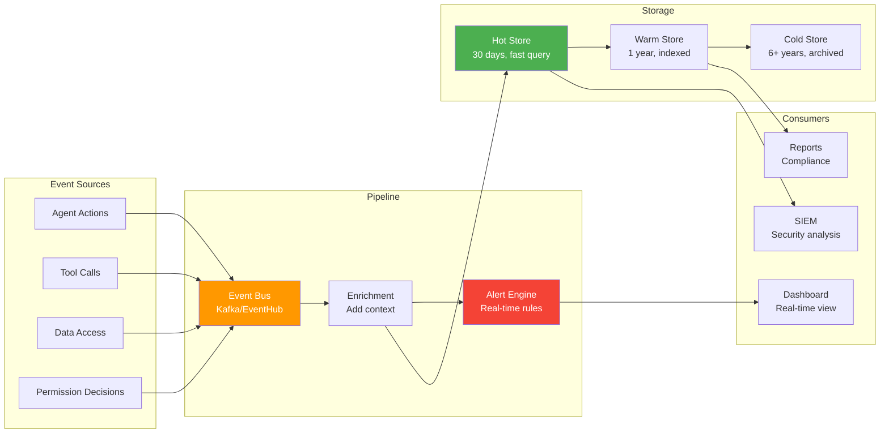

# Audit and Compliance

## Why Audit Everything in AI Systems

| Reason | Description |
|--------|-------------|
| **Legal** | Regulations require proof of who accessed what data |
| **Compliance** | SOC2, HIPAA, GDPR auditors need evidence of controls |
| **Debugging** | When AI produces wrong output, trace what happened |
| **Trust** | Users and organizations need confidence in the system |
| **Accountability** | Clear chain of responsibility for every action |
| **Incident Response** | When breach occurs, reconstruct what was accessed |

AI systems are particularly audit-critical because:
- They make autonomous decisions (no human clicked "approve")
- They access data across many systems in a single request
- They can be manipulated via prompt injection
- Their reasoning is opaque without explicit logging

---

## What to Audit

### Every Model Call

```json
{
  "event_type": "model_invocation",
  "timestamp": "2024-01-15T10:23:45.123Z",
  "user_id": "user_abc123",
  "agent_id": "agent:coordinator-v2",
  "session_id": "sess_789xyz",
  "model": "gpt-4",
  "prompt_tokens": 1250,
  "completion_tokens": 430,
  "prompt_hash": "sha256:abc...",
  "contains_pii": false,
  "latency_ms": 2340,
  "cost_usd": 0.052,
  "result": "success"
}
```

### Every Tool Invocation

```json
{
  "event_type": "tool_invocation",
  "timestamp": "2024-01-15T10:23:45.456Z",
  "user_id": "user_abc123",
  "agent_id": "agent:coordinator-v2",
  "session_id": "sess_789xyz",
  "tool": "database_query",
  "parameters": {"query": "SELECT revenue FROM sales WHERE year=2024"},
  "result": "success",
  "rows_returned": 12,
  "data_accessed": ["table:sales"],
  "execution_time_ms": 145,
  "approval": "auto_approved",
  "risk_level": "low"
}
```

### Every Data Access

```json
{
  "event_type": "data_access",
  "timestamp": "2024-01-15T10:23:45.789Z",
  "user_id": "user_abc123",
  "agent_id": "agent:coordinator-v2",
  "session_id": "sess_789xyz",
  "action": "vector_search",
  "collection": "engineering-docs",
  "documents_retrieved": ["doc_001", "doc_003", "doc_007"],
  "documents_filtered_by_permission": ["doc_002", "doc_005"],
  "permission_check": "pre_filter",
  "user_groups_at_time": ["engineering", "team-ml"]
}
```

### Every Permission Decision

```json
{
  "event_type": "permission_decision",
  "timestamp": "2024-01-15T10:23:44.000Z",
  "user_id": "user_abc123",
  "agent_id": "agent:coordinator-v2",
  "session_id": "sess_789xyz",
  "action": "database_query",
  "resource": "table:sales",
  "decision": "allowed",
  "reason": "user has role:analyst which grants read:sales",
  "policy_evaluated": "policy:analyst-data-access-v2",
  "effective_permissions": ["read:sales", "read:products"]
}
```

### Every Agent Decision

```json
{
  "event_type": "agent_decision",
  "timestamp": "2024-01-15T10:23:45.000Z",
  "user_id": "user_abc123",
  "agent_id": "agent:coordinator-v2",
  "session_id": "sess_789xyz",
  "decision": "call_tool",
  "reasoning": "User asked for revenue data. Need to query sales table.",
  "alternatives_considered": ["search_documents", "ask_clarification"],
  "chosen_action": "database_query",
  "confidence": 0.92
}
```

---

## Comprehensive Audit Log Schema

```json
{
  "id": "evt_abc123def456",
  "timestamp": "2024-01-15T10:23:45.123Z",
  "event_type": "tool_invocation",
  
  "identities": {
    "user_id": "user_abc123",
    "agent_id": "agent:coordinator-v2",
    "session_id": "sess_789xyz",
    "tenant_id": "tenant_acme",
    "delegation_chain": ["user_abc123", "agent:coordinator-v2", "tool:db-query"]
  },
  
  "action": {
    "type": "database_query",
    "parameters": {"query": "SELECT revenue FROM sales"},
    "target_resource": "database:analytics/table:sales",
    "risk_level": "low",
    "category": "read"
  },
  
  "authorization": {
    "decision": "allowed",
    "policy": "policy:analyst-data-access-v2",
    "reason": "user has role:analyst",
    "effective_scope": ["read:sales"],
    "approval_type": "auto",
    "approval_id": null
  },
  
  "result": {
    "status": "success",
    "data_accessed": ["table:sales"],
    "rows_returned": 12,
    "contains_pii": false,
    "execution_time_ms": 145
  },
  
  "context": {
    "user_ip": "10.0.1.45",
    "user_agent": "AI-Platform/2.1",
    "request_id": "req_xyz789",
    "correlation_id": "corr_abc123"
  }
}
```

---

## Retention Policies

| Regulation | Minimum Retention | Data Types |
|-----------|-------------------|------------|
| SOC2 | 1 year | All security events |
| HIPAA | 6 years | PHI access logs |
| GDPR | As short as possible | Personal data access (with right to deletion) |
| SOX | 7 years | Financial data access |
| PCI-DSS | 1 year | Payment data access |
| FedRAMP | 3 years | All system events |
| Internal | 90 days | Debug/performance logs |

```python
RETENTION_POLICIES = {
    "security_events": {"retention_days": 365, "immutable": True},
    "data_access": {"retention_days": 2190, "immutable": True},  # 6 years (HIPAA)
    "permission_decisions": {"retention_days": 365, "immutable": True},
    "model_invocations": {"retention_days": 90, "immutable": False},
    "debug_logs": {"retention_days": 30, "immutable": False},
}
```

---

## Immutability

Audit logs MUST be write-once:

```python
class ImmutableAuditStore:
    """Write-once audit storage. Cannot be modified or deleted."""
    
    def write(self, event: dict):
        # Hash the event for integrity verification
        event["_hash"] = sha256(json.dumps(event, sort_keys=True))
        event["_prev_hash"] = self.get_last_hash()  # Chain integrity
        
        # Write to append-only storage
        self.append_only_store.write(event)
        
        # Replicate to separate security-controlled storage
        self.security_replica.write(event)
    
    def verify_integrity(self):
        """Verify no logs have been tampered with."""
        events = self.append_only_store.read_all()
        for i, event in enumerate(events):
            # Verify hash
            computed = sha256(json.dumps(event, sort_keys=True, exclude=["_hash", "_prev_hash"]))
            assert computed == event["_hash"], f"Tampered event at index {i}"
            
            # Verify chain
            if i > 0:
                assert event["_prev_hash"] == events[i-1]["_hash"]
```

Storage options for immutability:
- AWS S3 with Object Lock (WORM)
- Azure Blob with immutability policies
- Dedicated SIEM (Splunk, Sentinel)
- Blockchain-anchored hashes (for critical events)

---

## Real-Time Alerting

```python
ALERT_RULES = [
    {
        "name": "cross_tenant_access_attempt",
        "condition": "event.identities.tenant_id != event.action.target_resource.tenant_id",
        "severity": "critical",
        "action": "page_security_team"
    },
    {
        "name": "high_volume_data_access",
        "condition": "count(events WHERE event_type='data_access' AND user_id=X) > 100 in 5min",
        "severity": "high",
        "action": "alert_security + throttle_user"
    },
    {
        "name": "permission_denied_spike",
        "condition": "count(events WHERE decision='denied' AND agent_id=X) > 10 in 1min",
        "severity": "medium",
        "action": "alert_ops + suspend_agent"
    },
    {
        "name": "destructive_tool_used",
        "condition": "event.action.category == 'destructive'",
        "severity": "high",
        "action": "notify_admin + log_enhanced"
    },
    {
        "name": "unusual_agent_behavior",
        "condition": "agent calls tools it has never called before",
        "severity": "medium",
        "action": "alert_ops"
    }
]
```

---

## Compliance Reports

```python
def generate_soc2_report(tenant_id, period):
    """Generate SOC2 compliance report."""
    return {
        "period": period,
        "tenant": tenant_id,
        "access_controls": {
            "total_access_events": count_events("data_access", tenant_id, period),
            "denied_events": count_events("permission_denied", tenant_id, period),
            "unauthorized_attempts": count_events("cross_tenant", tenant_id, period),
        },
        "change_management": {
            "permission_changes": get_permission_changes(tenant_id, period),
            "agent_deployments": get_agent_changes(tenant_id, period),
        },
        "monitoring": {
            "alerts_triggered": get_alerts(tenant_id, period),
            "incidents": get_incidents(tenant_id, period),
            "mean_time_to_detect": calculate_mttd(tenant_id, period),
        },
        "data_protection": {
            "encryption_status": "all_at_rest_and_transit",
            "key_rotations": get_key_rotations(tenant_id, period),
            "data_deletions": get_deletions(tenant_id, period),
        }
    }
```

---

## Audit Pipeline Architecture



---

## Summary

| Aspect | Requirement |
|--------|------------|
| Coverage | Every model call, tool use, data access, permission decision |
| Schema | Structured, queryable, includes full identity chain |
| Retention | Regulatory-driven (1-7 years depending on compliance) |
| Immutability | Write-once storage, hash chains for integrity |
| Alerting | Real-time detection of anomalies and violations |
| Reporting | Automated compliance reports (SOC2, HIPAA, GDPR) |
| Pipeline | Event bus → enrichment → hot/warm/cold storage |
