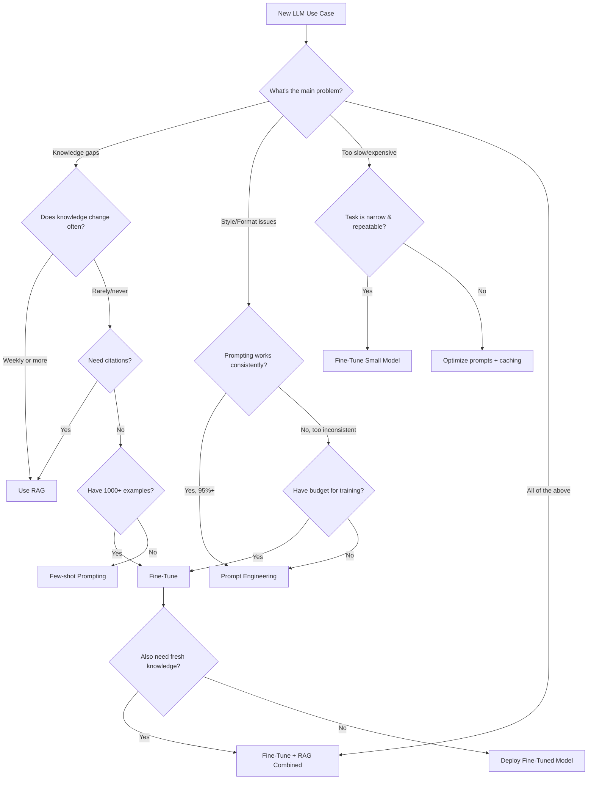

# When to Fine-Tune: The Decision Framework

## The Core Question

You have an LLM that's "almost right" for your use case. Should you:
1. Engineer better prompts?
2. Add retrieval (RAG)?
3. Fine-tune the model?

The answer depends on what's wrong with the current output.

---

## The Decision Tree

```
Is the model's KNOWLEDGE wrong/missing?
├── YES → Is the knowledge static or dynamic?
│   ├── DYNAMIC (changes weekly+) → Use RAG
│   └── STATIC (rarely changes) → Fine-tuning OR RAG
│       └── Do you need citations? → YES → RAG
│                                   → NO  → Fine-tuning
└── NO (knowledge is fine)
    └── Is the model's STYLE/FORMAT wrong?
        ├── YES → Can you fix it with prompting?
        │   ├── YES (and it's consistent) → Prompt Engineering
        │   └── NO (keeps drifting/inconsistent) → Fine-Tuning
        └── NO
            └── Is the model too SLOW or EXPENSIVE?
                ├── YES → Fine-tune smaller model
                └── NO → You might not need anything
```

---

## Fine-Tuning is the RIGHT Choice When

### 1. You Need Consistent Style/Format

**The Problem:** You need every response in a specific format—company voice, JSON schema, medical report structure—and prompting gets it right 80% of the time but fails 20%.

**Why Fine-Tuning Works:** The model internalizes the pattern. Instead of following instructions about format, it naturally produces the format.

**Example:**
```
Before (prompting): "Respond in our company's casual-professional tone..."
  → Sometimes too casual, sometimes too formal
  → Format breaks on edge cases

After (fine-tuning): Model naturally writes in the trained style
  → 98%+ format compliance
  → No format instructions needed (saves tokens too)
```

**Real-world cases:**
- Customer support bots that match brand voice
- Medical report generation in specific template
- Legal document summarization in court-required format
- API response generation in exact JSON schema

### 2. Domain Vocabulary is Specialized

**The Problem:** The model doesn't understand your industry's terminology, abbreviations, or context.

**Why Fine-Tuning Works:** The model learns domain-specific language patterns from examples.

**Example domains:**
- Medical: "Patient presents with JVD, S3 gallop, bilateral rales → CHF exacerbation"
- Legal: "Motion for MSJ under FRCP 56(a) re: breach of fiduciary duty"
- Finance: "EBITDA margin compression due to SBC and one-time restructuring charges"
- Engineering: "OOM kill on k8s pod due to memory leak in GC-heavy workload"

### 3. Response Speed Matters

**The Problem:** RAG adds 200-500ms for retrieval + larger context = slower generation.

**Why Fine-Tuning Works:** Knowledge is baked into a small model. No retrieval step, shorter prompts, faster inference.

**Comparison:**
```
RAG Pipeline:
  Query → Embed (50ms) → Vector Search (100ms) → Rerank (100ms) → 
  LLM with 4000 token context (800ms) = ~1050ms total

Fine-Tuned Small Model:
  Query → LLM with 200 token context (200ms) = ~200ms total
```

### 4. Cost Matters at Scale

**The Problem:** You're making 1M+ API calls per month and GPT-4 costs are unsustainable.

**Why Fine-Tuning Works:** Fine-tune a 7B model to match GPT-4 quality on YOUR specific task, then serve it at 1/100th the cost.

**Cost Math:**
```
GPT-4 at 1M requests/month:
  Average 500 input + 200 output tokens
  = 500M input tokens × $30/1M + 200M output tokens × $60/1M
  = $15,000 + $12,000 = $27,000/month

Fine-tuned Llama 7B (self-hosted on 1× A100):
  Hardware: ~$2,000/month
  Can serve: 1M+ requests/month easily
  = $2,000/month (92% savings)
```

### 5. Task is Well-Defined and Repeatable

**The Problem:** You have a specific, narrow task (classification, extraction, transformation) that doesn't need general intelligence.

**Why Fine-Tuning Works:** Focused training on one task → small model becomes expert at that specific task.

**Good candidates:**
- Sentiment classification (positive/negative/neutral)
- Entity extraction (names, dates, amounts from documents)
- Code translation (SQL to natural language)
- Summarization with specific length/style requirements
- Intent classification for chatbots

---

## Fine-Tuning is the WRONG Choice When

### 1. Knowledge Changes Frequently

**The Problem:** Your information updates daily/weekly (news, prices, inventory, regulations).

**Why It Fails:** Fine-tuning bakes knowledge into weights. To update, you must re-train. That's expensive and slow.

**Better Approach:** RAG with frequently updated vector store.

### 2. You Have < 100 Training Examples

**The Problem:** You have 20-50 examples of what you want.

**Why It Fails:** Models need statistical patterns. < 100 examples → overfitting, memorization, not generalization.

**Better Approach:** Few-shot prompting (put 5-10 examples in the prompt).

**Threshold guide:**
```
< 50 examples:    Use few-shot prompting (examples in prompt)
50-100 examples:  Try few-shot first, fine-tune only if fails
100-1000 examples: Fine-tuning viable for simple tasks
1000-10000:       Fine-tuning works well for most tasks
10000+:           Excellent fine-tuning results expected
```

### 3. The Task is General/Open-Ended

**The Problem:** You want a "better chatbot" for general conversation.

**Why It Fails:** Fine-tuning on narrow data makes the model worse at everything else (catastrophic forgetting). Base models are already optimized for general conversation.

**Better Approach:** Use a strong base model (GPT-4, Claude) with good system prompts.

### 4. Budget is Very Limited

**The Problem:** You need results now with minimal investment.

**Why It Fails:** Fine-tuning requires compute ($50-$5000+), data preparation time, evaluation infrastructure, and ongoing maintenance.

**Better Approach:** Start with prompt engineering (free), then RAG (moderate cost), then fine-tune only when ROI is clear.

### 5. You Need Attribution/Citations

**The Problem:** Users need to see WHERE information came from (legal, medical, academic).

**Why It Fails:** Fine-tuned models don't track which training example influenced a response. They can't provide sources.

**Better Approach:** RAG naturally provides source documents that can be cited.

---

## The Combined Approach: Fine-Tune for Style + RAG for Knowledge

The most powerful production pattern combines both:

```
┌─────────────────────────────────────────────────┐
│                Combined Pipeline                  │
├─────────────────────────────────────────────────┤
│                                                   │
│  User Query                                       │
│      │                                            │
│      ▼                                            │
│  RAG Retrieval (provides current knowledge)       │
│      │                                            │
│      ▼                                            │
│  Fine-Tuned Model (provides consistent style)     │
│      │                                            │
│      ▼                                            │
│  Response (correct knowledge + right format)      │
│                                                   │
└─────────────────────────────────────────────────┘
```

**Example:** Medical report generator
- RAG: retrieves latest clinical guidelines, patient history
- Fine-tuning: ensures output matches hospital's report format
- Result: accurate + properly formatted

---

## Cost Comparison Table

| Approach | Upfront Cost | Per-Request Cost | Time to Deploy | Maintenance |
|----------|-------------|-----------------|----------------|-------------|
| Prompt Engineering | $0 | High ($0.01-0.10/req with GPT-4) | Hours | Low (update prompts) |
| Fine-Tuning (API) | $50-500 | Low ($0.001-0.01/req) | Days | Medium (retrain monthly) |
| Fine-Tuning (Self-hosted) | $2000-5000 | Very Low ($0.0001/req) | Weeks | High (infra + retraining) |
| RAG | $100-1000 | Moderate ($0.005-0.05/req) | Days-Weeks | Medium (update index) |
| Fine-Tuning + RAG | $500-5000 | Moderate ($0.003-0.03/req) | Weeks | High (both systems) |

**Break-even analysis:**
```
Fine-tuning ROI = (cost_per_request_saved × monthly_requests) - fine_tuning_cost - maintenance

Example:
  Prompt engineering: $0.05/request × 100K requests = $5,000/month
  Fine-tuned 7B:     $0.002/request × 100K requests = $200/month + $500 one-time
  
  Break-even: Month 1 (saves $4,300 after $500 investment)
```

---

## Decision Flow



---

## Quick Decision Checklist

Before fine-tuning, answer these questions:

| Question | If YES | If NO |
|----------|--------|-------|
| Do you have 100+ quality examples? | Proceed | Use few-shot prompting |
| Is the task narrow and well-defined? | Good candidate | Consider if needed |
| Does knowledge change rarely? | Fine-tune viable | Use RAG for knowledge |
| Is style/format the main issue? | Strong candidate | May not need FT |
| Can you afford $50-5000 upfront? | Proceed | Optimize prompts first |
| Do you have evaluation metrics? | Proceed | Define metrics first |
| Will you serve 10K+ requests/month? | ROI likely positive | ROI may be negative |
| Can you maintain the pipeline? | Proceed | Use API fine-tuning |

**Score:** 6+ YES = definitely fine-tune. 4-5 = consider carefully. < 4 = try alternatives first.

---

## Summary

```
┌─────────────────────────────────────────────────────────────────┐
│                    The Decision Summary                           │
├─────────────────────────────────────────────────────────────────┤
│                                                                   │
│  Prompt Engineering: Free, fast, good enough for 80% of cases    │
│                                                                   │
│  RAG: When knowledge is dynamic or citations needed               │
│                                                                   │
│  Fine-Tuning: When style/format/speed/cost matter AND             │
│               you have sufficient data AND                        │
│               the task is well-defined AND                        │
│               you can maintain the pipeline                       │
│                                                                   │
│  Combined: When you need both consistent style AND fresh          │
│            knowledge (the production gold standard)                │
│                                                                   │
└─────────────────────────────────────────────────────────────────┘
```

The best approach is almost always to start simple (prompting), prove the use case, then graduate to more complex solutions (RAG, fine-tuning) when the ROI justifies the investment.
