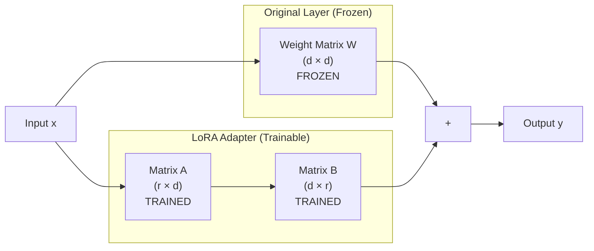
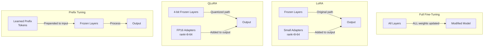

# Fine-Tuning Approaches: From Full to Parameter-Efficient

## Overview

Not all fine-tuning is created equal. The spectrum ranges from updating every weight in the model (expensive, powerful) to updating < 0.1% of parameters (cheap, surprisingly effective).

---

## Full Fine-Tuning

### How It Works

Every single weight in the model is updated during training. This is the "traditional" approach.

```
┌─────────────────────────────────────────────┐
│           Full Fine-Tuning                    │
├─────────────────────────────────────────────┤
│                                               │
│  Base Model Weights: ALL UPDATED              │
│  ┌─────────────────────────────┐             │
│  │ Layer 1: [w1, w2, ..., wN]  │ ← trained  │
│  │ Layer 2: [w1, w2, ..., wN]  │ ← trained  │
│  │ ...                          │             │
│  │ Layer L: [w1, w2, ..., wN]  │ ← trained  │
│  └─────────────────────────────┘             │
│                                               │
│  Total trainable params: 100% of model        │
│                                               │
└─────────────────────────────────────────────┘
```

### Memory Requirements

For training, you need to store:
1. **Model weights** (in fp16): 2 bytes × num_params
2. **Gradients**: same size as weights
3. **Optimizer states** (Adam): 2× weight size (momentum + variance)
4. **Activations**: depends on batch size and sequence length

```
Total VRAM ≈ 4× model size (minimum)

Examples:
  7B model:   7B × 2 bytes × 4 = 56 GB VRAM
  13B model:  13B × 2 bytes × 4 = 104 GB VRAM
  70B model:  70B × 2 bytes × 4 = 560 GB VRAM (!)
  
Hardware needed:
  7B:  1-2× A100 80GB
  13B: 2× A100 80GB
  70B: 8× A100 80GB (a full node)
```

### When to Use Full Fine-Tuning

- Maximum customization needed (complete behavior change)
- Unlimited compute budget
- Small models (< 3B) where memory isn't an issue
- Pre-training continuation (adding new language knowledge)

### Risks

- **Catastrophic forgetting:** Model loses general knowledge
- **Overfitting:** Model memorizes training data
- **Expensive:** Both compute and storage (full model copy per fine-tune)
- **Slow:** Hours to days of training

### Example Configuration

```python
# Full fine-tuning configuration
training_config = {
    "model": "meta-llama/Llama-2-7b-hf",
    "learning_rate": 2e-5,
    "num_epochs": 3,
    "batch_size": 4,
    "gradient_accumulation_steps": 8,  # effective batch = 32
    "weight_decay": 0.01,
    "warmup_ratio": 0.1,
    "fp16": True,
    "gradient_checkpointing": True,  # saves memory, costs speed
}
# Result: entire 7B model is your fine-tuned version
# Storage: 14GB model file (full copy)
```

---

## LoRA (Low-Rank Adaptation)

### The Key Insight

Research showed that the weight updates during fine-tuning have low intrinsic rank. Meaning: you don't need to update all dimensions of the weight matrices—a low-rank approximation captures most of the learning.

### How It Works

Instead of updating weight matrix W directly, LoRA decomposes the update into two small matrices:

```
Original:  W (d × d)              → d² parameters
LoRA:      W + B × A (d×r) × (r×d) → 2 × d × r parameters

Where r << d (rank is much smaller than dimension)

Example for a 4096×4096 weight matrix with rank=8:
  Original: 16,777,216 parameters
  LoRA:     4096×8 + 8×4096 = 65,536 parameters (0.4% of original!)
```

### Architecture Diagram



```
Forward pass:  y = W·x + (B·A)·x × (alpha/rank)

Where:
  W = frozen original weights
  A = trainable down-projection (d → r)
  B = trainable up-projection (r → d)
  alpha = scaling factor (controls adapter strength)
```

### Memory Requirements

```
VRAM = model_weights (frozen, can be quantized) + adapter_weights + gradients_for_adapters

Examples with LoRA rank=16:
  7B model:   ~16 GB (model in fp16) + ~50MB (adapters) ≈ 16.5 GB
  13B model:  ~28 GB + ~90MB ≈ 28.5 GB
  70B model:  ~140 GB + ~400MB ≈ 141 GB

Compare to full fine-tuning:
  7B:  16.5 GB vs 56 GB  (3.4× less)
  70B: 141 GB vs 560 GB  (4× less)
```

### Hyperparameters

| Parameter | Typical Range | Effect |
|-----------|--------------|--------|
| **rank (r)** | 8-64 | Higher = more capacity, more params, more memory |
| **alpha** | 16-128 (usually 2×rank) | Scaling factor. Higher = adapter has more influence |
| **target_modules** | q_proj, v_proj, k_proj, o_proj, gate_proj, up_proj, down_proj | Which layers get adapters |
| **dropout** | 0.0-0.1 | Regularization for adapters |

**Rank selection guide:**
```
Simple tasks (classification, short extraction):  r = 8
Medium tasks (summarization, style transfer):     r = 16-32
Complex tasks (instruction following, coding):    r = 64
Matching full fine-tuning quality:                r = 128-256
```

### When to Use LoRA

- Most fine-tuning scenarios (default choice)
- Want to preserve base model knowledge
- Need multiple task-specific adapters (swap at inference)
- Limited GPU budget but have decent hardware
- Want fast training (10-100× faster than full FT)

### Adapter Swapping

One killer feature: you can have ONE base model and MANY adapters:

```
Base Model (Llama 70B) - loaded once
  ├── Adapter: Customer Support (medical)
  ├── Adapter: Customer Support (finance)
  ├── Adapter: Code Review
  ├── Adapter: Legal Summarization
  └── Adapter: Spanish Translation

Each adapter: ~200-500MB
Switch between them: < 1 second
Total storage: 140GB + 5×500MB = 142.5GB
vs 5 full fine-tuned models: 5×140GB = 700GB
```

### Example Configuration

```python
from peft import LoraConfig, get_peft_model

lora_config = LoraConfig(
    r=16,                          # rank
    lora_alpha=32,                 # alpha (2× rank)
    target_modules=[
        "q_proj", "k_proj", "v_proj", "o_proj",
        "gate_proj", "up_proj", "down_proj"
    ],
    lora_dropout=0.05,
    bias="none",
    task_type="CAUSAL_LM",
)

model = get_peft_model(base_model, lora_config)
model.print_trainable_parameters()
# trainable params: 13,631,488 || all params: 6,751,334,400 || trainable%: 0.2019
```

---

## QLoRA (Quantized LoRA)

### The Breakthrough

QLoRA combines two ideas:
1. Quantize the base model to 4-bit (reduces memory 4×)
2. Train LoRA adapters in full precision on top

### How It Works

```
┌─────────────────────────────────────────────────┐
│                QLoRA Architecture                  │
├─────────────────────────────────────────────────┤
│                                                   │
│  Base Model: 4-bit quantized (NF4)               │
│  ┌─────────────────────────────┐                 │
│  │ Layer 1: [w1, w2, ...] 4-bit│ ← FROZEN       │
│  │ Layer 2: [w1, w2, ...] 4-bit│ ← FROZEN       │
│  │ ...                          │                 │
│  └─────────────────────────────┘                 │
│                                                   │
│  LoRA Adapters: fp16/bf16 (full precision)       │
│  ┌─────────────────────────────┐                 │
│  │ A matrices: fp16            │ ← TRAINED       │
│  │ B matrices: fp16            │ ← TRAINED       │
│  └─────────────────────────────┘                 │
│                                                   │
│  Double Quantization: quantize the quantization   │
│  constants too (saves additional memory)          │
│                                                   │
└─────────────────────────────────────────────────┘
```

### Memory Requirements

```
VRAM = model_in_4bit + adapters_in_fp16 + gradients

Examples:
  7B model:   ~4 GB (4-bit) + ~50MB (adapters) + ~2GB (training) ≈ 6 GB
  13B model:  ~7.5 GB + ~90MB + ~3GB ≈ 11 GB
  70B model:  ~35 GB + ~400MB + ~5GB ≈ 40 GB

This means:
  7B:  Fits on consumer GPU (RTX 3090, 24GB)
  13B: Fits on consumer GPU (RTX 4090, 24GB)
  70B: Fits on single A100 80GB (!!)
```

### Quality vs Full LoRA

Research findings:
```
Task: Instruction Following (Vicuna benchmark)

Full Fine-Tuning (16-bit):  Score 85.3
LoRA (16-bit base):         Score 84.7  (-0.7%)
QLoRA (4-bit base):         Score 84.1  (-1.4%)

Conclusion: QLoRA loses ~1-2% quality for 4× memory reduction
```

### When to Use QLoRA

- Fine-tuning large models (33B, 70B) on limited hardware
- Consumer GPU fine-tuning (RTX 3090/4090)
- Budget-constrained projects
- Prototyping before committing to full LoRA
- When 1-2% quality loss is acceptable

### Key Innovation: NF4 Data Type

```
Normal Float 4 (NF4):
- Optimized for normally-distributed weights
- Information-theoretically optimal 4-bit quantization
- Better than standard int4 or fp4

Quantization levels are placed at quantiles of N(0,1):
  [-1.0, -0.6962, -0.5251, -0.3949, -0.2844, -0.1848, -0.0911, 0.0,
   0.0796, 0.1609, 0.2461, 0.3379, 0.4407, 0.5626, 0.7230, 1.0]
```

### Example Configuration

```python
from transformers import BitsAndBytesConfig
from peft import LoraConfig, get_peft_model, prepare_model_for_kbit_training

# 4-bit quantization config
bnb_config = BitsAndBytesConfig(
    load_in_4bit=True,
    bnb_4bit_quant_type="nf4",         # NF4 quantization
    bnb_4bit_compute_dtype=torch.bfloat16,
    bnb_4bit_use_double_quant=True,     # double quantization
)

# Load model in 4-bit
model = AutoModelForCausalLM.from_pretrained(
    "meta-llama/Llama-2-70b-hf",
    quantization_config=bnb_config,
    device_map="auto",
)

# Prepare for training
model = prepare_model_for_kbit_training(model)

# Add LoRA
lora_config = LoraConfig(r=64, lora_alpha=128, ...)
model = get_peft_model(model, lora_config)
# Now training 70B model on a single A100!
```

---

## Prefix Tuning

### How It Works

Instead of modifying weight matrices, prefix tuning adds learnable "virtual tokens" to the beginning of each layer's input.

```
┌─────────────────────────────────────────────────┐
│              Prefix Tuning                        │
├─────────────────────────────────────────────────┤
│                                                   │
│  Input: [PREFIX_1, PREFIX_2, ..., PREFIX_k, x1, x2, ...] │
│                                                   │
│  Each layer gets its own learned prefix:          │
│  Layer 1: [p1_1, p1_2, ..., p1_k] + actual input │
│  Layer 2: [p2_1, p2_2, ..., p2_k] + actual input │
│  ...                                              │
│  Layer L: [pL_1, pL_2, ..., pL_k] + actual input │
│                                                   │
│  Only prefix parameters are trained               │
│  Model weights: completely frozen                 │
│                                                   │
└─────────────────────────────────────────────────┘
```

### Parameters

```
Trainable params = num_layers × prefix_length × hidden_dim × 2 (key + value)

Example for Llama 7B (32 layers, hidden_dim=4096, prefix=20):
  32 × 20 × 4096 × 2 = 5,242,880 parameters (0.08% of model)

Compare:
  LoRA (r=16):    ~13.6M params (0.2%)
  Prefix (len=20): ~5.2M params (0.08%)
  Full FT:         6.7B params (100%)
```

### When to Use

- Extremely constrained compute (even LoRA is too much)
- Very simple tasks (classification, simple extraction)
- Need many task adapters with minimal storage
- Research/experimentation

### Limitations

- Less flexible than LoRA (can't target specific layers)
- Reduces effective context length (prefix tokens take up space)
- Lower quality than LoRA for complex tasks
- Less community support and tooling

---

## Comparison Table

| Approach | Trainable Params | VRAM (7B) | VRAM (70B) | Quality | Training Time | Flexibility |
|----------|-----------------|-----------|------------|---------|---------------|-------------|
| Full Fine-Tuning | 100% | 56 GB | 560 GB | Best | Slowest | Highest |
| LoRA | 0.1-1% | 17 GB | 141 GB | Near-best | Fast | High |
| QLoRA | 0.1-1% | 6 GB | 40 GB | Good (-1-2%) | Fast | High |
| Prefix Tuning | < 0.1% | 15 GB | 135 GB | Moderate | Fastest | Low |
| Prompt Tuning | < 0.01% | 14 GB | 134 GB | Lower | Fastest | Lowest |

---

## Architecture Comparison (Visual)



---

## Decision Guide: Which Approach?

```
Start here:
│
├── Do you have 8× A100 80GB?
│   ├── YES + need maximum quality → Full Fine-Tuning
│   └── YES but want efficiency → LoRA
│
├── Do you have 1× A100 80GB?
│   ├── Model ≤ 13B → LoRA
│   └── Model > 13B → QLoRA
│
├── Do you have consumer GPU (24GB)?
│   ├── Model ≤ 7B → QLoRA
│   └── Model > 7B → Use cloud or API fine-tuning
│
└── Very limited compute?
    └── Prefix Tuning or API fine-tuning (OpenAI, Together)
```

---

## Practical Recommendations

### For Most Teams: Start with QLoRA

```
Why:
1. Works on affordable hardware
2. Quality is within 1-2% of full fine-tuning
3. Fast iteration (hours not days)
4. Can always upgrade to full LoRA if needed

Default config that works for most tasks:
  - Base: 4-bit NF4 quantization
  - LoRA rank: 16 (simple tasks) or 64 (complex tasks)
  - Alpha: 2× rank
  - Target: all linear layers
  - Learning rate: 2e-4
  - Epochs: 3
```

### For Production: LoRA with Merge

```
Training:  QLoRA (fast iteration, cheap experimentation)
    ↓
Validation: Merge adapter into full-precision model
    ↓
Serving:   Merged model quantized to int8/fp8 for inference
    ↓
Result:    Full quality + fast inference + no adapter overhead
```

### For Multi-Task: LoRA Adapter Library

```
One base model + N adapters:
  - Share base model across all tasks
  - Load specific adapter per request
  - Libraries: LoRAX, S-LoRA for efficient multi-adapter serving
  - Batch requests by adapter for efficiency
```

---

## Summary

The field has converged on LoRA/QLoRA as the default fine-tuning approach for most practical applications. Full fine-tuning is reserved for pre-training continuation or maximum quality requirements. Prefix tuning is niche but useful for extremely constrained scenarios.

**The practical hierarchy:**
1. Try QLoRA first (cheapest, fastest iteration)
2. If quality insufficient, try full LoRA (more capacity)
3. If still insufficient, try full fine-tuning (maximum quality)
4. In practice, most teams never need to go past step 1
