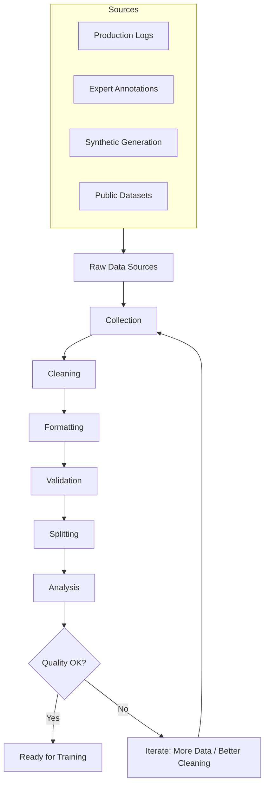

# Training Data Preparation for Fine-Tuning

## The Golden Rule

**Data quality determines fine-tuning success more than any hyperparameter, architecture choice, or training technique.**

100 perfect examples > 10,000 mediocre examples.

---

## Data Formats

### OpenAI Chat Format (Most Common)

```json
{"messages": [
  {"role": "system", "content": "You are a medical assistant that provides concise diagnoses."},
  {"role": "user", "content": "Patient: 65M, chest pain radiating to left arm, diaphoresis, ST elevation in leads II, III, aVF"},
  {"role": "assistant", "content": "Assessment: Acute inferior STEMI. Immediate cardiology consult and cath lab activation required."}
]}
```

Each line in a `.jsonl` file is one training example.

### Alpaca/Instruct Format

```json
{
  "instruction": "Summarize the following legal clause in plain English",
  "input": "The indemnifying party shall hold harmless and indemnify the indemnified party from and against any and all claims, damages, losses, costs, and expenses (including reasonable attorneys' fees) arising out of or relating to...",
  "output": "One party agrees to protect the other from any legal claims, costs, or damages that come from this agreement."
}
```

### Multi-Turn Conversation Format

```json
{"messages": [
  {"role": "system", "content": "You are a helpful coding assistant."},
  {"role": "user", "content": "How do I read a file in Python?"},
  {"role": "assistant", "content": "Use the built-in `open()` function:\n```python\nwith open('file.txt', 'r') as f:\n    content = f.read()\n```"},
  {"role": "user", "content": "What if the file doesn't exist?"},
  {"role": "assistant", "content": "Wrap it in a try-except:\n```python\ntry:\n    with open('file.txt', 'r') as f:\n        content = f.read()\nexcept FileNotFoundError:\n    print('File not found')\n```"}
]}
```

### ShareGPT Format (Common in Open Source)

```json
{
  "conversations": [
    {"from": "human", "value": "Explain quantum computing"},
    {"from": "gpt", "value": "Quantum computing uses quantum mechanical phenomena..."},
    {"from": "human", "value": "How is it different from classical?"},
    {"from": "gpt", "value": "Classical computers use bits (0 or 1)..."}
  ]
}
```

---

## Data Quality Requirements

### Minimum Quantities

```
Task Complexity vs Required Examples:

Simple Classification (2-5 classes):
  Minimum: 100 examples (20+ per class)
  Good:    500-1000 examples
  
Named Entity Extraction:
  Minimum: 200 examples (covering all entity types)
  Good:    1000-3000 examples

Style/Tone Transfer:
  Minimum: 200 examples
  Good:    500-2000 examples

Complex Instruction Following:
  Minimum: 500 examples
  Good:    5000-10000 examples

Multi-Turn Conversation:
  Minimum: 500 conversations
  Good:    5000-20000 conversations
```

### Quality Criteria

| Criterion | Description | How to Check |
|-----------|-------------|--------------|
| **Correctness** | Outputs are factually accurate | Expert review, automated fact-check |
| **Consistency** | Similar inputs → similar style/format | Measure output variance |
| **Diversity** | Covers full range of expected inputs | Distribution analysis |
| **Balance** | Equal representation across categories | Category count histogram |
| **Clarity** | Instructions are unambiguous | Inter-annotator agreement |
| **Completeness** | Outputs are thorough, not truncated | Length analysis |
| **No Contamination** | Test data NOT in training set | Deduplication check |

### The Quality Hierarchy

```
Tier 1: Expert-written examples (best quality, most expensive)
  - Domain experts write both input and output
  - Gold standard for evaluation sets
  - Use for: test set, difficult examples

Tier 2: Expert-validated examples (good quality, moderate cost)
  - Generated by model or crowd, validated by expert
  - Good for: training set bulk

Tier 3: Synthetic examples (variable quality, cheapest)
  - Generated by GPT-4 or similar strong model
  - Must be filtered and validated
  - Good for: augmentation, initial prototyping

Tier 4: Raw production data (unknown quality, free)
  - From actual system usage
  - Needs heavy cleaning and validation
  - Good for: understanding distribution, after filtering
```

---

## Data Preparation Pipeline



### Step 1: Collection

Sources of training data:

```python
# Source 1: Production logs (best for your specific use case)
production_data = [
    {"input": user_query, "output": model_response, "feedback": user_rating}
    for query, response, rating in production_logs
    if rating >= 4  # only keep good responses
]

# Source 2: Expert annotations (highest quality)
expert_data = [
    {"input": scenario, "output": expert_written_response}
    for scenario in domain_scenarios
    # Expert writes the ideal response for each scenario
]

# Source 3: Synthetic generation (scalable)
synthetic_data = [
    {"input": generated_input, "output": gpt4_response}
    for generated_input in diverse_inputs
    # GPT-4 generates high-quality responses
    # Human validates a sample
]
```

### Step 2: Cleaning

```python
def clean_example(example):
    """Clean a single training example."""
    
    # Remove PII
    text = remove_pii(example["output"])  # emails, phones, names
    
    # Fix encoding issues
    text = fix_unicode(text)  # smart quotes, em dashes, etc.
    
    # Remove system artifacts
    text = remove_artifacts(text)  # "As an AI...", logging prefixes
    
    # Normalize whitespace
    text = normalize_whitespace(text)
    
    # Truncate if too long (model context limit)
    text = truncate_to_limit(text, max_tokens=2048)
    
    # Deduplicate (exact and near-duplicate)
    # Done at dataset level, not per-example
    
    return {**example, "output": text}
```

**Common cleaning operations:**
- Remove PII (emails, phone numbers, addresses, names)
- Fix encoding (UTF-8 normalization)
- Remove HTML/markdown artifacts
- Standardize formatting (consistent newlines, indentation)
- Remove duplicate or near-duplicate examples
- Remove extremely short outputs (likely errors)
- Remove extremely long outputs (likely garbage)

### Step 3: Formatting

```python
def format_to_chat(example, system_prompt):
    """Convert to OpenAI chat format."""
    return {
        "messages": [
            {"role": "system", "content": system_prompt},
            {"role": "user", "content": example["input"]},
            {"role": "assistant", "content": example["output"]}
        ]
    }

# Write as JSONL
with open("train.jsonl", "w") as f:
    for example in formatted_data:
        f.write(json.dumps(example) + "\n")
```

### Step 4: Validation

```python
def validate_example(example):
    """Validate a single training example."""
    errors = []
    
    # Schema validation
    if "messages" not in example:
        errors.append("missing 'messages' field")
    
    # Role validation
    roles = [m["role"] for m in example["messages"]]
    if roles[-1] != "assistant":
        errors.append("last message must be from assistant")
    
    # Length validation
    total_tokens = count_tokens(example)
    if total_tokens > MAX_CONTEXT:
        errors.append(f"too long: {total_tokens} tokens")
    if total_tokens < MIN_TOKENS:
        errors.append(f"too short: {total_tokens} tokens")
    
    # Content validation
    assistant_msg = example["messages"][-1]["content"]
    if len(assistant_msg.strip()) < 10:
        errors.append("assistant response too short")
    
    # Quality heuristics
    if "I cannot" in assistant_msg and "I cannot" not in expected_refusals:
        errors.append("possible unwanted refusal")
    
    return errors

# Validate entire dataset
valid, invalid = [], []
for example in dataset:
    errors = validate_example(example)
    if errors:
        invalid.append({"example": example, "errors": errors})
    else:
        valid.append(example)

print(f"Valid: {len(valid)}, Invalid: {len(invalid)} ({len(invalid)/len(dataset)*100:.1f}%)")
```

### Step 5: Splitting

```python
from sklearn.model_selection import train_test_split

# Standard split: 80/10/10
train, temp = train_test_split(valid_data, test_size=0.2, random_state=42)
val, test = train_test_split(temp, test_size=0.5, random_state=42)

# Stratified split (maintain category balance)
train, temp = train_test_split(
    valid_data, test_size=0.2, random_state=42,
    stratify=[categorize(x) for x in valid_data]
)

print(f"Train: {len(train)}, Val: {len(val)}, Test: {len(test)}")

# IMPORTANT: Test set is sacred. Never train on it. Never look at it during development.
```

### Step 6: Analysis

```python
def analyze_dataset(data, name="dataset"):
    """Comprehensive dataset analysis."""
    
    # Token length distribution
    lengths = [count_tokens(ex) for ex in data]
    print(f"{name}: {len(data)} examples")
    print(f"  Token lengths: mean={np.mean(lengths):.0f}, "
          f"median={np.median(lengths):.0f}, "
          f"min={min(lengths)}, max={max(lengths)}")
    
    # Category distribution
    categories = Counter(categorize(ex) for ex in data)
    print(f"  Categories: {dict(categories)}")
    
    # Imbalance check
    max_count = max(categories.values())
    min_count = min(categories.values())
    imbalance_ratio = max_count / min_count
    if imbalance_ratio > 5:
        print(f"  ⚠️  HIGH IMBALANCE: {imbalance_ratio:.1f}x between largest/smallest class")
    
    # Difficulty distribution (if available)
    # Diversity score (embedding similarity)
    # Duplicate check
```

---

## Common Data Problems

### 1. Label Noise

**Problem:** Some examples have incorrect outputs (annotator errors, auto-labeling mistakes).

**Detection:**
```python
# Train a simple model, find examples with high loss
# High loss = model disagrees with label = potential noise
losses = compute_per_example_loss(model, dataset)
suspicious = [ex for ex, loss in zip(dataset, losses) if loss > threshold]
# Manual review of suspicious examples
```

**Solutions:**
- Manual review of high-loss examples
- Consensus labeling (3+ annotators, majority vote)
- Confident learning (cleanlab library)

### 2. Class Imbalance

**Problem:** 90% of examples are easy/common, 10% are hard/rare.

**Solutions:**
```python
# Option 1: Oversample minority classes
from imblearn.over_sampling import RandomOverSampler

# Option 2: Undersample majority classes (loses data)
# Option 3: Weighted loss function
class_weights = {cls: 1.0/count for cls, count in category_counts.items()}

# Option 4: Stratified batching
# Each batch has proportional representation
```

### 3. Data Contamination

**Problem:** Test examples accidentally appear in training data.

**Detection:**
```python
# Exact match check
train_set = set(json.dumps(ex) for ex in train_data)
test_set = set(json.dumps(ex) for ex in test_data)
contaminated = train_set & test_set
print(f"Contaminated examples: {len(contaminated)}")

# Near-duplicate check (embedding similarity)
for test_ex in test_data:
    similarities = cosine_similarity(embed(test_ex), train_embeddings)
    if max(similarities) > 0.95:
        print(f"Near-duplicate found: {test_ex}")
```

### 4. Staleness

**Problem:** Training data reflects old processes, outdated information.

**Solutions:**
- Timestamp all training examples
- Regularly refresh with recent production data
- Weight recent examples higher during training
- Remove examples older than threshold

---

## Data Augmentation Techniques

### Paraphrasing

```python
def paraphrase_input(example):
    """Generate paraphrased versions of the input."""
    prompt = f"Rephrase this question in 3 different ways:\n{example['input']}"
    paraphrases = gpt4(prompt)
    return [
        {**example, "input": p}
        for p in paraphrases
    ]
# Same output, different input phrasing → more robust model
```

### Back-Translation

```python
def back_translate(text, intermediate_lang="fr"):
    """Translate to another language and back for natural paraphrasing."""
    translated = translate(text, target=intermediate_lang)
    back = translate(translated, target="en")
    return back
```

### Synthetic Generation

```python
def generate_synthetic_examples(seed_examples, n=100):
    """Use GPT-4 to generate more training examples."""
    prompt = f"""Given these example input-output pairs:
{format_examples(seed_examples[:5])}

Generate {n} new examples following the same pattern.
Requirements:
- Diverse inputs (different topics, lengths, complexity)
- Outputs match the same style and format
- No duplicates of the seed examples
"""
    return gpt4(prompt, parse_as_json=True)
```

### Difficulty Stratification

```python
def stratify_by_difficulty(dataset):
    """Ensure training covers easy, medium, and hard examples."""
    easy = [ex for ex in dataset if is_easy(ex)]      # short, common patterns
    medium = [ex for ex in dataset if is_medium(ex)]  # moderate complexity
    hard = [ex for ex in dataset if is_hard(ex)]      # long, rare, complex
    
    # Target distribution: 40% easy, 40% medium, 20% hard
    # (Hard examples are more valuable for learning)
    return balance_to_ratio(easy, medium, hard, ratios=[0.4, 0.4, 0.2])
```

---

## Data Preparation Checklist

```
□ Format matches training framework expectations (JSONL, chat format)
□ All examples pass schema validation
□ No PII in training data
□ No duplicates between train/val/test
□ Token lengths within model context window
□ Category distribution is reasonable (< 5:1 imbalance)
□ Minimum 100 examples (ideally 1000+)
□ Expert review of random sample (10%+) confirms quality
□ Test set is representative and held sacred
□ Data versioned (can reproduce exactly which data trained which model)
```

---

## Summary

```
Data Preparation Priority Order:
1. Quality (correct, consistent outputs)
2. Diversity (covers all input types)
3. Quantity (more examples, diminishing returns after ~5000)
4. Balance (equal representation)
5. Augmentation (only after 1-4 are solid)
```

The most common failure mode in fine-tuning is bad data, not bad hyperparameters. Spend 80% of your effort on data quality and 20% on training configuration.
