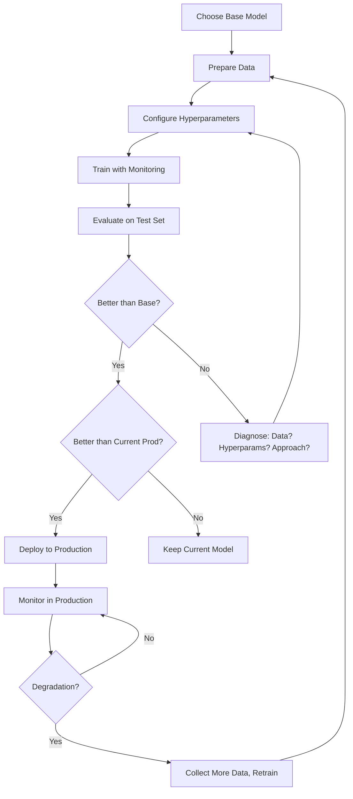
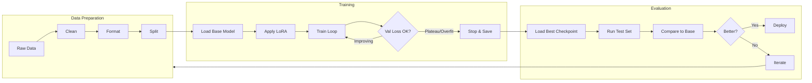

# Fine-Tuning Execution: The Complete Training Pipeline

## The End-to-End Pipeline



---

## Step 1: Choose Base Model

### Size vs Quality Tradeoff

```
Model Size    Quality (general)    Inference Cost    Fine-Tuning Cost
─────────────────────────────────────────────────────────────────────
1-3B          Low                  Very Low          $10-50
7B            Medium               Low               $50-200
13B           Good                 Moderate           $100-500
34B           Very Good            High               $500-2000
70B           Excellent            Very High          $2000-10000

Rule of thumb:
  Fine-tuned 7B ≈ Base 13-34B for specific tasks
  Fine-tuned 13B ≈ Base 70B for specific tasks
```

### Model Selection Criteria

| Factor | Recommendation |
|--------|---------------|
| Task is simple (classification) | 1-7B model |
| Task is moderate (summarization) | 7-13B model |
| Task is complex (reasoning, coding) | 13-70B model |
| Need multilingual | Choose model pre-trained on target languages |
| Need long context | Llama 3 (8K), Mistral (32K), Yi (200K) |
| Commercial use | Check license (Llama 3: permissive, others: varies) |

### Popular Base Models (2024)

```
Open Source:
  - Llama 3 8B/70B (Meta) - best general purpose
  - Mistral 7B / Mixtral 8x7B - efficient, good quality
  - Qwen 2 7B/72B (Alibaba) - strong multilingual
  - Gemma 2 9B/27B (Google) - efficient for size
  
API Fine-Tuning:
  - OpenAI GPT-4o-mini / GPT-4o
  - Anthropic (limited access)
  - Google Gemini
  - Together AI (open source models as API)
```

---

## Step 2: Configure Hyperparameters

### The Hyperparameters That Matter

```python
training_config = {
    # === Learning Rate (MOST IMPORTANT) ===
    "learning_rate": 2e-4,          # LoRA: 1e-4 to 3e-4
                                     # Full FT: 1e-5 to 5e-5
    # Too high → unstable training, loss spikes
    # Too low  → no learning, waste of compute
    
    # === Epochs ===
    "num_epochs": 3,                 # 1-5 for most tasks
    # More epochs → higher risk of overfitting
    # Rule: small dataset → fewer epochs
    #        large dataset → more epochs OK
    
    # === Batch Size ===
    "per_device_batch_size": 4,      # Limited by VRAM
    "gradient_accumulation_steps": 8, # Effective batch = 4×8 = 32
    # Larger effective batch → more stable training
    # Too large → less frequent updates, slower convergence
    
    # === LoRA Specific ===
    "lora_rank": 16,                 # 8 (simple) to 64 (complex)
    "lora_alpha": 32,                # Usually 2× rank
    "lora_dropout": 0.05,            # Light regularization
    "target_modules": "all",         # All linear layers
    
    # === Regularization ===
    "weight_decay": 0.01,            # Prevents overfitting
    "max_grad_norm": 1.0,            # Gradient clipping
    
    # === Schedule ===
    "warmup_ratio": 0.1,             # 10% of steps for warmup
    "lr_scheduler": "cosine",        # cosine or linear decay
    
    # === Precision ===
    "bf16": True,                    # bfloat16 (A100/H100)
    "tf32": True,                    # TF32 for matmul
}
```

### Hyperparameter Selection Guide

```
Learning Rate:
  ┌──────────────────────────────────────────────┐
  │  Too Low          Sweet Spot        Too High  │
  │  ←─────────────────┼──────────────────→       │
  │  No learning       Good training    Unstable  │
  │  Loss plateaus     Loss decreases   Loss spikes│
  │                    smoothly                     │
  │                                                │
  │  LoRA:    |----[1e-4]----[2e-4]----[3e-4]----|│
  │  Full FT: |----[1e-5]----[2e-5]----[5e-5]----|│
  └──────────────────────────────────────────────┘

Epochs:
  Dataset size    Recommended epochs
  < 500           1-2 (high overfit risk)
  500-5000        2-3
  5000-50000      3-5
  > 50000         1-2 (enough data per epoch)

LoRA Rank:
  Task complexity    Recommended rank
  Classification     8
  Extraction         8-16
  Summarization      16-32
  Style transfer     16-32
  Instruction follow 32-64
  Complex reasoning  64-128
```

---

## Step 3: Training with Monitoring

### What to Monitor

```python
# Key metrics to log every N steps
metrics = {
    "train/loss": current_loss,           # Should decrease
    "train/learning_rate": current_lr,     # Should follow schedule
    "train/grad_norm": gradient_norm,      # Should be stable (< 1.0)
    "eval/loss": validation_loss,          # Should decrease (if increases = overfit)
    "eval/accuracy": task_accuracy,        # Task-specific metric
    "system/gpu_memory": gpu_mem_used,     # Should be stable
    "system/throughput": samples_per_sec,  # Should be stable
}
```

### Loss Curve Interpretation

```
Good Training:
  Loss
  │╲
  │ ╲
  │  ╲___
  │      ╲___
  │          ╲_______ (smooth decrease, leveling off)
  └──────────────────── Steps

Overfitting (STOP TRAINING):
  Loss
  │╲         ╱ ← validation loss increases
  │ ╲       ╱
  │  ╲_____╱
  │   ╲
  │    ╲_________ ← training loss still decreasing
  └──────────────────── Steps

Unstable (REDUCE LEARNING RATE):
  Loss
  │    ╱╲   ╱╲
  │   ╱  ╲ ╱  ╲  ╱╲
  │  ╱    ╳    ╲╱  ╲
  │ ╱    ╱ ╲        ╲___
  │╱                     
  └──────────────────── Steps

No Learning (INCREASE LEARNING RATE):
  Loss
  │─────────────────── (flat line)
  │
  │
  │
  │
  └──────────────────── Steps
```

### Early Stopping

```python
class EarlyStopping:
    def __init__(self, patience=3, min_delta=0.001):
        self.patience = patience
        self.min_delta = min_delta
        self.best_loss = float('inf')
        self.counter = 0
    
    def should_stop(self, val_loss):
        if val_loss < self.best_loss - self.min_delta:
            self.best_loss = val_loss
            self.counter = 0
            return False  # Improving, continue
        else:
            self.counter += 1
            if self.counter >= self.patience:
                return True  # Not improving, stop
            return False

# Usage: evaluate every 100 steps
# If validation loss doesn't improve for 3 evaluations → stop
```

### Training Script Structure

```python
from transformers import TrainingArguments, Trainer
from peft import LoraConfig, get_peft_model

# 1. Load model and tokenizer
model = AutoModelForCausalLM.from_pretrained(BASE_MODEL, ...)
tokenizer = AutoTokenizer.from_pretrained(BASE_MODEL)

# 2. Apply LoRA
lora_config = LoraConfig(r=16, lora_alpha=32, ...)
model = get_peft_model(model, lora_config)

# 3. Load and tokenize data
train_dataset = load_dataset("json", data_files="train.jsonl")
val_dataset = load_dataset("json", data_files="val.jsonl")

# 4. Training arguments
training_args = TrainingArguments(
    output_dir="./checkpoints",
    num_train_epochs=3,
    per_device_train_batch_size=4,
    gradient_accumulation_steps=8,
    learning_rate=2e-4,
    warmup_ratio=0.1,
    lr_scheduler_type="cosine",
    evaluation_strategy="steps",
    eval_steps=100,
    save_steps=100,
    logging_steps=10,
    load_best_model_at_end=True,
    metric_for_best_model="eval_loss",
    bf16=True,
    report_to="wandb",  # logging to Weights & Biases
)

# 5. Train
trainer = Trainer(
    model=model,
    args=training_args,
    train_dataset=train_dataset,
    eval_dataset=val_dataset,
    callbacks=[EarlyStoppingCallback(early_stopping_patience=3)],
)
trainer.train()

# 6. Save
model.save_pretrained("./final_adapter")
```

---

## Step 4: Preventing Catastrophic Forgetting

### The Problem

Fine-tuning on task-specific data can destroy the model's general capabilities:

```
Before fine-tuning:
  General knowledge: 90/100
  Your specific task: 60/100

After naive fine-tuning:
  General knowledge: 50/100  ← CATASTROPHIC FORGETTING
  Your specific task: 95/100

Goal:
  General knowledge: 85/100  ← Small acceptable drop
  Your specific task: 93/100
```

### Prevention Strategies

#### 1. Use LoRA (Not Full Fine-Tuning)

```
LoRA freezes base weights → base knowledge preserved by design
Only small adapter learns new behavior
Result: general knowledge barely affected
```

#### 2. Replay Buffer

```python
# Mix 10-20% general data into training
training_data = (
    task_specific_data  # 80-90% your task
    + general_data       # 10-20% general instruction following
)

# General data sources:
# - OpenAssistant conversations
# - Dolly 15K
# - General instruction datasets
# This reminds the model of its general capabilities
```

#### 3. Low Learning Rate

```python
# Lower learning rate = smaller weight updates = less forgetting
# Full FT: 1e-5 instead of 5e-5
# LoRA: 1e-4 instead of 3e-4
```

#### 4. Monitor General Benchmarks

```python
# Before and after fine-tuning, evaluate on:
general_benchmarks = [
    "MMLU",          # General knowledge
    "HellaSwag",     # Common sense
    "ARC",           # Reasoning
    "TruthfulQA",    # Honesty
]

# Acceptable: < 5% drop on general benchmarks
# Unacceptable: > 10% drop → something is wrong
```

#### 5. Elastic Weight Consolidation (EWC)

```python
# Advanced: penalize changing weights that are important for general tasks
# Loss = task_loss + lambda * sum(F_i * (theta_i - theta_original_i)^2)
# F_i = Fisher information (how important is weight i for general tasks)
# Result: important general weights change less
```

---

## Step 5: Infrastructure Options

### Cloud Managed Services

```
AWS SageMaker:
  - JumpStart fine-tuning (one-click for popular models)
  - Custom training jobs with any framework
  - Built-in monitoring and hyperparameter tuning
  - Cost: pay for GPU hours (p4d.24xlarge = ~$32/hr)

Azure ML:
  - Model catalog with fine-tuning support
  - Serverless fine-tuning for select models
  - Integration with Azure OpenAI fine-tuning
  - Cost: varies by model and GPU SKU

GCP Vertex AI:
  - Model Garden with fine-tuning
  - Custom training pipelines
  - Cost: pay for GPU hours
```

### Open Source Frameworks

```
Axolotl (recommended for most users):
  - YAML-based configuration
  - Supports: LoRA, QLoRA, full FT, DPO, RLHF
  - Handles: data loading, tokenization, training, evaluation
  - GPU: single or multi-GPU

LLaMA-Factory:
  - Web UI for configuration
  - Very beginner-friendly
  - Supports most popular models and methods

Unsloth:
  - 2-5× faster training than standard
  - Custom CUDA kernels for efficiency
  - Best for: speed-optimized QLoRA training
  - Limitation: fewer model architectures supported

TRL (Hugging Face):
  - Official library for RLHF/DPO
  - SFTTrainer for supervised fine-tuning
  - Integrates with PEFT and transformers
```

### Experiment Tracking

```
Weights & Biases (wandb):
  - Best visualization and comparison
  - Free for individuals
  - wandb.init() → all metrics logged automatically

MLflow:
  - Open source, self-hosted
  - Model registry
  - Experiment comparison

TensorBoard:
  - Built into most frameworks
  - Local visualization
  - Basic but sufficient
```

---

## Step 6: Evaluation

### Evaluation Framework

```python
def evaluate_fine_tuned_model(fine_tuned, base_model, test_set):
    """Compare fine-tuned model to base model."""
    results = {
        "fine_tuned": {"correct": 0, "total": 0, "scores": []},
        "base": {"correct": 0, "total": 0, "scores": []},
    }
    
    for example in test_set:
        # Generate responses
        ft_response = fine_tuned.generate(example["input"])
        base_response = base_model.generate(example["input"])
        
        # Score (task-specific)
        ft_score = score_response(ft_response, example["expected_output"])
        base_score = score_response(base_response, example["expected_output"])
        
        results["fine_tuned"]["scores"].append(ft_score)
        results["base"]["scores"].append(base_score)
    
    # Aggregate
    ft_avg = np.mean(results["fine_tuned"]["scores"])
    base_avg = np.mean(results["base"]["scores"])
    improvement = (ft_avg - base_avg) / base_avg * 100
    
    print(f"Base model:      {base_avg:.3f}")
    print(f"Fine-tuned:      {ft_avg:.3f}")
    print(f"Improvement:     {improvement:+.1f}%")
    print(f"Recommendation:  {'DEPLOY' if improvement > 5 else 'ITERATE'}")
    
    return results
```

### What to Evaluate

| Metric | How to Measure | Threshold |
|--------|---------------|-----------|
| Task accuracy | Exact match or F1 on test set | > 5% improvement |
| Format compliance | % outputs in correct format | > 95% |
| Latency | Time per request | ≤ base model (or justify) |
| General knowledge | MMLU / HellaSwag scores | < 5% drop |
| Toxicity | Perspective API score | No increase |
| Hallucination rate | Human review or NLI | No increase |

---

## Training Pipeline Diagram



---

## Common Failure Modes and Fixes

| Symptom | Likely Cause | Fix |
|---------|-------------|-----|
| Loss doesn't decrease | Learning rate too low | Increase LR by 2-5× |
| Loss spikes/unstable | Learning rate too high | Decrease LR by 2-5× |
| Val loss increases early | Overfitting | More data, fewer epochs, more dropout |
| Good loss but bad outputs | Wrong eval metric | Check qualitative examples manually |
| OOM during training | Batch too large | Reduce batch, increase grad accumulation |
| Training too slow | Poor GPU utilization | Use bf16, gradient checkpointing, flash attention |
| Model outputs garbage | Data quality issue | Review training data, check tokenization |
| Model repeats itself | Common in early training | More data diversity, repetition penalty |

---

## Quick Start Recipe

```bash
# 1. Install
pip install transformers peft trl datasets bitsandbytes wandb

# 2. Prepare data as train.jsonl, val.jsonl, test.jsonl

# 3. Run training (example with Axolotl)
# config.yml:
base_model: meta-llama/Meta-Llama-3-8B-Instruct
load_in_4bit: true
adapter: qlora
lora_r: 16
lora_alpha: 32
dataset:
  - path: ./train.jsonl
    type: sharegpt
learning_rate: 2e-4
num_epochs: 3
micro_batch_size: 4
gradient_accumulation_steps: 8
eval_steps: 50
save_steps: 50
warmup_ratio: 0.1

# 4. Launch
accelerate launch -m axolotl.cli.train config.yml

# 5. Evaluate
python evaluate.py --model ./checkpoints/best --test-set ./test.jsonl
```

---

## Summary

The training pipeline is iterative. Expect to run 3-10 experiments before finding the right configuration. The key insight: **start with conservative settings, observe, then adjust.** Don't try to optimize everything at once.

Priority order for improvement:
1. Better data (always the highest-leverage fix)
2. More data (if quality is already high)
3. Hyperparameter tuning (learning rate first)
4. Different base model (if current one is fundamentally limited)
5. Different approach (LoRA → full FT, or vice versa)
