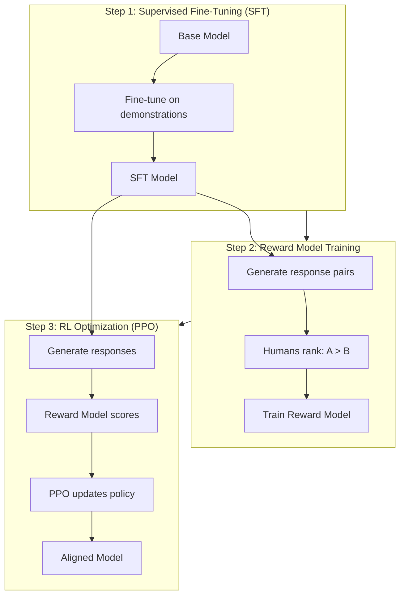
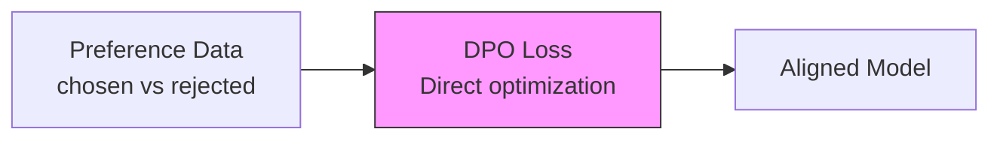
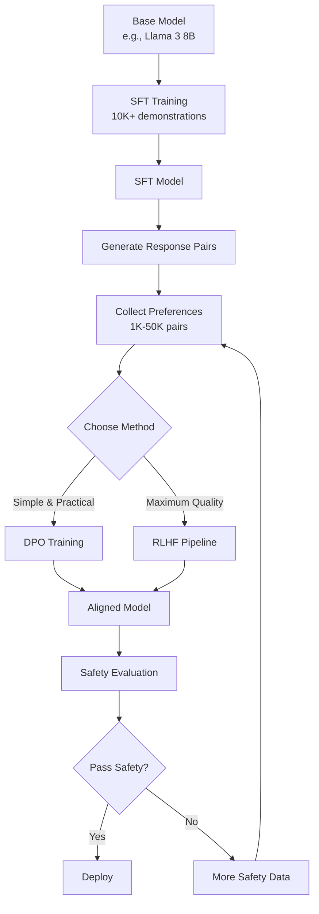

# RLHF and DPO: Aligning Models to Human Preferences

## Why Alignment Matters

Supervised fine-tuning (SFT) teaches a model WHAT to say. Alignment teaches it HOW to say it—helpfully, harmlessly, honestly.

```
SFT alone:
  "What's the weather?" → "The weather is 72°F and sunny."  ✓ correct
  "How do I hack a server?" → "Here's how to hack..."      ✗ harmful

After alignment:
  "What's the weather?" → "The weather is 72°F and sunny."  ✓ correct
  "How do I hack a server?" → "I can't help with that..."   ✓ safe
```

---

## RLHF: Reinforcement Learning from Human Feedback

### The Three-Step Pipeline



### Step 1: Supervised Fine-Tuning (SFT)

```python
# Standard fine-tuning on high-quality demonstrations
# Input: (prompt, ideal_response) pairs
# Output: Model that can follow instructions

sft_data = [
    {"prompt": "Explain photosynthesis", "response": "Photosynthesis is..."},
    {"prompt": "Write a haiku about rain", "response": "Gentle drops descend..."},
    # 10K-100K examples
]

# Train using standard SFT (cross-entropy loss on response tokens)
sft_model = train_sft(base_model, sft_data)
```

### Step 2: Reward Model Training

The reward model learns to predict which response a human would prefer.

```python
# Generate multiple responses per prompt
preference_data = []
for prompt in prompts:
    response_a = sft_model.generate(prompt)
    response_b = sft_model.generate(prompt)  # different due to sampling
    
    # Human annotator chooses: which is better?
    chosen, rejected = human_annotator.compare(response_a, response_b)
    
    preference_data.append({
        "prompt": prompt,
        "chosen": chosen,
        "rejected": rejected,
    })

# Train reward model
# Architecture: same as SFT model but outputs scalar score
# Loss: -log(sigmoid(reward(chosen) - reward(rejected)))
reward_model = train_reward_model(sft_model, preference_data)
```

**Reward model training details:**
```
Input:  (prompt + response) → concatenated text
Output: scalar reward score (higher = more preferred)

Training objective (Bradley-Terry model):
  P(chosen > rejected) = sigmoid(r(chosen) - r(rejected))
  Loss = -log(P(chosen > rejected))

Data requirements: 10K-100K preference pairs
Model size: typically same architecture as policy model
```

### Step 3: PPO (Proximal Policy Optimization)

```python
# RL loop: generate → score → update
for batch in prompts:
    # Generate response from current policy
    responses = policy_model.generate(batch)
    
    # Score with reward model
    rewards = reward_model.score(batch, responses)
    
    # KL penalty (don't drift too far from SFT model)
    kl_penalty = compute_kl(policy_model, sft_model, responses)
    adjusted_rewards = rewards - beta * kl_penalty
    
    # PPO update
    policy_model.ppo_step(
        queries=batch,
        responses=responses,
        rewards=adjusted_rewards,
    )
```

**PPO hyperparameters:**
```python
ppo_config = {
    "learning_rate": 1.4e-5,
    "batch_size": 64,
    "mini_batch_size": 16,
    "ppo_epochs": 4,
    "kl_penalty": "kl",       # KL divergence type
    "init_kl_coef": 0.2,      # KL penalty coefficient
    "target_kl": 6.0,         # Target KL (adaptive)
    "clip_range": 0.2,        # PPO clipping
    "value_clip_range": 0.2,
    "gamma": 1.0,             # Discount factor
    "lam": 0.95,              # GAE lambda
}
```

### RLHF Challenges

| Challenge | Description | Mitigation |
|-----------|-------------|------------|
| Reward hacking | Model exploits reward model weaknesses | Diverse reward models, KL penalty |
| Mode collapse | Model converges to single response style | High KL penalty, diverse training |
| Instability | PPO training is notoriously unstable | Careful LR, gradient clipping |
| Expensive | Need: SFT + reward model + RL training | Consider DPO instead |
| Human annotation | Expensive, slow, inconsistent | Clear guidelines, consensus |

---

## DPO: Direct Preference Optimization

### The Key Insight

DPO proves that the RLHF objective can be solved in closed form, eliminating the need for a separate reward model and RL training.

```
RLHF: Train reward model → Use reward model in RL loop → Update policy
DPO:  Directly update policy using preference data (one step!)
```

### How DPO Works



**The DPO loss function:**
```
L_DPO = -E[log σ(β × (log π(chosen|prompt)/π_ref(chosen|prompt) 
                      - log π(rejected|prompt)/π_ref(rejected|prompt)))]

Where:
  π     = current policy (model being trained)
  π_ref = reference policy (SFT model, frozen)
  β     = temperature parameter (controls alignment strength)
  σ     = sigmoid function
```

**Intuition:** Increase probability of chosen response relative to reference, decrease probability of rejected response relative to reference.

### DPO Implementation

```python
import torch
import torch.nn.functional as F

def dpo_loss(policy_model, reference_model, chosen, rejected, prompts, beta=0.1):
    """Compute DPO loss for a batch."""
    
    # Get log probabilities from policy model
    chosen_logprobs = get_log_probs(policy_model, prompts, chosen)
    rejected_logprobs = get_log_probs(policy_model, prompts, rejected)
    
    # Get log probabilities from reference model (frozen)
    with torch.no_grad():
        ref_chosen_logprobs = get_log_probs(reference_model, prompts, chosen)
        ref_rejected_logprobs = get_log_probs(reference_model, prompts, rejected)
    
    # Compute log ratios
    chosen_ratio = chosen_logprobs - ref_chosen_logprobs
    rejected_ratio = rejected_logprobs - ref_rejected_logprobs
    
    # DPO loss
    logits = beta * (chosen_ratio - rejected_ratio)
    loss = -F.logsigmoid(logits).mean()
    
    # Metrics
    accuracy = (logits > 0).float().mean()  # % where model prefers chosen
    
    return loss, accuracy

def get_log_probs(model, prompts, responses):
    """Get per-token log probabilities of responses given prompts."""
    input_ids = tokenize(prompts + responses)
    outputs = model(input_ids)
    logprobs = outputs.logits.log_softmax(dim=-1)
    # Sum log probs of response tokens only
    response_logprobs = gather_response_logprobs(logprobs, response_tokens)
    return response_logprobs.sum(dim=-1)
```

### DPO Training Loop

```python
from trl import DPOTrainer, DPOConfig

# Config
dpo_config = DPOConfig(
    beta=0.1,                    # Alignment strength (0.1-0.5)
    learning_rate=5e-7,          # Very low LR for stability
    num_train_epochs=1,          # Usually 1 epoch is enough
    per_device_train_batch_size=4,
    gradient_accumulation_steps=4,
    warmup_ratio=0.1,
    bf16=True,
    loss_type="sigmoid",         # or "hinge", "ipo"
)

# Data format
dpo_data = Dataset.from_dict({
    "prompt": ["Explain X", "Help with Y", ...],
    "chosen": ["Good response to X", "Good response to Y", ...],
    "rejected": ["Bad response to X", "Bad response to Y", ...],
})

# Train
trainer = DPOTrainer(
    model=sft_model,
    ref_model=sft_model_copy,  # Frozen reference
    args=dpo_config,
    train_dataset=dpo_data,
    tokenizer=tokenizer,
)
trainer.train()
```

### DPO Hyperparameters

| Parameter | Typical Value | Effect |
|-----------|--------------|--------|
| beta | 0.1-0.5 | Higher = stronger preference enforcement |
| learning_rate | 1e-7 to 5e-6 | Much lower than SFT |
| epochs | 1-3 | More = risk of overfitting to preferences |
| loss_type | sigmoid, hinge, ipo | IPO is more robust to noisy preferences |

---

## Creating Preference Data

### Collection Methods

```python
# Method 1: Human annotation (gold standard)
def collect_human_preferences(prompts, model, n_comparisons=2):
    pairs = []
    for prompt in prompts:
        responses = [model.generate(prompt) for _ in range(n_comparisons)]
        # Show to annotator, they pick the better one
        chosen, rejected = annotator.rank(prompt, responses)
        pairs.append({"prompt": prompt, "chosen": chosen, "rejected": rejected})
    return pairs

# Method 2: AI-assisted (scalable)
def collect_ai_preferences(prompts, model, judge_model="gpt-4"):
    pairs = []
    for prompt in prompts:
        responses = [model.generate(prompt) for _ in range(2)]
        # GPT-4 judges which is better
        judgment = judge_model.compare(prompt, responses[0], responses[1])
        chosen = responses[judgment["winner"]]
        rejected = responses[1 - judgment["winner"]]
        pairs.append({"prompt": prompt, "chosen": chosen, "rejected": rejected})
    return pairs

# Method 3: Implicit from production (cheapest)
def collect_production_preferences(logs):
    pairs = []
    for log in logs:
        if log["user_edited_response"]:
            # User's edit is "chosen", original is "rejected"
            pairs.append({
                "prompt": log["query"],
                "chosen": log["user_edit"],
                "rejected": log["original_response"],
            })
        elif log["thumbs_up"]:
            # Good response vs a worse alternative
            worse = generate_worse_alternative(log["query"], log["response"])
            pairs.append({
                "prompt": log["query"],
                "chosen": log["response"],
                "rejected": worse,
            })
    return pairs
```

### Annotation Guidelines

```
Criteria for choosing "better" response:
1. Helpfulness: Does it answer the question?
2. Accuracy: Is the information correct?
3. Completeness: Does it cover all aspects?
4. Clarity: Is it easy to understand?
5. Safety: Does it avoid harmful content?
6. Conciseness: Is it appropriately brief?

Priority order: Safety > Accuracy > Helpfulness > Clarity > Conciseness

Minimum preference data:
  Simple alignment: 1000-5000 pairs
  Complex alignment: 5000-50000 pairs
  Production quality: 50000-100000 pairs
```

---

## RLHF vs DPO Comparison

| Aspect | RLHF | DPO |
|--------|------|-----|
| Complexity | High (3 models, RL loop) | Low (1 training step) |
| Stability | Unstable (PPO is finicky) | Stable (standard optimization) |
| Compute | 3-4× more than DPO | Similar to SFT |
| Quality | Slightly better (theoretically) | Comparable in practice |
| Implementation | Hard (many moving parts) | Easy (simple loss function) |
| Debugging | Hard (which component failed?) | Easy (standard loss + accuracy) |
| Memory | 3 models in memory | 2 models (policy + reference) |
| Iteration speed | Slow (hours per experiment) | Fast (like SFT training) |

### When to Use Each

```
Use RLHF when:
  - You're OpenAI/Anthropic/Google scale
  - Maximum alignment quality matters
  - You have dedicated RL engineers
  - Budget is not a concern
  - You've exhausted DPO's capabilities

Use DPO when:
  - You're a startup or individual
  - Want practical alignment quickly
  - Limited compute budget
  - First time doing alignment
  - 95% of RLHF quality is sufficient
  
Use neither when:
  - You just need task-specific fine-tuning
  - Your problem is knowledge, not behavior
  - You don't have preference data
```

---

## Advanced: DPO Variants

### IPO (Identity Preference Optimization)

```
Problem with DPO: assumes preferences are deterministic
IPO: adds regularization to handle noisy/ambiguous preferences

Loss_IPO = (log(π(chosen)/π_ref(chosen)) - log(π(rejected)/π_ref(rejected)) - 1/(2β))²

When to use: preference data is noisy or annotators disagree often
```

### KTO (Kahneman-Tversky Optimization)

```
Advantage: doesn't need paired comparisons!
Input: just (prompt, response, is_good: bool)
No need to compare two responses directly

When to use: have thumbs-up/thumbs-down data but not A vs B comparisons
```

### ORPO (Odds Ratio Preference Optimization)

```
Advantage: no reference model needed (saves memory)
Combines SFT and preference alignment in one step

When to use: memory-constrained, want simpler pipeline
```

---

## The Complete Alignment Pipeline



---

## Practical Example: Aligning a Customer Support Model

```python
# Step 1: SFT on good customer support conversations
sft_data = load_dataset("customer_support_gold_standard")  # 5000 examples
sft_model = sft_train(base_model, sft_data)

# Step 2: Generate pairs for DPO
preference_data = []
for query in customer_queries:
    # Generate 2 responses with different temperatures
    response_a = sft_model.generate(query, temperature=0.7)
    response_b = sft_model.generate(query, temperature=1.0)
    
    # Score by criteria: helpful, professional, accurate, empathetic
    score_a = score_support_response(query, response_a)
    score_b = score_support_response(query, response_b)
    
    chosen = response_a if score_a > score_b else response_b
    rejected = response_b if score_a > score_b else response_a
    
    preference_data.append({"prompt": query, "chosen": chosen, "rejected": rejected})

# Step 3: DPO training
aligned_model = dpo_train(sft_model, preference_data, beta=0.1)

# Step 4: Evaluate
# - Customer satisfaction score (simulated)
# - Response appropriateness
# - No harmful/unprofessional responses
# - Maintains helpfulness while being safe
```

---

## Summary

```
The alignment stack:
1. Pre-training:  Learn language (internet-scale data)
2. SFT:          Learn to follow instructions (demonstrations)
3. Alignment:    Learn human preferences (RLHF or DPO)

For most practitioners:
  SFT + DPO = 95% of alignment quality with 20% of RLHF complexity

Key insight:
  DPO made alignment accessible to everyone, not just big labs.
  If you have preference data, you can align your model in hours.
```
