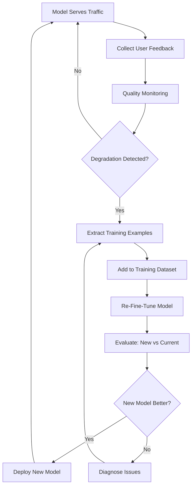
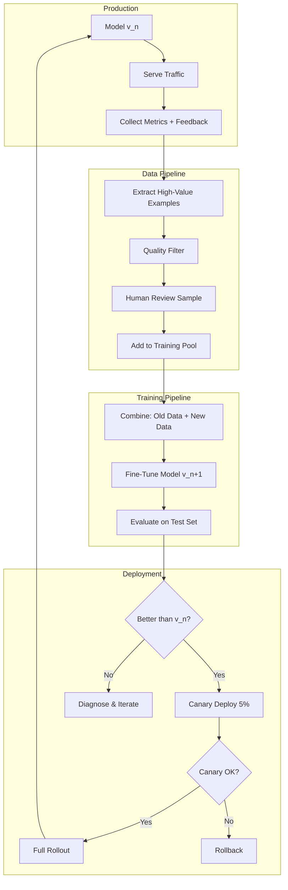

# Continuous Improvement: The Fine-Tuning Flywheel

## Fine-Tuning is Not a One-Time Event

The best production ML systems improve continuously. Fine-tuning once and deploying forever means your model gradually becomes stale as:
- User expectations evolve
- Domain knowledge updates
- Edge cases accumulate
- Competitors improve

---

## The Feedback Loop



---

## Feedback Collection Strategies

### Explicit Feedback

```python
# Thumbs up/down
feedback_types = {
    "thumbs_up": {
        "signal": "Response was good",
        "action": "Add to positive examples pool",
        "confidence": "medium",
    },
    "thumbs_down": {
        "signal": "Response was bad",
        "action": "Flag for review, collect correction",
        "confidence": "medium",
    },
    "user_edit": {
        "signal": "User corrected the response",
        "action": "Correction = ideal output (very valuable!)",
        "confidence": "high",
    },
    "regenerate": {
        "signal": "First response was unsatisfactory",
        "action": "First response is negative example",
        "confidence": "low-medium",
    },
}
```

### Implicit Feedback

```python
implicit_signals = {
    "copy_response": {
        "signal": "User copied the text (likely found it useful)",
        "positive_indicator": True,
    },
    "session_length": {
        "signal": "Long session after response = user engaged",
        "positive_indicator": True,  # context dependent
    },
    "immediate_bounce": {
        "signal": "User left immediately after response",
        "negative_indicator": True,
    },
    "follow_up_clarification": {
        "signal": "User asked for clarification",
        "negative_indicator": True,  # response wasn't clear enough
    },
    "task_completion": {
        "signal": "User completed their goal (downstream metric)",
        "positive_indicator": True,
    },
}
```

---

## Extracting Training Examples from Feedback

### High-Value Example Sources

```python
def extract_training_examples(production_logs):
    """Extract the most valuable training examples from production."""
    
    new_examples = []
    
    # 1. User corrections (HIGHEST VALUE)
    # When a user edits the response, they're giving you the ideal output
    for log in production_logs:
        if log.get("user_correction"):
            new_examples.append({
                "input": log["query"],
                "output": log["user_correction"],  # What user wanted
                "source": "user_correction",
                "value": "very_high",
            })
    
    # 2. High-confidence correct responses (verified good)
    # Responses that got thumbs-up AND high confidence score
    for log in production_logs:
        if log.get("thumbs_up") and log.get("model_confidence", 0) > 0.9:
            new_examples.append({
                "input": log["query"],
                "output": log["response"],
                "source": "verified_positive",
                "value": "high",
            })
    
    # 3. Hard examples that were correct (model struggled but succeeded)
    # Low confidence but user confirmed correct → valuable edge case
    for log in production_logs:
        if log.get("thumbs_up") and log.get("model_confidence", 0) < 0.5:
            new_examples.append({
                "input": log["query"],
                "output": log["response"],
                "source": "hard_positive",
                "value": "very_high",  # Rare and informative
            })
    
    # 4. Failure patterns (for DPO/preference learning)
    # Thumbs-down responses paired with later corrections
    for log in production_logs:
        if log.get("thumbs_down") and log.get("later_correction"):
            new_examples.append({
                "input": log["query"],
                "chosen": log["later_correction"],
                "rejected": log["response"],
                "source": "preference_pair",
                "value": "high",
            })
    
    return new_examples
```

### Quality Filtering

```python
def filter_training_candidates(examples):
    """Filter examples before adding to training set."""
    
    filtered = []
    for ex in examples:
        # Skip if too short (likely noise)
        if len(ex["output"]) < 20:
            continue
        
        # Skip if PII detected
        if contains_pii(ex["input"]) or contains_pii(ex["output"]):
            continue
        
        # Skip if duplicate of existing training data
        if is_near_duplicate(ex, existing_training_data):
            continue
        
        # Skip if quality score below threshold
        quality = compute_quality_score(ex)
        if quality < QUALITY_THRESHOLD:
            continue
        
        # Skip if from a known bad user (spam, adversarial)
        if ex.get("user_id") in blocked_users:
            continue
        
        filtered.append(ex)
    
    return filtered
```

---

## The Flywheel Effect

```
Cycle 1: 1000 training examples → Model v1 (75% accuracy)
  ↓ Deploy, collect 500 corrections over 2 weeks
  
Cycle 2: 1500 training examples → Model v2 (82% accuracy)
  ↓ Better model → more users → more feedback → 800 corrections in 2 weeks
  
Cycle 3: 2300 training examples → Model v3 (87% accuracy)
  ↓ Even better → even more users → 1200 corrections in 2 weeks
  
Cycle 4: 3500 training examples → Model v4 (91% accuracy)
  ↓ Virtuous cycle accelerates

More users → More feedback → Better model → More users
```

---

## Online vs Offline Learning

### Offline Learning (Recommended)

```
Schedule:
  - Accumulate feedback for 1-4 weeks
  - Curate and validate new training examples
  - Re-fine-tune (or continue training)
  - Evaluate against holdout test set
  - A/B test new model vs current
  - Deploy if better

Advantages:
  - Stable (can review data before training)
  - Safe (full evaluation before deployment)
  - Debuggable (know exactly what changed)
  
Disadvantages:
  - Slower adaptation (weeks between updates)
  - Feedback delay (issues persist until retrain)
```

### Online Learning (Advanced, Risky)

```
Process:
  - Model updated continuously from real-time feedback
  - Each interaction potentially updates model weights
  
Advantages:
  - Instant adaptation
  - No retraining cost
  
Disadvantages:
  - Unstable (bad feedback can corrupt model instantly)
  - Hard to debug (which update caused regression?)
  - No evaluation checkpoint
  - Vulnerable to adversarial inputs
  
Recommendation: Almost never use for LLMs.
  Exception: bandits/ranking models where updates are bounded.
```

### Recommended: Frequent Offline Cycles

```
Week 1: Collect feedback, current model serves traffic
Week 2: Continue collecting, data team curates week 1 data
Week 3: Retrain with new data, evaluate
Week 4: Canary deploy, monitor
Week 5: Full deploy if canary passes, start new cycle

Result: Model improves every 4-5 weeks
```

---

## Safeguards for Continuous Improvement

### 1. Always Compare to Production

```python
def should_deploy(new_model, current_model, test_set):
    """Never deploy a worse model."""
    new_scores = evaluate(new_model, test_set)
    current_scores = evaluate(current_model, test_set)
    
    # Must be better on primary metric
    if new_scores["primary"] <= current_scores["primary"]:
        return False, "Not better on primary metric"
    
    # Must not regress significantly on secondary metrics
    for metric in secondary_metrics:
        if new_scores[metric] < current_scores[metric] - REGRESSION_THRESHOLD:
            return False, f"Regression on {metric}"
    
    # Must pass safety checks
    if not passes_safety_eval(new_model):
        return False, "Failed safety evaluation"
    
    return True, "Approved for deployment"
```

### 2. Human Review of Training Data

```python
# Never blindly trust user feedback
review_pipeline = {
    "user_corrections": {
        "auto_add": False,  # Always review
        "sample_rate": 1.0,  # Review 100%
        "reviewer": "domain_expert",
    },
    "thumbs_up_responses": {
        "auto_add": True,   # Auto-add if confidence > 0.9
        "sample_rate": 0.1, # Spot-check 10%
        "reviewer": "any_reviewer",
    },
    "synthetic_examples": {
        "auto_add": False,
        "sample_rate": 0.3,  # Review 30%
        "reviewer": "domain_expert",
    },
}
```

### 3. Holdout Test Set (Sacred)

```
Rules:
  1. Test set created ONCE at project start
  2. NEVER train on test data (even indirectly)
  3. Evaluate every model version on same test set
  4. Add to test set only with careful curation
  5. If test set becomes stale, create new one AND keep old one
  
Purpose: provides consistent measurement across model versions
```

### 4. Canary Deployment

```python
deployment_stages = {
    "canary": {
        "traffic_percentage": 5,     # 5% of traffic
        "duration": "48 hours",
        "metrics_monitored": ["error_rate", "latency", "user_satisfaction"],
        "rollback_threshold": "any metric > 10% worse than baseline",
    },
    "gradual_rollout": {
        "stages": [5, 25, 50, 100],  # Percentage steps
        "hold_per_stage": "24 hours",
        "auto_rollback": True,
    },
}
```

---

## Knowledge Distillation

### The Pattern

Use an expensive, high-quality model to teach a cheap, fast model.

```
Teacher: GPT-4 (expensive: $0.03/1K tokens, slow: 500ms/response)
Student: Llama 7B fine-tuned (cheap: $0.0001/1K tokens, fast: 50ms/response)

Process:
1. Collect 10K prompts from your specific use case
2. Generate responses using GPT-4 (cost: ~$300-500)
3. Fine-tune Llama 7B on (prompt, GPT-4 response) pairs
4. Result: Llama 7B performs like GPT-4 on YOUR specific task
5. Serve at 1/100th the cost forever
```

### Implementation

```python
def knowledge_distillation_pipeline(prompts, teacher_model="gpt-4"):
    """Generate training data from teacher model."""
    
    training_data = []
    for prompt in prompts:
        # Get high-quality response from teacher
        response = teacher_model.generate(
            prompt,
            temperature=0.7,   # Some diversity
            max_tokens=1024,
        )
        
        # Validate quality (optional but recommended)
        quality_score = evaluate_response(prompt, response)
        if quality_score >= QUALITY_THRESHOLD:
            training_data.append({
                "messages": [
                    {"role": "user", "content": prompt},
                    {"role": "assistant", "content": response},
                ]
            })
    
    return training_data

# Cost calculation
# 10K prompts × average 500 tokens/prompt × $0.03/1K = $150 (input)
# 10K responses × average 300 tokens × $0.06/1K = $180 (output)
# Total: ~$330 one-time cost
# Result: model that serves at $0.0001/request forever
```

### When Distillation Works Best

```
Works great:
  - Narrow, well-defined task (classification, extraction, formatting)
  - Student model is only 2-3× smaller than teacher
  - Large enough training set (5K-50K examples)
  - Task doesn't require teacher's full reasoning ability

Works poorly:
  - Open-ended creative tasks
  - Tasks requiring deep multi-step reasoning
  - Student model much smaller than teacher (7B learning from 1T)
  - Very small training set (< 1K examples)
```

---

## Monitoring and Alerting

```python
monitoring_config = {
    "metrics": {
        "accuracy": {
            "window": "1 hour",
            "alert_threshold": "< 5% below baseline",
            "action": "page on-call",
        },
        "latency_p99": {
            "window": "15 minutes",
            "alert_threshold": "> 2x baseline",
            "action": "alert team",
        },
        "error_rate": {
            "window": "5 minutes",
            "alert_threshold": "> 5%",
            "action": "auto-rollback",
        },
        "user_satisfaction": {
            "window": "1 day",
            "alert_threshold": "> 10% thumbs-down increase",
            "action": "alert team + start data collection",
        },
    },
    "drift_detection": {
        "input_distribution": "monitor for distribution shift",
        "output_distribution": "monitor for response pattern changes",
        "alert_on": "significant shift detected",
    },
}
```

---

## The Complete Continuous Improvement System



---

## Practical Timeline

```
Month 1:  Deploy initial fine-tuned model
          Set up feedback collection
          Set up monitoring dashboards

Month 2:  Accumulate 500+ feedback signals
          Curate 200+ new training examples
          First improvement cycle

Month 3:  Model v2 deployed
          Feedback quality improving (users trust model more)
          Identify systematic failure patterns

Month 4:  Model v3 deployed
          Flywheel accelerating
          Start knowledge distillation experiments

Month 6:  Model v5+ deployed
          Mature pipeline: mostly automated
          Focus on edge cases and hard examples

Year 1:   Model v10+ deployed
          Significant domain expertise captured
          Pipeline runs with minimal intervention
```

---

## Summary

```
The continuous improvement mindset:
1. Deploy is the BEGINNING, not the end
2. Every user interaction is a potential training signal
3. Quality > quantity for training data (always)
4. Never deploy without comparison to current production
5. The flywheel compounds: early investment pays off exponentially
6. Automate the pipeline, keep humans in the quality loop
```

The organizations that win with LLMs are not those with the best initial model—they're those with the best feedback loops.
