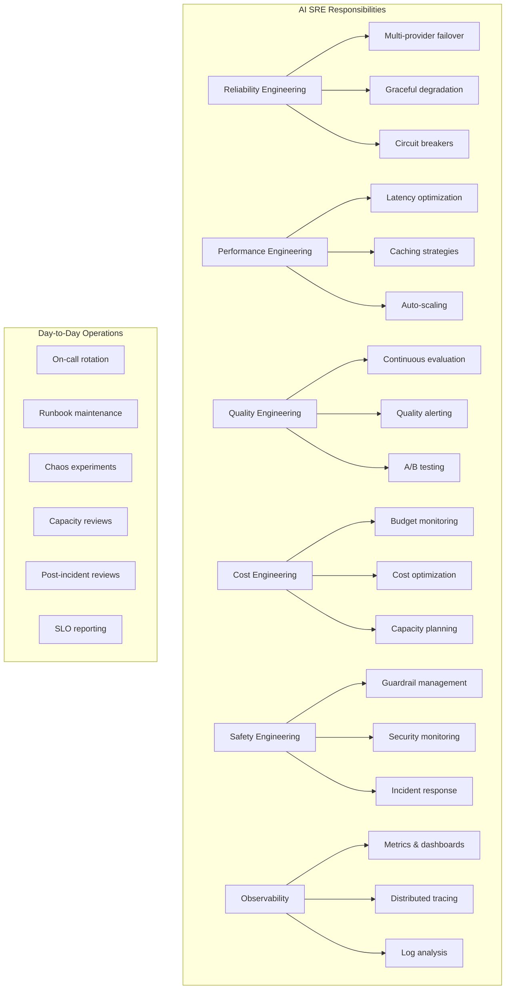

# AI SRE Fundamentals

## What is SRE for AI Systems?

Site Reliability Engineering (SRE) for AI systems extends traditional SRE practices to address the unique challenges of operating machine learning and AI-powered services in production. While traditional SRE focuses on uptime, latency, and error rates, AI SRE must also manage **quality**, **cost**, and **non-determinism** as first-class concerns.

### Traditional SRE vs AI SRE

| Dimension | Traditional SRE | AI SRE |
|-----------|----------------|--------|
| Health indicator | HTTP 200 | HTTP 200 + quality score |
| Failure mode | Crashes, timeouts | Silent quality degradation |
| Cost model | Fixed infrastructure | Per-token variable cost |
| Rollback | Deploy previous version | Roll back model + prompts + data |
| Testing | Unit/integration tests | Eval suites + human judgment |
| Capacity | CPU/memory/disk | Tokens/sec + GPU memory + vector capacity |
| Dependencies | Internal services | External model providers (OpenAI, Anthropic) |
| Drift | Code doesn't change itself | Models drift, data goes stale |

---

## Why AI Systems Need Specialized SRE

### 1. Non-Deterministic Behavior

Traditional services are deterministic: same input → same output. AI systems are stochastic:

```
Input: "What is the capital of France?"
Response 1: "The capital of France is Paris."
Response 2: "Paris is the capital of France, located on the Seine River."
Response 3: "France's capital city is Paris, which has been the capital since..."
```

**Implications for SRE:**
- Cannot use simple response comparison for health checks
- Need statistical methods to detect degradation
- "Correct" is a spectrum, not binary
- Regression testing requires eval frameworks, not assertion equality

### 2. Silent Quality Degradation

Traditional systems fail loudly (500 errors, crashes). AI systems fail silently:

```
Monday:    "Based on the document, revenue grew 15%" (correct)
Tuesday:   "Based on the document, revenue grew 12%" (wrong, but looks right)
Wednesday: "Revenue grew significantly" (vague, quality dropped)
Thursday:  "The document discusses financial metrics" (useless, but no error)
```

No error code. No exception. No crash. Just... worse answers.

**Implications for SRE:**
- Must continuously evaluate output quality
- Need automated eval pipelines running on production traffic
- User feedback becomes a critical signal
- "Availability" must include "quality availability"

### 3. Per-Token Variable Cost

Traditional services have fixed costs (servers running whether idle or busy). AI systems have **variable costs that scale with usage AND complexity**:

```
Simple query:  500 tokens  × $0.01/1K = $0.005
Complex query: 50,000 tokens × $0.01/1K = $0.50 (100x more expensive!)
Agent loop:    200,000 tokens × $0.01/1K = $2.00 (400x!)
```

**Implications for SRE:**
- Cost monitoring is as critical as latency monitoring
- A single runaway agent can cost more than a day of normal traffic
- Need per-request cost tracking and budgets
- Cost anomaly detection is a P1 alert

### 4. Dependency on External Providers

Most AI systems depend on external model providers:

```
Your System → OpenAI API → Response
Your System → Azure OpenAI → Response  
Your System → Anthropic API → Response
```

When OpenAI goes down, YOUR service goes down. You have zero control over:
- Their deployment schedule
- Their rate limits changing
- Their model quality after updates
- Their pricing changes

**Implications for SRE:**
- Must implement multi-provider failover
- Cannot SLO above your provider's SLO
- Need provider health monitoring independent of your own health checks
- Must maintain compatibility with multiple providers simultaneously

### 5. Model Drift

Traditional services don't change behavior without a deployment. AI systems drift:

```
Causes of drift:
- Provider silently updates model weights
- Training data distribution shifts
- User input patterns change over time
- RAG data becomes stale
- Embedding model updates change vector space
```

**Implications for SRE:**
- Continuous evaluation even when nothing was deployed
- Baseline quality metrics that detect gradual degradation
- Scheduled re-evaluation against golden datasets
- Automated alerts on quality trend changes

---

## AI SRE Pillars

### Pillar 1: Reliability (Availability + Quality)

Reliability for AI means the system is both **available** (responds) and **useful** (responds well).

```
Effective Availability = Uptime × Quality Rate

Example:
- System uptime: 99.95%
- Quality rate (responses meeting quality bar): 95%
- Effective availability: 99.95% × 95% = 94.95%
```

Key practices:
- Multi-provider failover for availability
- Quality monitoring for usefulness
- Graceful degradation (serve cached/simpler responses when quality drops)
- Circuit breakers on quality (stop serving if quality below threshold)

### Pillar 2: Performance (Latency + Throughput)

AI systems have unique latency characteristics:
- **Time to first token (TTFT)**: how long before user sees anything
- **Tokens per second (TPS)**: streaming speed
- **End-to-end latency**: total time for complete response
- **Retrieval latency**: time to fetch context from vector DB

```
Total Latency = Retrieval + Prompt Construction + Model Inference + Post-processing

Typical breakdown:
- Retrieval: 50-200ms
- Prompt construction: 10-50ms  
- Model inference: 1-15s (dominates!)
- Post-processing: 10-100ms
```

### Pillar 3: Cost Efficiency (Budget Management)

```
Daily Cost = Σ (requests × avg_tokens × cost_per_token) + infrastructure

Cost Levers:
- Caching (avoid redundant calls)
- Model selection (use cheaper model when possible)
- Prompt optimization (fewer tokens = less cost)
- Batch processing (bulk discounts)
- Self-hosting (amortized GPU cost)
```

### Pillar 4: Quality (Evaluation + Monitoring)

```
Quality Metrics:
- Faithfulness: does output match provided context?
- Relevance: does output answer the question?
- Coherence: is the output well-structured?
- Completeness: does it cover all aspects?
- Safety: is it free from harmful content?
```

### Pillar 5: Safety (Guardrails + Incident Response)

```
Safety Layers:
1. Input guardrails: block malicious/inappropriate inputs
2. Output guardrails: filter harmful/incorrect outputs
3. Access controls: prevent data leakage between tenants
4. Rate limiting: prevent abuse and cost runaway
5. Audit logging: trace every decision for review
```

---

## SLOs for AI Systems

### Service Level Objectives (with real numbers)

| SLO | Target | Measurement | Alert Threshold |
|-----|--------|-------------|-----------------|
| Availability | 99.9% | Successful responses / total requests | < 99.5% over 5 min |
| Latency P50 | < 2s | End-to-end response time | > 3s over 5 min |
| Latency P95 | < 5s (simple), < 15s (complex) | End-to-end response time | > 8s / > 20s |
| Time to First Token P95 | < 1s | Time until streaming starts | > 2s over 5 min |
| Quality (Faithfulness) | > 0.9 | Automated eval on sample | < 0.85 over 1 hour |
| Hallucination Rate | < 5% | Claims not supported by context | > 8% over 1 hour |
| Cost per Request (avg) | < $0.05 | Total cost / total requests | > $0.08 over 1 hour |
| Provider Failover Time | < 30s | Time to switch providers | > 60s |
| Cache Hit Rate | > 40% | Cache hits / total requests | < 25% over 1 hour |

### SLO Definitions in Code

```yaml
slos:
  availability:
    target: 0.999
    window: 30d
    measurement: successful_responses / total_responses
    exclude: planned_maintenance

  latency_simple:
    target: 0.95  # 95th percentile
    threshold: 3000ms
    window: 30d
    measurement: response_time where complexity = "simple"

  latency_complex:
    target: 0.95
    threshold: 10000ms
    window: 30d
    measurement: response_time where complexity = "complex"

  quality_faithfulness:
    target: 0.90
    window: 7d
    measurement: mean(faithfulness_score) on production_sample
    sample_rate: 0.05  # evaluate 5% of traffic

  hallucination_rate:
    target: 0.05  # less than 5%
    window: 7d
    measurement: hallucinated_responses / evaluated_responses
    
  cost_per_request:
    target: 0.05  # $0.05
    window: 1d
    measurement: total_daily_cost / total_daily_requests
```

---

## Error Budgets for AI

### Concept

An error budget is the amount of unreliability you can tolerate before taking action.

```
Error Budget = 1 - SLO Target

Examples:
- Availability SLO 99.9% → Error budget: 0.1% = 43.2 minutes/month
- Hallucination SLO < 5% → Error budget: 5% hallucination rate
- Latency SLO 95% < 3s → Error budget: 5% of requests can exceed 3s
```

### Error Budget Policies

```
When error budget is > 50% remaining:
  → Normal operations, deploy freely
  → Experiment with new features
  → Run chaos experiments

When error budget is 20-50% remaining:
  → Cautious deployments (smaller batches)
  → Increase monitoring
  → Review recent changes

When error budget is < 20% remaining:
  → Freeze non-critical deployments
  → Focus engineering on reliability
  → Cancel risky experiments

When error budget is exhausted (0%):
  → FREEZE all deployments
  → All engineering on reliability
  → Postmortem required before resuming
  → Executive notification
```

### AI-Specific Error Budget Tracking

```python
# Monthly error budget tracking
class AIErrorBudget:
    def __init__(self):
        self.budgets = {
            "availability": {
                "total_minutes": 43.2,  # 0.1% of 30 days
                "consumed_minutes": 0,
            },
            "hallucination": {
                "total_allowance": 0.05,  # 5% rate
                "current_rate": 0.0,
            },
            "cost": {
                "monthly_budget": 50000,  # $50K/month
                "spent": 0,
            },
        }
```

---

## AI SRE Responsibilities



---

## Key Takeaways

1. **AI SRE = Traditional SRE + Quality + Cost + Non-determinism**
2. **You cannot rely on error codes alone** — silent degradation is the biggest risk
3. **Cost is a reliability concern** — a $10K bill from a runaway agent is an incident
4. **External providers are your biggest dependency** — always have a failover plan
5. **Continuous evaluation is non-negotiable** — you must measure quality continuously, not just at deploy time
6. **Error budgets drive decisions** — they tell you when to ship features vs. fix reliability
