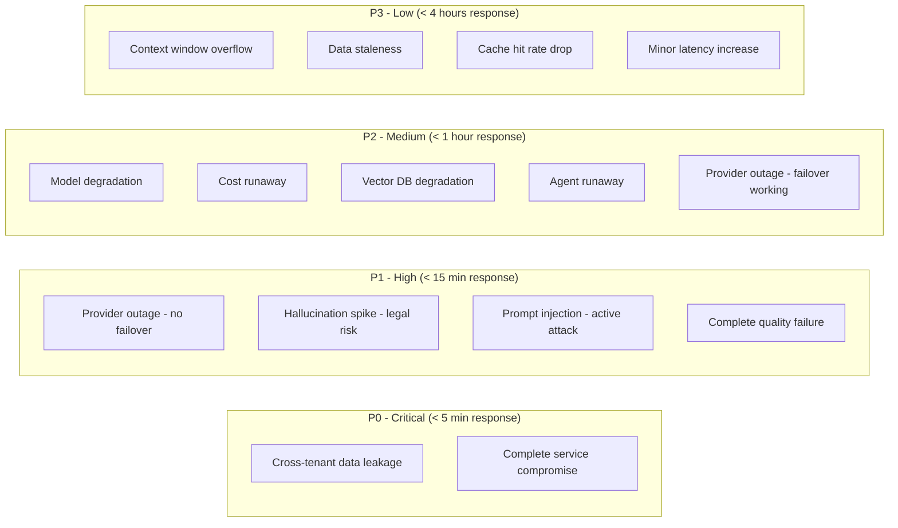

# AI Incident Taxonomy

## Overview

AI systems have unique failure modes that don't exist in traditional software. This document catalogs the full taxonomy of AI-specific incidents, with severity levels, detection methods, and response procedures for each.

---

## Incident Type 1: Model Degradation

**Description**: Quality of model outputs drops without any deployment or code change.

**Severity**: P2 (no outage, but user impact)

**Causes**:
- Model provider silently updated weights
- Input distribution shifted (users asking different types of questions)
- RAG data became stale or corrupted
- Upstream data source changed format

**Detection**:
- Automated eval scores drop below threshold
- User satisfaction ratings decline
- Thumbs-down rate increases > 2x baseline
- Automated faithfulness/relevance scores trending down

**Response**:
1. Confirm degradation with expanded eval sample
2. Identify when degradation started (correlate with events)
3. Check if provider announced model updates
4. If provider change: switch to pinned model version or fallback provider
5. If data issue: identify and fix data pipeline
6. If input shift: update prompts/retrieval strategy

**Example Alert**:
```
ALERT: Model Quality Degradation
Metric: faithfulness_score
Current: 0.82 (baseline: 0.92)
Duration: 2 hours
Trend: declining
Action: Investigate quality drop - no recent deployments
```

---

## Incident Type 2: Hallucination Spike

**Description**: Sudden increase in model generating claims not supported by provided context.

**Severity**: P1 (trust impact, possible legal/compliance risk)

**Causes**:
- Retrieved context quality dropped (wrong documents retrieved)
- Prompt change reduced grounding effectiveness
- Model temperature too high
- Context window overflow causing truncation of key information
- Embedding model mismatch after update

**Detection**:
- Faithfulness monitor drops below 0.85
- Confidence scores drop across responses
- Claim verification rate drops
- User reports of incorrect information spike

**Response**:
1. Immediately increase guardrail sensitivity (lower confidence threshold)
2. Enable stricter output validation
3. Sample recent responses and manually verify
4. Check retrieval quality: are correct documents being found?
5. Check context construction: is relevant info being included?
6. If retrieval issue: investigate vector DB, re-index if needed
7. If model issue: reduce temperature, add stronger grounding instructions
8. Monitor for 1 hour after fix before relaxing guardrails

**Example Alert**:
```
ALERT: Hallucination Rate Exceeded SLO
Metric: hallucination_rate
Current: 12% (SLO: < 5%)
Duration: 30 minutes
Samples flagged: 15/125 evaluated
Action: IMMEDIATE - Increase guardrail sensitivity, investigate retrieval
```

---

## Incident Type 3: Provider Outage

**Description**: Primary model provider (OpenAI, Anthropic, Azure) is unavailable.

**Severity**: P1 (service unavailable if no failover)

**Causes**:
- Provider infrastructure issues
- Rate limiting (hit quota)
- Authentication/API key issues
- Network connectivity problems
- Provider maintenance (sometimes unannounced)

**Detection**:
- Health check failures (> 3 consecutive)
- Error rate > 5% from provider
- Timeout rate spike
- Provider status page shows incident

**Response**:
1. Confirm outage (not just a transient error)
2. Trigger automatic failover to secondary provider
3. Verify failover is working (quality + latency acceptable)
4. Communicate to users if latency increases
5. Monitor secondary provider capacity
6. When primary recovers: gradual traffic shift back (canary)
7. Post-incident: review failover performance

**Example Alert**:
```
ALERT: Provider Outage - OpenAI
Metric: provider_error_rate
Current: 95% errors (last 2 minutes)
Health checks: 5/5 failed
Failover: ACTIVATED → Azure OpenAI
Action: Monitor failover quality, prepare for extended outage
```

---

## Incident Type 4: Cost Runaway

**Description**: Spending exceeds budget thresholds, potentially by orders of magnitude.

**Severity**: P2 (financial impact, potential service disruption if budget exhausted)

**Causes**:
- Agent stuck in infinite loop (burning tokens)
- Unexpected traffic spike (viral moment)
- Prompt change increased token usage
- Cache failure (all requests hitting model)
- Retry storm (failed requests retrying endlessly)
- User abuse (single user sending thousands of requests)

**Detection**:
- Hourly cost exceeds 2x normal
- Single request cost > $5
- Token usage rate > 3x baseline
- Budget burn rate projects exceeding monthly budget

**Response**:
1. Identify the source (which user/endpoint/feature)
2. If agent loop: kill runaway agents immediately
3. If traffic spike: enable rate limiting
4. If cache failure: fix cache, enable request coalescing
5. If abuse: block abusive user/IP
6. Calculate total unexpected spend
7. Implement prevention (token budgets, iteration limits)

**Example Alert**:
```
ALERT: Cost Anomaly Detected
Metric: hourly_cost
Current: $450/hour (baseline: $80/hour)
Projection: $10,800/day (budget: $2,500/day)
Top consumer: agent-research-v2 (75% of spend)
Action: Investigate agent-research-v2, check for loops
```

---

## Incident Type 5: Context Window Overflow

**Description**: Requests exceeding model's context window limits, causing truncation or errors.

**Severity**: P3 (degraded experience, not outage)

**Causes**:
- User conversation grew too long
- Too many documents retrieved for context
- System prompt + few-shot examples grew too large
- Concatenation of multiple data sources exceeded limits

**Detection**:
- Token count warnings in logs
- Truncation events increasing
- Model returning "input too long" errors
- Response quality dropping for long conversations

**Response**:
1. Check which requests are overflowing
2. Implement context compression (summarize older messages)
3. Reduce retrieval count or chunk size
4. Implement sliding window for conversations
5. Consider upgrading to model with larger context window
6. Add pre-request token counting with graceful handling

**Example Alert**:
```
ALERT: Context Window Overflow Rate High
Metric: context_overflow_rate
Current: 8% of requests (baseline: 0.5%)
Affected: long conversation threads (> 20 turns)
Action: Implement conversation summarization for threads > 15 turns
```

---

## Incident Type 6: Vector DB Degradation

**Description**: Vector database latency spikes or retrieval quality (recall) drops.

**Severity**: P2 (degraded quality and latency)

**Causes**:
- Index fragmentation from high write volume
- Node failure in cluster
- Memory pressure (index doesn't fit in RAM)
- Query pattern change (different vector dimensions)
- Stale replicas serving outdated data

**Detection**:
- Vector search latency P95 > 500ms (baseline: 100ms)
- Recall@10 drops below 0.8 on test queries
- Connection timeout rate increases
- Node health check failures

**Response**:
1. Check cluster health (all nodes up?)
2. Check memory utilization (index in RAM?)
3. If node failure: failover to replica, replace node
4. If memory pressure: add nodes or reduce index size
5. If fragmentation: schedule index rebuild (off-peak)
6. If recall drop: check if embeddings are stale, re-embed if needed

**Example Alert**:
```
ALERT: Vector DB Latency Spike
Metric: vector_search_p95_latency
Current: 850ms (baseline: 120ms)
Affected nodes: node-3, node-7
Memory utilization: 94%
Action: Scale cluster, investigate memory pressure
```

---

## Incident Type 7: Prompt Injection Detected

**Description**: Active attempt to manipulate the AI system through crafted inputs.

**Severity**: P1 (security incident)

**Causes**:
- Malicious user attempting to extract system prompts
- Attempt to bypass content filters
- Injection through uploaded documents (indirect injection)
- Social engineering the AI to perform unauthorized actions

**Detection**:
- Input guardrail triggered on injection patterns
- Anomalous response patterns (system prompt leakage)
- User behavior anomaly (many varied adversarial inputs)
- Output contains system-level information

**Response**:
1. Block the attacking user/session immediately
2. Review what information may have been exposed
3. Check if any unauthorized actions were performed
4. Audit logs for scope of compromise
5. Strengthen input filters for the attack vector used
6. If data exposure: follow data breach protocol
7. Report to security team for full investigation

**Example Alert**:
```
ALERT: Prompt Injection Attempt Detected
Metric: guardrail_injection_block
User: user_4821
Attempts: 15 blocked in 5 minutes
Pattern: system prompt extraction attempts
Action: Block user, review audit logs, check for successful bypass
```

---

## Incident Type 8: Data Staleness

**Description**: RAG system serving outdated information because data pipeline is stale.

**Severity**: P3 (quality impact, not outage)

**Causes**:
- Data ingestion pipeline failed silently
- Source data changed location/format
- Embedding job failed partway through
- Index not refreshed on schedule
- New documents not being picked up

**Detection**:
- Data freshness monitor: newest document age > threshold
- Pipeline health checks failing
- User reports of outdated information
- Scheduled freshness tests returning stale results

**Response**:
1. Check data pipeline status (when did it last run successfully?)
2. Identify failure point (extraction, embedding, indexing)
3. Fix pipeline issue
4. Trigger manual re-ingestion for missed data
5. Verify freshness after re-ingestion
6. Add alerting on pipeline staleness if not present

**Example Alert**:
```
ALERT: Data Freshness SLO Violation
Metric: newest_document_age
Current: 72 hours (SLO: < 24 hours)
Pipeline: document-ingestion-daily
Last success: 3 days ago
Action: Investigate pipeline failure, trigger manual re-ingestion
```

---

## Incident Type 9: Agent Runaway

**Description**: Autonomous agent stuck in loop or consuming excessive resources.

**Severity**: P2 (cost + resource impact)

**Causes**:
- Agent stuck in retry/loop without exit condition
- Task impossible but agent keeps trying
- Tool call returning errors, agent retrying indefinitely
- Recursive agent spawning agents

**Detection**:
- Agent iteration count > maximum (e.g., > 50 iterations)
- Single agent token usage > budget (e.g., > 100K tokens)
- Agent running time > maximum (e.g., > 10 minutes)
- Agent cost > per-request budget (e.g., > $2)

**Response**:
1. Kill the runaway agent immediately
2. Check what work it completed (partial results?)
3. Identify the loop/failure pattern
4. Fix: add/lower iteration limits, improve exit conditions
5. Add tool-call error handling (fail after N retries)
6. Review agent guardrails (token budget, time budget, iteration limit)

**Example Alert**:
```
ALERT: Agent Runaway Detected
Metric: agent_iteration_count
Agent ID: agent-research-7x92k
Current iterations: 87 (limit: 50)
Token usage: 145,000 tokens ($1.45)
Duration: 8 minutes
Action: KILL agent, investigate loop cause
```

---

## Incident Type 10: Cross-Tenant Data Leakage

**Description**: One tenant's data exposed to another tenant through the AI system.

**Severity**: P0 (CRITICAL - security + compliance + legal)

**Causes**:
- RAG retrieval not properly filtered by tenant
- Conversation context bleeding between sessions
- Cache returning wrong tenant's data
- Vector DB namespace isolation failure
- Permission bypass in document retrieval

**Detection**:
- Audit log shows cross-tenant data access
- User reports seeing others' data
- Automated cross-tenant probe tests fail
- Compliance scan detects data mixing

**Response**:
1. **IMMEDIATELY** isolate affected tenants
2. Determine scope: which tenants affected, what data exposed
3. Disable the leaking component (even if it means degraded service)
4. Forensic investigation: how did isolation fail?
5. Fix the isolation mechanism
6. Verify fix with comprehensive cross-tenant tests
7. Legal/compliance notification (may be mandatory)
8. Affected tenant notification
9. Full post-incident review with executive briefing

**Example Alert**:
```
ALERT: CRITICAL - Cross-Tenant Data Access Detected
Metric: cross_tenant_access_attempt
Tenant A: tenant_acme_corp (data owner)
Tenant B: tenant_globex_inc (unauthorized access)
Component: vector-retrieval-service
Action: IMMEDIATE SERVICE ISOLATION - Follow P0 runbook
```

---

## Severity Matrix



---

## Incident Communication Templates

### P0 Communication Template

```
🚨 P0 INCIDENT - [Title]
Status: ACTIVE
Started: [Time UTC]
Impact: [What users/tenants are affected]
Current Action: [What we're doing right now]
Next Update: [Time - within 15 minutes]

Commander: [Name]
Comms Lead: [Name]

DO NOT discuss externally until cleared by legal.
```

### P1 Communication Template

```
⚠️ P1 INCIDENT - [Title]
Status: INVESTIGATING / MITIGATING / RESOLVED
Started: [Time UTC]
Impact: [Scope - % users, which features]
Root Cause: [Known/Investigating]
Mitigation: [What's been done]
ETA to Resolution: [Estimate]
Next Update: [Time - within 30 minutes]
```

### P2 Communication Template

```
📋 P2 INCIDENT - [Title]
Status: [Status]
Started: [Time UTC]
Impact: [Description - degraded quality/latency/cost]
Action: [What's being done]
Owner: [Name]
Next Update: [Time - within 2 hours]
```

### P3 Communication Template

```
📝 P3 ISSUE - [Title]
Status: [Status]
Impact: Minor - [description]
Owner: [Name]
Tracking: [Ticket link]
```

---

## Incident Patterns and Correlations

Common patterns that indicate specific root causes:

| Pattern | Likely Cause |
|---------|-------------|
| Quality drop + no deployment | Provider model update or data staleness |
| Latency spike + error spike | Provider overloaded or network issue |
| Cost spike + single user | Abuse or agent runaway |
| Cost spike + all users | Cache failure or prompt change |
| Quality drop + latency drop | Model switched to faster/cheaper/worse |
| Hallucination spike + retrieval latency | Vector DB returning wrong results |
| Multiple P3s simultaneously | Underlying P1 manifesting in multiple ways |

---

## Key Takeaways

1. **AI incidents are often invisible** — quality degradation has no error code
2. **Speed of detection matters more than speed of resolution** — catch it early
3. **P0 is always data/security** — quality issues are serious but not P0
4. **Have runbooks BEFORE the incident** — you can't think clearly at 3 AM
5. **Communication is part of the response** — keep stakeholders informed
6. **Every incident improves the system** — post-incident reviews are mandatory
