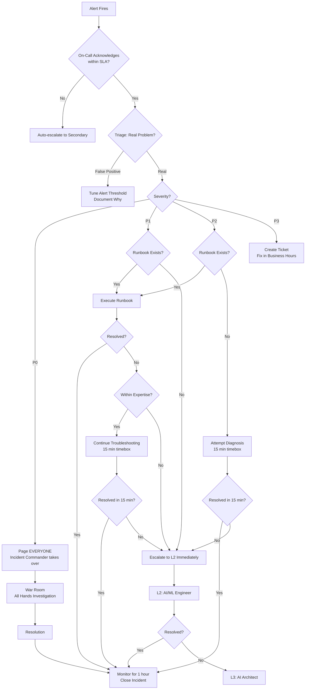

# On-Call and Escalation for AI Systems

## What's Different About On-Call for AI?

Traditional on-call monitors for binary failures: service up or down, errors or no errors. AI on-call must monitor a **continuous spectrum of quality** alongside traditional metrics.

An AI on-call engineer must be able to:
- Distinguish between "model is giving slightly worse answers" and "model is hallucinating dangerously"
- Understand whether a quality alert is a real problem or statistical noise
- Make judgment calls about quality thresholds (there's no clear "broken" vs "working")
- Navigate multi-provider architectures and failover decisions
- Understand cost implications of their decisions (enabling verbose mode costs 5x more)

---

## On-Call Responsibilities

### Primary Responsibilities

1. **Monitor dashboards** (quality + performance + cost)
   - Check quality dashboard every 30 minutes during shift
   - Review cost burn rate at start of shift and hourly
   - Verify all health checks are passing

2. **Respond to alerts** (within SLA)
   - P0: 5 minutes (page, wake up)
   - P1: 15 minutes (page)
   - P2: 30 minutes (notification)
   - P3: 4 hours (ticket)

3. **Triage: is this real?**
   - AI alerts have higher false-positive rates than traditional alerts
   - Quality metrics are noisy — a single bad response can spike the metric
   - Check: sample size, duration, trend direction, user impact

4. **Execute runbooks**
   - Follow documented procedures step by step
   - Do NOT improvise unless runbook doesn't cover the situation
   - Document any deviations from runbook

5. **Escalate when needed**
   - If beyond your expertise (ML-specific issue)
   - If blast radius is growing
   - If mitigation isn't working after 15 minutes
   - If P0/P1 and you're alone

6. **Communicate**
   - Update incident channel with progress
   - Notify stakeholders per severity level
   - Hand off cleanly at end of shift

---

## Escalation Paths

### Level 1: On-Call Engineer (First Response)

**Skills needed**: System operations, runbook execution, basic AI/ML understanding
**Responsibilities**:
- Acknowledge and triage alerts
- Execute standard runbooks
- Perform failover operations
- Restart services, scale resources
- Communicate status

**Escalate to L2 when**:
- Runbook doesn't resolve the issue
- Root cause is model/ML specific
- Quality degradation without obvious infrastructure cause
- Need to make prompt/retrieval changes

### Level 2: AI/ML Engineer

**Skills needed**: Deep ML knowledge, model evaluation, prompt engineering, retrieval systems
**Responsibilities**:
- Diagnose model quality issues
- Analyze eval score failures
- Debug retrieval/embedding problems
- Make prompt changes in production
- Decide on model rollback

**Escalate to L3 when**:
- Architectural change needed
- Multi-system coordination required
- Provider relationship decisions
- Budget/cost decisions beyond threshold

### Level 3: AI Architect / Engineering Lead

**Skills needed**: System architecture, vendor relationships, business context
**Responsibilities**:
- Architectural decisions under pressure
- Provider switching decisions
- Budget override approvals
- Cross-team coordination
- Executive communication

### External: Vendor Support

**When to engage**:
- Provider outage confirmed on their side
- Rate limit increases needed urgently
- Model behavior change that requires provider investigation
- Billing disputes

---

## Alert Design for AI Systems

### Principle: Alert on SYMPTOMS, Not Causes

```
BAD:  Alert when GPU utilization > 80%
GOOD: Alert when response latency P95 > 5s

BAD:  Alert when model returns 500 error
GOOD: Alert when user-facing error rate > 1%

BAD:  Alert when embedding job runs long
GOOD: Alert when data freshness > 24 hours
```

### Alert Fatigue Prevention

AI systems are noisy. Prevent alert fatigue with:

1. **Statistical significance**: Don't alert on single bad responses
   ```
   Alert only when: metric violates threshold for > duration
   Example: hallucination_rate > 8% for > 15 minutes
   ```

2. **Aggregation**: Group related alerts
   ```
   Don't fire: 10 separate "slow response" alerts
   Do fire: 1 "latency degradation" alert with context
   ```

3. **Severity-appropriate channels**:
   - P0/P1: Page (wake someone up)
   - P2: Slack notification (respond within 30 min)
   - P3: Ticket (respond within 4 hours)

4. **Auto-resolve**: If metric recovers, auto-resolve the alert

### AI-Specific Alert Definitions

```yaml
alerts:
  - name: quality_degradation
    metric: faithfulness_score
    condition: avg < 0.85 for 15m
    severity: P2
    channel: page
    runbook: runbook-quality-degradation
    
  - name: hallucination_spike
    metric: hallucination_rate
    condition: rate > 0.08 for 10m
    severity: P1
    channel: page
    runbook: runbook-hallucination-spike
    
  - name: cost_anomaly
    metric: hourly_cost
    condition: value > 3x rolling_7d_average
    severity: P2
    channel: slack
    runbook: runbook-cost-runaway
    
  - name: provider_errors
    metric: provider_error_rate
    condition: rate > 0.05 for 2m
    severity: P1
    channel: page
    runbook: runbook-provider-outage
    
  - name: cache_miss_spike
    metric: cache_hit_rate
    condition: rate < 0.25 for 10m
    severity: P2
    channel: slack
    runbook: runbook-cache-degradation
    
  - name: latency_spike
    metric: response_latency_p95
    condition: value > 8000ms for 5m
    severity: P2
    channel: page
    runbook: runbook-latency-spike
    
  - name: agent_runaway
    metric: agent_iteration_count
    condition: value > 50 (single agent)
    severity: P2
    channel: page
    runbook: runbook-agent-runaway
    
  - name: cross_tenant_access
    metric: cross_tenant_probe
    condition: any failure
    severity: P0
    channel: page_all
    runbook: runbook-data-leakage
```

---

## On-Call Rotation Design

### Rotation Structure

```
Primary On-Call:   Handles all alerts, first response
Secondary On-Call: Backup if primary unavailable, assists on P0/P1
ML On-Call:        Available for L2 escalation (not paged for all alerts)

Rotation: Weekly (Monday 9 AM → Monday 9 AM)
Overlap: 1 hour handoff window
```

### Handoff Procedure

At the start of each rotation, outgoing on-call briefs incoming:

```markdown
## On-Call Handoff Brief

### Active Issues
- [List any ongoing incidents or degraded states]

### Recent Changes
- [Deployments in last 48 hours]
- [Configuration changes]
- [Provider updates]

### Current Health
- Quality score: [current] (baseline: [normal])
- Error rate: [current]
- Cost burn rate: [current] (budget: [daily budget])
- Alerts firing: [list or "none"]

### Watch Items
- [Things that might become problems]
- [Experiments running]
- [Scheduled maintenance]

### Notes
- [Anything unusual the next person should know]
```

### Follow-the-Sun for Global Teams

```
Region 1 (Americas): 8 AM - 4 PM PT (handles US business hours)
Region 2 (EMEA):     8 AM - 4 PM GMT (handles EU business hours)  
Region 3 (APAC):     8 AM - 4 PM JST (handles APAC + overnight US)

Overlap windows: 1 hour between each region for handoff
Weekend: Reduced coverage (primary only, L2 on-call from home)
```

---

## Post-Incident Review for AI Systems

### What's Different from Traditional Post-Incident Reviews

In traditional systems, root cause is usually: "code bug", "config change", "hardware failure."

In AI systems, root cause can be:
- "Model started giving worse answers" (no change on our side)
- "User input patterns shifted" (nothing broke, just different usage)
- "Data became stale" (pipeline ran fine, just source stopped updating)
- "Provider changed model weights" (no notification)

### AI Post-Incident Review Template

```markdown
## Post-Incident Review: [Title]

### Timeline
- [Time]: First signal of issue
- [Time]: Alert fired
- [Time]: On-call acknowledged
- [Time]: Diagnosis started
- [Time]: Root cause identified
- [Time]: Mitigation applied
- [Time]: Resolution confirmed
- [Time]: Monitoring confirmed stable

### Impact
- Duration: [X hours/minutes]
- Users affected: [number or percentage]
- Quality impact: [eval scores during incident]
- Cost impact: [$X additional spend]
- Trust impact: [any user complaints, media, etc.]

### Root Cause
[Detailed explanation - be specific]
[For AI: what changed? Model? Data? Input patterns? Provider?]

### What Went Well
- [Things that worked as designed]
- [Quick detection, effective runbook, good communication]

### What Went Wrong
- [Detection was slow because...]
- [Runbook was outdated/missing step for...]
- [Escalation was delayed because...]

### Action Items
| Action | Owner | Due Date | Priority |
|--------|-------|----------|----------|
| [Specific fix] | [Name] | [Date] | P1 |
| [Monitoring improvement] | [Name] | [Date] | P2 |
| [Runbook update] | [Name] | [Date] | P2 |

### Lessons Learned
- [What did we learn about our AI system?]
- [What assumption was wrong?]
- [What would we do differently?]
```

### Review Cadence

- **P0/P1**: Review within 48 hours of resolution
- **P2**: Review within 1 week
- **P3**: Batch review monthly
- **Quarterly**: Review all incidents for patterns

---

## Escalation Flowchart



---

## Key Takeaways

1. **AI on-call requires ML literacy** — you must understand quality metrics, not just uptime
2. **Higher false-positive tolerance** — AI metrics are noisy, don't page on single bad responses
3. **Escalation is not failure** — ML issues require ML expertise, escalate early
4. **Handoffs must include quality context** — "system is up" isn't enough
5. **Post-incident reviews must investigate what changed** — even when you didn't deploy anything
6. **Time-box troubleshooting** — 15 minutes max before escalating
